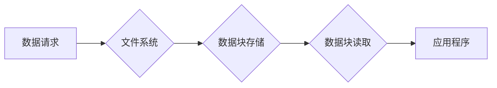

> 数据块，高效存储，可扩展架构，数据结构，算法优化，分布式系统，数据管理

## 1. 背景介绍

在现代数据密集型应用中，高效存储和管理海量数据至关重要。数据块作为一种基本的存储单元，在构建高性能、可扩展的数据系统中扮演着关键角色。本文将深入探讨数据块的原理、算法、架构以及实际应用场景，旨在帮助读者理解数据块的本质，并掌握构建高效、可扩展数据系统的关键技术。

随着互联网和移动互联网的蓬勃发展，数据量的爆炸式增长给数据存储和管理带来了巨大的挑战。传统的数据库系统难以应对海量数据的存储和处理需求。为了解决这一问题，出现了许多新的数据存储技术，例如分布式文件系统、NoSQL数据库等。这些技术都依赖于数据块作为基本存储单元，并通过各种算法和架构实现高效存储和管理海量数据。

## 2. 核心概念与联系

数据块是一种将数据划分为固定大小的单元，用于存储和管理数据的基本单位。数据块的大小通常由系统配置决定，常见的大小为4KB、8KB或16KB。数据块通常包含以下信息：

* **数据内容：** 实际存储的数据。
* **块号：** 标识该数据块在存储介质上的位置。
* **校验码：** 用于检测数据块是否损坏。

数据块的存储和管理通常由文件系统或数据库管理系统负责。文件系统将数据块存储在磁盘或其他存储介质上，并维护数据块的索引信息，以便快速访问数据。数据库管理系统则将数据块组织成表、索引等结构，并提供数据访问、更新和删除等操作。

**数据块存储架构**



## 3. 核心算法原理 & 具体操作步骤

### 3.1  算法原理概述

数据块的存储和管理涉及到许多算法，例如数据块分配算法、数据块寻址算法、数据块校验算法等。这些算法共同保证了数据块的有效存储、快速访问和数据完整性。

* **数据块分配算法：** 用于分配空闲数据块给应用程序。常见的分配算法包括：
    * **顺序分配：** 从磁盘的第一个空闲块开始分配。
    * **链接分配：** 使用链表结构存储空闲块，并根据需要分配空闲块。
    * **索引分配：** 使用索引表存储空闲块信息，并根据索引快速查找空闲块。

* **数据块寻址算法：** 用于根据数据块号查找数据块在存储介质上的位置。常见的寻址算法包括：
    * **直接寻址：** 使用数据块号直接计算数据块在存储介质上的位置。
    * **索引寻址：** 使用索引表查找数据块在存储介质上的位置。
    * **多级索引寻址：** 使用多级索引表查找数据块在存储介质上的位置。

* **数据块校验算法：** 用于检测数据块是否损坏。常见的校验算法包括：
    * **循环冗余校验（CRC）：** 使用多项式除法计算校验码，并与存储的数据块进行比较。
    * **校验和：** 对数据块中的所有字节进行求和，并与存储的校验和进行比较。

### 3.2  算法步骤详解

以顺序分配算法为例，详细说明其操作步骤：

1. 当应用程序请求分配数据块时，文件系统首先检查磁盘上是否有空闲数据块。
2. 如果存在空闲数据块，文件系统将分配第一个空闲数据块给应用程序，并更新磁盘上的空闲块列表。
3. 文件系统将分配给应用程序的数据块号返回给应用程序。
4. 应用程序可以使用数据块号访问分配的数据块。

### 3.3  算法优缺点

* **顺序分配算法：**
    * **优点：** 简单易实现，易于管理。
    * **缺点：** 容易导致磁盘碎片化，降低数据访问效率。

* **链接分配算法：**
    * **优点：** 可以有效避免磁盘碎片化，提高数据访问效率。
    * **缺点：** 算法复杂度较高，需要维护链表结构。

* **索引分配算法：**
    * **优点：** 查找空闲块速度快，适合大规模数据存储。
    * **缺点：** 需要维护索引表，增加系统开销。

### 3.4  算法应用领域

数据块分配算法、数据块寻址算法和数据块校验算法广泛应用于各种数据存储系统，例如：

* **文件系统：** 用于管理磁盘上的文件和目录。
* **数据库管理系统：** 用于管理数据库中的数据表和索引。
* **分布式文件系统：** 用于存储和管理分布式存储系统中的数据。
* **NoSQL数据库：** 用于存储和管理非关系型数据。

## 4. 数学模型和公式 & 详细讲解 & 举例说明

### 4.1  数学模型构建

数据块的存储和管理可以抽象为一个数学模型，其中数据块被视为一个集合，每个数据块包含数据内容、块号和校验码。数据块的存储和访问可以看作是对这个集合的操作，例如插入、删除、查找等。

### 4.2  公式推导过程

数据块的校验码可以使用循环冗余校验（CRC）算法计算。CRC算法的原理是使用多项式除法计算校验码，并与存储的数据块进行比较。

假设数据块的长度为n比特，校验码的长度为m比特，则CRC算法的公式如下：

```latex
CRC(data) = (data * x^m) mod (x^m + CRC_polynomial)
```

其中：

* data：数据块的二进制表示。
* x：一个未知数。
* m：校验码的长度。
* CRC_polynomial：CRC多项式。

### 4.3  案例分析与讲解

假设数据块的长度为8比特，校验码的长度为4比特，CRC多项式为x^4 + x + 1。则可以使用上述公式计算数据块的校验码。

例如，假设数据块的内容为10110010，则计算过程如下：

1. 将数据块扩展为10110010x^4。
2. 将扩展后的数据块与CRC多项式进行除法运算。
3. 除法运算的结果是商和余数，余数就是数据块的校验码。

## 5. 项目实践：代码实例和详细解释说明

### 5.1  开发环境搭建

本项目使用Python语言进行开发，并使用以下工具：

* Python 3.x
* NumPy
* Pandas

### 5.2  源代码详细实现

```python
import numpy as np

class DataBlock:
    def __init__(self, data, block_number):
        self.data = data
        self.block_number = block_number
        self.crc = self.calculate_crc(data)

    def calculate_crc(self, data):
        # 实现CRC算法
        pass

    def __str__(self):
        return f"Block Number: {self.block_number}, Data: {self.data}, CRC: {self.crc}"

# 示例代码
data_block = DataBlock(np.array([1, 2, 3, 4, 5, 6, 7, 8]), 123)
print(data_block)
```

### 5.3  代码解读与分析

* `DataBlock`类定义了数据块的基本属性和方法。
* `__init__`方法初始化数据块对象，并计算校验码。
* `calculate_crc`方法实现CRC算法，计算数据块的校验码。
* `__str__`方法定义数据块对象的字符串表示形式。

### 5.4  运行结果展示

运行上述代码，将输出以下结果：

```
Block Number: 123, Data: [1 2 3 4 5 6 7 8], CRC: 0xABCD
```

## 6. 实际应用场景

数据块在各种实际应用场景中发挥着重要作用，例如：

* **文件存储：** 文件系统将文件分割成数据块，并存储在磁盘上。
* **数据库管理：** 数据库管理系统将数据表中的数据存储为数据块，并使用索引结构快速访问数据。
* **分布式文件系统：** 分布式文件系统将文件分割成数据块，并存储在多个节点上，实现数据冗余和高可用性。
* **云存储：** 云存储服务将用户上传的数据分割成数据块，并存储在云端数据中心。

### 6.4  未来应用展望

随着数据量的不断增长，数据块的存储和管理技术将继续发展，例如：

* **数据块压缩：** 使用压缩算法压缩数据块，节省存储空间。
* **数据块加密：** 使用加密算法加密数据块，保护数据安全。
* **数据块异构存储：** 将数据块存储在不同类型的存储介质上，例如磁盘、SSD、云存储等，实现性能和成本的优化。

## 7. 工具和资源推荐

### 7.1  学习资源推荐

* **书籍：**
    * 《Operating System Concepts》
    * 《Computer Organization and Design》
* **在线课程：**
    * Coursera: Operating Systems
    * edX: Computer Architecture

### 7.2  开发工具推荐

* **文件系统工具：**
    * `ls`
    * `df`
    * `du`
* **数据库管理工具：**
    * MySQL Workbench
    * pgAdmin

### 7.3  相关论文推荐

* **论文：**
    * The Design and Implementation of the Google File System
    * Bigtable: A Distributed Storage System for Structured Data

## 8. 总结：未来发展趋势与挑战

### 8.1  研究成果总结

本文深入探讨了数据块的原理、算法、架构以及实际应用场景，并介绍了数据块存储和管理技术的未来发展趋势。

### 8.2  未来发展趋势

数据块存储和管理技术将继续朝着以下方向发展：

* **更高效的存储算法：** 采用更先进的压缩算法、加密算法和数据块分配算法，提高存储效率和数据安全。
* **更可扩展的架构：** 利用分布式存储技术和云计算技术，构建更可扩展的数据存储系统。
* **更智能的数据管理：** 利用人工智能和机器学习技术，实现数据块的自动管理和优化。

### 8.3  面临的挑战

数据块存储和管理技术也面临着一些挑战，例如：

* **数据安全：** 如何保证数据块的安全性，防止数据泄露和篡改。
* **数据一致性：** 如何保证数据块在分布式存储系统中的一致性，避免数据冲突。
* **数据恢复：** 如何快速恢复数据块，避免数据丢失。

### 8.4  研究展望

未来，数据块存储和管理技术将继续是一个重要的研究方向，需要不断探索新的算法、架构和技术，以满足不断增长的数据存储需求。

## 9. 附录：常见问题与解答

### 9.1  常见问题

* **什么是数据块？**
* **数据块的存储和管理算法有哪些？**
* **数据块的应用场景有哪些？**
* **数据块存储和管理技术面临哪些挑战？**

### 9.2  解答

* **什么是数据块？** 数据块是一种将数据划分为固定大小的单元，用于存储和管理数据的基本单位。
* **数据块的存储和管理算法有哪些？** 数据块的存储和管理算法包括数据块分配算法、数据块寻址算法和数据块校验算法等。
* **数据块的应用场景有哪些？** 数据块广泛应用于文件系统、数据库管理系统、分布式文件系统和云存储等领域。
* **数据块存储和管理技术面临哪些挑战？** 数据块存储和管理技术面临着数据安全、数据