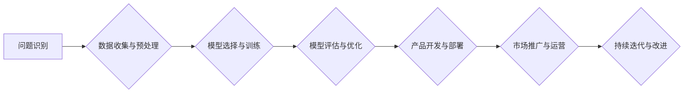

> AI大模型，创业，技术优势，商业模式，应用场景，发展趋势

## 1. 背景介绍

近年来，人工智能（AI）技术取得了飞速发展，特别是大模型的涌现，为各行各业带来了前所未有的机遇。大模型是指参数规模庞大、训练数据海量的人工智能模型，具备强大的泛化能力和学习能力，能够在自然语言处理、计算机视觉、语音识别等领域取得突破性进展。

对于创业者来说，AI大模型的出现带来了新的机遇和挑战。一方面，大模型的强大能力可以帮助创业公司快速构建创新产品和服务，提升效率和竞争力。另一方面，大模型的训练和部署需要大量的计算资源和技术 expertise，创业公司需要克服技术门槛和成本压力。

## 2. 核心概念与联系

**2.1 AI大模型的构成**

AI大模型通常由以下几个核心部分组成：

* **模型架构:**  决定模型的结构和功能，常见的架构包括 Transformer、BERT、GPT 等。
* **训练数据:**  模型的学习基础，需要海量、高质量的数据进行训练。
* **训练算法:**  用于训练模型的参数，常见的算法包括梯度下降、Adam 等。
* **硬件平台:**  大模型的训练和部署需要强大的计算能力，通常采用 GPU 或 TPU 等加速器。

**2.2  AI大模型与创业的联系**

AI大模型可以为创业公司带来以下技术优势：

* **自动化:**  大模型可以自动化完成许多重复性任务，例如数据处理、文本生成、图像识别等，提高效率和降低成本。
* **个性化:**  大模型可以根据用户的需求和喜好进行个性化定制，提供更精准的服务。
* **创新:**  大模型可以帮助创业公司探索新的商业模式和产品，开拓新的市场。

**2.3  AI大模型创业流程**



## 3. 核心算法原理 & 具体操作步骤

**3.1  算法原理概述**

深度学习是训练大模型的核心算法，它通过多层神经网络模拟人类大脑的学习过程。每个神经元接收输入信号，经过激活函数处理后输出信号，信号通过连接权重传递到下一层神经元。通过不断调整连接权重，模型可以学习数据中的模式和规律。

**3.2  算法步骤详解**

1. **数据预处理:** 将原始数据转换为模型可以理解的格式，例如文本数据需要进行分词、词向量化等处理。
2. **模型构建:** 根据任务需求选择合适的模型架构，并设置模型参数。
3. **模型训练:** 使用训练数据训练模型，通过反向传播算法调整模型参数，使模型的预测结果与真实值尽可能接近。
4. **模型评估:** 使用测试数据评估模型的性能，例如准确率、召回率、F1-score 等。
5. **模型优化:** 根据评估结果调整模型参数或架构，提高模型性能。

**3.3  算法优缺点**

**优点:**

* 强大的学习能力，能够学习复杂的数据模式。
* 泛化能力强，能够应用于不同的任务和领域。

**缺点:**

* 训练数据量大，需要大量的计算资源和时间。
* 模型参数众多，容易过拟合。
* 解释性差，难以理解模型的决策过程。

**3.4  算法应用领域**

* 自然语言处理：文本分类、情感分析、机器翻译、对话系统等。
* 计算机视觉：图像识别、物体检测、图像分割、视频分析等。
* 语音识别：语音转文本、语音助手、语音搜索等。
* 其他领域：推荐系统、欺诈检测、医疗诊断等。

## 4. 数学模型和公式 & 详细讲解 & 举例说明

**4.1  数学模型构建**

深度学习模型的核心是神经网络，它由多个层组成，每层包含多个神经元。每个神经元接收来自上一层的输入信号，经过激活函数处理后输出信号。

**4.2  公式推导过程**

* **激活函数:**  激活函数用于引入非线性，使模型能够学习复杂的数据模式。常见的激活函数包括 sigmoid、ReLU、tanh 等。

* **损失函数:**  损失函数用于衡量模型预测结果与真实值的差距。常见的损失函数包括均方误差、交叉熵等。

* **梯度下降:**  梯度下降算法用于调整模型参数，使损失函数最小化。

**4.3  案例分析与讲解**

以图像分类为例，假设我们有一个包含猫和狗的图像数据集。我们可以使用卷积神经网络（CNN）来训练一个图像分类模型。

CNN模型的结构包括卷积层、池化层和全连接层。卷积层用于提取图像特征，池化层用于降低特征维度，全连接层用于分类。

训练过程中，模型会根据损失函数的梯度更新参数，最终学习到能够将猫和狗图像区分开的特征。

## 5. 项目实践：代码实例和详细解释说明

**5.1  开发环境搭建**

* **操作系统:**  Linux 或 macOS
* **编程语言:**  Python
* **深度学习框架:**  TensorFlow 或 PyTorch
* **硬件平台:**  GPU 或 TPU

**5.2  源代码详细实现**

```python
# 使用 TensorFlow 框架实现一个简单的图像分类模型

import tensorflow as tf

# 定义模型架构
model = tf.keras.models.Sequential([
    tf.keras.layers.Conv2D(32, (3, 3), activation='relu', input_shape=(28, 28, 1)),
    tf.keras.layers.MaxPooling2D((2, 2)),
    tf.keras.layers.Conv2D(64, (3, 3), activation='relu'),
    tf.keras.layers.MaxPooling2D((2, 2)),
    tf.keras.layers.Flatten(),
    tf.keras.layers.Dense(10, activation='softmax')
])

# 编译模型
model.compile(optimizer='adam',
              loss='sparse_categorical_crossentropy',
              metrics=['accuracy'])

# 训练模型
model.fit(x_train, y_train, epochs=10)

# 评估模型
loss, accuracy = model.evaluate(x_test, y_test)
print('Test loss:', loss)
print('Test accuracy:', accuracy)
```

**5.3  代码解读与分析**

* **模型架构:**  该代码定义了一个简单的 CNN 模型，包含两层卷积层、两层池化层和一层全连接层。
* **编译模型:**  使用 Adam 优化器、交叉熵损失函数和准确率作为评估指标编译模型。
* **训练模型:**  使用训练数据训练模型，训练 10 个 epochs。
* **评估模型:**  使用测试数据评估模型的性能，打印测试损失和准确率。

**5.4  运行结果展示**

训练完成后，模型可以用于预测新的图像类别。

## 6. 实际应用场景

**6.1  自然语言处理**

* **聊天机器人:**  使用大模型构建更智能、更自然的聊天机器人，能够理解用户的意图并提供更精准的回复。
* **文本生成:**  生成高质量的文本内容，例如新闻报道、小说、诗歌等。
* **机器翻译:**  实现更高效、更准确的机器翻译，突破语言障碍。

**6.2  计算机视觉**

* **图像识别:**  识别图像中的物体、场景、人物等，应用于安防监控、医疗诊断等领域。
* **图像分割:**  将图像分割成不同的区域，应用于自动驾驶、医学影像分析等领域。
* **视频分析:**  分析视频内容，例如识别动作、跟踪目标、理解场景等。

**6.3  语音识别**

* **语音转文本:**  将语音转换为文本，应用于语音助手、会议记录等领域。
* **语音搜索:**  使用语音进行搜索，提高用户体验。
* **语音识别:**  识别语音中的说话人、情绪、意图等，应用于人机交互、情感分析等领域。

**6.4  未来应用展望**

AI大模型的应用场景还在不断扩展，未来将应用于更多领域，例如：

* **个性化教育:**  根据学生的学习情况提供个性化的学习方案。
* **精准医疗:**  根据患者的基因信息和病史提供个性化的医疗方案。
* **科学研究:**  加速科学研究，例如药物研发、材料科学等。

## 7. 工具和资源推荐

**7.1  学习资源推荐**

* **书籍:**  《深度学习》、《自然语言处理》
* **在线课程:**  Coursera、edX、Udacity 等平台提供深度学习和自然语言处理相关的课程。
* **博客和论坛:**  机器之心、AI 算法等网站和论坛提供最新的 AI 技术资讯和讨论。

**7.2  开发工具推荐**

* **深度学习框架:**  TensorFlow、PyTorch、Keras 等。
* **编程语言:**  Python。
* **云计算平台:**  AWS、Google Cloud、Azure 等。

**7.3  相关论文推荐**

* **BERT:**  BERT: Pre-training of Deep Bidirectional Transformers for Language Understanding
* **GPT:**  GPT-3: Language Models are Few-Shot Learners
* **Transformer:**  Attention Is All You Need

## 8. 总结：未来发展趋势与挑战

**8.1  研究成果总结**

近年来，AI大模型取得了显著进展，在自然语言处理、计算机视觉等领域取得了突破性进展。

**8.2  未来发展趋势**

* **模型规模更大:**  未来大模型的规模将继续扩大，参数数量将达到数万亿甚至数千亿。
* **模型能力更强:**  大模型将能够处理更复杂的任务，例如代码生成、药物设计等。
* **模型应用更广泛:**  大模型将应用于更多领域，例如教育、医疗、金融等。

**8.3  面临的挑战**

* **计算资源:**  训练大模型需要大量的计算资源，成本很高。
* **数据安全:**  大模型的训练数据可能包含敏感信息，需要保障数据安全。
* **伦理问题:**  大模型的应用可能带来伦理问题，例如算法偏见、隐私侵犯等。

**8.4  研究展望**

未来研究将集中在以下几个方面：

* **高效训练方法:**  开发更有效的训练方法，降低训练成本。
* **模型解释性:**  提高模型的解释性，使模型的决策过程更加透明。
* **安全可靠性:**  确保大模型的安全可靠性，避免算法偏见和隐私侵犯。

## 9. 附录：常见问题与解答

**9.1  如何选择合适的 AI 大模型？**

选择合适的 AI 大模型需要根据具体的应用场景和需求进行考虑。例如，对于文本分类任务，可以选择 BERT 或 RoBERTa 等预训练语言模型；对于图像识别任务，可以选择 ResNet 或 EfficientNet 等预训练图像模型。

**9.2  如何训练自己的 AI 大模型？**

训练自己的 AI 大模型需要准备海量数据、强大的计算资源和专业的技术 expertise。可以使用深度学习框架，例如 TensorFlow 或 PyTorch，进行模型训练。

**9.3  AI 大模型的伦理问题有哪些？**

AI 大模型的应用可能带来伦理问题，例如算法偏见、隐私侵犯、就业替代等。需要在开发和应用过程中，充分考虑伦理问题，制定相应的规范和制度。


作者：禅与计算机程序设计艺术 / Zen and the Art of Computer Programming 
<end_of_turn>