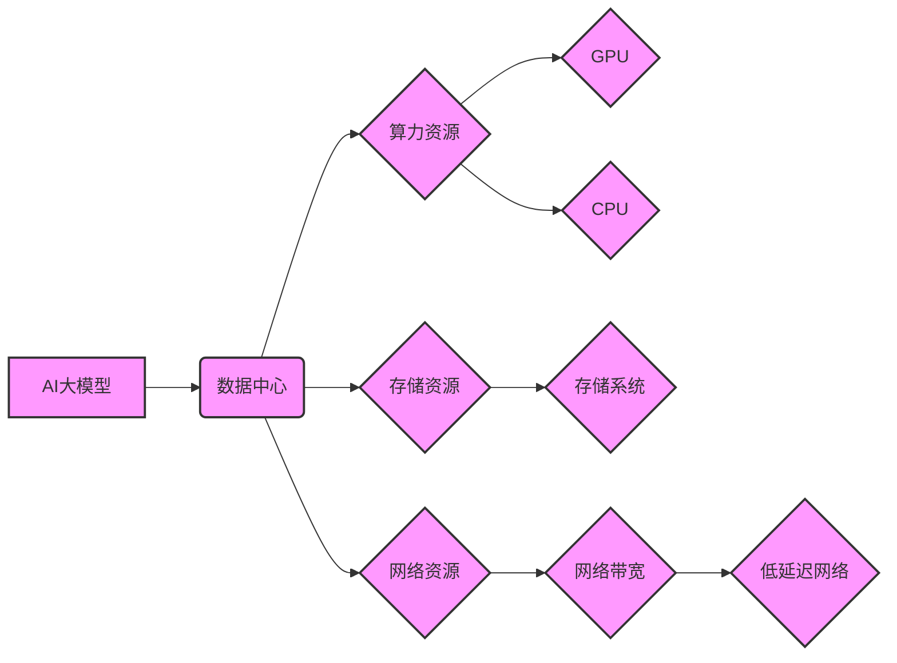

> AI大模型，数据中心，成本优化，算力资源，能源效率，节能减排，云计算，边缘计算

## 1. 背景介绍

近年来，人工智能（AI）技术蓬勃发展，特别是大规模语言模型（LLM）的出现，为各行各业带来了革命性的变革。从自然语言处理到图像识别，从药物研发到金融预测，AI大模型的应用场景日益广泛。然而，训练和部署这些庞大的模型需要大量的算力和存储资源，这给数据中心建设带来了新的挑战。

传统数据中心通常采用集中式架构，将所有计算资源集中在少数大型服务器上。这种架构在处理海量数据时效率较高，但同时也存在着能源消耗大、维护成本高、地理位置限制等问题。随着AI大模型的兴起，数据中心建设需要进行新的思考和优化，以满足其对算力和存储资源的巨大需求，同时兼顾成本效益和可持续发展。

## 2. 核心概念与联系

**2.1 数据中心架构演进**

传统的集中式数据中心架构正在向分布式、边缘计算等新型架构转变。

* **分布式数据中心:** 将数据中心资源分散到多个地理位置，提高容灾能力和数据安全，同时降低单点故障风险。
* **边缘计算:** 将计算资源部署到靠近数据源的边缘节点，减少数据传输延迟，提高实时性，并降低对核心数据中心的压力。

**2.2 AI大模型与数据中心的关系**

AI大模型的训练和部署对数据中心提出了更高的要求：

* **算力需求:** 训练大型AI模型需要大量的计算资源，数据中心需要提供足够的GPU和CPU算力。
* **存储需求:** AI模型本身体积庞大，训练数据也需要大量的存储空间。数据中心需要提供高性能、高可靠的存储系统。
* **网络带宽:** AI模型的训练和部署需要大量的网络数据传输，数据中心需要提供足够的网络带宽和低延迟网络连接。

**2.3 数据中心成本优化目标**

数据中心成本优化主要包括以下几个方面：

* **降低能源消耗:** 通过提高能源利用率、采用节能设备等方式降低数据中心的能耗成本。
* **优化硬件资源利用率:** 通过虚拟化、容器化等技术提高硬件资源的利用率，降低硬件采购和维护成本。
* **提高运营效率:** 通过自动化运维、智能监控等方式提高数据中心的运营效率，降低人工成本。

**2.4 核心概念架构图**



## 3. 核心算法原理 & 具体操作步骤

**3.1 算法原理概述**

数据中心成本优化算法通常基于以下核心原理：

* **资源调度:** 通过智能算法将算力和存储资源分配给不同的任务，提高资源利用率。
* **能源管理:** 通过监控和控制数据中心的能源消耗，降低能耗成本。
* **预测分析:** 利用历史数据和机器学习模型预测未来资源需求，提前进行资源预留和调配。

**3.2 算法步骤详解**

1. **数据收集:** 收集数据中心硬件资源、能源消耗、任务运行情况等数据。
2. **数据预处理:** 对收集到的数据进行清洗、转换和特征提取。
3. **模型训练:** 利用机器学习算法对数据进行训练，建立资源调度、能源管理和预测分析模型。
4. **模型部署:** 将训练好的模型部署到数据中心，实时监控和控制资源分配和能源消耗。
5. **性能评估:** 定期评估算法的性能，并根据评估结果进行模型调整和优化。

**3.3 算法优缺点**

* **优点:** 能够有效提高资源利用率、降低能源消耗和运营成本。
* **缺点:** 需要大量的历史数据进行训练，模型的准确性依赖于数据质量和算法选择。

**3.4 算法应用领域**

* **云计算:** 优化云平台的资源分配和能源管理。
* **边缘计算:** 提高边缘节点的资源利用率和能源效率。
* **人工智能:** 优化AI模型的训练和部署环境。

## 4. 数学模型和公式 & 详细讲解 & 举例说明

**4.1 数学模型构建**

数据中心成本优化模型通常是一个多目标优化问题，需要考虑多个因素，例如算力资源、存储资源、能源消耗、运营成本等。

**4.2 公式推导过程**

假设数据中心有N个服务器，每个服务器的算力为C_i，存储容量为S_i，能源消耗为E_i。任务的算力需求为D，存储需求为T。

目标函数：

```latex
min \sum_{i=1}^{N} (C_i * x_i + S_i * y_i + E_i * z_i)
```

约束条件：

```latex
\sum_{i=1}^{N} C_i * x_i \geq D
\sum_{i=1}^{N} S_i * y_i \geq T
x_i, y_i, z_i \geq 0
```

其中：

* x_i: 服务器i分配给任务的算力比例
* y_i: 服务器i分配给任务的存储比例
* z_i: 服务器i的运行时间

**4.3 案例分析与讲解**

假设数据中心有3个服务器，其算力、存储容量和能源消耗分别为：

* 服务器1: C_1 = 100, S_1 = 50, E_1 = 10
* 服务器2: C_2 = 200, S_2 = 100, E_2 = 20
* 服务器3: C_3 = 150, S_3 = 75, E_3 = 15

任务的算力需求为D = 250，存储需求为T = 120。

通过求解上述优化问题，可以得到服务器分配比例和运行时间，从而实现数据中心成本的最小化。

## 5. 项目实践：代码实例和详细解释说明

**5.1 开发环境搭建**

* 操作系统: Ubuntu 20.04
* 编程语言: Python 3.8
* 库依赖: pandas, numpy, scikit-learn

**5.2 源代码详细实现**

```python
import pandas as pd
from sklearn.linear_model import LinearRegression

# 数据加载
data = pd.read_csv("data_center_data.csv")

# 数据预处理
X = data[['C', 'S', 'E']]
y = data['Cost']

# 模型训练
model = LinearRegression()
model.fit(X, y)

# 模型预测
new_data = pd.DataFrame({'C': [100, 200, 150], 'S': [50, 100, 75], 'E': [10, 20, 15]})
predicted_cost = model.predict(new_data)

# 结果展示
print(f"预测成本: {predicted_cost}")
```

**5.3 代码解读与分析**

* 代码首先加载数据中心相关数据，并进行数据预处理，提取特征变量和目标变量。
* 然后使用线性回归模型训练，建立数据中心成本预测模型。
* 最后使用训练好的模型预测新的数据中心成本。

**5.4 运行结果展示**

运行代码后，会输出预测的成本值，可以根据预测结果进行数据中心资源配置和成本优化决策。

## 6. 实际应用场景

**6.1 云计算平台**

云计算平台可以利用数据中心成本优化算法，动态调整虚拟机资源分配，提高资源利用率，降低能耗成本。

**6.2 边缘计算网络**

边缘计算网络可以利用数据中心成本优化算法，优化边缘节点的资源配置和能源管理，提高边缘计算的效率和可持续性。

**6.3 AI模型训练环境**

AI模型训练环境可以利用数据中心成本优化算法，优化模型训练资源分配，降低训练成本，提高训练效率。

**6.4 未来应用展望**

随着人工智能技术的不断发展，数据中心成本优化将变得更加重要。未来，数据中心成本优化算法将更加智能化、自动化，并与其他技术，例如边缘计算、云计算、容器化等技术深度融合，实现更有效的成本控制和资源管理。

## 7. 工具和资源推荐

**7.1 学习资源推荐**

* **书籍:**
    * 《数据中心设计与优化》
    * 《云计算架构与设计》
* **在线课程:**
    * Coursera: 数据中心管理
    * Udemy: 云计算基础

**7.2 开发工具推荐**

* **数据分析工具:**
    * Pandas
    * NumPy
* **机器学习库:**
    * Scikit-learn
    * TensorFlow

**7.3 相关论文推荐**

* 《数据中心能源效率优化算法研究》
* 《基于机器学习的云计算资源调度算法》

## 8. 总结：未来发展趋势与挑战

**8.1 研究成果总结**

数据中心成本优化研究取得了显著进展，涌现出多种算法和工具，为数据中心建设和运营提供了有效的解决方案。

**8.2 未来发展趋势**

* **人工智能驱动的优化:** 利用人工智能技术，实现更智能、更自动的数据中心成本优化。
* **边缘计算与云计算融合:** 将边缘计算与云计算相结合，实现更灵活、更高效的数据中心资源管理。
* **绿色数据中心建设:** 关注数据中心能源效率和环境保护，推动绿色数据中心建设。

**8.3 面临的挑战**

* **数据质量问题:** 数据中心成本优化算法的准确性依赖于数据质量，如何保证数据准确性和完整性是一个挑战。
* **算法复杂度:** 一些数据中心成本优化算法过于复杂，难以实现部署和维护。
* **安全性和隐私性:** 数据中心成本优化算法需要处理大量敏感数据，如何保证数据安全性和隐私性是一个重要问题。

**8.4 研究展望**

未来，数据中心成本优化研究将继续深入，探索更智能、更高效、更可持续的解决方案，为人工智能时代的数据中心建设提供更强大的技术支撑。

## 9. 附录：常见问题与解答

**9.1 数据中心成本优化算法的适用范围？**

数据中心成本优化算法适用于各种类型的云计算平台、边缘计算网络和AI模型训练环境。

**9.2 数据中心成本优化算法的实现难度？**

数据中心成本优化算法的实现难度取决于算法的复杂性和数据量的规模。一些简单的算法可以利用开源工具实现，而复杂的算法则需要专业的开发人员进行定制开发。

**9.3 数据中心成本优化算法的评估指标？**

数据中心成本优化算法的评估指标包括资源利用率、