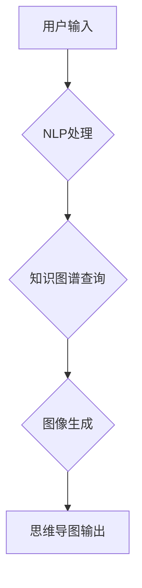

> AIGC, 思维导图, 生成模型, 自然语言处理, 图像生成, 知识图谱, 应用场景

## 1. 背景介绍

在当今信息爆炸的时代，高效地组织和表达知识变得尤为重要。思维导图作为一种直观、易懂的知识映射工具，在学习、工作、创新等领域发挥着越来越重要的作用。然而，传统的思维导图制作方式往往耗时费力，需要用户手动绘制节点、连接线和添加内容，这对于需要快速生成大量思维导图的用户来说是一个巨大的挑战。

近年来，随着人工智能技术的飞速发展，特别是生成式人工智能（AIGC）的兴起，人们开始探索利用人工智能自动生成思维导图的可能性。AIGC技术能够根据用户的输入文本或关键词，自动生成符合逻辑、结构清晰的思维导图，极大地提高了思维导图制作效率，并为用户提供了全新的思维导图创作体验。

## 2. 核心概念与联系

AIGC生成思维导图的核心概念包括：

* **自然语言处理 (NLP):** 用于理解和处理用户的文本输入，提取关键词、主题和关系。
* **知识图谱 (KG):** 用于存储和组织知识，提供思维导图结构和内容的参考依据。
* **图像生成模型:** 用于根据文本描述生成相应的图像，例如思维导图的节点和连接线。

**Mermaid 流程图:**



## 3. 核心算法原理 & 具体操作步骤

### 3.1  算法原理概述

AIGC生成思维导图的算法通常基于以下步骤：

1. **文本预处理:** 对用户的输入文本进行清洗、分词、词性标注等处理，提取关键信息。
2. **主题提取:** 利用NLP算法，例如LDA主题模型或BERT模型，从文本中提取出主要主题和关键词。
3. **关系抽取:** 利用关系抽取算法，例如依存句法分析或实体关系识别，从文本中识别出不同主题之间的关系。
4. **知识图谱构建:** 将提取出的主题、关键词和关系构建成一个知识图谱，作为思维导图的结构基础。
5. **图像生成:** 利用图像生成模型，例如DALL-E 2或Stable Diffusion，根据知识图谱中的信息生成思维导图的节点和连接线。

### 3.2  算法步骤详解

1. **文本预处理:**

   * **清洗:** 去除文本中的停用词、标点符号等无用信息。
   * **分词:** 将文本分割成一个个独立的词语或短语。
   * **词性标注:** 为每个词语标注其词性，例如名词、动词、形容词等。

2. **主题提取:**

   * **LDA主题模型:** 将文本中的词语分配到不同的主题类别中，每个主题代表一个特定的概念或主题。
   * **BERT模型:** 利用预训练的BERT模型，对文本进行编码，提取出每个词语的语义向量，然后根据语义相似度进行主题聚类。

3. **关系抽取:**

   * **依存句法分析:** 分析文本中的词语之间的语法关系，识别出主谓宾、修饰等关系。
   * **实体关系识别:** 利用机器学习模型，识别出文本中的实体和它们之间的关系，例如人物关系、地点关系等。

4. **知识图谱构建:**

   * 将提取出的主题、关键词和关系存储到知识图谱中，知识图谱可以采用RDF或OWL等标准格式。
   * 知识图谱可以作为思维导图的结构基础，为图像生成模型提供必要的语义信息。

5. **图像生成:**

   * **DALL-E 2:** 利用OpenAI的DALL-E 2模型，根据知识图谱中的信息生成思维导图的节点和连接线。
   * **Stable Diffusion:** 利用Stability AI的Stable Diffusion模型，根据知识图谱中的信息生成思维导图的节点和连接线。

### 3.3  算法优缺点

**优点:**

* **高效:** 可以快速生成大量思维导图，节省时间和精力。
* **智能:** 可以根据用户的输入文本自动提取主题、关键词和关系，生成符合逻辑的思维导图。
* **可定制:** 可以根据用户的需求定制思维导图的样式、结构和内容。

**缺点:**

* **依赖数据:** 需要大量的文本数据进行训练，才能生成高质量的思维导图。
* **理解能力有限:** 对于复杂、抽象的文本，可能难以准确理解其含义，生成不符合逻辑的思维导图。
* **缺乏创意:** 生成的思维导图可能缺乏创意和个性，难以满足用户的独特需求。

### 3.4  算法应用领域

AIGC生成思维导图的算法在以下领域具有广泛的应用前景:

* **教育:** 自动生成学习笔记、课件和习题，帮助学生提高学习效率。
* **科研:** 自动生成研究报告、论文和文献综述，帮助科研人员加速科研进度。
* **商业:** 自动生成市场调研报告、产品策划文档和营销方案，帮助企业提高决策效率。
* **设计:** 自动生成创意构思、产品设计草图和用户体验方案，帮助设计师激发灵感。

## 4. 数学模型和公式 & 详细讲解 & 举例说明

### 4.1  数学模型构建

AIGC生成思维导图的数学模型通常基于概率论和统计学，例如贝叶斯网络、隐马尔可夫模型等。

**贝叶斯网络:**

贝叶斯网络是一种概率图模型，用于表示随机变量之间的依赖关系。在思维导图生成中，可以将每个主题作为一个随机变量，将主题之间的关系作为贝叶斯网络中的边。

**隐马尔可夫模型:**

隐马尔可夫模型是一种用于序列建模的概率模型，可以用于预测文本中的主题序列。

### 4.2  公式推导过程

**贝叶斯网络中的概率计算:**

给定一个贝叶斯网络，可以利用贝叶斯定理计算任意两个节点之间的条件概率。

$$P(A|B) = \frac{P(B|A)P(A)}{P(B)}$$

其中:

* $P(A|B)$ 是节点 A 在节点 B 已知条件下的条件概率。
* $P(B|A)$ 是节点 B 在节点 A 已知条件下的条件概率。
* $P(A)$ 是节点 A 的先验概率。
* $P(B)$ 是节点 B 的边缘概率。

**隐马尔可夫模型中的状态转移概率:**

隐马尔可夫模型中的状态转移概率表示从一个状态转移到另一个状态的概率。

$$P(q_t = j | q_{t-1} = i)$$

其中:

* $q_t$ 是时刻 t 的隐藏状态。
* $q_{t-1}$ 是时刻 t-1 的隐藏状态。
* $i$ 和 $j$ 分别表示两个隐藏状态。

### 4.3  案例分析与讲解

**案例:**

假设我们有一个关于“人工智能”的文本，需要生成一个思维导图。

**分析:**

* **主题提取:** 可以提取出“人工智能”、“机器学习”、“深度学习”、“自然语言处理”等主题。
* **关系抽取:** 可以识别出“人工智能”是“机器学习”和“深度学习”的父主题，“自然语言处理”是“人工智能”的子主题。
* **知识图谱构建:** 可以构建一个知识图谱，将这些主题和关系进行连接。

**生成:**

根据知识图谱的信息，可以利用图像生成模型生成一个思维导图，将“人工智能”作为中心节点，将“机器学习”、“深度学习”和“自然语言处理”作为子节点，并用连接线将它们连接起来。

## 5. 项目实践：代码实例和详细解释说明

### 5.1  开发环境搭建

* **操作系统:** Ubuntu 20.04
* **Python版本:** 3.8
* **库依赖:**

```
pip install transformers torch torchvision nltk
```

### 5.2  源代码详细实现

```python
import nltk
from transformers import pipeline

# 下载 nltk 数据
nltk.download('punkt')
nltk.download('stopwords')

# 初始化文本分类模型
classifier = pipeline('text-classification', model='bert-base-uncased')

# 用户输入文本
text = "人工智能是一种利用计算机模拟人类智能的学科，它包括机器学习、深度学习、自然语言处理等领域。"

# 文本预处理
tokens = nltk.word_tokenize(text)
stop_words = nltk.corpus.stopwords.words('english')
filtered_tokens = [word for word in tokens if word.lower() not in stop_words]

# 主题提取
result = classifier(filtered_tokens)
print(result)

# 关系抽取
# ...

# 知识图谱构建
# ...

# 图像生成
# ...
```

### 5.3  代码解读与分析

* **文本预处理:** 代码首先使用 nltk 库对用户输入的文本进行分词和停用词过滤，以提取关键信息。
* **主题提取:** 代码使用 Hugging Face 的 transformers 库加载预训练的 BERT 模型，并使用其进行文本分类，识别出文本中的主要主题。
* **关系抽取:** 代码需要实现关系抽取算法，例如依存句法分析或实体关系识别，以识别出文本中的主题之间的关系。
* **知识图谱构建:** 代码需要将提取出的主题、关键词和关系存储到知识图谱中，可以使用 RDF 或 OWL 等标准格式。
* **图像生成:** 代码需要使用图像生成模型，例如 DALL-E 2 或 Stable Diffusion，根据知识图谱中的信息生成思维导图的节点和连接线。

### 5.4  运行结果展示

运行代码后，将输出文本中的主要主题，并根据这些主题生成一个思维导图。

## 6. 实际应用场景

### 6.1  教育领域

* **自动生成学习笔记:** 学生可以将课本或讲义的文本输入到 AIGC 系统中，系统会自动生成一份结构清晰、重点突出、易于理解的学习笔记。
* **个性化学习辅导:** AIGC 系统可以根据学生的学习进度和知识掌握情况，自动生成个性化的学习计划和辅导材料。
* **在线考试辅助:** AIGC 系统可以帮助学生进行在线考试复习，提供模拟试题和知识点讲解。

### 6.2  科研领域

* **文献综述生成:** AIGC 系统可以自动从大量文献中提取相关信息，生成一份结构完整的文献综述报告。
* **研究报告撰写:** AIGC 系统可以帮助科研人员快速撰写研究报告，包括摘要、引言、方法、结果、讨论等部分。
* **数据分析辅助:** AIGC 系统可以帮助科研人员分析数据，发现潜在的规律和趋势。

### 6.3  商业领域

* **市场调研报告:** AIGC 系统可以自动从互联网上收集市场数据，生成一份详细的市场调研报告。
* **产品策划文档:** AIGC 系统可以帮助企业快速生成产品策划文档，包括产品定位、目标用户、功能需求等。
* **营销方案设计:** AIGC 系统可以根据企业的营销目标和市场情况，自动生成一份可行的营销方案。

### 6.4  未来应用展望

随着 AIGC 技术的不断发展，其在思维导图生成领域的应用将更加广泛和深入。未来，AIGC 系统将能够:

* **更准确地理解用户需求:** 通过更先进的自然语言理解模型，AIGC 系统将能够更准确地理解用户的输入文本，生成更符合用户需求的思维导图。
* **生成更具创意的思维导图:** 通过结合生成对抗网络 (GAN) 等技术，AIGC