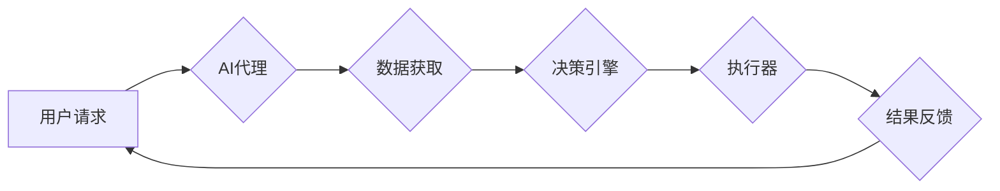

> AI代理，工作流，新零售，智能化，自动化，流程优化，数据驱动

## 1. 背景介绍

新零售时代，消费者对购物体验的期望越来越高，对个性化、智能化、便捷化的服务需求日益增长。传统零售模式面临着效率低下、成本高昂、服务体验差等挑战。而人工智能（AI）技术作为新零售的重要驱动力，正在深刻地改变着零售业的运营模式和消费者购物体验。

AI代理工作流（AI Agent WorkFlow）作为一种新兴的AI应用模式，通过构建智能代理系统，自动完成零售业务流程中的各种任务，可以有效提升零售效率、降低运营成本、提升客户满意度。

## 2. 核心概念与联系

**2.1 AI代理**

AI代理是指能够自主学习、决策、执行任务的智能软件实体。它可以模拟人类的行为，通过感知环境、分析数据、制定计划并执行行动来完成特定的任务。

**2.2 工作流**

工作流是指一系列相互关联的活动或任务，按照一定的顺序和逻辑进行执行，以实现某个目标。在零售业中，工作流涵盖了从商品采购到客户服务等多个环节。

**2.3 AI代理工作流**

AI代理工作流是指利用AI代理技术，自动完成零售业务流程中的各种任务，实现流程自动化、智能化和优化。

**2.4 架构图**



## 3. 核心算法原理 & 具体操作步骤

**3.1 算法原理概述**

AI代理工作流的核心算法原理是基于机器学习和自然语言处理技术。

* **机器学习:** AI代理通过学习历史数据，识别模式和趋势，从而预测未来行为和做出决策。
* **自然语言处理:** AI代理能够理解和处理人类语言，例如客户的咨询、订单信息等。

**3.2 算法步骤详解**

1. **数据收集:** 收集零售业务流程中的各种数据，例如商品信息、客户数据、订单数据等。
2. **数据预处理:** 对收集到的数据进行清洗、转换和格式化，使其能够被AI代理理解和使用。
3. **模型训练:** 利用机器学习算法，训练AI代理模型，使其能够识别模式、预测行为和做出决策。
4. **代理部署:** 将训练好的AI代理模型部署到实际环境中，使其能够接收到用户请求并执行任务。
5. **任务执行:** AI代理根据用户请求和自身模型的决策，执行相应的任务，例如处理订单、提供客户服务等。
6. **结果反馈:** AI代理将执行结果反馈给用户，并根据用户反馈进行模型更新和优化。

**3.3 算法优缺点**

* **优点:**
    * 自动化流程，提高效率
    * 智能化决策，提升准确性
    * 个性化服务，增强客户体验
* **缺点:**
    * 数据依赖性强，需要大量高质量数据
    * 模型训练复杂，需要专业技术人员
    * 缺乏灵活性，难以应对突发情况

**3.4 算法应用领域**

* **智能客服:** 自动处理客户咨询、订单查询、退换货等问题。
* **商品推荐:** 根据用户的购买历史和偏好，推荐合适的商品。
* **库存管理:** 自动预测商品需求，优化库存水平。
* **物流配送:** 自动规划配送路线，提高配送效率。

## 4. 数学模型和公式 & 详细讲解 & 举例说明

**4.1 数学模型构建**

AI代理工作流的数学模型可以基于马尔可夫决策过程（MDP）构建。

* 状态空间：零售业务流程中的所有可能状态，例如订单状态、库存水平、客户位置等。
* 动作空间：AI代理可以执行的各种动作，例如处理订单、推荐商品、调整库存等。
* 转移概率：从一个状态到另一个状态的概率，取决于执行的动作和环境因素。
* 奖励函数：评估AI代理在不同状态下执行不同动作的收益，例如完成订单的奖励、减少库存积压的奖励等。

**4.2 公式推导过程**

MDP的目标是找到一个策略，使得AI代理在长期运行中获得最大的总奖励。策略可以表示为一个状态到动作的映射关系。

可以使用动态规划算法或强化学习算法来求解MDP问题。

**4.3 案例分析与讲解**

例如，在智能客服场景中，状态空间可以包括客户的咨询内容、订单状态等；动作空间可以包括回答客户问题、提供相关信息、转接人工客服等；转移概率可以根据客户的反馈和历史数据进行估计；奖励函数可以根据客户满意度和服务效率进行设计。

通过训练AI代理模型，使其能够学习到最佳的策略，从而实现智能客服的自动化和智能化。

## 5. 项目实践：代码实例和详细解释说明

**5.1 开发环境搭建**

* Python 3.x
* TensorFlow 或 PyTorch
* NLTK 或 SpaCy

**5.2 源代码详细实现**

```python
# 导入必要的库
import tensorflow as tf
from nltk.tokenize import word_tokenize

# 定义模型结构
model = tf.keras.Sequential([
    tf.keras.layers.Embedding(input_dim=vocab_size, output_dim=embedding_dim),
    tf.keras.layers.LSTM(units=hidden_units),
    tf.keras.layers.Dense(units=num_classes, activation='softmax')
])

# 编译模型
model.compile(optimizer='adam', loss='sparse_categorical_crossentropy', metrics=['accuracy'])

# 训练模型
model.fit(x_train, y_train, epochs=epochs, batch_size=batch_size)

# 预测结果
predictions = model.predict(x_test)
```

**5.3 代码解读与分析**

* 该代码示例展示了使用深度学习模型训练一个简单的AI代理，用于处理客户咨询。
* 模型结构包括嵌入层、LSTM层和全连接层。
* 嵌入层将单词转换为向量表示。
* LSTM层用于捕捉文本序列中的上下文信息。
* 全连接层用于分类客户咨询的类型。

**5.4 运行结果展示**

* 训练完成后，可以评估模型的准确率和F1-score等指标。
* 可以将训练好的模型部署到实际环境中，用于处理客户咨询。

## 6. 实际应用场景

**6.1 智能客服**

AI代理可以自动处理客户咨询、订单查询、退换货等问题，提高客服效率，降低人工成本。

**6.2 商品推荐**

AI代理可以根据用户的购买历史和偏好，推荐合适的商品，提升用户购物体验，增加销售额。

**6.3 库存管理**

AI代理可以自动预测商品需求，优化库存水平，降低库存积压和缺货风险。

**6.4 物流配送**

AI代理可以自动规划配送路线，提高配送效率，降低物流成本。

**6.5 未来应用展望**

* **个性化营销:** AI代理可以根据用户的行为和偏好，提供个性化的营销服务。
* **智慧门店:** AI代理可以帮助构建智慧门店，提供更便捷、更智能的购物体验。
* **供应链管理:** AI代理可以优化供应链流程，提高效率和透明度。

## 7. 工具和资源推荐

**7.1 学习资源推荐**

* **书籍:**
    * 《Reinforcement Learning: An Introduction》
    * 《Deep Learning》
* **在线课程:**
    * Coursera: Reinforcement Learning Specialization
    * Udacity: Deep Learning Nanodegree

**7.2 开发工具推荐**

* **TensorFlow:** 开源深度学习框架
* **PyTorch:** 开源深度学习框架
* **NLTK:** 自然语言处理工具包
* **SpaCy:** 自然语言处理工具包

**7.3 相关论文推荐**

* **AlphaGo:** DeepMind发布的围棋AI系统
* **BERT:** Google发布的预训练语言模型
* **GPT-3:** OpenAI发布的文本生成模型

## 8. 总结：未来发展趋势与挑战

**8.1 研究成果总结**

AI代理工作流在零售业的应用取得了显著成果，例如提高了客服效率、优化了库存管理、提升了用户购物体验等。

**8.2 未来发展趋势**

* **更智能的代理:** 利用更先进的AI算法，例如强化学习和迁移学习，训练更智能的AI代理，使其能够更好地理解和响应用户的需求。
* **更个性化的服务:** 利用用户数据和行为分析，提供更个性化的商品推荐、营销服务和购物体验。
* **更广泛的应用场景:** 将AI代理工作流应用到更多零售业的环节，例如商品设计、供应链管理、物流配送等。

**8.3 面临的挑战**

* **数据安全和隐私保护:** AI代理工作流需要大量用户数据，如何保证数据安全和隐私保护是一个重要的挑战。
* **算法可解释性和透明度:** AI代理的决策过程往往是复杂的，如何提高算法的可解释性和透明度，增强用户信任是一个重要的挑战。
* **技术标准和生态建设:** 缺乏统一的技术标准和生态建设，制约了AI代理工作流的推广应用。

**8.4 研究展望**

未来，AI代理工作流的研究将继续深入，探索更智能、更个性化、更广泛的应用场景，为零售业的数字化转型和智能化发展提供更强大的技术支撑。

## 9. 附录：常见问题与解答

**9.1 如何选择合适的AI代理模型？**

选择合适的AI代理模型需要根据具体的应用场景和数据特点进行选择。例如，对于文本处理任务，可以使用BERT或GPT-3等预训练语言模型；对于决策任务，可以使用强化学习算法训练的代理模型。

**9.2 如何保证AI代理的安全性？**

保证AI代理的安全性需要从多个方面进行考虑，例如数据加密、身份验证、权限控制等。

**9.3 如何评估AI代理的性能？**

评估AI代理的性能可以使用各种指标，例如准确率、F1-score、召回率等。

**9.4 如何部署AI代理？**

AI代理可以部署到云端、边缘设备或本地服务器等环境中。

**9.5 如何维护和更新AI代理？**

需要定期收集新的数据，训练和更新AI代理模型，以保证其性能和准确性。


作者：禅与计算机程序设计艺术 / Zen and the Art of Computer Programming 
<end_of_turn>