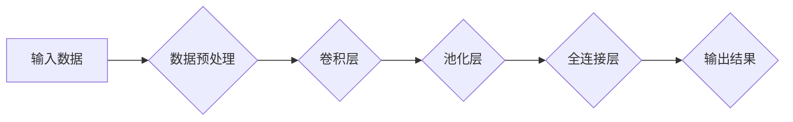

> AI模型加速、CPU、GPU、深度学习、并行计算、设备选择、性能优化

## 1. 背景介绍

近年来，人工智能（AI）技术蓬勃发展，深度学习模型在图像识别、自然语言处理、语音识别等领域取得了突破性进展。然而，训练和部署这些复杂的深度学习模型往往需要大量的计算资源和时间。为了加速AI模型的训练和推理过程，高效利用计算资源成为一个关键问题。

CPU（中央处理器）和GPU（图形处理单元）是两种主要的计算设备，在AI模型加速中扮演着重要角色。CPU擅长处理顺序计算，而GPU拥有强大的并行计算能力，使其在处理海量数据和复杂的矩阵运算方面具有优势。

本文将深入探讨CPU和GPU在AI模型加速中的应用，分析其优缺点，并提供设备选择和性能优化建议，帮助读者更好地理解和利用这些计算资源，加速AI模型的训练和推理过程。

## 2. 核心概念与联系

### 2.1 CPU和GPU的架构差异

**CPU**

* 核心数：少（通常4-8个）
* 缓存：大（L1、L2、L3）
* 频率：高
* 功耗：高
* 擅长的计算类型：顺序计算、少量数据处理

**GPU**

* 核心数：多（千核甚至万核）
* 缓存：小（共享内存）
* 频率：低
* 功耗：低
* 擅长的计算类型：并行计算、海量数据处理

### 2.2 AI模型加速的原理

深度学习模型的训练和推理本质上是大量的矩阵运算。GPU的并行计算能力使其能够高效处理这些矩阵运算，从而加速AI模型的训练和推理过程。

**并行计算原理：**

GPU将一个大型任务分解成许多小的子任务，并将其分配给不同的核心进行并行处理。每个核心处理一个子任务，最终将所有子任务的结果汇总在一起，得到最终的结果。

**数据流图：**

深度学习模型的训练和推理过程可以表示为数据流图，其中每个节点代表一个计算操作，每个边代表数据流。GPU可以并行处理多个节点，从而加速数据流的传输和计算。

**Mermaid 流程图：**



## 3. 核心算法原理 & 具体操作步骤

### 3.1 算法原理概述

深度学习模型的训练主要基于反向传播算法（Backpropagation）。反向传播算法通过计算误差，并根据误差调整模型参数，从而使模型的预测结果越来越准确。

**反向传播算法步骤：**

1. 将输入数据输入到模型中，得到预测结果。
2. 计算预测结果与真实结果之间的误差。
3. 根据误差反向传播，计算每个参数的梯度。
4. 使用梯度下降算法更新模型参数。
5. 重复步骤1-4，直到模型的预测结果达到预设的精度。

### 3.2 算法步骤详解

**1. 前向传播：**

将输入数据逐层传递到模型中，计算每个层的输出。

**2. 损失函数计算：**

计算预测结果与真实结果之间的误差，使用损失函数衡量误差的大小。

**3. 反向传播：**

根据损失函数的梯度，反向传播误差信息到每个参数。

**4. 参数更新：**

使用梯度下降算法更新每个参数的值，使模型的预测结果更接近真实结果。

### 3.3 算法优缺点

**优点：**

* 能够学习复杂的非线性关系。
* 具有较高的预测精度。
* 可以应用于多种类型的数据。

**缺点：**

* 训练过程需要大量的计算资源和时间。
* 模型参数数量庞大，容易过拟合。
* 对数据质量要求较高。

### 3.4 算法应用领域

* 图像识别
* 自然语言处理
* 语音识别
* 机器翻译
* 医疗诊断
* 金融预测

## 4. 数学模型和公式 & 详细讲解 & 举例说明

### 4.1 数学模型构建

深度学习模型可以看作是一个多层神经网络，每个神经元接收多个输入，并通过激活函数进行处理，输出一个结果。

**神经网络模型：**

```
y = f(W * x + b)
```

其中：

* y：输出结果
* x：输入数据
* W：权重矩阵
* b：偏置向量
* f：激活函数

### 4.2 公式推导过程

反向传播算法的核心是计算每个参数的梯度，并根据梯度更新参数值。

**梯度计算公式：**

```
dW = ∂L/∂W
db = ∂L/∂b
```

其中：

* L：损失函数

### 4.3 案例分析与讲解

假设我们有一个简单的线性回归模型，目标是预测房价。

**模型输入：**

* 房屋面积

**模型输出：**

* 房价

**损失函数：**

* 均方误差

我们可以使用反向传播算法训练这个模型，通过调整模型参数（权重和偏置），使模型的预测结果与真实房价越接近。

## 5. 项目实践：代码实例和详细解释说明

### 5.1 开发环境搭建

* Python 3.x
* TensorFlow 或 PyTorch 深度学习框架
* CUDA 和 cuDNN（GPU加速库）

### 5.2 源代码详细实现

```python
import tensorflow as tf

# 定义模型
model = tf.keras.models.Sequential([
    tf.keras.layers.Dense(units=64, activation='relu', input_shape=(1,)),
    tf.keras.layers.Dense(units=1)
])

# 编译模型
model.compile(optimizer='adam', loss='mse')

# 训练模型
model.fit(x_train, y_train, epochs=10)

# 评估模型
loss = model.evaluate(x_test, y_test)
```

### 5.3 代码解读与分析

* **模型定义：** 使用 TensorFlow 的 Keras API 定义了一个简单的线性回归模型，包含两层全连接层。
* **模型编译：** 使用 Adam 优化器和均方误差损失函数编译模型。
* **模型训练：** 使用训练数据训练模型，设置训练轮数为 10。
* **模型评估：** 使用测试数据评估模型的性能，计算损失值。

### 5.4 运行结果展示

训练完成后，我们可以使用测试数据预测房价，并与真实房价进行比较。

## 6. 实际应用场景

### 6.1 图像识别

* 自动驾驶汽车
* 人脸识别
* 物体检测

### 6.2 自然语言处理

* 机器翻译
* 文本摘要
* 情感分析

### 6.3 语音识别

* 语音助手
* 语音搜索
* 语音控制

### 6.4 未来应用展望

* 医疗诊断
* 金融预测
* 个性化推荐

## 7. 工具和资源推荐

### 7.1 学习资源推荐

* 深度学习书籍：
    * 《深度学习》
    * 《动手学深度学习》
* 在线课程：
    * Coursera 深度学习课程
    * Udacity 深度学习工程师 Nanodegree

### 7.2 开发工具推荐

* TensorFlow
* PyTorch
* Keras

### 7.3 相关论文推荐

* 《ImageNet Classification with Deep Convolutional Neural Networks》
* 《Attention Is All You Need》

## 8. 总结：未来发展趋势与挑战

### 8.1 研究成果总结

近年来，AI模型加速技术取得了显著进展，特别是GPU在深度学习训练中的应用，极大地提高了模型训练效率。

### 8.2 未来发展趋势

* 更强大的GPU架构
* 更高效的深度学习算法
* 模型压缩和加速技术
* 边缘计算和推理

### 8.3 面临的挑战

* 计算资源成本高昂
* 模型训练时间长
* 数据隐私和安全问题

### 8.4 研究展望

* 开发更节能、更高效的AI加速技术
* 研究更适合边缘计算的深度学习模型
* 探索新的AI应用场景

## 9. 附录：常见问题与解答

### 9.1 CPU和GPU哪个更适合深度学习？

GPU更适合深度学习，因为它拥有强大的并行计算能力，可以高效处理深度学习模型中的大量矩阵运算。

### 9.2 如何选择合适的GPU？

选择合适的GPU需要考虑模型规模、训练数据量、预算等因素。

### 9.3 如何优化AI模型的性能？

可以通过模型架构设计、数据预处理、参数优化等方式优化AI模型的性能。


作者：禅与计算机程序设计艺术 / Zen and the Art of Computer Programming 
<end_of_turn>