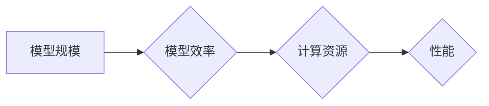

> AI模型规模,模型效率,深度学习,计算资源,性能优化,压缩技术,量化技术,模型剪枝

## 1. 背景介绍

近年来，深度学习在计算机视觉、自然语言处理、语音识别等领域取得了突破性进展，其核心驱动力之一是模型规模的不断扩大。更大的模型参数量往往意味着更强的学习能力和更高的准确率。然而，随着模型规模的增长，训练和部署这些模型所需的计算资源也呈指数级增长，这给模型的效率和可扩展性带来了挑战。

模型规模与效率之间的平衡是一个至关重要的课题。一方面，更大的模型可以带来更好的性能，但另一方面，过大的模型会带来巨大的计算成本和资源消耗。如何找到模型规模与效率的最佳平衡点，是当前人工智能研究领域的重要方向之一。

## 2. 核心概念与联系

**2.1 模型规模**

模型规模通常指模型参数的数量。参数是模型学习到的知识表示，它们决定了模型的复杂性和表达能力。模型规模越大，参数数量越多，模型理论上可以学习更复杂的模式，从而获得更高的准确率。

**2.2 模型效率**

模型效率是指模型在给定计算资源下完成任务所需的资源消耗。它通常用模型的推理速度、内存占用和能耗来衡量。高效的模型能够在有限的资源下提供良好的性能，这对于部署在移动设备、嵌入式系统等资源受限环境中至关重要。

**2.3 联系**

模型规模和效率之间存在着密切的联系。一般来说，模型规模越大，效率越低。这是因为更大的模型需要更多的计算资源来进行训练和推理。然而，并非所有规模较大的模型都效率低下。通过一些模型压缩和优化技术，可以有效提高模型的效率，同时保持其较高的准确率。

**2.4 Mermaid 流程图**



## 3. 核心算法原理 & 具体操作步骤

**3.1 算法原理概述**

模型压缩和优化技术旨在通过减少模型参数量、降低模型复杂度或提高模型的计算效率来提高模型的效率。常见的模型压缩和优化技术包括：

* **量化技术:** 将模型参数从高精度浮点数（例如32位浮点数）压缩到低精度整数（例如8位整数）。
* **模型剪枝:** 通过移除模型中不重要的参数或连接，减少模型参数量。
* **知识蒸馏:** 将大型模型的知识迁移到小型模型中，从而提高小型模型的性能。

**3.2 算法步骤详解**

**3.2.1 量化技术**

1. **选择量化方案:** 常见的量化方案包括均匀量化、非均匀量化和混合量化。
2. **量化模型参数:** 将模型参数转换为低精度整数。
3. **调整模型结构:** 为了适应量化后的参数，可能需要调整模型结构，例如增加激活函数的量化步骤。
4. **重新训练模型:** 使用量化后的模型进行微调，以恢复模型性能。

**3.2.2 模型剪枝**

1. **选择剪枝策略:** 常见的剪枝策略包括随机剪枝、梯度下降剪枝和结构剪枝。
2. **移除不重要的参数:** 根据剪枝策略，移除模型中不重要的参数或连接。
3. **重新训练模型:** 使用剪枝后的模型进行微调，以恢复模型性能。

**3.3 算法优缺点**

**3.3.1 量化技术**

* **优点:** 
    * 模型大小和计算量显著减少。
    * 推理速度显著提升。
    * 能耗降低。
* **缺点:** 
    * 量化可能会导致精度损失。
    * 需要额外的训练步骤来恢复模型性能。

**3.3.2 模型剪枝**

* **优点:** 
    * 模型大小和计算量显著减少。
    * 推理速度显著提升。
    * 能耗降低。
* **缺点:** 
    * 剪枝可能会导致精度损失。
    * 需要额外的训练步骤来恢复模型性能。

**3.4 算法应用领域**

模型压缩和优化技术广泛应用于各种人工智能领域，例如：

* **移动设备:** 由于移动设备的资源受限，模型压缩和优化技术可以使深度学习模型在移动设备上高效运行。
* **嵌入式系统:** 嵌入式系统通常具有有限的计算资源，模型压缩和优化技术可以使深度学习模型在嵌入式系统上部署。
* **云计算:** 云计算平台需要处理海量数据，模型压缩和优化技术可以提高云计算平台的效率和资源利用率。

## 4. 数学模型和公式 & 详细讲解 & 举例说明

**4.1 数学模型构建**

模型压缩和优化技术可以抽象为一个数学优化问题。目标是找到一个模型参数的子集，使得模型在给定精度损失下，计算资源消耗最小。

**4.2 公式推导过程**

假设模型的精度损失函数为L(θ)，其中θ表示模型参数。模型的计算资源消耗函数为C(θ)，其中θ表示模型参数。目标是找到一个模型参数的子集θ*，使得以下目标函数最小化：

```latex
min_{\theta*} C(\theta*)
```

subject to:

```latex
L(\theta*) \leq \epsilon
```

其中ε表示允许的精度损失。

**4.3 案例分析与讲解**

**4.3.1 量化技术**

在量化技术中，模型参数从高精度浮点数转换为低精度整数。量化误差可以表示为：

```latex
\Delta = \theta_{quantized} - \theta_{original}
```

其中θ<sub>quantized</sub>表示量化后的参数，θ<sub>original</sub>表示原始的参数。

量化误差会影响模型的精度。为了最小化量化误差，可以采用均匀量化、非均匀量化或混合量化等方案。

**4.3.2 模型剪枝**

在模型剪枝中，移除模型中不重要的参数或连接。剪枝策略可以根据模型结构和任务需求进行选择。例如，随机剪枝可以随机移除一些参数，而梯度下降剪枝可以根据参数的梯度值进行剪枝。

## 5. 项目实践：代码实例和详细解释说明

**5.1 开发环境搭建**

* Python 3.7+
* TensorFlow 2.0+
* PyTorch 1.0+

**5.2 源代码详细实现**

```python
# 模型量化示例代码
import tensorflow as tf

# 定义一个简单的模型
model = tf.keras.models.Sequential([
    tf.keras.layers.Dense(128, activation='relu', input_shape=(784,)),
    tf.keras.layers.Dense(10, activation='softmax')
])

# 加载训练数据
(x_train, y_train), (x_test, y_test) = tf.keras.datasets.mnist.load_data()

# 训练模型
model.compile(optimizer='adam',
              loss='sparse_categorical_crossentropy',
              metrics=['accuracy'])
model.fit(x_train, y_train, epochs=5)

# 量化模型
converter = tf.lite.TFLiteConverter.from_keras_model(model)
tflite_model = converter.convert()

# 保存量化模型
with open('quantized_model.tflite', 'wb') as f:
    f.write(tflite_model)
```

**5.3 代码解读与分析**

* 代码首先定义了一个简单的深度学习模型。
* 然后加载MNIST数据集进行训练。
* 训练完成后，使用`tf.lite.TFLiteConverter`将模型转换为TFLite格式。
* 最后将量化后的模型保存为`quantized_model.tflite`文件。

**5.4 运行结果展示**

量化后的模型可以部署在移动设备或嵌入式系统上，并提供良好的性能。

## 6. 实际应用场景

**6.1 移动设备**

在移动设备上，模型压缩和优化技术可以使深度学习模型在有限的资源下高效运行。例如，可以将语音识别模型压缩到几百KB，并在智能手机上实现实时语音识别。

**6.2 嵌入式系统**

嵌入式系统通常具有有限的计算资源和内存容量。模型压缩和优化技术可以使深度学习模型在嵌入式系统上部署，例如在智能家居设备、无人机和工业自动化系统中。

**6.3 云计算**

云计算平台需要处理海量数据，模型压缩和优化技术可以提高云计算平台的效率和资源利用率。例如，可以将大型语言模型压缩到更小的尺寸，并部署在云端，以提供更快速和高效的自然语言处理服务。

**6.4 未来应用展望**

随着人工智能技术的不断发展，模型压缩和优化技术将发挥越来越重要的作用。未来，我们可以期待以下应用场景：

* **边缘计算:** 模型压缩和优化技术将使深度学习模型能够在边缘设备上进行推理，从而实现更低延迟和更高的隐私保护。
* **工业自动化:** 模型压缩和优化技术将使深度学习模型能够在工业自动化系统中部署，以提高生产效率和安全性。
* **医疗保健:** 模型压缩和优化技术将使深度学习模型能够在医疗保健领域应用，例如用于疾病诊断、药物发现和个性化医疗。

## 7. 工具和资源推荐

**7.1 学习资源推荐**

* **论文:**
    * "Deep Compression: Compressing Deep Neural Networks with Pruning, Trained Quantization and Huffman Coding"
    * "Lottery Ticket Hypothesis: Finding Sparse, Trainable Neural Networks"
    * "Knowledge Distillation"
* **博客:**
    * TensorFlow Blog: https://blog.tensorflow.org/
    * PyTorch Blog: https://pytorch.org/blog/

**7.2 开发工具推荐**

* **TensorFlow Lite:** https://www.tensorflow.org/lite
* **PyTorch Mobile:** https://pytorch.org/mobile/
* **ONNX Runtime:** https://onnxruntime.ai/

**7.3 相关论文推荐**

* "MobileNetV2: Inverted Residuals and Linear Bottlenecks"
* "EfficientNet: Rethinking Model Scaling for Convolutional Neural Networks"
* "SqueezeNet: AlexNet-level accuracy with 50x fewer parameters and <0.5MB model size"

## 8. 总结：未来发展趋势与挑战

**8.1 研究成果总结**

近年来，模型压缩和优化技术取得了显著进展，例如量化技术、模型剪枝和知识蒸馏等方法已经成功应用于各种人工智能领域。这些技术有效降低了模型的计算资源消耗，提高了模型的效率和可部署性。

**8.2 未来发展趋势**

未来，模型压缩和优化技术将朝着以下方向发展：

* **更有效的压缩算法:** 研究更有效的模型压缩算法，以进一步降低模型的尺寸和计算资源消耗。
* **自适应压缩:** 开发自适应压缩技术，根据不同的硬件平台和任务需求动态调整模型压缩策略。
* **硬件加速:** 与硬件厂商合作，开发专门用于模型压缩和优化的硬件加速器。

**8.3 面临的挑战**

尽管取得了显著进展，模型压缩和优化技术仍然面临一些挑战：

* **精度损失:** 模型压缩可能会导致精度损失，需要找到一种平衡模型大小和精度的方法。
* **通用性:** 目前大多数模型压缩技术针对特定的模型架构和任务，缺乏通用性。
* **可解释性:** 模型压缩过程的复杂性使得其结果难以解释，需要提高模型压缩技术的可解释性。

**8.4 研究展望**

未来，我们需要继续探索新的模型压缩和优化技术，以解决上述挑战，并推动人工智能技术的更广泛应用。


## 9. 附录：常见问题与解答

**9.1 模型压缩会降低模型精度吗？**

是的，模型压缩可能会导致精度损失。这是因为模型压缩会减少模型参数量或模型复杂度，从而降低模型的学习能力。

**9.2 如何选择