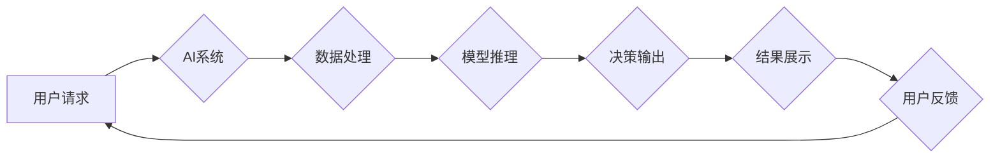

> AI系统, 可审计性, 合规性, 透明度, 可解释性, 责任追溯, 监管框架, 数据隐私

## 1. 背景介绍

人工智能 (AI) 技术的飞速发展，为各行各业带来了前所未有的机遇和挑战。AI 系统在医疗诊断、金融风险评估、交通管理等领域展现出强大的应用潜力，但也引发了关于其可审计性和合规性的广泛关注。

随着 AI 系统的应用范围不断扩大，其决策过程的复杂性和不可解释性也日益凸显。当 AI 系统做出错误或有偏见的结果时，难以追溯其决策逻辑，这不仅会损害用户的信任，还会带来法律和伦理上的风险。因此，设计可审计和合规的 AI 系统，对于确保 AI 技术的健康发展至关重要。

## 2. 核心概念与联系

**2.1 可审计性 (Auditability)**

可审计性是指 AI 系统的决策过程能够被人类理解和验证的能力。这意味着，当 AI 系统做出决策时，应该能够提供清晰、可解释的证据和推理过程，以便人类能够对其进行审查和评估。

**2.2 合规性 (Compliance)**

合规性是指 AI 系统符合相关法律法规和行业标准的能力。这包括数据隐私保护、算法公平性、责任追溯等方面。

**2.3 透明度 (Transparency)**

透明度是指 AI 系统的设计、训练数据和决策过程的公开性和可访问性。透明度有助于提高可审计性和合规性，并增强用户对 AI 系统的信任。

**2.4 可解释性 (Interpretability)**

可解释性是指 AI 系统决策背后的逻辑和推理过程能够被人类理解的能力。

**2.5 责任追溯 (Traceability)**

责任追溯是指能够追溯 AI 系统决策的责任主体，以及其决策过程中的关键环节和数据来源。

**2.6 监管框架 (Regulatory Framework)**

监管框架是指政府或行业组织为规范 AI 系统的开发、应用和监管而制定的规则和标准。

**2.7 数据隐私 (Data Privacy)**

数据隐私是指个人信息在 AI 系统中收集、使用和存储过程中的安全性和保护性。

**Mermaid 流程图**



## 3. 核心算法原理 & 具体操作步骤

### 3.1 算法原理概述

可审计性设计在 AI 系统中通常通过以下几种算法原理实现：

* **规则ベースシステム:** 基于预先定义的规则进行决策，规则清晰易懂，可直接进行审计。
* **可解释性机器学习算法:** 采用如线性回归、决策树、支持向量机等算法，其决策过程相对透明，易于解释。
* **注意力机制:** 通过突出模型在决策过程中关注的关键信息，提高决策的可解释性。
* **对抗训练:** 通过生成对抗样本，增强模型的鲁棒性和可解释性。

### 3.2 算法步骤详解

以决策树算法为例，其可审计性设计步骤如下：

1. **数据预处理:** 对训练数据进行清洗、转换和特征工程，确保数据质量和算法性能。
2. **决策树构建:** 根据训练数据，构建决策树模型，每个节点代表一个特征，每个分支代表一个决策规则。
3. **决策树剪枝:** 通过剪枝算法，去除模型中的冗余节点和分支，提高模型的简洁性和可解释性。
4. **模型评估:** 使用测试数据评估模型的性能，并进行必要的调整和优化。
5. **可解释性分析:** 通过可视化决策树结构、分析特征重要度等方法，解释模型的决策过程。

### 3.3 算法优缺点

**优点:**

* 决策过程清晰易懂，易于解释和审计。
* 训练数据要求相对较低，易于实现。

**缺点:**

* 对于复杂问题，决策树模型可能过于简单，难以捕捉复杂关系。
* 容易过拟合，需要进行适当的剪枝和正则化。

### 3.4 算法应用领域

决策树算法广泛应用于分类、回归、预测等任务，例如：

* **医疗诊断:** 根据患者的症状和病史，预测疾病类型。
* **金融风险评估:** 根据客户的信用记录和财务状况，评估贷款风险。
* **客户关系管理:** 根据客户的行为和偏好，预测客户流失风险。

## 4. 数学模型和公式 & 详细讲解 & 举例说明

### 4.1 数学模型构建

决策树算法的构建过程可以抽象为一个数学模型，其中决策节点对应于特征选择，分支对应于决策规则，叶子节点对应于预测结果。

**决策树模型:**

```
T(x) = {
    c_i, if x ∈ R_i
}
```

其中：

* T(x) 表示决策树对输入数据 x 的预测结果。
* R_i 表示决策树的第 i 个叶子节点对应的样本集。
* c_i 表示决策树的第 i 个叶子节点对应的预测结果。

### 4.2 公式推导过程

决策树算法的构建过程通常采用贪婪算法，通过选择最优特征和决策阈值，逐步构建决策树。

**信息增益:**

```
Gain(S, A) = Entropy(S) - Σ(v∈V) [|S_v| / |S| * Entropy(S_v)]
```

其中：

* S 表示训练数据集。
* A 表示特征。
* V 表示特征 A 的取值集合。
* S_v 表示特征 A 取值为 v 的样本集。
* Entropy(S) 表示数据集 S 的熵值。

**信息增益率:**

```
GainRatio(S, A) = Gain(S, A) / SplitInfo(A)
```

其中：

* SplitInfo(A) 表示特征 A 的分裂信息。

决策树算法会选择信息增益或信息增益率最高的特征作为决策节点，并根据特征的取值，将样本集划分为不同的子集，递归地构建决策树。

### 4.3 案例分析与讲解

假设我们有一个数据集，用于预测客户是否会购买商品。数据集包含以下特征：年龄、收入、性别、购买历史等。

我们可以使用决策树算法构建一个预测模型，并通过可视化决策树结构，分析模型的决策过程。例如，模型可能选择年龄和收入作为决策节点，根据客户的年龄和收入，判断其是否会购买商品。

## 5. 项目实践：代码实例和详细解释说明

### 5.1 开发环境搭建

* 操作系统: Ubuntu 20.04
* Python 版本: 3.8
* 必要的库: scikit-learn, pandas, matplotlib

### 5.2 源代码详细实现

```python
from sklearn.tree import DecisionTreeClassifier
from sklearn.model_selection import train_test_split
from sklearn.metrics import accuracy_score

# 加载数据集
data = pd.read_csv('customer_data.csv')

# 划分训练集和测试集
X_train, X_test, y_train, y_test = train_test_split(data.drop('purchase', axis=1), data['purchase'], test_size=0.2, random_state=42)

# 创建决策树模型
model = DecisionTreeClassifier()

# 训练模型
model.fit(X_train, y_train)

# 预测测试集结果
y_pred = model.predict(X_test)

# 计算模型准确率
accuracy = accuracy_score(y_test, y_pred)
print(f'模型准确率: {accuracy}')

# 可视化决策树结构
from sklearn.tree import plot_tree
import matplotlib.pyplot as plt

plt.figure(figsize=(12, 8))
plot_tree(model, feature_names=data.drop('purchase', axis=1).columns, class_names=['不购买', '购买'], filled=True)
plt.show()
```

### 5.3 代码解读与分析

* 代码首先加载数据集，并使用 `train_test_split` 函数将数据集划分为训练集和测试集。
* 然后，创建决策树模型 `DecisionTreeClassifier()`，并使用 `fit` 方法训练模型。
* 训练完成后，使用 `predict` 方法预测测试集结果，并计算模型准确率。
* 最后，使用 `plot_tree` 函数可视化决策树结构，方便理解模型的决策过程。

### 5.4 运行结果展示

运行代码后，会输出模型的准确率，并展示决策树的结构图。决策树结构图可以直观地展示模型的决策规则，例如，哪些特征被选中作为决策节点，每个节点的决策阈值是多少，以及每个叶子节点对应的预测结果。

## 6. 实际应用场景

可审计性设计在 AI 系统的实际应用场景中具有重要意义，例如：

* **医疗诊断:** 当 AI 系统诊断出疾病时，需要能够提供清晰的证据和推理过程，以便医生进行复核和确认。
* **金融风险评估:** 当 AI 系统拒绝贷款申请时，需要能够解释拒绝的原因，以便客户了解决策依据。
* **自动驾驶:** 当自动驾驶系统做出紧急决策时，需要能够记录决策过程和相关数据，以便事故调查和责任追溯。

### 6.4 未来应用展望

随着 AI 技术的不断发展，可审计性设计将变得越来越重要。未来，可审计性设计将应用于更广泛的 AI 系统，例如：

* **个性化推荐:** 能够解释推荐结果背后的逻辑，增强用户信任。
* **智能客服:** 能够记录对话过程和决策过程，提高服务质量和客户满意度。
* **法律判决辅助:** 能够提供 AI 系统决策的依据和推理过程，提高判决的透明度和公正性。

## 7. 工具和资源推荐

### 7.1 学习资源推荐

* **书籍:**
    * "Interpretable Machine Learning" by Christoph Molnar
    * "The Master Algorithm" by Pedro Domingos
* **在线课程:**
    * Coursera: "Machine Learning" by Andrew Ng
    * edX: "Artificial Intelligence" by Columbia University

### 7.2 开发工具推荐

* **Scikit-learn:** Python 机器学习库，提供多种可解释性算法。
* **LIME:** Local Interpretable Model-agnostic Explanations，用于解释任何机器学习模型的决策。
* **SHAP:** SHapley Additive exPlanations，用于解释机器学习模型的特征重要度。

### 7.3 相关论文推荐

* "Towards a Rigorous Science of Interpretable Machine Learning" by Christoph Molnar
* "Explainable AI: Interpreting, Explaining and Visualizing Deep Learning" by Marco Tulio Ribeiro, Sameer Singh, and Carlos Guestrin
* "SHAP: A Unified Approach to Interpreting Model Predictions" by Scott Lundberg and Su-In Lee

## 8. 总结：未来发展趋势与挑战

### 8.1 研究成果总结

可审计性设计在 AI 系统中取得了显著进展，例如：

* 发展了多种可解释性算法，能够解释机器学习模型的决策过程。
* 构建了可审计性 AI 系统的框架和标准，为 AI 系统的开发和应用提供了指导。
* 推动了 AI 系统的可解释性和透明度的提升，增强了用户对 AI 系统的信任。

### 8.2 未来发展趋势

未来，可审计性设计将朝着以下方向发展：

* **更强大的可解释性算法:** 开发更精确、更通用的可解释性算法，能够解释更复杂和更深层的 AI 模型。
* **自动化可审计性设计:** 自动化可审计性设计流程，降低 AI 系统的可审计性开发成本。
* **可审计性与隐私保护的结合:** 研究可审计性设计与数据隐私保护的结合方法，实现 AI 系统的可审计性和隐私保护的平衡。

### 8.3 面临的挑战

可