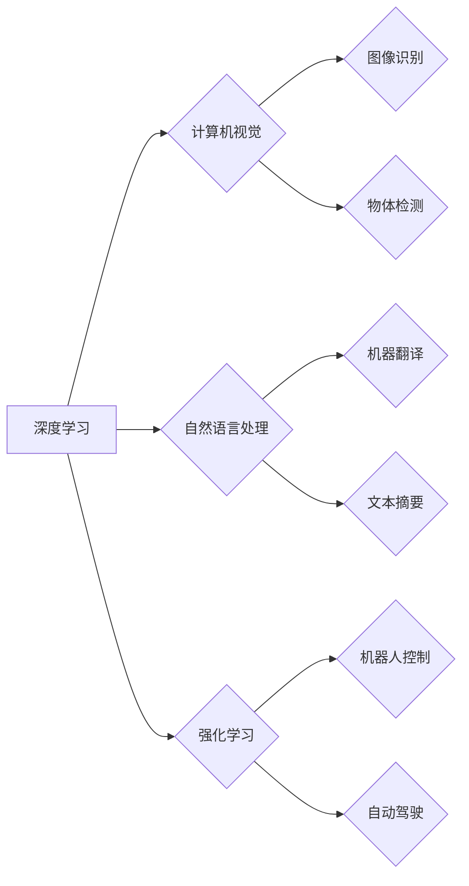

> 人工智能，深度学习，计算机视觉，自然语言处理，强化学习，伦理问题，未来趋势

## 1. 背景介绍

人工智能（AI）正以惊人的速度发展，深刻地改变着我们生活的方方面面。从自动驾驶汽车到智能语音助手，AI技术正在不断突破边界，为人类社会带来前所未有的机遇。作为AI领域的领军人物之一，Andrej Karpathy 博士的贡献和见解对理解AI的未来发展方向具有重要意义。

Andrej Karpathy 博士是特斯拉自动驾驶团队的负责人，也是一位享誉全球的计算机科学家和深度学习专家。他曾在斯坦福大学获得博士学位，并在OpenAI等顶尖机构工作过。Karpathy 博士的研究领域涵盖计算机视觉、自然语言处理和强化学习等多个重要领域，他发表了许多具有影响力的论文，并积极参与开源项目，推动AI技术的普及和发展。

## 2. 核心概念与联系

**2.1 深度学习**

深度学习是人工智能领域的一个重要分支，它利用多层神经网络来模拟人类大脑的学习过程。通过对大量数据进行训练，深度学习模型能够自动提取特征，并进行复杂的模式识别和预测。

**2.2 计算机视觉**

计算机视觉是让计算机“看”世界的一种技术，它旨在使计算机能够理解和解释图像和视频信息。深度学习在计算机视觉领域取得了突破性的进展，例如图像识别、物体检测和图像分割等任务。

**2.3 自然语言处理**

自然语言处理（NLP）是让计算机“理解”人类语言的技术，它旨在使计算机能够理解、生成和处理自然语言文本。深度学习在NLP领域也取得了显著的成果，例如机器翻译、文本摘要和情感分析等任务。

**2.4 强化学习**

强化学习是一种机器学习方法，它通过奖励和惩罚机制来训练智能体，使其在特定环境中做出最优决策。强化学习在机器人控制、游戏 AI 和自动驾驶等领域具有广泛的应用前景。

**2.5 伦理问题**

随着AI技术的快速发展，其伦理问题也日益受到关注。例如，AI算法的偏见、数据隐私和工作岗位替代等问题都需要认真思考和解决。

**2.6 未来趋势**

AI技术将继续朝着更智能、更通用、更安全的方向发展。例如，通用人工智能（AGI）的实现、边缘计算和联邦学习等技术将推动AI技术的进一步发展。

**Mermaid 流程图**



## 3. 核心算法原理 & 具体操作步骤

### 3.1 算法原理概述

深度学习算法的核心是多层神经网络。神经网络由多个层组成，每一层都包含多个神经元。神经元之间通过连接进行信息传递，每个连接都有一个权重。通过对大量数据进行训练，神经网络能够自动调整权重，从而学习到数据的特征和模式。

### 3.2 算法步骤详解

1. **数据预处理:** 将原始数据转换为深度学习模型可以理解的格式。例如，图像数据需要转换为像素值，文本数据需要转换为词向量。
2. **网络结构设计:** 根据具体任务选择合适的网络结构。例如，图像识别任务通常使用卷积神经网络（CNN），文本分类任务通常使用循环神经网络（RNN）。
3. **模型训练:** 使用训练数据训练神经网络模型。训练过程包括前向传播、反向传播和梯度下降等步骤。
4. **模型评估:** 使用测试数据评估模型的性能。常用的评估指标包括准确率、召回率、F1-score等。
5. **模型调优:** 根据评估结果调整模型参数，例如学习率、网络结构等，以提高模型性能。

### 3.3 算法优缺点

**优点:**

* **高准确率:** 深度学习算法能够学习到数据的复杂特征，从而实现高准确率的预测和分类。
* **自动化特征提取:** 深度学习模型能够自动提取特征，无需人工特征工程。
* **通用性强:** 深度学习模型可以应用于多种不同的任务，例如图像识别、自然语言处理和语音识别等。

**缺点:**

* **数据依赖性强:** 深度学习模型需要大量的训练数据才能达到较好的性能。
* **计算资源消耗大:** 训练深度学习模型需要大量的计算资源，例如GPU和TPU。
* **可解释性差:** 深度学习模型的决策过程比较复杂，难以解释其决策依据。

### 3.4 算法应用领域

深度学习算法已广泛应用于各个领域，例如：

* **计算机视觉:** 图像识别、物体检测、图像分割、人脸识别、视频分析等。
* **自然语言处理:** 机器翻译、文本摘要、情感分析、问答系统、聊天机器人等。
* **语音识别:** 语音转文本、语音助手、语音搜索等。
* **医疗保健:** 疾病诊断、图像分析、药物研发等。
* **金融科技:** 风险评估、欺诈检测、投资预测等。

## 4. 数学模型和公式 & 详细讲解 & 举例说明

### 4.1 数学模型构建

深度学习模型的核心是神经网络，它由多个层组成，每一层都包含多个神经元。每个神经元接收来自上一层的输入信号，并通过激活函数进行处理，输出到下一层。

**神经元模型:**

$$
y = f(w^T x + b)
$$

其中：

* $y$ 是神经元的输出值。
* $f$ 是激活函数。
* $w$ 是神经元的权重向量。
* $x$ 是神经元的输入向量。
* $b$ 是神经元的偏置项。

**网络结构:**

深度学习模型可以有多种不同的网络结构，例如卷积神经网络（CNN）、循环神经网络（RNN）和变分自编码器（VAE）。

### 4.2 公式推导过程

深度学习模型的训练过程是通过优化模型参数来最小化损失函数。损失函数衡量模型预测结果与真实结果之间的差异。常用的损失函数包括均方误差（MSE）和交叉熵损失（CE）。

**均方误差损失函数:**

$$
L = \frac{1}{N} \sum_{i=1}^{N} (y_i - \hat{y}_i)^2
$$

其中：

* $L$ 是损失函数的值。
* $N$ 是样本数量。
* $y_i$ 是真实值。
* $\hat{y}_i$ 是模型预测值。

**交叉熵损失函数:**

$$
L = -\frac{1}{N} \sum_{i=1}^{N} y_i \log(\hat{y}_i)
$$

其中：

* $L$ 是损失函数的值。
* $N$ 是样本数量。
* $y_i$ 是真实值（one-hot编码）。
* $\hat{y}_i$ 是模型预测值（概率分布）。

### 4.3 案例分析与讲解

**图像识别案例:**

假设我们有一个图像识别任务，目标是识别图像中的物体类别。我们可以使用CNN模型进行训练，并使用MSE损失函数来优化模型参数。

训练过程如下：

1. 将图像数据预处理，转换为CNN模型可以理解的格式。
2. 设计CNN模型结构，例如包含多个卷积层、池化层和全连接层。
3. 使用训练数据训练CNN模型，并使用MSE损失函数来计算模型预测结果与真实结果之间的差异。
4. 通过反向传播算法，更新模型参数，以最小化损失函数的值。
5. 使用测试数据评估模型的性能，例如计算准确率。

## 5. 项目实践：代码实例和详细解释说明

### 5.1 开发环境搭建

* **操作系统:** Ubuntu 20.04 LTS
* **编程语言:** Python 3.8
* **深度学习框架:** TensorFlow 2.0
* **GPU:** NVIDIA GeForce RTX 3060

### 5.2 源代码详细实现

```python
import tensorflow as tf

# 定义模型结构
model = tf.keras.models.Sequential([
    tf.keras.layers.Conv2D(32, (3, 3), activation='relu', input_shape=(28, 28, 1)),
    tf.keras.layers.MaxPooling2D((2, 2)),
    tf.keras.layers.Conv2D(64, (3, 3), activation='relu'),
    tf.keras.layers.MaxPooling2D((2, 2)),
    tf.keras.layers.Flatten(),
    tf.keras.layers.Dense(10, activation='softmax')
])

# 编译模型
model.compile(optimizer='adam',
              loss='sparse_categorical_crossentropy',
              metrics=['accuracy'])

# 加载数据集
(x_train, y_train), (x_test, y_test) = tf.keras.datasets.mnist.load_data()

# 数据预处理
x_train = x_train.astype('float32') / 255.0
x_test = x_test.astype('float32') / 255.0
x_train = x_train.reshape((x_train.shape[0], 28, 28, 1))
x_test = x_test.reshape((x_test.shape[0], 28, 28, 1))

# 训练模型
model.fit(x_train, y_train, epochs=5)

# 评估模型
loss, accuracy = model.evaluate(x_test, y_test)
print('Test loss:', loss)
print('Test accuracy:', accuracy)
```

### 5.3 代码解读与分析

这段代码实现了使用TensorFlow框架训练一个简单的MNIST手写数字识别模型。

* **模型结构:** 代码定义了一个包含卷积层、池化层和全连接层的CNN模型。
* **模型编译:** 代码使用Adam优化器、稀疏类别交叉熵损失函数和准确率作为评估指标来编译模型。
* **数据加载和预处理:** 代码使用MNIST数据集，并对数据进行预处理，例如归一化和reshape。
* **模型训练:** 代码使用训练数据训练模型，并设置训练轮数为5。
* **模型评估:** 代码使用测试数据评估模型的性能，并打印测试损失和准确率。

### 5.4 运行结果展示

训练完成后，模型的准确率通常会达到98%以上。

## 6. 实际应用场景

### 6.1 自动驾驶

深度学习在自动驾驶领域发挥着至关重要的作用，例如：

* **图像识别:** 识别道路标志、交通信号灯和行人等物体。
* **物体检测:** 检测周围环境中的车辆、行人和其他障碍物。
* **路径规划:** 根据周围环境信息规划行驶路径。

### 6.2 医疗诊断

深度学习可以辅助医生进行疾病诊断，例如：

* **图像分析:** 分析X光片、CT扫描和MRI图像，识别肿瘤、骨折和其他异常。
* **病理学诊断:** 分析病理切片，识别癌细胞和其他病变。
* **药物研发:** 预测药物的疗效和副作用。

### 6.3 金融科技

深度学习在金融科技领域应用广泛，例如：

* **欺诈检测:** 检测信用卡欺诈、网络钓鱼和其他金融犯罪。
* **风险评估:** 评估贷款风险、投资风险和市场风险。
* **投资预测:** 预测股票价格、汇率和其他金融指标。

### 6.4 未来应用展望

随着AI技术的不断发展，深度学习将在更多领域得到应用，例如：

* **个性化教育:** 根据学生的学习情况提供个性化的学习内容和教学方法。
* **智能家居