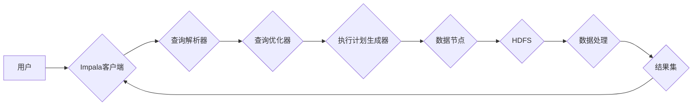

> Impala,MPP,Hadoop,Hive,SQL,数据仓库,分布式计算,查询优化

## 1. 背景介绍

在海量数据时代，高效地处理和分析数据成为企业发展的关键。传统的关系型数据库在面对海量数据时，往往表现出瓶颈，无法满足实时分析的需求。为了解决这一问题，Apache Impala应运而生。

Impala是一个开源的分布式SQL查询引擎，它基于Hadoop生态系统，能够快速高效地查询HDFS上的数据。Impala采用MPP（Massively Parallel Processing）架构，将查询任务分解成多个子任务，并并行执行，从而大幅提升查询性能。

## 2. 核心概念与联系

Impala的核心概念包括：

* **MPP架构:** Impala采用MPP架构，将查询任务分解成多个子任务，并行执行，充分利用集群的计算资源。
* **Columnar存储:** Impala采用列式存储格式，将数据按列存储，有利于数据压缩和并行查询。
* **内存计算:** Impala将数据加载到内存中进行计算，减少磁盘IO，提升查询速度。
* **查询优化:** Impala拥有强大的查询优化器，能够分析查询语句，并生成最优的执行计划，提高查询效率。

**Impala架构图:**

## 3. 核心算法原理 & 具体操作步骤

### 3.1  算法原理概述

Impala的核心算法原理包括：

* **查询解析:** 将用户提交的SQL语句解析成抽象语法树（AST），以便后续的优化和执行。
* **查询优化:** 分析AST，生成最优的执行计划，包括数据选择、数据过滤、数据排序等操作。
* **数据分片:** 将数据按照一定的规则分片，并分配到不同的数据节点上，以便并行处理。
* **数据并行处理:** 将查询任务分解成多个子任务，并行执行，充分利用集群的计算资源。
* **结果集合并:** 将各个数据节点处理的结果集合并，生成最终的查询结果。

### 3.2  算法步骤详解

1. **用户提交SQL语句:** 用户通过Impala客户端提交SQL查询语句。
2. **查询解析:** Impala客户端将SQL语句解析成AST。
3. **查询优化:** Impala查询优化器分析AST，生成最优的执行计划。
4. **数据分片:** 根据执行计划，将数据按照一定的规则分片，并分配到不同的数据节点上。
5. **数据并行处理:** 各个数据节点并行执行查询任务，处理各自分片的数据。
6. **结果集合并:** 各个数据节点处理的结果集合并，生成最终的查询结果。
7. **返回结果:** Impala客户端将最终的查询结果返回给用户。

### 3.3  算法优缺点

**优点:**

* **高性能:** Impala采用MPP架构和内存计算，能够快速高效地处理海量数据。
* **SQL支持:** Impala支持标准SQL语法，方便用户使用。
* **开源免费:** Impala是一个开源项目，可以免费使用。

**缺点:**

* **数据更新效率:** Impala的数据更新效率相对较低，不适合频繁更新的数据。
* **数据一致性:** Impala的数据一致性需要通过其他机制保证。

### 3.4  算法应用领域

Impala广泛应用于以下领域：

* **数据仓库:** Impala可以用于构建数据仓库，快速高效地查询历史数据。
* **实时分析:** Impala可以用于实时分析，例如用户行为分析、市场趋势分析等。
* **机器学习:** Impala可以用于机器学习的训练和预测，例如推荐系统、欺诈检测等。

## 4. 数学模型和公式 & 详细讲解 & 举例说明

### 4.1  数学模型构建

Impala的查询优化器基于一个数学模型，该模型将查询语句转换为一个图结构，其中节点代表数据表或视图，边代表数据之间的关系。

### 4.2  公式推导过程

Impala的查询优化器使用一系列的数学公式来计算不同执行计划的代价，例如：

* **数据扫描代价:**  计算扫描数据表所需的时间。
* **数据过滤代价:** 计算过滤数据所需的时间。
* **数据排序代价:** 计算排序数据所需的时间。

这些公式通常基于数据量、索引信息、硬件资源等因素进行计算。

### 4.3  案例分析与讲解

例如，假设有一个查询语句需要查询两个表的数据，其中一个表有索引，另一个表没有索引。Impala的查询优化器会根据索引信息和数据量，计算两种执行计划的代价：

* **执行计划1:** 先扫描没有索引的表，然后使用索引扫描有索引的表。
* **执行计划2:** 先使用索引扫描有索引的表，然后扫描没有索引的表。

最终，查询优化器会选择代价最低的执行计划。

## 5. 项目实践：代码实例和详细解释说明

### 5.1  开发环境搭建

Impala的开发环境搭建需要以下软件：

* Hadoop集群
* Impala安装包
* Impala客户端工具

### 5.2  源代码详细实现

Impala的源代码主要位于GitHub仓库中：https://github.com/apache/impala

### 5.3  代码解读与分析

Impala的源代码主要包含以下模块：

* **查询解析器:** 解析用户提交的SQL语句。
* **查询优化器:** 生成最优的执行计划。
* **执行引擎:** 执行查询任务。
* **数据存储:** 管理数据存储。

### 5.4  运行结果展示

Impala的运行结果可以通过Impala客户端工具查看。

## 6. 实际应用场景

Impala在实际应用场景中广泛应用于以下领域：

* **电商平台:** 用于分析用户行为、商品销售数据等。
* **金融机构:** 用于分析交易数据、风险评估等。
* **医疗机构:** 用于分析患者数据、疾病流行趋势等。

### 6.4  未来应用展望

随着大数据时代的到来，Impala的应用场景将会更加广泛，例如：

* **物联网数据分析:** Impala可以用于分析海量物联网数据，例如传感器数据、设备状态数据等。
* **人工智能训练:** Impala可以用于机器学习模型的训练和预测，例如图像识别、自然语言处理等。

## 7. 工具和资源推荐

### 7.1  学习资源推荐

* **Impala官方文档:** https://impala.apache.org/docs/
* **Impala GitHub仓库:** https://github.com/apache/impala
* **Hadoop官方文档:** https://hadoop.apache.org/docs/

### 7.2  开发工具推荐

* **Impala客户端工具:** Impala Shell
* **IDE:** Eclipse, IntelliJ IDEA

### 7.3  相关论文推荐

* Impala: A Modern, Distributed SQL Query Engine for Hadoop
* Optimizing Query Execution in Impala

## 8. 总结：未来发展趋势与挑战

### 8.1  研究成果总结

Impala作为一款开源的分布式SQL查询引擎，在数据处理和分析领域取得了显著的成果。其MPP架构、内存计算、查询优化等技术，使得Impala能够高效地处理海量数据，并支持标准SQL语法，方便用户使用。

### 8.2  未来发展趋势

Impala的未来发展趋势包括：

* **支持更多数据源:** Impala将支持更多数据源，例如NoSQL数据库、云存储等。
* **提升数据更新效率:** Impala将提升数据更新效率，使其更适合频繁更新的数据。
* **增强数据一致性:** Impala将增强数据一致性，使其更适合需要高一致性的应用场景。

### 8.3  面临的挑战

Impala也面临一些挑战，例如：

* **数据规模增长:** 随着数据规模的不断增长，Impala需要不断提升其处理能力。
* **异构数据处理:** Impala需要支持更多异构数据类型的处理。
* **安全性和隐私保护:** Impala需要加强安全性和隐私保护机制。

### 8.4  研究展望

未来，Impala的研究方向将集中在以下几个方面：

* **更先进的查询优化算法:** 开发更先进的查询优化算法，提高查询效率。
* **更有效的并行处理机制:** 开发更有效的并行处理机制，充分利用集群资源。
* **更强大的数据分析功能:** 开发更强大的数据分析功能，支持更复杂的分析需求。

## 9. 附录：常见问题与解答

**常见问题:**

* Impala如何保证数据一致性？
* Impala如何处理数据更新？
* Impala如何支持不同数据源？

**解答:**

* Impala的数据一致性通过使用分布式事务机制保证。
* Impala的数据更新效率相对较低，不适合频繁更新的数据。
* Impala可以通过插件机制支持不同数据源。

作者：禅与计算机程序设计艺术 / Zen and the Art of Computer Programming 
<end_of_turn>