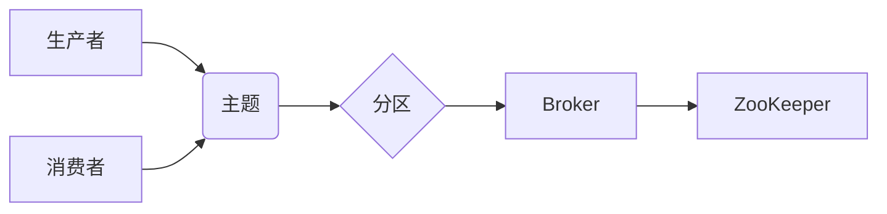

> Kafka,消息队列,分布式系统,流式处理,数据传输,消费者,生产者,分区,副本,ZooKeeper

## 1. 背景介绍

在当今数据爆炸的时代，高效、可靠的数据传输和处理能力成为企业数字化转型和业务发展的关键。消息队列作为一种轻量级、高性能的中间件，在解决数据传输和处理难题方面发挥着越来越重要的作用。其中，Apache Kafka 作为开源消息队列系统，凭借其高吞吐量、低延迟、容错性强等特点，在海量数据处理领域获得了广泛应用。

Kafka 的出现，填补了传统消息队列系统在高吞吐量、实时性、容错性等方面的不足，为企业提供了更强大的数据处理能力。

## 2. 核心概念与联系

Kafka 的核心概念包括生产者、消费者、主题、分区、副本等。

**2.1. 生产者**

生产者是向 Kafka 集群发送数据的应用程序。它们将数据序列化成消息，并发送到指定的主题分区。

**2.2. 消费者**

消费者从 Kafka 集群订阅主题，并消费主题中的消息。它们可以从任意一个分区开始消费，并可以根据需要进行消息的过滤和处理。

**2.3. 主题**

主题是 Kafka 集群中用于组织消息的逻辑容器。每个主题可以包含多个分区。

**2.4. 分区**

分区是主题的物理存储单元，数据会被均匀地分配到不同的分区中。每个分区是一个有序的日志，消息会被按顺序写入到分区中。

**2.5. 副本**

Kafka 集群中的每个分区都会有多个副本，以保证数据的可靠性。副本可以分布在不同的 Broker 节点上，以提高系统的容错性。

**2.6. Broker**

Broker 是 Kafka 集群中的节点，负责存储和管理主题的分区。

**2.7. ZooKeeper**

ZooKeeper 是 Kafka 集群中用于协调和管理服务的元数据存储系统。它负责管理主题、分区、副本等元数据信息。

**2.8.  Kafka 架构流程图**



## 3. 核心算法原理 & 具体操作步骤

### 3.1  算法原理概述

Kafka 的核心算法原理包括消息的序列化、分区、复制、消费等。

* **消息序列化:** 生产者将数据序列化成消息，以便传输和存储。Kafka 支持多种消息序列化格式，例如 JSON、Avro 等。
* **分区:** Kafka 将主题的数据均匀地分配到不同的分区中，以提高数据处理的吞吐量和并行度。
* **复制:** Kafka 将每个分区的数据复制到多个 Broker 节点上，以保证数据的可靠性。
* **消费:** 消费者从 Kafka 集群订阅主题，并消费主题中的消息。Kafka 提供了多种消费模式，例如 at-least-once、exactly-once 等。

### 3.2  算法步骤详解

1. **生产者发送消息:** 生产者将数据序列化成消息，并发送到 Kafka 集群的指定主题分区。
2. **Broker 接收消息:** Broker 接收生产者发送的消息，并将其写入到对应的分区中。
3. **消息复制:** Broker 将消息复制到其他 Broker 节点上，以保证数据的可靠性。
4. **消费者订阅主题:** 消费者订阅 Kafka 集群中的主题，并指定消费的分区。
5. **消费者消费消息:** 消费者从 Kafka 集群中消费主题中的消息，并进行相应的处理。

### 3.3  算法优缺点

**优点:**

* 高吞吐量: Kafka 可以处理海量数据，每秒可以处理数百万条消息。
* 低延迟: Kafka 的消息延迟非常低，可以满足实时数据处理的需求。
* 容错性强: Kafka 的数据复制机制保证了数据的可靠性，即使 Broker 节点发生故障，数据也不会丢失。
* 可扩展性强: Kafka 可以轻松地扩展到更大的集群，以满足不断增长的数据处理需求。

**缺点:**

* 学习曲线较陡: Kafka 的架构和功能比较复杂，需要一定的学习成本。
* 维护成本较高: Kafka 集群需要定期维护和升级，以保证系统的稳定性和性能。

### 3.4  算法应用领域

Kafka 的应用领域非常广泛，包括：

* **实时数据流处理:** Kafka 可以用于处理来自各种数据源的实时数据流，例如传感器数据、日志数据、交易数据等。
* **消息中间件:** Kafka 可以作为消息中间件，用于不同系统之间的数据交换和通信。
* **事件驱动架构:** Kafka 可以用于构建事件驱动架构，例如用户行为分析、推荐系统等。
* **数据分析:** Kafka 可以用于收集和传输数据，为数据分析平台提供数据源。

## 4. 数学模型和公式 & 详细讲解 & 举例说明

### 4.1  数学模型构建

Kafka 的核心算法可以抽象为一个消息传递模型，其中包括生产者、消费者、主题、分区、副本等角色和组件。

**4.1.1. 消息传递模型**

```
M = {P, C, T, F, R}
```

其中：

* M: 消息传递模型
* P: 生产者集合
* C: 消费者集合
* T: 主题集合
* F: 分区集合
* R: 副本集合

**4.1.2. 消息传递过程**

消息传递过程可以描述为以下步骤：

1. 生产者将消息发送到主题分区。
2. Broker 接收消息并将其写入到对应的分区中。
3. 消息被复制到其他 Broker 节点上。
4. 消费者订阅主题并消费消息。

### 4.2  公式推导过程

Kafka 的吞吐量和延迟可以根据以下公式进行计算：

**4.2.1. 吞吐量**

```
吞吐量 = 消息数 / 时间
```

**4.2.2. 延迟**

```
延迟 = 消息接收时间 - 消息发送时间
```

**4.2.3. 副本数影响**

副本数会影响 Kafka 的吞吐量和延迟。增加副本数可以提高数据的可靠性，但会降低吞吐量和增加延迟。

### 4.3  案例分析与讲解

假设一个 Kafka 集群有 3 个 Broker 节点，每个 Broker 节点上都有 3 个分区，每个分区有 3 个副本。生产者发送 1000 条消息到主题分区，消费者消费这些消息。

* 吞吐量: 如果消费者在 1 秒内消费了 1000 条消息，则吞吐量为 1000 条/秒。
* 延迟: 如果消息从发送到接收的时间为 10 毫秒，则延迟为 10 毫秒。

## 5. 项目实践：代码实例和详细解释说明

### 5.1  开发环境搭建

* Java Development Kit (JDK) 8 或更高版本
* Apache Kafka 集群 (至少 3 个 Broker 节点)
* ZooKeeper 集群
* IDE (例如 Eclipse, IntelliJ IDEA)

### 5.2  源代码详细实现

```java
// 生产者代码
import org.apache.kafka.clients.producer.KafkaProducer;
import org.apache.kafka.clients.producer.ProducerConfig;
import org.apache.kafka.clients.producer.ProducerRecord;
import org.apache.kafka.common.serialization.StringSerializer;

import java.util.Properties;

public class KafkaProducerExample {

    public static void main(String[] args) {
        // 配置生产者属性
        Properties props = new Properties();
        props.put(ProducerConfig.BOOTSTRAP_SERVERS_CONFIG, "localhost:9092");
        props.put(ProducerConfig.KEY_SERIALIZER_CLASS_CONFIG, StringSerializer.class.getName());
        props.put(ProducerConfig.VALUE_SERIALIZER_CLASS_CONFIG, StringSerializer.class.getName());

        // 创建生产者实例
        KafkaProducer<String, String> producer = new KafkaProducer<>(props);

        // 发送消息
        for (int i = 0; i < 10; i++) {
            ProducerRecord<String, String> record = new ProducerRecord<>("my-topic", "key" + i, "value" + i);
            producer.send(record);
        }

        // 关闭生产者
        producer.close();
    }
}

// 消费者代码
import org.apache.kafka.clients.consumer.ConsumerConfig;
import org.apache.kafka.clients.consumer.ConsumerRecord;
import org.apache.kafka.clients.consumer.ConsumerRecords;
import org.apache.kafka.clients.consumer.KafkaConsumer;
import org.apache.kafka.common.serialization.StringDeserializer;

import java.time.Duration;
import java.util.Collections;
import java.util.Properties;

public class KafkaConsumerExample {

    public static void main(String[] args) {
        // 配置消费者属性
        Properties props = new Properties();
        props.put(ConsumerConfig.BOOTSTRAP_SERVERS_CONFIG, "localhost:9092");
        props.put(ConsumerConfig.GROUP_ID_CONFIG, "my-group");
        props.put(ConsumerConfig.KEY_DESERIALIZER_CLASS_CONFIG, StringDeserializer.class.getName());
        props.put(ConsumerConfig.VALUE_DESERIALIZER_CLASS_CONFIG, StringDeserializer.class.getName());

        // 创建消费者实例
        KafkaConsumer<String, String> consumer = new KafkaConsumer<>(props);

        // 订阅主题
        consumer.subscribe(Collections.singletonList("my-topic"));

        // 消费消息
        while (true) {
            ConsumerRecords<String, String> records = consumer.poll(Duration.ofMillis(100));
            for (ConsumerRecord<String, String> record : records) {
                System.out.println("Received message: " + record.value());
            }
        }
    }
}
```

### 5.3  代码解读与分析

* **生产者代码:**
    * 配置生产者属性，包括 Broker 地址、key 和 value 的序列化器。
    * 创建 KafkaProducer 实例。
    * 发送消息到指定主题分区。
    * 关闭生产者。
* **消费者代码:**
    * 配置消费者属性，包括 Broker 地址、组 ID、key 和 value 的反序列化器。
    * 创建 KafkaConsumer 实例。
    * 订阅主题。
    * 使用 poll 方法获取消息，并打印消息内容。

### 5.4  运行结果展示

运行上述代码，生产者会发送 10 条消息到主题 "my-topic"，消费者会订阅该主题并消费这些消息。

## 6. 实际应用场景

### 6.1. 实时数据流处理

Kafka 可以用于处理来自各种数据源的实时数据流，例如传感器数据、日志数据、交易数据等。例如，一个金融机构可以使用 Kafka 来处理交易数据，实时监控交易情况，并进行风险控制。

### 6.2. 消息中间件

Kafka 可以作为消息中间件，用于不同系统之间的数据交换和通信。例如，一个电商平台可以使用 Kafka 来实现订单处理、支付处理、库存管理等业务流程的异步通信。

### 6.3. 事件驱动架构

Kafka 可以用于构建事件驱动架构，例如用户行为分析、推荐系统等。例如，一个社交媒体平台可以使用 Kafka 来收集用户行为数据，并触发相应的事件处理逻辑。

### 6.4  未来应用展望

随着数据量的不断增长和实时数据处理需求的增加，Kafka 的应用场景将会更加广泛。例如，在物联网、边缘计算、人工智能等领域，Kafka 将发挥越来越重要的作用。

## 7. 工具和资源推荐

### 7.1  学习资源推荐

* **Apache Kafka 官方文档:** https://kafka.apache.org/documentation/
* **Kafka 入门教程:** https://www.tutorialspoint.com/kafka/index.htm
* **Kafka 博客:** https://kafka.apache.org/blog/

### 7.2  开发工具推荐

* **Apache Kafka 命令行工具:** https://