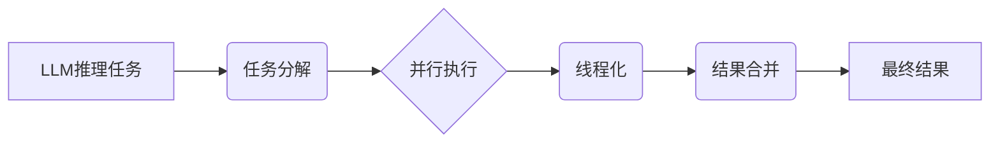

> Large Language Model (LLM), 并行推理, 任务处理, 线程化, 效率提升, 性能优化

## 1. 背景介绍

大型语言模型 (LLM) 在自然语言处理领域取得了显著的进展，展现出强大的文本生成、翻译、摘要和问答能力。然而，LLM 的推理过程通常是顺序执行的，这导致推理速度慢，难以满足实时应用的需求。为了解决这个问题，并行推理技术应运而生，它通过将推理任务分解成多个子任务，并行执行，从而显著提高推理效率。

## 2. 核心概念与联系

**2.1 并行推理**

并行推理是指将一个大型语言模型的推理任务分解成多个子任务，并利用多核处理器或分布式计算平台同时执行这些子任务，从而缩短推理时间。

**2.2 线程化**

线程化是一种并行编程技术，它允许程序同时执行多个任务，每个任务被称为一个线程。线程共享相同的内存空间，但它们可以独立执行，从而提高程序的并发性和效率。

**2.3 任务处理**

任务处理是指将一个复杂的推理任务分解成多个小的、可独立执行的任务，并对这些任务进行调度和管理。

**2.4 核心概念关系**

并行推理、线程化和任务处理是相互关联的概念，它们共同构成了高效的LLM推理系统。



## 3. 核心算法原理 & 具体操作步骤

**3.1 算法原理概述**

LLM 线程化推理算法的核心思想是将一个大型语言模型的推理任务分解成多个子任务，并利用多线程并发执行这些子任务。每个线程负责处理一个子任务，并独立地进行计算和推理。最终，所有线程的结果会被合并，得到最终的推理结果。

**3.2 算法步骤详解**

1. **任务分解:** 将一个大型语言模型的推理任务分解成多个小的、可独立执行的任务。
2. **线程创建:** 创建多个线程，每个线程负责处理一个子任务。
3. **数据分配:** 将任务数据分配给不同的线程。
4. **并行执行:** 每个线程独立地执行其分配的任务，并进行计算和推理。
5. **结果合并:** 收集所有线程的结果，并将其合并成最终的推理结果。

**3.3 算法优缺点**

**优点:**

* **提高推理速度:** 并行执行多个子任务可以显著缩短推理时间。
* **提高资源利用率:** 利用多核处理器或分布式计算平台可以充分利用硬件资源。
* **支持实时应用:** 提高推理效率可以满足实时应用的需求。

**缺点:**

* **增加开发复杂度:** 线程化编程比顺序编程更复杂，需要考虑线程同步和数据共享问题。
* **增加内存消耗:** 多个线程需要共享内存空间，可能会增加内存消耗。

**3.4 算法应用领域**

LLM 线程化推理算法广泛应用于以下领域:

* **聊天机器人:** 提高聊天机器人响应速度，提供更流畅的对话体验。
* **机器翻译:** 缩短翻译时间，提高翻译效率。
* **文本摘要:** 快速生成文本摘要，节省时间和精力。
* **问答系统:** 提高问答系统的响应速度，提供更准确的答案。

## 4. 数学模型和公式 & 详细讲解 & 举例说明

**4.1 数学模型构建**

假设我们有一个大型语言模型，其推理过程可以表示为一个函数 f(x)，其中 x 是输入数据，y 是输出结果。

```latex
y = f(x)
```

为了进行并行推理，我们可以将输入数据 x 分解成多个子集 x1, x2, ..., xn，每个子集对应一个子任务。

```latex
x = {x1, x2, ..., xn}
```

每个子任务的输出结果可以表示为 yi，其中 i = 1, 2, ..., n。

```latex
yi = fi(xi)
```

最终的推理结果 y 可以通过合并所有子任务的结果得到。

```latex
y = g(y1, y2, ..., yn)
```

其中 g( ) 是一个合并函数，用于将多个子任务的结果合并成最终结果。

**4.2 公式推导过程**

并行推理的效率取决于子任务的并行度和合并函数的复杂度。

* **并行度:** 指的是多个子任务可以同时执行的程度。
* **合并函数复杂度:** 指的是合并多个子任务结果所需的计算量。

**4.3 案例分析与讲解**

例如，在机器翻译任务中，我们可以将输入文本分解成多个句子，每个句子作为一个子任务进行翻译。每个子任务可以并行执行，最终将所有子任务的结果合并成完整的翻译结果。

## 5. 项目实践：代码实例和详细解释说明

**5.1 开发环境搭建**

* 操作系统: Ubuntu 20.04
* Python 版本: 3.8
* 库依赖: PyTorch, NumPy, threading

**5.2 源代码详细实现**

```python
import torch
import numpy as np
from threading import Thread

# 定义LLM模型
class LLM:
    def __init__(self):
        # 模型参数初始化
        pass

    def forward(self, x):
        # 模型推理过程
        pass

# 并行推理函数
def parallel_inference(model, data):
    # 将数据分解成多个子任务
    sub_tasks = np.array_split(data, num_threads)
    # 创建多个线程
    threads = []
    for sub_data in sub_tasks:
        thread = Thread(target=inference_worker, args=(model, sub_data))
        threads.append(thread)
        thread.start()
    # 等待所有线程完成
    for thread in threads:
        thread.join()
    # 合并所有子任务的结果
    results = []
    for thread in threads:
        results.extend(thread.result)
    return results

# 子任务推理函数
def inference_worker(model, data):
    # 对子任务进行推理
    results = model.forward(data)
    # 将结果存储到线程的result属性中
    thread.result = results

# 主程序
if __name__ == "__main__":
    # 初始化LLM模型
    model = LLM()
    # 初始化数据
    data = np.random.rand(1000)
    # 设置线程数量
    num_threads = 4
    # 进行并行推理
    results = parallel_inference(model, data)
    # 打印结果
    print(results)
```

**5.3 代码解读与分析**

* `LLM` 类定义了大型语言模型的结构和推理过程。
* `parallel_inference` 函数负责进行并行推理，它将数据分解成多个子任务，创建多个线程，并等待所有线程完成。
* `inference_worker` 函数负责处理每个子任务的推理过程。
* 主程序初始化模型和数据，设置线程数量，并调用 `parallel_inference` 函数进行并行推理。

**5.4 运行结果展示**

运行代码后，将输出一个包含所有子任务推理结果的列表。

## 6. 实际应用场景

**6.1 聊天机器人**

在聊天机器人领域，LLM 线程化推理可以显著提高聊天机器人的响应速度，提供更流畅的对话体验。例如，在处理用户输入时，可以将输入文本分解成多个句子，每个句子作为一个子任务进行理解和回复，从而缩短回复时间。

**6.2 机器翻译**

机器翻译任务通常需要处理大量的文本数据，LLM 线程化推理可以有效提高翻译速度。例如，可以将输入文本分解成多个句子或段落，每个句子或段落作为一个子任务进行翻译，从而并行执行翻译任务。

**6.3 文本摘要**

文本摘要任务需要提取文本的关键信息并生成简洁的摘要。LLM 线程化推理可以帮助提高摘要生成速度。例如，可以将输入文本分解成多个段落，每个段落作为一个子任务进行摘要生成，从而并行执行摘要任务。

**6.4 问答系统**

问答系统需要快速准确地回答用户的问题。LLM 线程化推理可以帮助提高问答系统的响应速度和准确率。例如，可以将用户的问题分解成多个子问题，每个子问题作为一个子任务进行处理，从而并行执行问答任务。

**6.5 未来应用展望**

随着人工智能技术的不断发展，LLM 线程化推理技术将在更多领域得到应用，例如：

* **代码生成:** 利用LLM生成代码，并行执行代码生成任务，提高代码生成速度。
* **药物研发:** 利用LLM分析药物数据，并行执行药物研发任务，加速药物研发进程。
* **金融分析:** 利用LLM分析金融数据，并行执行金融分析任务，提高金融分析效率。

## 7. 工具和资源推荐

**7.1 学习资源推荐**

* **书籍:**
    * 《深度学习》 by Ian Goodfellow, Yoshua Bengio, and Aaron Courville
    * 《自然语言处理》 by Dan Jurafsky and James H. Martin
* **在线课程:**
    * Coursera: Deep Learning Specialization
    * Udacity: Natural Language Processing Nanodegree

**7.2 开发工具推荐**

* **PyTorch:** 一个开源的深度学习框架，支持并行推理。
* **TensorFlow:** 另一个开源的深度学习框架，支持并行推理。
* **OpenAI API:** 提供访问GPT-3等大型语言模型的API，支持并行推理。

**7.3 相关论文推荐**

* **Parallelizing Transformer Training** by Dai et al.
* **Efficient Transformer Training with Sparse Attention** by Wang et al.
* **Longformer: The Long-Document Transformer** by Beltagy et al.

## 8. 总结：未来发展趋势与挑战

**8.1 研究成果总结**

LLM 线程化推理技术取得了显著的进展，能够有效提高LLM推理效率，并支持实时应用。

**8.2 未来发展趋势**

* **更有效的并行推理算法:** 研究更有效的并行推理算法，例如基于图神经网络的并行推理算法。
* **更强大的硬件平台:** 开发更强大的硬件平台，例如GPU和TPU，以支持更复杂的并行推理任务。
* **更灵活的模型架构:** 设计更灵活的模型架构，例如可扩展的Transformer模型，以适应不同的并行推理场景。

**8.3 面临的挑战**

* **数据并行性:** 确保数据在并行推理过程中能够有效地分配和共享。
* **模型并行性:** 确保模型在并行推理过程中能够有效地通信和协作。
* **性能优化:** 进一步优化并行推理算法和硬件平台，以提高推理效率和降低成本。

**8.4 研究展望**

未来，LLM 线程化推理技术将继续发展，并应用于更多领域，推动人工智能技术的进步。


## 9. 附录：常见问题与解答

**9.1 Q: 并行推理和分布式训练有什么区别？**

**A:** 并行推理是指在推理阶段利用多核处理器或分布式计算平台并行执行推理任务，而分布式训练是指在训练阶段利用多台机器并行训练模型。

**9.2 Q: 如何选择合适的并行推理算法？**

**A:** 选择合适的并行推理算法需要考虑多个因素，例如模型架构、数据规模、硬件平台等。

**9.3 Q: 并行推理会增加内存消耗吗？**

**A:** 是的，并行推理可能会增加内存消耗，因为多个线程需要共享内存空间。

**9.4 Q: 如何优化并行推理的性能？**

**A:** 可以通过优化并行推理算法、使用更强大的硬件平台、减少数据传输等方式来优化并行推理的性能。


作者：禅与计算机程序设计艺术 / Zen