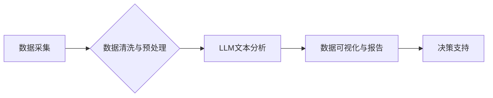

> Large Language Model (LLM), 数据分析, 自然语言处理 (NLP), 机器学习 (ML), 深度学习 (DL), 海量数据, 知识发现

## 1. 背景介绍

在信息爆炸的时代，海量数据无处不在，蕴藏着丰富的知识和价值。传统的统计分析方法难以有效地处理和挖掘这些复杂的数据。近年来，大型语言模型 (LLM) 的快速发展为数据分析领域带来了新的机遇。LLM 拥有强大的文本理解和生成能力，能够从海量文本数据中提取关键信息、发现隐藏的模式和关系，从而为数据分析提供更智能、更深入的洞察。

## 2. 核心概念与联系

**2.1  大型语言模型 (LLM)**

LLM 是指参数量巨大、训练数据海量的人工智能模型，能够理解和生成人类语言。它们基于深度学习技术，通过学习大量的文本数据，掌握了语言的语法、语义和上下文关系。

**2.2  数据分析**

数据分析是指从数据中提取有价值信息的过程，包括数据收集、清洗、整理、分析和可视化等步骤。其目标是通过对数据的深入挖掘，发现隐藏的趋势、模式和规律，从而支持决策和解决问题。

**2.3  LLM与数据分析的联系**

LLM 可以有效地辅助数据分析，主要体现在以下几个方面：

* **文本数据处理:** LLM 可以自动识别和提取文本数据中的关键信息，例如实体、关系、事件等，为后续数据分析提供基础数据。
* **文本分类和聚类:** LLM 可以根据文本内容自动进行分类和聚类，将相似文本归为一类，方便数据分析和挖掘。
* **文本摘要和问答:** LLM 可以自动生成文本摘要和回答问题，帮助用户快速了解文本内容和关键信息。
* **异常检测和预测:** LLM 可以学习文本数据的正常模式，并识别异常数据，从而帮助用户发现潜在问题和风险。

**2.4  LLM与数据分析的架构**



## 3. 核心算法原理 & 具体操作步骤

**3.1  算法原理概述**

LLM 的核心算法是基于 Transformer 架构的深度神经网络。Transformer 模型通过自注意力机制 (Self-Attention) 学习文本数据的上下文关系，能够捕捉到长距离依赖关系，从而实现更准确的文本理解和生成。

**3.2  算法步骤详解**

1. **数据预处理:** 将原始文本数据进行清洗、分词、标记等预处理操作，使其能够被模型理解。
2. **模型训练:** 使用大量的文本数据训练 Transformer 模型，通过反向传播算法不断调整模型参数，使其能够准确地预测文本序列。
3. **模型评估:** 使用测试数据评估模型的性能，例如准确率、召回率、F1-score 等。
4. **模型部署:** 将训练好的模型部署到生产环境中，用于实际的文本分析任务。

**3.3  算法优缺点**

**优点:**

* 强大的文本理解和生成能力
* 能够捕捉长距离依赖关系
* 训练效率高

**缺点:**

* 参数量巨大，需要大量的计算资源
* 训练数据量要求高
* 对数据质量要求高

**3.4  算法应用领域**

* 自然语言处理 (NLP)
* 机器翻译
* 文本摘要
* 问答系统
* 情感分析
* 代码生成

## 4. 数学模型和公式 & 详细讲解 & 举例说明

**4.1  数学模型构建**

Transformer 模型的核心是自注意力机制 (Self-Attention)。自注意力机制通过计算每个词与所有其他词之间的相关性，来学习文本数据的上下文关系。

**4.2  公式推导过程**

假设我们有一个文本序列 X = (x1, x2, ..., xn)，其中 xi 表示第 i 个词。自注意力机制的计算过程如下：

1. **计算词嵌入:** 将每个词 xi 映射到一个低维向量空间中，称为词嵌入。

2. **计算注意力权重:** 计算每个词 xi 与所有其他词之间的相关性，得到注意力权重矩阵 W。

3. **加权求和:** 将每个词 xi 的词嵌入与注意力权重矩阵 W 相乘，并求和，得到每个词的上下文表示。

**4.3  案例分析与讲解**

例如，我们有一个文本序列 "The cat sat on the mat"。

* 每个词的词嵌入可以表示为：

```
cat: [0.2, 0.5, 0.1]
sat: [0.3, 0.1, 0.7]
on: [0.4, 0.2, 0.3]
mat: [0.1, 0.6, 0.2]
```

* 自注意力机制会计算每个词与所有其他词之间的相关性，例如 "cat" 与 "sat" 的相关性较高，因为它们在语义上相关。

* 最后，每个词的上下文表示会包含来自所有其他词的信息，从而更全面地理解文本的含义。

## 5. 项目实践：代码实例和详细解释说明

**5.1  开发环境搭建**

* Python 3.7+
* PyTorch 或 TensorFlow
* CUDA 和 cuDNN (可选)

**5.2  源代码详细实现**

```python
import torch
import torch.nn as nn

class Transformer(nn.Module):
    def __init__(self, vocab_size, embedding_dim, num_heads, num_layers):
        super(Transformer, self).__init__()
        self.embedding = nn.Embedding(vocab_size, embedding_dim)
        self.transformer_layers = nn.ModuleList([
            nn.TransformerEncoderLayer(embedding_dim, num_heads)
            for _ in range(num_layers)
        ])
        self.linear = nn.Linear(embedding_dim, vocab_size)

    def forward(self, x):
        x = self.embedding(x)
        for layer in self.transformer_layers:
            x = layer(x)
        x = self.linear(x)
        return x
```

**5.3  代码解读与分析**

* `__init__` 方法初始化模型参数，包括词嵌入层、Transformer编码器层和线性输出层。
* `forward` 方法定义模型的正向传播过程，将输入序列 x 映射到输出序列。

**5.4  运行结果展示**

训练好的 Transformer 模型可以用于各种文本分析任务，例如文本分类、机器翻译、文本摘要等。

## 6. 实际应用场景

**6.1  金融领域**

* 欺诈检测: LLM 可以分析交易数据，识别异常交易模式，帮助金融机构预防欺诈行为。
* 风险评估: LLM 可以分析客户数据，评估客户的信用风险，帮助金融机构做出更明智的贷款决策。
* 投资分析: LLM 可以分析市场新闻和财经数据，识别投资机会，帮助投资者做出更优的投资决策。

**6.2  医疗领域**

* 疾病诊断: LLM 可以分析患者的病历和症状，辅助医生进行疾病诊断。
* 药物研发: LLM 可以分析大量的生物医学文献，帮助科学家发现新的药物靶点和治疗方案。
* 患者咨询: LLM 可以与患者进行对话，提供医疗信息和建议。

**6.3  教育领域**

* 个性化学习: LLM 可以根据学生的学习情况，提供个性化的学习内容和建议。
* 自动批改作业: LLM 可以自动批改学生的作业，节省教师的时间和精力。
* 智能问答系统: LLM 可以回答学生的学习问题，帮助学生更好地理解知识。

**6.4  未来应用展望**

随着 LLM 技术的不断发展，其在数据分析领域的应用将更加广泛和深入。未来，LLM 将能够更好地理解和处理复杂的数据，为数据分析提供更智能、更深入的洞察，从而推动各行各业的数字化转型和智能升级。

## 7. 工具和资源推荐

**7.1  学习资源推荐**

* **书籍:**
    * 《深度学习》 (Deep Learning) - Ian Goodfellow, Yoshua Bengio, Aaron Courville
    * 《自然语言处理入门》 (Speech and Language Processing) - Daniel Jurafsky, James H. Martin
* **在线课程:**
    * Coursera: 自然语言处理 Specialization
    * Stanford CS224N: 自然语言处理与深度学习

**7.2  开发工具推荐**

* **PyTorch:** 深度学习框架
* **TensorFlow:** 深度学习框架
* **Hugging Face Transformers:** 预训练 Transformer 模型库

**7.3  相关论文推荐**

* Attention Is All You Need (Vaswani et al., 2017)
* BERT: Pre-training of Deep Bidirectional Transformers for Language Understanding (Devlin et al., 2018)
* GPT-3: Language Models are Few-Shot Learners (Brown et al., 2020)

## 8. 总结：未来发展趋势与挑战

**8.1  研究成果总结**

LLM 在数据分析领域取得了显著的成果，例如在文本分类、机器翻译、文本摘要等任务上取得了state-of-the-art的性能。

**8.2  未来发展趋势**

* **模型规模和能力的提升:** 未来 LLM 的模型规模将继续扩大，其能力将更加强大，能够处理更复杂的数据和任务。
* **多模态数据分析:** LLM 将与其他模态数据 (例如图像、音频) 相结合，实现多模态数据分析。
* **可解释性增强:** 研究者将致力于提高 LLM 的可解释性，使其决策过程更加透明和可理解。

**8.3  面临的挑战**

* **数据隐私和安全:** LLM 的训练需要大量的文本数据，如何保护数据隐私和安全是一个重要的挑战。
* **模型偏见和公平性:** LLM 的训练数据可能存在偏见，导致模型输出存在偏见和不公平性。
* **计算资源需求:** LLM 的训练和部署需要大量的计算资源，这对于资源有限的机构来说是一个挑战。

**8.4  研究展望**

未来，LLM 在数据分析领域的应用将更加广泛和深入，其发展将推动人工智能技术向更智能、更安全、更可解释的方向发展。


## 9. 附录：常见问题与解答

**9.1  LLM 的训练数据来源？**

LLM 的训练数据通常来自公开的文本数据集，例如维基百科、书籍、新闻文章等。

**9.2  LLM 的训练需要多长时间？**

LLM 的训练时间取决于模型规模、训练数据量和计算资源等因素，通常需要数天到数周的时间。

**9.3  如何评估 LLM 的性能？**

LLM 的性能通常通过在标准数据集上进行测试，并计算准确率、召回率、F1-score 等指标来评估。

**9.4  LLM 是否可以理解人类的情感？**

LLM 可以识别文本中的情感倾向，但它并不能真正理解人类的情感。

**9.5  LLM 是否会取代人类的工作？**

LLM 可以自动化一些重复性工作，但它并不能完全取代人类的工作。人类仍然需要发挥创造力和解决复杂问题的能力。


作者：禅与计算机程序设计艺术 / Zen and the Art of Computer Programming 
<end_of_turn>