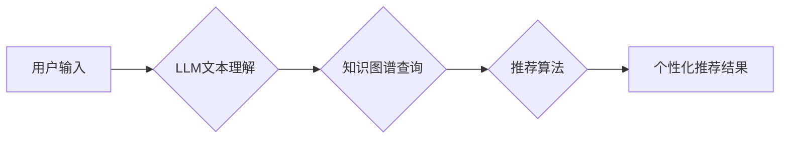

>  LLM, 个性化推荐, 大语言模型, 知识图谱, 深度学习, 推荐算法

## 1. 背景介绍

在信息爆炸的时代，海量数据和个性化需求日益凸显。智能个性化推荐系统作为解决用户信息过载和精准推荐的关键技术，在电商、社交媒体、内容平台等领域发挥着越来越重要的作用。传统的推荐系统主要依赖于协同过滤、内容过滤等方法，但这些方法在数据稀疏、冷启动等问题上存在局限性。近年来，大语言模型（LLM）的快速发展为智能个性化推荐系统带来了新的机遇。

LLM 拥有强大的文本理解和生成能力，能够从海量文本数据中学习用户兴趣、偏好和需求，并生成个性化的推荐内容。与传统的基于规则或机器学习的推荐系统相比，LLM 驱动的推荐系统具有以下优势：

* **更精准的理解用户需求**: LLM 可以理解用户自然语言输入，并从文本中提取更丰富的用户特征，例如兴趣爱好、生活方式、价值观等，从而更精准地理解用户的需求。
* **更丰富的推荐内容**: LLM 可以生成多样化的推荐内容，包括文本、图片、视频等多种形式，并根据用户的个性化需求进行定制化推荐。
* **更智能的交互体验**: LLM 可以与用户进行自然语言对话，提供更智能、更人性化的交互体验。

## 2. 核心概念与联系

**2.1 个性化推荐系统**

个性化推荐系统旨在根据用户的历史行为、偏好和需求，推荐最符合其兴趣的商品、内容或服务。其核心目标是提高用户满意度、提升用户粘性和促进商业转化。

**2.2 大语言模型 (LLM)**

大语言模型 (LLM) 是一种基于深度学习的强大人工智能模型，能够理解和生成人类语言。它通过训练大量的文本数据，学习语言的语法、语义和上下文关系，从而具备强大的文本理解、生成、翻译、问答等能力。

**2.3 知识图谱 (KG)**

知识图谱 (KG) 是以实体和关系为节点构建的知识表示形式。它能够存储和组织大量结构化知识，并通过关系链接将不同实体连接起来，形成一个庞大的知识网络。

**2.4 核心架构**

LLM 在智能个性化推荐系统中的应用，通常采用以下核心架构：



**2.4.1 用户输入**: 用户通过自然语言或其他方式表达其需求，例如“推荐一部科幻电影”或“给我推荐一些关于人工智能的书籍”。

**2.4.2 LLM文本理解**: LLM 将用户的输入进行理解和分析，提取用户的意图、关键词和相关信息。

**2.4.3 知识图谱查询**: LLM 根据提取的信息，查询知识图谱，获取与用户需求相关的实体和关系。

**2.4.4 推荐算法**: 推荐算法根据用户需求和知识图谱信息，生成个性化的推荐结果。

**2.4.5 个性化推荐结果**: 推荐系统将推荐结果以文本、图片、视频等多种形式呈现给用户。

## 3. 核心算法原理 & 具体操作步骤

**3.1 算法原理概述**

LLM 驱动的个性化推荐系统通常采用以下核心算法原理：

* **嵌入式表示学习**: 将用户、商品、内容等实体映射到低维向量空间，通过向量之间的相似度计算推荐相关性。
* **Transformer网络**: 利用 Transformer 网络的注意力机制，捕捉用户需求和商品特征之间的复杂关系，提高推荐精准度。
* **知识图谱推理**: 利用知识图谱中的关系和规则，进行推理和推断，挖掘用户潜在需求和商品关联性。

**3.2 算法步骤详解**

1. **数据预处理**: 收集用户行为数据、商品信息、内容描述等数据，并进行清洗、格式化和特征提取。
2. **嵌入式表示学习**: 使用 Word2Vec、GloVe 等模型，将用户、商品、内容等实体映射到低维向量空间。
3. **Transformer网络训练**: 使用 Transformer 网络，训练一个推荐模型，输入用户嵌入向量和商品嵌入向量，输出推荐分数。
4. **知识图谱融合**: 将知识图谱信息融入推荐模型，例如利用知识图谱中的关系进行实体关联，提高推荐的准确性和个性化程度。
5. **个性化推荐**: 根据用户历史行为、偏好和当前需求，预测用户对商品的兴趣，并生成个性化的推荐结果。

**3.3 算法优缺点**

**优点**:

* **更精准的推荐**: LLM 能够理解用户需求，并结合知识图谱信息，生成更精准的推荐结果。
* **更丰富的推荐内容**: LLM 可以生成多样化的推荐内容，包括文本、图片、视频等多种形式。
* **更智能的交互体验**: LLM 可以与用户进行自然语言对话，提供更智能、更人性化的交互体验。

**缺点**:

* **训练成本高**: LLM 的训练需要大量的计算资源和数据。
* **模型复杂度高**: LLM 的模型结构复杂，部署和维护成本较高。
* **数据安全问题**: LLM 需要处理大量用户数据，需要加强数据安全保护。

**3.4 算法应用领域**

LLM 驱动的个性化推荐系统在以下领域具有广泛的应用前景：

* **电商**: 推荐商品、个性化营销、用户画像分析。
* **社交媒体**: 推荐好友、推荐内容、个性化广告。
* **内容平台**: 推荐文章、视频、音频等内容，个性化内容推送。
* **教育**: 个性化学习推荐、智能辅导系统。
* **医疗**: 个性化医疗建议、疾病诊断辅助。

## 4. 数学模型和公式 & 详细讲解 & 举例说明

**4.1 数学模型构建**

LLM 驱动的个性化推荐系统通常采用以下数学模型：

* **协同过滤**: 基于用户-商品交互矩阵，预测用户对商品的评分或偏好。
* **内容过滤**: 基于商品特征和用户偏好，推荐与用户兴趣相符的商品。
* **深度学习**: 使用深度神经网络，学习用户和商品之间的复杂关系，进行推荐预测。

**4.2 公式推导过程**

**协同过滤**:

* **用户-商品交互矩阵**: 用矩阵 $R$ 表示用户-商品交互矩阵，其中 $R_{ui}$ 表示用户 $u$ 对商品 $i$ 的评分或偏好。
* **预测评分**: 使用协同过滤算法，预测用户 $u$ 对商品 $i$ 的评分，例如使用基于用户的协同过滤算法：

$$
\hat{R}_{ui} = \bar{R}_u + \frac{\sum_{j \in N(u)} (R_{uj} - \bar{R}_u) \cdot sim(u, v)}{\sum_{j \in N(u)} sim(u, v)}
$$

其中，$\bar{R}_u$ 是用户 $u$ 的平均评分，$N(u)$ 是用户 $u$ 评分过的商品集合，$sim(u, v)$ 是用户 $u$ 和用户 $v$ 之间的相似度。

**4.3 案例分析与讲解**

假设有一个用户-商品交互矩阵 $R$，其中用户 $u$ 对商品 $i$ 的评分为 5，用户 $v$ 对商品 $i$ 的评分为 4，用户 $u$ 和用户 $v$ 之间的相似度为 0.8。

使用基于用户的协同过滤算法，预测用户 $u$ 对商品 $j$ 的评分，其中用户 $v$ 对商品 $j$ 的评分为 3。

$$
\hat{R}_{uj} = \bar{R}_u + \frac{(R_{vj} - \bar{R}_u) \cdot sim(u, v)}{\sum_{j \in N(u)} sim(u, v)}
$$

$$
\hat{R}_{uj} = \bar{R}_u + \frac{(3 - \bar{R}_u) \cdot 0.8}{0.8}
$$

$$
\hat{R}_{uj} = \bar{R}_u + (3 - \bar{R}_u)
$$

$$
\hat{R}_{uj} = 3
$$

因此，使用基于用户的协同过滤算法，预测用户 $u$ 对商品 $j$ 的评分为 3。

## 5. 项目实践：代码实例和详细解释说明

**5.1 开发环境搭建**

* **操作系统**: Ubuntu 20.04
* **编程语言**: Python 3.8
* **深度学习框架**: PyTorch 1.8
* **其他依赖**: numpy, pandas, scikit-learn

**5.2 源代码详细实现**

```python
import torch
import torch.nn as nn

class RecommenderModel(nn.Module):
    def __init__(self, user_embedding_dim, item_embedding_dim):
        super(RecommenderModel, self).__init__()
        self.user_embedding = nn.Embedding(num_users, user_embedding_dim)
        self.item_embedding = nn.Embedding(num_items, item_embedding_dim)
        self.fc = nn.Linear(user_embedding_dim + item_embedding_dim, 1)

    def forward(self, user_ids, item_ids):
        user_embeddings = self.user_embedding(user_ids)
        item_embeddings = self.item_embedding(item_ids)
        combined_embeddings = torch.cat((user_embeddings, item_embeddings), dim=1)
        scores = self.fc(combined_embeddings)
        return scores

# ... 其他代码 ...
```

**5.3 代码解读与分析**

* **模型结构**: 该代码实现了一个简单的基于深度学习的推荐模型，包含用户嵌入层、商品嵌入层和全连接层。
* **用户嵌入**: 使用 Embedding 层将用户 ID 映射到低维向量空间，每个用户都有一个唯一的嵌入向量。
* **商品嵌入**: 同样使用 Embedding 层将商品 ID 映射到低维向量空间，每个商品都有一个唯一的嵌入向量。
* **融合嵌入**: 将用户嵌入向量和商品嵌入向量拼接在一起，作为全连接层的输入。
* **预测评分**: 全连接层输出用户对商品的评分，该评分是一个实数。

**5.4 运行结果展示**

* 使用训练好的模型，对新的用户和商品进行预测，得到推荐评分。
* 根据推荐评分，排序推荐结果，并展示给用户。

## 6. 实际应用场景

**6.1 电商推荐**

* **商品推荐**: 根据用户的浏览历史、购买记录、购物车内容等信息，推荐相关的商品。
* **个性化营销**: 根据用户的兴趣爱好、消费习惯等信息，推送个性化的广告和促销活动。
* **用户画像分析**: 利用用户的行为数据，构建用户画像，了解用户的需求和偏好。

**6.2 社交媒体推荐**

* **好友推荐**: 根据用户的兴趣爱好、社交关系等信息，推荐潜在的好友。
* **内容推荐**: 根据用户的浏览历史、点赞记录、评论内容等信息，推荐相关的文章、视频、图片等内容。
* **个性化广告**: 根据用户的兴趣爱好、消费习惯等信息，推送个性化的广告。

**6.3 内容平台推荐**

* **文章推荐**: 根据用户的阅读历史、点赞记录、评论内容等信息，推荐相关的文章。
* **视频推荐**: 根据用户的观看历史、点赞记录、评论内容等信息，推荐相关的视频。
* **音频推荐**: 根据用户的收听历史、点赞记录、评论内容等信息，推荐相关的音频。

**6.4 未来应用展望**

* **多模态推荐**: 将文本、图片、视频等多种模态信息融合，提供更丰富的推荐体验。
* **实时推荐**: 基于用户的实时行为，提供更精准、更及时地推荐。
* **个性化解释**: 为推荐结果提供个性化的解释，帮助用户理解