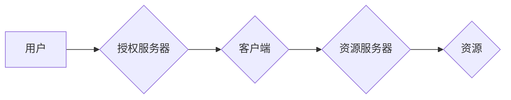

> OAuth 2.0, 单点登录, 安全认证, 授权流程, 访问令牌, 刷新令牌, 应用安全

## 1. 背景介绍

在当今互联网时代，用户需要在多个应用程序和服务之间进行身份验证和授权。传统的密码验证方式存在着安全性和用户体验方面的缺陷。OAuth 2.0 协议应运而生，它提供了一种安全、灵活和用户友好的身份验证和授权机制，广泛应用于各种应用程序和服务，例如社交媒体、云存储、在线支付等。

单点登录 (Single Sign-On, SSO) 是 OAuth 2.0 的重要应用场景之一。SSO 允许用户使用一次身份验证凭据访问多个应用程序和服务，无需重复输入用户名和密码。这不仅提高了用户体验，也增强了安全性，减少了密码泄露的风险。

## 2. 核心概念与联系

OAuth 2.0 协议的核心概念包括：

* **资源所有者 (Resource Owner):** 拥有数据和资源的用户。
* **客户端 (Client):** 需要访问资源的应用程序或服务。
* **授权服务器 (Authorization Server):** 管理用户授权和颁发访问令牌的服务器。
* **资源服务器 (Resource Server):** 拥有用户数据和资源的服务器。

OAuth 2.0 的授权流程可以概括为以下步骤：

1. 客户端引导用户访问授权服务器。
2. 用户在授权服务器上授权客户端访问其资源。
3. 授权服务器颁发访问令牌给客户端。
4. 客户端使用访问令牌访问资源服务器获取资源。

**OAuth 2.0 授权流程流程图:**



## 3. 核心算法原理 & 具体操作步骤

### 3.1  算法原理概述

OAuth 2.0 协议的核心算法是基于哈希函数和数字签名。哈希函数用于生成不可逆的哈希值，用于验证数据完整性。数字签名用于验证消息的发送者身份和消息的完整性。

### 3.2  算法步骤详解

1. **哈希函数生成:** 客户端和授权服务器使用哈希函数对用户授权信息进行加密，生成不可逆的哈希值。
2. **数字签名验证:** 授权服务器使用私钥对哈希值进行数字签名，并发送给客户端。
3. **访问令牌颁发:** 客户端使用公钥验证授权服务器的数字签名，确认授权信息有效后，授权服务器颁发访问令牌给客户端。

### 3.3  算法优缺点

**优点:**

* **安全性高:** 哈希函数和数字签名机制确保了数据完整性和身份验证的安全性。
* **灵活性和可扩展性强:** OAuth 2.0 协议支持多种授权模式和应用场景。
* **用户体验友好:** 用户只需一次身份验证即可访问多个应用程序和服务。

**缺点:**

* **实现复杂度较高:** OAuth 2.0 协议的实现需要对安全认证和授权机制有深入的了解。
* **依赖第三方服务:** OAuth 2.0 协议依赖于授权服务器和资源服务器的稳定性和安全性。

### 3.4  算法应用领域

OAuth 2.0 协议广泛应用于以下领域:

* **社交媒体:** 用户可以使用 OAuth 2.0 协议授权应用程序访问其社交媒体账户信息。
* **云存储:** 用户可以使用 OAuth 2.0 协议授权应用程序访问其云存储账户数据。
* **在线支付:** 用户可以使用 OAuth 2.0 协议授权应用程序访问其银行账户信息进行支付。

## 4. 数学模型和公式 & 详细讲解 & 举例说明

### 4.1  数学模型构建

OAuth 2.0 协议的数学模型可以抽象为一个三元组 (R, C, A)，其中：

* R 代表资源所有者。
* C 代表客户端。
* A 代表授权服务器。

### 4.2  公式推导过程

OAuth 2.0 协议的授权流程可以表示为以下公式：

```
R -> A: {授权请求}
A -> C: {访问令牌}
C -> R: {资源访问请求}
```

其中：

* 授权请求包含资源所有者身份信息、客户端标识信息和授权范围信息。
* 访问令牌包含客户端标识信息、资源所有者身份信息和授权范围信息。
* 资源访问请求包含访问令牌和资源访问路径信息。

### 4.3  案例分析与讲解

假设用户 Alice 想要授权应用程序 Bob 访问其社交媒体账户信息。

1. Alice 通过 Bob 应用程序访问授权服务器。
2. Alice 在授权服务器上确认授权范围，并输入其密码进行身份验证。
3. 授权服务器验证 Alice 的身份后，生成访问令牌并发送给 Bob 应用程序。
4. Bob 应用程序使用访问令牌访问 Alice 的社交媒体账户，获取其个人信息。

## 5. 项目实践：代码实例和详细解释说明

### 5.1  开发环境搭建

本示例使用 Python 语言和 Flask 框架进行开发。

* 安装 Python 和 Flask 框架。
* 创建一个新的 Flask 项目。

### 5.2  源代码详细实现

```python
from flask import Flask, request, jsonify

app = Flask(__name__)

# 模拟授权服务器
@app.route('/authorize', methods=['GET'])
def authorize():
    # 获取客户端标识、授权范围等信息
    client_id = request.args.get('client_id')
    scope = request.args.get('scope')

    # 验证客户端身份
    # ...

    # 生成访问令牌
    access_token = 'your_access_token'

    # 返回访问令牌
    return jsonify({'access_token': access_token})

if __name__ == '__main__':
    app.run(debug=True)
```

### 5.3  代码解读与分析

* `authorize` 函数模拟授权服务器的授权流程。
* 客户端通过 GET 请求访问 `/authorize` 路径，传递客户端标识和授权范围等信息。
* 授权服务器验证客户端身份后，生成访问令牌并返回给客户端。

### 5.4  运行结果展示

运行代码后，访问 `http://127.0.0.1:5000/authorize` 路径，可以获取访问令牌。

## 6. 实际应用场景

### 6.1  社交媒体登录

用户可以使用 OAuth 2.0 协议授权应用程序访问其社交媒体账户信息，例如 Facebook、Twitter、Google 等。

### 6.2  云存储服务

用户可以使用 OAuth 2.0 协议授权应用程序访问其云存储账户数据，例如 Dropbox、Google Drive、OneDrive 等。

### 6.3  在线支付

用户可以使用 OAuth 2.0 协议授权应用程序访问其银行账户信息进行支付，例如 PayPal、Alipay、WeChat Pay 等。

### 6.4  未来应用展望

随着互联网技术的不断发展，OAuth 2.0 协议的应用场景将更加广泛，例如：

* **物联网设备授权:** 用户可以使用 OAuth 2.0 协议授权物联网设备访问其个人数据和控制设备功能。
* **区块链应用:** OAuth 2.0 协议可以用于区块链应用中的身份验证和授权。
* **人工智能服务:** OAuth 2.0 协议可以用于人工智能服务中的数据访问和授权。

## 7. 工具和资源推荐

### 7.1  学习资源推荐

* OAuth 2.0 规范文档: https://oauth.net/2/
* OAuth 2.0 入门教程: https://www.oauth.com/oauth2-simplified/

### 7.2  开发工具推荐

* OAuth 2.0 库: https://github.com/oauthlib/oauthlib

### 7.3  相关论文推荐

* OAuth 2.0: An Authorization Framework for the Web
* OAuth 2.0: A Comprehensive Guide

## 8. 总结：未来发展趋势与挑战

### 8.1  研究成果总结

OAuth 2.0 协议为互联网应用提供了安全、灵活和用户友好的身份验证和授权机制，推动了互联网应用的快速发展。

### 8.2  未来发展趋势

* **更安全的授权机制:** OAuth 2.0 协议将继续发展更安全的授权机制，例如基于密码学的认证和授权。
* **更广泛的应用场景:** OAuth 2.0 协议将应用于更多领域，例如物联网、区块链和人工智能。
* **更友好的用户体验:** OAuth 2.0 协议将更加注重用户体验，例如提供更便捷的授权流程和更直观的授权界面。

### 8.3  面临的挑战

* **协议复杂性:** OAuth 2.0 协议的实现较为复杂，需要对安全认证和授权机制有深入的了解。
* **第三方服务依赖:** OAuth 2.0 协议依赖于授权服务器和资源服务器的稳定性和安全性。
* **隐私保护:** OAuth 2.0 协议需要妥善处理用户隐私信息，确保用户数据安全。

### 8.4  研究展望

未来研究方向包括：

* 开发更安全、更灵活和更易于使用的 OAuth 2.0 协议实现方案。
* 研究 OAuth 2.0 协议在物联网、区块链和人工智能等领域的应用。
* 探索 OAuth 2.0 协议与其他身份验证和授权机制的结合。

## 9. 附录：常见问题与解答

### 9.1  常见问题

* OAuth 2.0 和 OpenID Connect (OIDC) 的区别是什么？
* 如何实现 OAuth 2.0 的单点登录功能？
* OAuth 2.0 协议有哪些常见的授权模式？

### 9.2  解答

* OAuth 2.0 和 OIDC 是两个不同的协议，OAuth 2.0 是一种授权框架，而 OIDC 是基于 OAuth 2.0 的身份验证协议。
* 实现 OAuth 2.0 的单点登录功能需要配置授权服务器、资源服务器和客户端应用程序。
* OAuth 2.0 协议支持多种授权模式，例如授权码模式、密码模式、客户端凭证模式和隐式模式。


作者：禅与计算机程序设计艺术 / Zen and the Art of Computer Programming 
<end_of_turn>