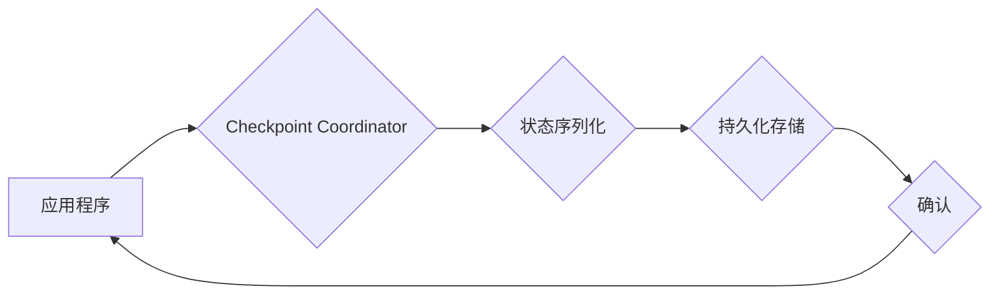

> Samza, Checkpoint, 流式计算, 数据一致性, Fault Tolerance, 容错, 分布式系统, 编程实践

## 1. 背景介绍

在现代数据处理领域，流式计算逐渐成为处理实时数据的重要方式。Samza作为一款开源的流式计算框架，以其高吞吐量、高可用性和容错能力而备受关注。在流式计算系统中，数据处理通常涉及多个阶段和节点，数据在各个节点之间流动。为了保证数据的一致性和容错性，Samza引入了Checkpoint机制。

Checkpoint机制的核心思想是定期将流式计算的状态信息保存到持久存储中。当系统发生故障时，可以从最近的Checkpoint点恢复数据状态，从而保证数据的一致性和业务连续性。

## 2. 核心概念与联系

### 2.1  Checkpoint的概念

Checkpoint是指在流式计算过程中，将当前状态信息（例如数据流的偏移量、处理状态等）持久化到外部存储系统中的操作。

### 2.2  Checkpoint的类型

* **Full Checkpoint:** 保存整个应用程序的状态信息，包括所有数据和处理状态。
* **Incremental Checkpoint:** 只保存自上次Checkpoint以来产生的数据和处理状态变化。

### 2.3  Checkpoint的流程

1. **Trigger:** 根据预设的策略（例如时间间隔、数据量等）触发Checkpoint操作。
2. **Preparation:** 应用程序将当前状态信息收集到内存中。
3. **Serialization:** 将状态信息序列化成可持久化的格式。
4. **Persistence:** 将序列化后的状态信息写入持久存储系统（例如HDFS、S3等）。
5. **Confirmation:** 应用程序确认Checkpoint操作成功完成。

### 2.4  Checkpoint的架构



## 3. 核心算法原理 & 具体操作步骤

### 3.1  算法原理概述

Samza的Checkpoint机制基于分布式一致性算法，例如Raft或ZooKeeper，来保证Checkpoint操作的可靠性和一致性。

### 3.2  算法步骤详解

1. **Checkpoint Coordinator:** 负责协调Checkpoint操作，包括触发Checkpoint、收集状态信息、序列化状态信息和确认Checkpoint操作。
2. **应用程序:** 负责收集当前状态信息，并将其发送给Checkpoint Coordinator。
3. **状态序列化:** 将应用程序的状态信息序列化成可持久化的格式，例如Avro或Protocol Buffers。
4. **持久化存储:** 将序列化后的状态信息写入持久存储系统，例如HDFS或S3。
5. **确认机制:** Checkpoint Coordinator通过确认机制来保证Checkpoint操作的可靠性。当所有应用程序都确认了Checkpoint操作成功完成时，Checkpoint Coordinator才会将Checkpoint标记为成功。

### 3.3  算法优缺点

**优点:**

* **数据一致性:** Checkpoint机制保证了数据的一致性，即使系统发生故障，也可以从最近的Checkpoint点恢复数据状态。
* **容错能力:** Checkpoint机制提高了系统的容错能力，可以应对节点故障、网络故障等各种异常情况。
* **可恢复性:** Checkpoint机制提供了数据恢复的功能，可以快速恢复系统到故障前的状态。

**缺点:**

* **性能开销:** Checkpoint操作会带来一定的性能开销，因为需要收集、序列化和持久化状态信息。
* **存储空间:** Checkpoint机制需要占用一定的存储空间，因为需要保存状态信息。

### 3.4  算法应用领域

Checkpoint机制广泛应用于各种流式计算系统，例如：

* **实时数据分析:** 用于处理实时数据流，例如网站访问日志、社交媒体数据等。
* **实时推荐系统:** 用于根据用户行为实时推荐商品或内容。
* **实时监控系统:** 用于监控系统状态和报警。

## 4. 数学模型和公式 & 详细讲解 & 举例说明

### 4.1  数学模型构建

Checkpoint机制可以抽象为一个状态转移模型，其中状态表示应用程序的当前状态，转移函数表示应用程序的状态变化。

* **状态:** S(t) 表示应用程序在时间t的当前状态。
* **转移函数:** f(S(t), D(t)) 表示应用程序在时间t接收数据D(t)后，状态转移到S(t+1)的函数。

### 4.2  公式推导过程

Checkpoint操作可以看作是在状态转移模型中插入一个特殊的转移操作，将当前状态S(t)持久化到外部存储系统。

* **Checkpoint操作:** C(S(t)) 将状态S(t)持久化到外部存储系统。

### 4.3  案例分析与讲解

假设一个应用程序处理用户登录事件，状态包括用户ID、登录时间等信息。当应用程序接收到一个新的用户登录事件时，状态会更新。

* **状态转移函数:** f(S(t), D(t)) = S(t) ∪ D(t)
* **Checkpoint操作:** C(S(t)) 将状态S(t)持久化到HDFS。

当系统发生故障时，应用程序可以从最近的Checkpoint点恢复数据状态，例如从HDFS中读取状态S(t)。

## 5. 项目实践：代码实例和详细解释说明

### 5.1  开发环境搭建

* Java 8 或更高版本
* Apache Samza 0.10 或更高版本
* HDFS 或其他持久存储系统

### 5.2  源代码详细实现

```java
import org.apache.samza.config.Config;
import org.apache.samza.job.Job;
import org.apache.samza.job.JobBuilder;
import org.apache.samza.task.StreamTask;
import org.apache.samza.task.TaskCoordinator;

public class CheckpointExample {

    public static void main(String[] args) {
        Config config = new Config();
        // 配置Checkpoint相关参数
        config.set("samza.checkpoint.interval", "60s");
        config.set("samza.checkpoint.store", "hdfs://localhost:9000/checkpoint");

        Job job = JobBuilder.create("CheckpointExample")
                .setTask(new UserLoginTask())
                .build();

        job.run(config);
    }

    public static class UserLoginTask extends StreamTask {

        private TaskCoordinator coordinator;

        @Override
        public void init(Config config, TaskCoordinator coordinator) {
            this.coordinator = coordinator;
        }

        @Override
        public void process(String message) {
            // 处理用户登录事件
            System.out.println("Processing user login event: " + message);

            // 定期触发Checkpoint操作
            if (coordinator.isCheckpointTrigger()) {
                coordinator.checkpoint();
            }
        }
    }
}
```

### 5.3  代码解读与分析

* **Checkpoint配置:** 在代码中，我们配置了Checkpoint的间隔时间为60秒，并将Checkpoint数据存储在HDFS路径`/checkpoint`下。
* **Checkpoint触发:** 在`UserLoginTask`类中，我们使用`coordinator.isCheckpointTrigger()`方法来判断是否需要触发Checkpoint操作。
* **Checkpoint执行:** 当需要触发Checkpoint操作时，我们使用`coordinator.checkpoint()`方法执行Checkpoint操作。

### 5.4  运行结果展示

当应用程序运行时，每隔60秒会触发一次Checkpoint操作，并将应用程序的状态信息持久化到HDFS。如果系统发生故障，应用程序可以从最近的Checkpoint点恢复数据状态。

## 6. 实际应用场景

### 6.1  实时数据分析

在实时数据分析场景中，Checkpoint机制可以保证数据的一致性和容错性。例如，在处理网站访问日志时，Checkpoint机制可以保证日志数据的完整性和准确性，即使系统发生故障，也可以从最近的Checkpoint点恢复数据状态。

### 6.2  实时推荐系统

在实时推荐系统中，Checkpoint机制可以保证推荐结果的准确性和及时性。例如，在根据用户行为实时推荐商品时，Checkpoint机制可以保证推荐结果的最新性和一致性，即使系统发生故障，也可以从最近的Checkpoint点恢复推荐状态。

### 6.3  实时监控系统

在实时监控系统中，Checkpoint机制可以保证监控数据的完整性和可靠性。例如，在监控系统状态和报警时，Checkpoint机制可以保证监控数据的完整性和准确性，即使系统发生故障，也可以从最近的Checkpoint点恢复监控状态。

### 6.4  未来应用展望

随着流式计算技术的不断发展，Checkpoint机制将在更多场景中得到应用，例如：

* **实时机器学习:** 用于实时训练机器学习模型，并根据实时数据更新模型参数。
* **实时欺诈检测:** 用于实时检测欺诈行为，并及时采取措施阻止欺诈行为的发生。
* **实时风险管理:** 用于实时监控风险，并及时采取措施降低风险。

## 7. 工具和资源推荐

### 7.1  学习资源推荐

* **Samza官方文档:** https://samza.apache.org/
* **Apache Samza Github仓库:** https://github.com/apache/samza
* **流式计算书籍:**
    * Streaming Systems: Design and Implementation
    * Apache Kafka: The Definitive Guide

### 7.2  开发工具推荐

* **IDE:** IntelliJ IDEA, Eclipse
* **调试工具:** JDB, Samza Debugger

### 7.3  相关论文推荐

* **Samza: A Distributed Stream Processing Engine**
* **Fault Tolerance in Distributed Stream Processing Systems**

## 8. 总结：未来发展趋势与挑战

### 8.1  研究成果总结

Checkpoint机制是流式计算系统中保证数据一致性和容错性的重要技术。Samza框架通过Checkpoint机制，实现了高吞吐量、高可用性和容错能力。

### 8.2  未来发展趋势

* **更智能的Checkpoint策略:** 基于机器学习等技术，自动调整Checkpoint的间隔时间和频率，以优化性能和资源利用率。
* **更轻量级的Checkpoint操作:** 减少Checkpoint操作的性能开销，提高系统的吞吐量。
* **更强大的容错能力:** 支持更复杂的容错场景，例如节点故障、网络分区等。

### 8.3  面临的挑战

* **Checkpoint操作的性能开销:** Checkpoint操作会带来一定的性能开销，需要不断优化Checkpoint算法和实现，以降低性能开销。
* **Checkpoint数据存储的成本:** Checkpoint数据需要占用一定的存储空间，需要考虑存储成本和数据管理问题。
* **Checkpoint操作的复杂性:** Checkpoint操作的实现比较复杂，需要对流式计算系统有深入的了解。

### 8.4  研究展望

未来，Checkpoint机制的研究方向将集中在以下几个方面：

* **更智能、更高效的Checkpoint策略:** 基于机器学习等技术，自动调整Checkpoint的间隔时间和频率，以优化性能和资源利用率。
* **更轻量级的Checkpoint操作:** 减少Checkpoint操作的性能开销，提高系统的吞吐量。
* **更强大的容错能力:** 支持更复杂的容错场景，例如节点故障、网络分区等。


## 9. 附录：常见问题与解答

### 9.1  Checkpoint操作的频率如何确定？

Checkpoint操作的频率需要根据实际应用场景和系统性能进行调整。一般来说，Checkpoint操作的频率越低，性能开销越小，但容错能力越弱；Checkpoint操作的频率越高，容错能力越强，但性能开销越大。

### 9.2  Checkpoint数据存储在哪里？

Checkpoint数据可以存储在各种持久存储系统中，例如HDFS、S3等。

### 9.3  如果系统发生故障，如何恢复数据状态？

当系统发生故障时，应用程序可以从最近的Checkpoint点恢复数据状态。

### 9.4  Checkpoint操作会影响应用程序的性能吗？

Checkpoint操作会带来一定的性能开销，但可以通过优化Checkpoint算法和实现来降低性能开销。

### 9.5  如何监控Checkpoint操作的执行情况？

Samza框架提供了监控Checkpoint操作的执行情况的工具和指标。

作者：禅与计算机程序设计艺术 / Zen and the Art of Computer Programming


