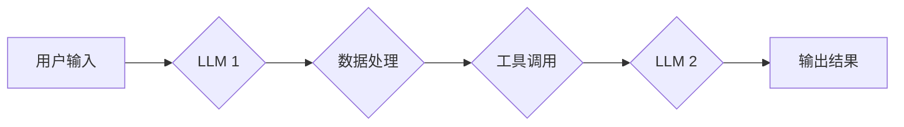

> LangChain, 语言模型, 链式调用, 应用场景, 编程实践, 构建流程

## 1. 背景介绍

近年来，大型语言模型（LLM）的快速发展，如GPT-3、LaMDA等，为人工智能领域带来了革命性的变革。这些模型展现出强大的文本生成、理解和翻译能力，但其单一功能的局限性也逐渐显现。为了更好地利用LLM的潜力，并将其应用于更复杂的任务场景，人们开始探索将多个LLM或其他人工智能组件串联起来构建更强大的智能系统。

LangChain正是应运而生的一种工具，它提供了一套灵活的框架和组件，帮助开发者构建、管理和部署基于LLM的链式应用。通过LangChain，开发者可以将不同的LLM、数据源、工具和业务逻辑组合在一起，构建出更智能、更强大的应用。

## 2. 核心概念与联系

### 2.1  链式调用

LangChain的核心概念是“链式调用”，即将多个组件串联起来，形成一个数据和控制流的序列。每个组件可以是LLM、数据库、API接口、工具函数等，它们之间通过明确的接口和数据传递机制进行交互。

### 2.2  组件

LangChain提供了一系列预定义的组件，涵盖了常见的LLM交互、数据处理、工具调用等功能。开发者可以根据需求选择和组合这些组件，构建自己的链式应用。

### 2.3  链

链是多个组件组成的序列，它定义了数据和控制流的执行路径。开发者可以根据不同的应用场景，构建不同的链，实现不同的功能。

**Mermaid 流程图**



## 3. 核心算法原理 & 具体操作步骤

### 3.1  算法原理概述

LangChain的核心算法原理是基于链式调用的数据和控制流管理。它通过定义组件之间的接口和数据传递机制，实现组件之间的交互和数据流转。

### 3.2  算法步骤详解

1. **定义链:** 开发者首先需要定义链的结构，即确定链中包含哪些组件，以及组件之间的连接方式。
2. **配置组件:** 每个组件都需要进行配置，例如LLM的模型参数、数据库连接信息、API接口地址等。
3. **数据传递:** 当链执行时，数据会从一个组件传递到下一个组件，直到最终输出结果。
4. **控制流:** 链的执行流程由组件之间的连接方式决定，可以是顺序执行、并行执行或分支执行等。

### 3.3  算法优缺点

**优点:**

* **灵活度高:** 可以根据不同的应用场景，灵活组合不同的组件，构建出不同的链式应用。
* **可扩展性强:** 可以轻松添加新的组件，扩展应用的功能。
* **复用性高:** 已经定义好的组件可以被多个链复用，提高开发效率。

**缺点:**

* **复杂度高:** 构建复杂的链式应用需要对组件之间的交互和数据流转有深入的理解。
* **调试难度大:** 链式应用的调试难度相对较高，需要对每个组件的执行过程进行跟踪和分析。

### 3.4  算法应用领域

LangChain的链式调用机制可以应用于各种领域，例如：

* **聊天机器人:** 将LLM与对话管理系统、知识库等组件结合，构建更智能、更自然的聊天机器人。
* **文本生成:** 将LLM与数据处理、模板引擎等组件结合，构建文本生成工具，例如文章写作、代码生成等。
* **问答系统:** 将LLM与知识库、搜索引擎等组件结合，构建更准确、更全面的问答系统。
* **代码辅助:** 将LLM与代码解析器、代码库等组件结合，构建代码辅助工具，例如代码补全、代码生成等。

## 4. 数学模型和公式 & 详细讲解 & 举例说明

### 4.1  数学模型构建

LangChain的链式调用机制可以抽象为一个图论模型，其中：

* 节点代表组件
* 边代表组件之间的连接

每个节点可以拥有自己的状态和行为，边可以定义数据传递和控制流的规则。

### 4.2  公式推导过程

由于LangChain的链式调用机制是基于图论模型的，因此可以使用图论中的相关公式来描述其行为，例如：

* **路径:** 从一个节点到另一个节点的所有边的序列称为路径。
* **最短路径:** 从一个节点到另一个节点的所有路径中，长度最短的路径称为最短路径。
* **拓扑排序:** 对图中的节点进行排序，使得对于任意一条边 (u, v)，节点 u 在节点 v 之前。

### 4.3  案例分析与讲解

例如，在构建一个简单的问答系统时，我们可以将LLM作为知识查询节点，数据库作为知识库节点，用户输入作为起点节点。

通过定义这些节点之间的连接和数据传递规则，我们可以构建一个链式应用，实现用户提问，LLM查询数据库，并返回答案的功能。

## 5. 项目实践：代码实例和详细解释说明

### 5.1  开发环境搭建

为了使用LangChain构建链式应用，我们需要搭建一个开发环境。

* 安装Python 3.7+
* 安装LangChain库：`pip install langchain`
* 安装其他依赖库，例如OpenAI API库

### 5.2  源代码详细实现

```python
from langchain.llms import OpenAI
from langchain.chains import ConversationChain
from langchain.memory import ConversationBufferMemory

# 初始化LLM
llm = OpenAI(temperature=0.7)

# 初始化内存
memory = ConversationBufferMemory()

# 初始化对话链
conversation = ConversationChain(
    llm=llm,
    memory=memory,
    prompt= "你好，请问您有什么问题？"
)

# 与用户交互
while True:
    user_input = input("您:")
    response = conversation.run(user_input)
    print("机器人:", response)
```

### 5.3  代码解读与分析

这段代码演示了如何使用LangChain构建一个简单的对话机器人。

* 首先，我们初始化了OpenAI的LLM模型和ConversationBufferMemory内存。
* 然后，我们创建了一个ConversationChain对象，将LLM和内存作为参数传入。
* 最后，我们使用一个循环与用户交互，每次获取用户输入，并使用ConversationChain运行该输入，得到LLM的响应。

### 5.4  运行结果展示

当运行这段代码时，用户可以与机器人进行对话，机器人会根据用户输入，从内存中获取上下文信息，并生成相应的响应。

## 6. 实际应用场景

### 6.1  聊天机器人

LangChain可以用于构建各种类型的聊天机器人，例如客服机器人、陪伴机器人、游戏机器人等。

### 6.2  文本生成

LangChain可以用于生成各种类型的文本，例如文章、故事、诗歌、代码等。

### 6.3  问答系统

LangChain可以用于构建问答系统，例如知识问答系统、搜索引擎问答系统等。

### 6.4  未来应用展望

随着LLM技术的不断发展，LangChain的应用场景将会更加广泛，例如：

* **个性化教育:** 根据学生的学习情况，生成个性化的学习内容和练习题。
* **智能写作助手:** 帮助用户撰写文章、报告、邮件等。
* **代码生成工具:** 自动生成代码，提高开发效率。

## 7. 工具和资源推荐

### 7.1  学习资源推荐

* **LangChain官方文档:** https://python.langchain.com/docs/
* **LangChain GitHub仓库:** https://github.com/langchain-ai/langchain

### 7.2  开发工具推荐

* **VS Code:** https://code.visualstudio.com/
* **PyCharm:** https://www.jetbrains.com/pycharm/

### 7.3  相关论文推荐

* **Chain-of-Thought Prompting Elicits Reasoning in Large Language Models:** https://arxiv.org/abs/2106.05760
* **Prompt Engineering for Large Language Models:** https://arxiv.org/abs/2207.06211

## 8. 总结：未来发展趋势与挑战

### 8.1  研究成果总结

LangChain为构建基于LLM的链式应用提供了强大的工具和框架，其灵活性和可扩展性使其在各种应用场景中都具有很大的潜力。

### 8.2  未来发展趋势

未来，LangChain的发展趋势将集中在以下几个方面：

* **更强大的组件库:** 提供更多类型的组件，例如图像处理、语音识别等。
* **更智能的链构建工具:** 提供更智能的链构建工具，帮助开发者更轻松地构建复杂的链式应用。
* **更完善的生态系统:** 建立更完善的生态系统，包括更多社区支持、学习资源和应用案例。

### 8.3  面临的挑战

LangChain也面临着一些挑战，例如：

* **链式应用的调试和维护:** 由于链式应用的复杂性，调试和维护难度较高。
* **数据安全和隐私问题:** 链式应用需要处理大量的数据，因此数据安全和隐私问题需要得到重视。
* **伦理问题:** LLMs的应用可能会带来一些伦理问题，例如偏见、虚假信息等，需要得到妥善解决。

### 8.4  研究展望

未来，我们将继续研究LangChain的应用，探索其在更多领域中的潜力，并积极解决其面临的挑战，推动其健康发展。

## 9. 附录：常见问题与解答

### 9.1  Q1: 如何选择合适的LLM模型？

**A1:** 选择合适的LLM模型取决于具体的应用场景。

例如，对于需要生成高质量文本的应用，可以选择GPT-3等强大的文本生成模型；对于需要进行对话交互的应用，可以选择LaMDA等对话型LLM模型。

### 9.2  Q2: 如何调试LangChain的链式应用？

**A2:** 调试LangChain的链式应用可以采用以下方法：

* 使用打印语句跟踪每个组件的执行过程。
* 使用调试器逐步执行代码，观察变量的变化。
* 使用日志记录工具记录链式应用的运行日志。

### 9.3  Q3: 如何保证数据安全和隐私？

**A3:** 在使用LangChain构建链式应用时，需要采取以下措施保证数据安全和隐私：

* 使用加密技术保护敏感数据。
* 限制数据访问权限。
* 合理处理用户数据，遵守相关法律法规。


作者：禅与计算机程序设计艺术 / Zen and the Art of Computer Programming 
<end_of_turn>