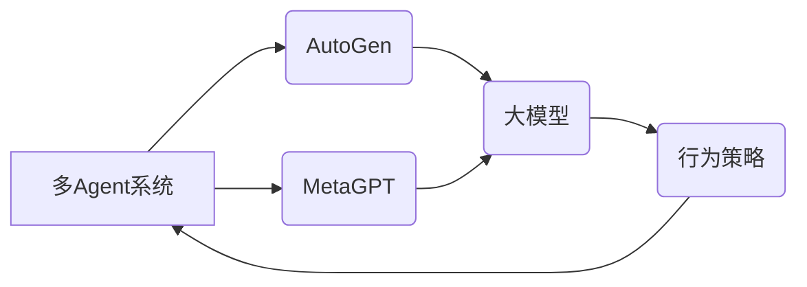

> 多Agent框架, AutoGen, MetaGPT, 大模型应用, AI Agent, 协同学习, 智能决策

## 1. 背景介绍

近年来，人工智能（AI）技术取得了飞速发展，大模型的涌现更是推动了AI应用的广泛普及。从文本生成、图像识别到语音合成，大模型展现出强大的能力，为各行各业带来了革命性的变革。然而，单一的大模型往往难以应对复杂、多变的现实世界问题。

多Agent系统（MAS）作为一种新的智能计算 paradigm，以其能够模拟和解决复杂系统问题的能力，逐渐成为研究热点。MAS由多个智能体（Agent）组成，每个Agent都具有自主决策和行动的能力，通过相互交互和协作来实现共同目标。将大模型与多Agent系统相结合，可以构建更强大、更灵活、更具适应性的AI系统。

AutoGen和MetaGPT是两种基于大模型的多Agent框架，它们分别从不同的角度探索了大模型在多Agent系统中的应用。AutoGen专注于自动生成多Agent系统的行为策略，而MetaGPT则侧重于利用大模型进行多Agent系统的元学习和进化。

## 2. 核心概念与联系

### 2.1  多Agent系统（MAS）

多Agent系统由多个独立的智能体（Agent）组成，每个Agent都具有感知环境、做出决策和执行行动的能力。Agent之间通过通信和协作来实现共同目标。MAS的特点包括：

* **自主性:** 每个Agent都具有自主决策和行动的能力。
* **交互性:** Agent之间通过通信和协作来实现共同目标。
* **分布式性:** MAS通常是分布式的，每个Agent都运行在不同的计算节点上。
* **复杂性:** MAS通常由大量的Agent组成，其行为模式非常复杂。

### 2.2  大模型

大模型是指参数量巨大、训练数据海量的人工智能模型。大模型通常具有强大的泛化能力和表示能力，能够在各种自然语言处理、计算机视觉等任务中取得优异的性能。

### 2.3  AutoGen

AutoGen是一种基于大模型的多Agent框架，它利用大模型自动生成多Agent系统的行为策略。AutoGen的核心思想是将每个Agent的行为策略视为一个可学习的参数向量，并使用大模型进行策略优化。

### 2.4  MetaGPT

MetaGPT是一种基于大模型的多Agent框架，它利用大模型进行多Agent系统的元学习和进化。MetaGPT的核心思想是将多Agent系统的训练过程视为一个元学习问题，并使用大模型学习如何优化多Agent系统的策略和结构。

**多Agent框架 AutoGen 和 MetaGPT 的关系**



## 3. 核心算法原理 & 具体操作步骤

### 3.1  算法原理概述

AutoGen和MetaGPT都基于大模型的强大能力，利用其学习和优化策略的能力来构建多Agent系统。

AutoGen采用强化学习算法，通过训练大模型学习每个Agent的行为策略，使其能够在多Agent环境中取得最佳结果。MetaGPT则采用元学习算法，通过训练大模型学习如何优化多Agent系统的策略和结构，使其能够适应不同的环境和任务。

### 3.2  算法步骤详解

#### 3.2.1 AutoGen

1. **环境建模:** 将多Agent环境建模为一个Markov决策过程（MDP）。
2. **策略表示:** 将每个Agent的行为策略表示为一个可学习的参数向量。
3. **强化学习训练:** 使用强化学习算法，例如DQN或PPO，训练大模型学习每个Agent的行为策略。
4. **策略部署:** 将训练好的策略部署到多Agent系统中，使Agent能够根据策略做出决策。

#### 3.2.2 MetaGPT

1. **元学习任务定义:** 将多Agent系统的训练过程定义为一个元学习任务。
2. **策略和结构表示:** 将多Agent系统的策略和结构表示为可学习的参数。
3. **元学习训练:** 使用元学习算法，例如MAML或 Reptile，训练大模型学习如何优化多Agent系统的策略和结构。
4. **策略和结构部署:** 将训练好的策略和结构部署到多Agent系统中，使Agent能够根据策略和结构做出决策。

### 3.3  算法优缺点

#### 3.3.1 AutoGen

* **优点:**
    * 能够自动生成多Agent系统的行为策略，无需人工设计。
    * 能够学习到复杂的策略，适应不同的环境和任务。
* **缺点:**
    * 训练过程可能需要大量的计算资源和时间。
    * 策略的表达能力可能有限，难以解决非常复杂的决策问题。

#### 3.3.2 MetaGPT

* **优点:**
    * 能够学习到更通用的策略和结构，适用于不同的环境和任务。
    * 能够进行策略和结构的进化，不断提升多Agent系统的性能。
* **缺点:**
    * 元学习算法的训练过程更加复杂，需要更强大的计算资源。
    * 难以评估元学习算法的性能，需要更有效的评估指标。

### 3.4  算法应用领域

AutoGen和MetaGPT在多个领域都有着广泛的应用前景，例如：

* **机器人协作:** 多机器人协作完成复杂任务，例如搜索和救援、环境清理等。
* **智能交通:** 多车协作实现安全高效的交通流，例如自动驾驶、交通信号控制等。
* **金融交易:** 多智能体协作进行金融交易，例如股票交易、风险管理等。
* **游戏开发:** 多玩家游戏中的AI对手，例如策略游戏、角色扮演游戏等。

## 4. 数学模型和公式 & 详细讲解 & 举例说明

### 4.1  数学模型构建

#### 4.1.1 AutoGen

AutoGen将多Agent系统建模为一个Markov决策过程（MDP）。

* **状态空间:** $S$，表示所有可能的系统状态。
* **动作空间:** $A$，表示每个Agent可以执行的动作。
* **状态转移概率:** $P(s'|s,a)$，表示从状态 $s$ 执行动作 $a$ 后转移到状态 $s'$ 的概率。
* **奖励函数:** $R(s,a)$，表示在状态 $s$ 执行动作 $a$ 后获得的奖励。

#### 4.1.2 MetaGPT

MetaGPT将多Agent系统的训练过程定义为一个元学习任务。

* **内循环任务:** 在每个训练迭代中，MetaGPT会随机选择一个环境和一个初始策略，并使用强化学习算法训练一个子模型来优化策略。
* **外循环任务:** MetaGPT会使用元学习算法，例如MAML，学习如何优化子模型的训练过程，使其能够在不同的环境和任务中取得更好的性能。

### 4.2  公式推导过程

#### 4.2.1 AutoGen

AutoGen使用强化学习算法，例如DQN，来训练大模型学习每个Agent的行为策略。DQN的目标是学习一个价值函数 $Q(s,a)$，该函数估计在状态 $s$ 执行动作 $a$ 后获得的长期奖励。

DQN的更新规则如下：

$$
Q(s,a) \leftarrow Q(s,a) + \alpha [r + \gamma \max_{a'} Q(s',a') - Q(s,a)]
$$

其中：

* $\alpha$ 是学习率。
* $r$ 是在状态 $s$ 执行动作 $a$ 后获得的奖励。
* $\gamma$ 是折扣因子。
* $s'$ 是从状态 $s$ 执行动作 $a$ 后转移到的状态。

#### 4.2.2 MetaGPT

MetaGPT使用元学习算法，例如MAML，来学习如何优化子模型的训练过程。MAML的目标是学习一个元模型，该模型能够根据给定的任务数据快速地更新子模型的参数，使其能够在该任务上取得更好的性能。

MAML的更新规则如下：

$$
\theta \leftarrow \theta - \alpha \sum_{i=1}^{N} \nabla_{\theta} L(\theta_i, \mathcal{D}_i)
$$

其中：

* $\theta$ 是元模型的参数。
* $\theta_i$ 是子模型的参数。
* $\mathcal{D}_i$ 是第 $i$ 个任务的数据集。
* $L(\theta_i, \mathcal{D}_i)$ 是子模型在第 $i$ 个任务上的损失函数。

### 4.3  案例分析与讲解

#### 4.3.1 AutoGen

假设有一个多Agent系统，其中每个Agent需要在迷宫中寻找出口。AutoGen可以训练一个大模型，学习每个Agent在迷宫中的行为策略。大模型可以学习到不同的路径选择策略，并根据环境信息做出最优决策。

#### 4.3.2 MetaGPT

假设有一个多Agent系统，其中每个Agent需要协作完成一个任务，例如构建一座桥梁。MetaGPT可以训练一个元模型，学习如何优化子模型的训练过程。元模型可以学习到不同的协作策略，并根据任务需求调整子模型的参数，使其能够在不同的环境和任务中取得更好的性能。

## 5. 项目实践：代码实例和详细解释说明

### 5.1  开发环境搭建

* **操作系统:** Linux/macOS
* **编程语言:** Python
* **深度学习框架:** PyTorch/TensorFlow
* **其他依赖:** NumPy, Pandas, Matplotlib等

### 5.2  源代码详细实现

由于篇幅限制，这里只提供 AutoGen 的代码示例，MetaGPT 的代码实现类似。

```python
import torch
import torch.nn as nn

class Agent(nn.Module):
    def __init__(self, state_dim, action_dim):
        super(Agent, self).__init__()
        self.fc1 = nn.Linear(state_dim, 128)
        self.fc2 = nn.Linear(128, action_dim)

    def forward(self, state):
        x = torch.relu(self.fc1(state))
        x = self.fc2(x)
        return x

# 初始化 Agent
agent = Agent(state_dim=10, action_dim=5)

# 定义损失函数
criterion = nn.MSELoss()

# 定义优化器
optimizer = torch.optim.Adam(agent.parameters(), lr=0.001)

# 训练循环
for epoch in range(100):
    # 获取训练数据
    state, action, reward = get_training_data()

    # 前向传播
    output = agent(state)

    # 计算损失
    loss = criterion(output, action)

    # 反向传播
    optimizer.zero_grad()
    loss.backward()

    # 更新参数
    optimizer.step()

# 保存训练好的模型
torch.save(agent.state_dict(), 'agent.pth')
```

### 5.3  代码解读与分析

* **Agent类:** 定义了每个Agent的行为策略，使用两层全连接神经网络进行学习。
* **训练循环:** 使用强化学习算法训练Agent，通过最小化损失函数来更新Agent的参数。
* **get_training_data():** 用于获取训练数据，包含状态、动作和奖励信息。

### 5.4  运行结果展示

训练完成后，可以将训练好的模型部署到多Agent系统中，使Agent能够根据策略做出决策。

## 6. 实际应用场景

### 6.1  机器人协作

AutoGen和MetaGPT可以用于训练多机器人协作完成复杂任务，例如：

* **搜索和救援:** 多机器人协作在灾难现场搜索和救援人员。
* **环境清理:** 多机器人协作清理海洋垃圾、森林火灾后残骸等。