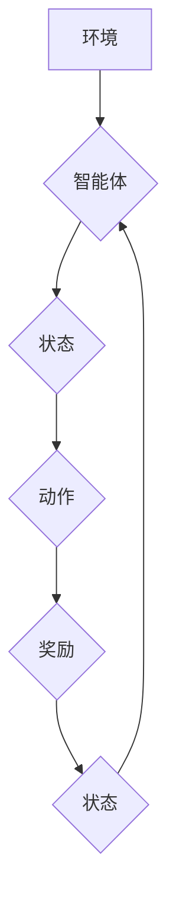

> Deep Q-Network (DQN), 动态规划, Bellman方程, 强化学习, 价值函数, 策略梯度

## 1. 背景介绍

强化学习 (Reinforcement Learning, RL) 作为机器学习的一个重要分支，近年来在各个领域取得了显著的成果，例如游戏、机器人控制、自动驾驶等。其中，Deep Q-Network (DQN) 作为一种深度强化学习算法，凭借其强大的学习能力和应用广泛性，成为了 RL 领域的研究热点。

DQN 算法的核心思想是利用深度神经网络来估计状态-动作价值函数 (Q-value)，并通过最大化 Q-value 来选择最优动作。然而，对于初学者来说，DQN 的算法原理可能显得较为复杂，难以理解。本文将从动态规划的视角出发，对 DQN 算法进行深入的解释，并通过 Bellman 方程的直观理解，帮助读者更好地理解 DQN 的工作机制。

## 2. 核心概念与联系

**2.1 动态规划 (Dynamic Programming)**

动态规划是一种解决复杂问题的方法，其核心思想是将问题分解成若干个子问题，并通过求解子问题来得到最终问题的解。动态规划算法通常具有以下特点：

* **最优子结构**: 问题的最优解可以由子问题的最优解构成。
* **重叠子问题**: 子问题在求解过程中会被重复计算。

**2.2 强化学习 (Reinforcement Learning)**

强化学习是一种机器学习方法，其目标是训练一个智能体在环境中采取最优行动，以最大化累积的奖励。强化学习系统通常由以下几个组成部分组成：

* **智能体 (Agent)**:  做出决策并与环境交互的实体。
* **环境 (Environment)**: 智能体所处的外部世界，会根据智能体的行动产生相应的状态变化和奖励信号。
* **状态 (State)**: 环境的当前状态。
* **动作 (Action)**: 智能体可以采取的行动。
* **奖励 (Reward)**: 环境对智能体行动的反馈，可以是正向奖励或负向惩罚。

**2.3 状态-动作价值函数 (Q-value)**

状态-动作价值函数 Q(s, a) 表示在状态 s 下采取动作 a 的预期累积奖励。 Q-value 是强化学习算法的核心概念之一，它用来评估不同状态-动作对的价值。

**2.4 Bellman方程**

Bellman 方程是动态规划的核心公式，它描述了状态-动作价值函数之间的关系。Bellman 方程的直观解释是：一个状态-动作对的价值等于采取该动作后进入下一个状态的价值，加上当前状态的奖励。

**2.5 DQN算法与动态规划的联系**

DQN 算法的核心思想是利用深度神经网络来估计状态-动作价值函数 Q(s, a)。而 Bellman 方程则提供了估计 Q-value 的数学基础。DQN 算法通过迭代更新 Q-value，最终逼近最优 Q-value 函数，从而实现智能体的最优决策。

**2.6 Mermaid 流程图**



## 3. 核心算法原理 & 具体操作步骤

### 3.1 算法原理概述

DQN 算法的核心思想是利用深度神经网络来估计状态-动作价值函数 Q(s, a)，并通过最大化 Q-value 来选择最优动作。DQN 算法的主要步骤如下：

1. **初始化**: 初始化深度神经网络，并设置学习率、折扣因子等超参数。
2. **经验回放**: 从经验池中随机采样若干个状态-动作-奖励-下一个状态的四元组 (s, a, r, s')。
3. **Q-value 更新**: 利用 Bellman 方程更新神经网络的权重，使 Q-value 逼近最优 Q-value 函数。
4. **目标网络**: 使用一个目标网络来评估 Q-value，目标网络的权重是主网络权重的拷贝，并以一定的频率更新。
5. **策略选择**: 根据神经网络估计的 Q-value 选择最优动作。

### 3.2 算法步骤详解

1. **初始化**:

   * 创建一个深度神经网络，其输入为状态 s，输出为动作 a 的 Q-value。
   * 设置学习率、折扣因子等超参数。

2. **经验回放**:

   * 在训练过程中，智能体与环境交互，收集状态-动作-奖励-下一个状态的四元组 (s, a, r, s')。
   * 将这些四元组存储在经验池中。
   * 在每次训练迭代中，从经验池中随机采样若干个四元组 (s, a, r, s')。

3. **Q-value 更新**:

   * 使用采样的四元组 (s, a, r, s') 计算目标 Q-value:

     $$
     y = r + \gamma \max_{a'} Q(s', a')
     $$

     其中，r 是当前奖励，γ 是折扣因子，a' 是下一个状态 s' 下最优动作。

   * 使用目标 Q-value 和神经网络估计的 Q-value 计算损失函数。
   * 利用梯度下降算法更新神经网络的权重，使损失函数最小化。

4. **目标网络**:

   * 创建一个与主网络结构相同的目标网络。
   * 定期将目标网络的权重更新为主网络权重的拷贝。
   * 使用目标网络来评估 Q-value，避免过拟合。

5. **策略选择**:

   * 在测试阶段，根据神经网络估计的 Q-value 选择最优动作。

### 3.3 算法优缺点

**优点**:

* **能够学习复杂环境中的最优策略**: DQN 算法能够利用深度神经网络学习复杂环境中的非线性关系，从而找到最优策略。
* **能够处理高维状态空间**: DQN 算法能够处理高维状态空间，例如游戏中的图像输入。
* **能够利用经验回放**: 经验回放机制能够提高训练效率，并避免过拟合。

**缺点**:

* **训练过程可能比较慢**: DQN 算法的训练过程可能比较慢，需要大量的训练数据和计算资源。
* **容易出现震荡**: DQN 算法的训练过程可能出现震荡，导致学习效果不稳定。
* **难以处理连续动作空间**: DQN 算法难以处理连续动作空间，例如机器人控制中的运动控制。

### 3.4 算法应用领域

DQN 算法在以下领域取得了成功应用：

* **游戏**: DQN 算法能够学习玩各种游戏，例如 Atari 游戏、Go 游戏等。
* **机器人控制**: DQN 算法能够用于控制机器人运动、抓取物体等任务。
* **自动驾驶**: DQN 算法能够用于训练自动驾驶汽车的决策系统。
* **推荐系统**: DQN 算法能够用于个性化推荐系统，例如推荐电影、音乐等。

## 4. 数学模型和公式 & 详细讲解 & 举例说明

### 4.1 数学模型构建

DQN 算法的核心数学模型是状态-动作价值函数 Q(s, a)。该函数表示在状态 s 下采取动作 a 的预期累积奖励。

### 4.2 公式推导过程

Bellman 方程是 DQN 算法的核心公式，它描述了状态-动作价值函数之间的关系。Bellman 方程的表达式如下：

$$
Q(s, a) = r + \gamma \max_{a'} Q(s', a')
$$

其中：

* Q(s, a) 是状态 s 下采取动作 a 的价值。
* r 是当前奖励。
* γ 是折扣因子，表示未来奖励的权重。
* s' 是采取动作 a 后进入的下一个状态。
* a' 是下一个状态 s' 下最优动作。

### 4.3 案例分析与讲解

假设我们有一个简单的环境，智能体可以采取两种动作：向上和向下。在状态 s=0 时，采取向上动作的奖励为 1，采取向下动作的奖励为 -1。在状态 s=1 时，采取向上动作的奖励为 -1，采取向下动作的奖励为 1。

根据 Bellman 方程，我们可以计算出状态-动作价值函数 Q(s, a) 的值：

* Q(0, Up) = 1 + γ * max(Q(1, Up), Q(1, Down))
* Q(0, Down) = -1 + γ * max(Q(1, Up), Q(1, Down))
* Q(1, Up) = -1 + γ * max(Q(0, Up), Q(0, Down))
* Q(1, Down) = 1 + γ * max(Q(0, Up), Q(0, Down))

其中，γ 是折扣因子，假设 γ = 0.9。

通过迭代计算，我们可以得到最优 Q-value 函数。

## 5. 项目实践：代码实例和详细解释说明

### 5.1 开发环境搭建

* Python 3.6+
* TensorFlow/PyTorch
* OpenAI Gym

### 5.2 源代码详细实现

```python
import tensorflow as tf
import numpy as np
from tensorflow.keras.models import Sequential
from tensorflow.keras.layers import Dense

# 定义 DQN 网络
class DQN(tf.keras.Model):
    def __init__(self, state_size, action_size):
        super(DQN, self).__init__()
        self.dense1 = Dense(64, activation='relu')
        self.dense2 = Dense(64, activation='relu')
        self.output = Dense(action_size, activation='linear')

    def call(self, state):
        x = self.dense1(state)
        x = self.dense2(x)
        return self.output(x)

# 定义 DQN 算法
class DQNAgent:
    def __init__(self, state_size, action_size, learning_rate=0.001, gamma=0.99, epsilon=1.0, epsilon_decay=0.995, epsilon_min=0.01):
        self.state_size = state_size
        self.action_size = action_size
        self.learning_rate = learning_rate
        self.gamma = gamma
        self.epsilon = epsilon
        self.epsilon_decay = epsilon_decay
        self.epsilon_min = epsilon_min
        self.model = DQN(state_size, action_size)
        self.target_model = DQN(state_size, action_size)
        self.optimizer = tf.keras.optimizers.Adam(learning_rate=self.learning_rate)

    def choose_action(self, state):
        if np.random.rand() < self.epsilon:
            return np.random.randint(0, self.action_size)
        else:
            q_values = self.model(state)
            return np.argmax(q_values[0])

    def train(self, state, action, reward, next_state, done):
        with tf.GradientTape() as tape:
            target_q_values = self.target_model(next_state)
            max_next_q = tf.reduce_max(target_q_values, axis=1)
            target = reward + self.gamma * max_next_q * (1 - done)
            q_values = self.model(state)
            loss = tf.keras.losses.mean_squared_error(target, q_values[0][action])
        gradients = tape.gradient(loss, self.model.trainable_variables)
        self.optimizer.apply_gradients(zip(gradients, self.model.trainable_variables))

    def update_target_model(self):
        self.target_