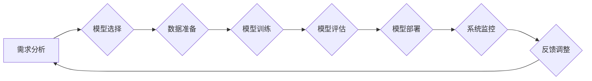

> 人工智能，管理，工作，自动化，流程优化，伦理，未来趋势

## 1. 背景介绍

人工智能（AI）正以惊人的速度发展，深刻地改变着我们生活的方方面面。从自动驾驶汽车到个性化医疗，从智能客服到金融风险评估，AI技术的应用场景日益广泛。然而，AI的快速发展也带来了新的挑战，其中之一就是如何有效地管理AI系统，并将其与人类工作相融合。

传统的管理模式难以适应AI时代的需求。传统的管理体系往往侧重于对人的监督和控制，而AI系统则具有自主学习和决策的能力。因此，我们需要重新思考和定义管理工作，以适应AI技术的应用。

## 2. 核心概念与联系

**2.1 AI管理的核心概念**

AI管理是指在AI系统开发、部署和运行过程中，运用科学的方法和工具，对AI系统进行规划、组织、协调、控制和监督，以确保AI系统的安全、可靠、高效和可持续发展。

**2.2 AI管理与传统管理的关系**

AI管理并非完全取代传统管理，而是对传统管理的延伸和升级。AI管理借鉴了传统管理的经验和方法，同时结合了AI技术的特点，形成了新的管理模式。

**2.3 AI管理的要素**

* **数据管理:** AI系统依赖于海量数据进行训练和运行，因此数据管理是AI管理的核心要素。
* **模型管理:** AI模型是AI系统的核心资产，需要进行开发、训练、部署和维护。
* **算法管理:** AI算法是模型的核心，需要进行选择、优化和评估。
* **安全管理:** AI系统需要保障数据安全、模型安全和系统安全。
* **伦理管理:** AI技术的应用需要遵循伦理原则，避免产生负面影响。

**2.4 AI管理的流程**



## 3. 核心算法原理 & 具体操作步骤

**3.1 算法原理概述**

深度学习是AI领域最热门的技术之一，其核心算法是多层神经网络。深度学习算法能够自动从数据中学习特征，并进行复杂的模式识别和预测。

**3.2 算法步骤详解**

1. **数据收集和预处理:** 收集大量相关数据，并进行清洗、转换和格式化。
2. **网络结构设计:** 根据任务需求设计多层神经网络的结构，包括神经元数量、层数和激活函数等。
3. **模型训练:** 使用训练数据训练神经网络模型，通过调整模型参数，使模型的预测结果与真实值尽可能接近。
4. **模型评估:** 使用测试数据评估模型的性能，并进行调整和优化。
5. **模型部署:** 将训练好的模型部署到实际应用场景中。

**3.3 算法优缺点**

* **优点:** 能够自动学习特征，具有强大的学习能力和泛化能力。
* **缺点:** 需要大量数据进行训练，训练时间长，参数调整复杂。

**3.4 算法应用领域**

* **图像识别:** 人脸识别、物体检测、图像分类等。
* **自然语言处理:** 语音识别、机器翻译、文本摘要等。
* **预测分析:** 股票预测、天气预报、疾病诊断等。

## 4. 数学模型和公式 & 详细讲解 & 举例说明

**4.1 数学模型构建**

深度学习模型可以看作是一个复杂的数学函数，其输入是数据特征，输出是预测结果。

**4.2 公式推导过程**

深度学习模型的训练过程是通过优化模型参数来最小化损失函数的过程。损失函数衡量模型预测结果与真实值的差距。常用的损失函数包括均方误差（MSE）和交叉熵损失（Cross-Entropy Loss）。

**4.3 案例分析与讲解**

假设我们有一个图像分类任务，目标是将图像分类为猫或狗。我们可以使用一个深度学习模型，例如卷积神经网络（CNN），来完成这个任务。

CNN模型的结构包括多个卷积层、池化层和全连接层。卷积层用于提取图像特征，池化层用于降低特征维度，全连接层用于分类。

模型的训练过程是通过输入图像数据，计算模型的输出结果，并使用损失函数计算模型的误差。然后，通过反向传播算法更新模型参数，使模型的误差最小化。

## 5. 项目实践：代码实例和详细解释说明

**5.1 开发环境搭建**

可以使用Python语言和深度学习框架TensorFlow或PyTorch来开发AI项目。

**5.2 源代码详细实现**

```python
import tensorflow as tf

# 定义模型结构
model = tf.keras.models.Sequential([
    tf.keras.layers.Conv2D(32, (3, 3), activation='relu', input_shape=(28, 28, 1)),
    tf.keras.layers.MaxPooling2D((2, 2)),
    tf.keras.layers.Conv2D(64, (3, 3), activation='relu'),
    tf.keras.layers.MaxPooling2D((2, 2)),
    tf.keras.layers.Flatten(),
    tf.keras.layers.Dense(10, activation='softmax')
])

# 编译模型
model.compile(optimizer='adam',
              loss='sparse_categorical_crossentropy',
              metrics=['accuracy'])

# 训练模型
model.fit(x_train, y_train, epochs=5)

# 评估模型
loss, accuracy = model.evaluate(x_test, y_test)
print('Test loss:', loss)
print('Test accuracy:', accuracy)
```

**5.3 代码解读与分析**

这段代码定义了一个简单的卷积神经网络模型，用于图像分类任务。

* `tf.keras.models.Sequential` 创建了一个顺序模型，即层级结构。
* `tf.keras.layers.Conv2D` 定义了一个卷积层，用于提取图像特征。
* `tf.keras.layers.MaxPooling2D` 定义了一个池化层，用于降低特征维度。
* `tf.keras.layers.Flatten` 将多维特征转换为一维向量。
* `tf.keras.layers.Dense` 定义了一个全连接层，用于分类。
* `model.compile` 编译模型，指定优化器、损失函数和评价指标。
* `model.fit` 训练模型，使用训练数据进行训练。
* `model.evaluate` 评估模型，使用测试数据进行评估。

**5.4 运行结果展示**

训练完成后，模型的测试准确率可以作为评估模型性能的指标。

## 6. 实际应用场景

**6.1 自动化客服**

AI驱动的聊天机器人可以自动回答客户常见问题，提高客服效率。

**6.2 个性化推荐**

AI算法可以分析用户的行为数据，提供个性化的商品或内容推荐。

**6.3 医疗诊断**

AI系统可以辅助医生进行疾病诊断，提高诊断准确率。

**6.4 金融风险评估**

AI算法可以分析金融数据，识别潜在的风险，帮助金融机构进行风险管理。

**6.5 未来应用展望**

AI技术的应用场景将更加广泛，例如自动驾驶、机器人、智能家居等。

## 7. 工具和资源推荐

**7.1 学习资源推荐**

* **在线课程:** Coursera、edX、Udacity等平台提供丰富的AI课程。
* **书籍:** 《深度学习》、《机器学习实战》等书籍是学习AI的基础。
* **开源项目:** TensorFlow、PyTorch等开源项目可以帮助你实践AI技术。

**7.2 开发工具推荐**

* **Python:** Python是AI开发最常用的编程语言。
* **TensorFlow:** TensorFlow是一个开源的深度学习框架。
* **PyTorch:** PyTorch是一个开源的深度学习框架。

**7.3 相关论文推荐**

* **《ImageNet Classification with Deep Convolutional Neural Networks》**
* **《Attention Is All You Need》**
* **《BERT: Pre-training of Deep Bidirectional Transformers for Language Understanding》**

## 8. 总结：未来发展趋势与挑战

**8.1 研究成果总结**

近年来，AI技术取得了长足的进步，在图像识别、自然语言处理、预测分析等领域取得了突破性进展。

**8.2 未来发展趋势**

* **模型更加强大:** 模型规模将继续扩大，性能将进一步提升。
* **应用更加广泛:** AI技术将应用于更多领域，例如医疗、教育、金融等。
* **伦理问题更加突出:** AI技术的应用需要更加重视伦理问题，避免产生负面影响。

**8.3 面临的挑战**

* **数据获取和隐私保护:** AI模型需要大量数据进行训练，如何获取高质量数据并保护用户隐私是一个挑战。
* **算法解释性和可信度:** 许多AI算法是黑箱模型，难以解释其决策过程，这降低了模型的可信度。
* **公平性和偏见:** AI算法可能存在公平性和偏见问题，需要进行针对性的研究和改进。

**8.4 研究展望**

未来，AI研究将更加注重模型的可解释性、公平性和安全性，并探索更有效的AI管理方法。

## 9. 附录：常见问题与解答

**9.1 如何选择合适的AI算法？**

选择合适的AI算法需要根据具体任务需求和数据特点进行选择。

**9.2 如何评估AI模型的性能？**

常用的评估指标包括准确率、召回率、F1-score等。

**9.3 如何解决AI模型的过拟合问题？**

可以使用正则化、交叉验证等方法来解决AI模型的过拟合问题。


作者：禅与计算机程序设计艺术 / Zen and the Art of Computer Programming 
<end_of_turn>