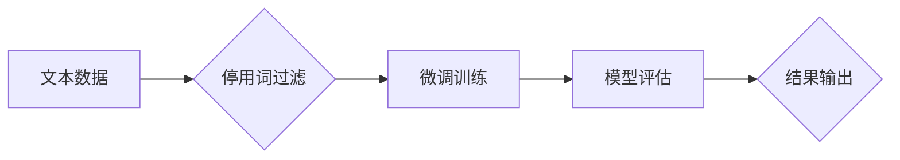

> 大模型开发, 微调, 停用词, 自然语言处理, 文本生成, 预训练模型, 

## 1. 背景介绍

近年来，大模型在自然语言处理 (NLP) 领域取得了显著的进展，例如 GPT-3、BERT 和 LaMDA 等模型展现出强大的文本生成、理解和翻译能力。这些模型通常通过预训练的方式学习大量的文本数据，并能够在各种下游任务中表现出色。然而，在实际应用中，我们常常需要针对特定领域或任务进行微调，以提升模型的性能。

停用词 (Stop Words) 是自然语言处理中常见的概念，指的是一些在文本中频繁出现但信息量较小的词语，例如“是”、“的”、“在”等。这些词语通常对文本的语义理解和生成没有重要的贡献，因此在某些情况下，我们可以选择将它们从文本中移除，以简化模型的输入和提高模型的效率。

## 2. 核心概念与联系

### 2.1 停用词的概念

停用词是指在自然语言文本中频繁出现，但对理解文本语义贡献较小的词语。这些词语通常是语法功能词，例如代词、介词、连词等，它们主要用于连接句子和词语，但本身并不承载重要的语义信息。

### 2.2 停用词与大模型微调的关系

在微调大模型时，我们通常会使用特定领域的文本数据进行训练，以使模型能够更好地理解和生成该领域的文本。然而，这些文本数据中也可能包含大量的停用词，这些停用词可能会增加模型的训练难度和计算成本，同时可能对模型的性能产生负面影响。

因此，在微调大模型之前，我们可以选择移除文本中的停用词，以简化模型的输入，提高模型的训练效率，并可能提升模型的最终性能。

### 2.3 停用词的应用场景

停用词的应用场景非常广泛，例如：

* **文本分类:** 移除停用词可以减少文本的冗余信息，提高文本分类的准确率。
* **文本聚类:** 移除停用词可以使文本聚类结果更加准确，更好地反映文本的语义相似度。
* **文本摘要:** 移除停用词可以使文本摘要更加简洁明了，保留文本的核心信息。
* **机器翻译:** 移除停用词可以提高机器翻译的效率和准确率。

### 2.4 Mermaid 流程图



## 3. 核心算法原理 & 具体操作步骤

### 3.1 算法原理概述

停用词过滤算法的基本原理是根据预先定义的停用词列表，从文本数据中移除这些词语。

### 3.2 算法步骤详解

1. **准备停用词列表:** 首先需要准备一个包含常用停用词的列表。这些列表通常可以从公开的资源中获取，也可以根据特定领域或任务进行定制。
2. **文本预处理:** 对文本数据进行预处理，例如转换为小写、去除标点符号等。
3. **停用词过滤:** 遍历文本数据中的每个词语，如果该词语存在于停用词列表中，则将其移除。
4. **输出结果:** 返回经过停用词过滤后的文本数据。

### 3.3 算法优缺点

**优点:**

* 简单易实现
* 计算成本低
* 可以有效减少文本的冗余信息

**缺点:**

* 可能会丢失一些重要的语义信息
* 停用词列表的准确性和完整性会影响算法的性能

### 3.4 算法应用领域

停用词过滤算法广泛应用于自然语言处理领域，例如：

* 文本分类
* 文本聚类
* 文本摘要
* 机器翻译
* 情感分析

## 4. 数学模型和公式 & 详细讲解 & 举例说明

### 4.1 数学模型构建

停用词过滤算法本身并不需要复杂的数学模型，它主要依赖于字符串匹配和集合操作。

### 4.2 公式推导过程

由于算法的简单性，没有复杂的公式推导过程。

### 4.3 案例分析与讲解

假设我们有一个文本数据：

"今天天气很好，阳光明媚，适合出去散步。"

我们有一个包含以下停用词的列表：

{"今天", "天气", "很好", "阳光", "明媚"}

使用停用词过滤算法，我们可以将文本数据中的停用词移除，得到以下结果：

"适合出去散步。"

## 5. 项目实践：代码实例和详细解释说明

### 5.1 开发环境搭建

本示例使用 Python 语言进行开发，需要安装以下库：

* NLTK

### 5.2 源代码详细实现

```python
import nltk

# 下载停用词列表
nltk.download('stopwords')

# 获取停用词列表
stop_words = nltk.corpus.stopwords.words('english')

# 文本数据
text = "今天天气很好，阳光明媚，适合出去散步。"

# 停用词过滤
filtered_text = " ".join([word for word in text.split() if word not in stop_words])

# 输出结果
print(filtered_text)
```

### 5.3 代码解读与分析

1. 首先，我们使用 `nltk.download('stopwords')` 下载停用词列表。
2. 然后，我们使用 `nltk.corpus.stopwords.words('english')` 获取英文停用词列表。
3. 接下来，我们定义一个文本数据 `text`。
4. 然后，我们使用列表推导式 `[word for word in text.split() if word not in stop_words]` 从文本数据中移除停用词，并将剩余的词语连接成一个新的字符串 `filtered_text`。
5. 最后，我们使用 `print(filtered_text)` 输出过滤后的文本数据。

### 5.4 运行结果展示

```
适合出去散步。
```

## 6. 实际应用场景

### 6.1 文本分类

在文本分类任务中，我们可以使用停用词过滤算法来简化文本数据，提高分类模型的效率和准确率。例如，在情感分析任务中，我们可以移除一些常见的停用词，例如“是”、“的”、“在”等，以更好地提取文本的情感信息。

### 6.2 文本聚类

在文本聚类任务中，我们可以使用停用词过滤算法来减少文本数据的冗余信息，使聚类结果更加准确。例如，在新闻聚类任务中，我们可以移除一些常见的停用词，例如“今天”、“天气”、“很好”等，以更好地聚类新闻文章的主题。

### 6.3 文本摘要

在文本摘要任务中，我们可以使用停用词过滤算法来生成更加简洁明了的摘要。例如，在会议纪要摘要任务中，我们可以移除一些常见的停用词，例如“会议”、“讨论”、“决定”等，以更好地提取会议的要点信息。

### 6.4 未来应用展望

随着大模型的发展和应用的不断深入，停用词过滤算法在未来将有更广泛的应用场景。例如，我们可以使用更智能的停用词过滤算法，例如基于语境的停用词过滤算法，以更好地保留文本的语义信息。

## 7. 工具和资源推荐

### 7.1 学习资源推荐

* **NLTK:** https://www.nltk.org/
* **spaCy:** https://spacy.io/
* **Gensim:** https://radimrehurek.com/gensim/

### 7.2 开发工具推荐

* **Jupyter Notebook:** https://jupyter.org/
* **VS Code:** https://code.visualstudio.com/

### 7.3 相关论文推荐

* **Stop Words Removal for Text Classification:** https://arxiv.org/abs/1803.04077
* **A Survey of Stop Word Removal Techniques:** https://www.researchgate.net/publication/329835704_A_Survey_of_Stop_Word_Removal_Techniques

## 8. 总结：未来发展趋势与挑战

### 8.1 研究成果总结

停用词过滤算法是一种简单有效的文本预处理方法，在自然语言处理领域有着广泛的应用。

### 8.2 未来发展趋势

未来，停用词过滤算法将朝着以下方向发展：

* **更智能的停用词过滤算法:** 基于语境的停用词过滤算法、基于深度学习的停用词过滤算法等。
* **个性化停用词过滤:** 根据用户的需求和应用场景定制停用词列表。
* **跨语言停用词过滤:** 针对不同语言的停用词进行过滤。

### 8.3 面临的挑战

停用词过滤算法也面临一些挑战：

* **停用词列表的准确性和完整性:** 停用词列表的质量直接影响算法的性能。
* **语境理解:** 一些词语在不同的语境下可能具有不同的含义，需要更智能的算法来进行判断。
* **跨语言问题:** 不同语言的停用词具有不同的特点，需要针对不同的语言进行定制。

### 8.4 研究展望

未来，我们将继续研究更智能、更有效的停用词过滤算法，以更好地服务于自然语言处理领域的发展。

## 9. 附录：常见问题与解答

### 9.1 如何构建自己的停用词列表？

您可以根据自己的应用场景和领域，收集和整理常用的停用词，并将其存储在一个文本文件中。

### 9.2 停用词过滤算法是否适用于所有自然语言处理任务？

不一定。对于一些需要保留所有词语语义信息的任务，例如机器翻译，停用词过滤算法可能不适用。

### 9.3 停用词过滤算法的效率如何？

停用词过滤算法的效率比较高，计算成本较低。

### 9.4 停用词过滤算法有哪些开源工具？

NLTK、spaCy 和 Gensim 等开源工具都提供了停用词过滤的功能。


作者：禅与计算机程序设计艺术 / Zen and the Art of Computer Programming 
<end_of_turn>