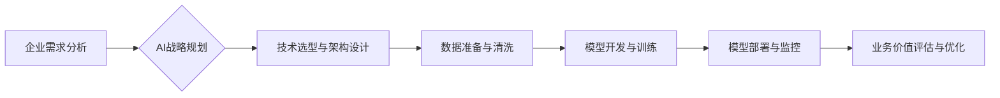

> 企业AI战略，Lepton AI，人工智能咨询，机器学习，深度学习，数据分析，业务优化，数字化转型

## 1. 背景介绍

在当今数据爆炸和技术飞速发展的时代，人工智能（AI）已成为企业数字化转型和竞争优势的关键驱动力。然而，许多企业在AI战略规划、技术选型、人才培养等方面面临着诸多挑战。如何有效地利用AI技术，提升企业运营效率、创造新的商业价值，成为企业亟需解决的问题。

Lepton AI作为一家世界级人工智能咨询公司，致力于为企业提供全面的AI战略咨询服务，帮助企业构建可持续发展的AI生态系统。我们拥有强大的技术团队、丰富的行业经验和成熟的咨询体系，能够帮助企业从战略规划到技术落地，实现AI价值最大化。

## 2. 核心概念与联系

Lepton AI的AI战略咨询服务基于以下核心概念：

* **数据驱动**: AI技术的核心是数据，Lepton AI将帮助企业建立数据驱动的决策体系，挖掘数据价值，为AI应用提供高质量的数据支撑。
* **业务价值**: AI技术应用应以业务价值为导向，Lepton AI将帮助企业明确AI应用场景，量身定制AI解决方案，实现业务目标。
* **可持续发展**: Lepton AI将帮助企业构建可持续发展的AI生态系统，包括人才培养、技术迭代、监管合规等方面，确保AI技术的长期价值。

**Lepton AI AI战略咨询服务流程**

## 3. 核心算法原理 & 具体操作步骤

Lepton AI在AI战略咨询服务中，会根据企业需求，选择合适的机器学习算法，例如：

* **监督学习**: 用于预测或分类问题，例如客户流失预测、欺诈检测等。
* **无监督学习**: 用于发现数据中的隐藏模式，例如客户画像分析、异常检测等。
* **强化学习**: 用于训练智能体，使其在特定环境中做出最佳决策，例如机器人控制、游戏AI等。

### 3.1  算法原理概述

Lepton AI的专家团队将根据企业具体需求，对选定的算法进行深入分析，并提供清晰易懂的原理概述，帮助企业理解算法的运作机制。

### 3.2  算法步骤详解

Lepton AI将详细解释算法的每个步骤，包括数据预处理、特征工程、模型训练、模型评估等，并提供具体的操作步骤和代码示例，帮助企业快速上手。

### 3.3  算法优缺点

Lepton AI将分析算法的优缺点，包括准确率、效率、可解释性等，帮助企业权衡利弊，选择最适合的算法。

### 3.4  算法应用领域

Lepton AI将介绍算法在不同领域的应用案例，例如金融、医疗、零售、制造等，帮助企业了解算法的应用场景和价值。

## 4. 数学模型和公式 & 详细讲解 & 举例说明

Lepton AI的专家团队将使用数学模型和公式，详细解释算法的原理和运作机制，并通过具体的案例分析，帮助企业理解算法的应用和效果。

### 4.1  数学模型构建

Lepton AI将根据算法的特点，构建相应的数学模型，例如线性回归模型、逻辑回归模型、神经网络模型等，并解释模型的结构和参数。

### 4.2  公式推导过程

Lepton AI将详细推导算法中的关键公式，例如损失函数、梯度下降算法等，帮助企业理解公式的含义和作用。

### 4.3  案例分析与讲解

Lepton AI将通过具体的案例分析，展示算法的应用效果，并解释模型的预测结果和背后的逻辑。

## 5. 项目实践：代码实例和详细解释说明

Lepton AI将提供实际项目代码实例，并进行详细的解释和分析，帮助企业了解算法的实现过程和代码结构。

### 5.1  开发环境搭建

Lepton AI将指导企业搭建开发环境，包括安装必要的软件和库，配置开发工具等。

### 5.2  源代码详细实现

Lepton AI将提供源代码，并进行详细的注释和解释，帮助企业理解代码的逻辑和功能。

### 5.3  代码解读与分析

Lepton AI将对代码进行解读和分析，解释代码的各个模块和函数，帮助企业理解代码的整体结构和工作机制。

### 5.4  运行结果展示

Lepton AI将展示代码的运行结果，并解释结果的含义和意义，帮助企业验证算法的有效性。

## 6. 实际应用场景

Lepton AI将介绍AI技术的实际应用场景，例如：

* **金融领域**: 风险评估、欺诈检测、客户画像分析等。
* **医疗领域**: 疾病诊断、药物研发、患者管理等。
* **零售领域**: 商品推荐、库存优化、个性化营销等。
* **制造领域**: 质量控制、设备预测维护、生产流程优化等。

### 6.4  未来应用展望

Lepton AI将展望AI技术的未来发展趋势，并探讨AI技术在不同领域的应用潜力。

## 7. 工具和资源推荐

Lepton AI将推荐相关的学习资源、开发工具和论文，帮助企业深入了解AI技术。

### 7.1  学习资源推荐

Lepton AI将推荐一些优秀的AI学习资源，例如在线课程、书籍、博客等。

### 7.2  开发工具推荐

Lepton AI将推荐一些常用的AI开发工具，例如机器学习框架、数据可视化工具等。

### 7.3  相关论文推荐

Lepton AI将推荐一些最新的AI相关论文，帮助企业了解AI技术的最新进展。

## 8. 总结：未来发展趋势与挑战

Lepton AI将总结AI战略咨询服务的重要意义，并展望AI技术的未来发展趋势和面临的挑战。

### 8.1  研究成果总结

Lepton AI将总结其在AI战略咨询服务方面的研究成果，并分享其经验和见解。

### 8.2  未来发展趋势

Lepton AI将探讨AI技术的未来发展趋势，例如模型的自动化、解释性的增强、跨模态学习等。

### 8.3  面临的挑战

Lepton AI将分析AI技术发展面临的挑战，例如数据隐私、算法偏见、人才短缺等。

### 8.4  研究展望

Lepton AI将展望未来研究方向，例如更安全、更可靠、更可解释的AI技术。

## 9. 附录：常见问题与解答

Lepton AI将解答企业在AI战略咨询服务过程中可能遇到的常见问题，提供详细的解答和建议。

作者：禅与计算机程序设计艺术 / Zen and the Art of Computer Programming 
<end_of_turn>