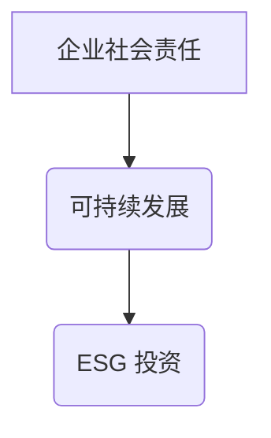

> 企业社会责任，ESG，可持续发展，人工智能，伦理决策，社会影响

## 1. 背景介绍

在当今全球化和信息化的时代，企业面临着前所未有的机遇和挑战。一方面，市场竞争日益激烈，企业需要不断追求利润最大化以确保自身可持续发展。另一方面，社会对企业责任的期望也越来越高，人们更加关注企业对环境、社会和经济的影响。

企业社会责任（Corporate Social Responsibility，简称CSR）应运而生，它指企业在追求经济效益的同时，也承担起对社会和环境的责任，并积极履行这些责任。CSR已成为企业可持续发展的重要组成部分，也是企业赢得社会信任和长远发展的关键。

## 2. 核心概念与联系

**2.1 企业社会责任 (CSR)**

企业社会责任是指企业在经营活动中，不仅要追求经济效益，还要考虑其对社会和环境的影响，并积极履行其社会责任。

**2.2 可持续发展 (Sustainable Development)**

可持续发展是指满足当前世代需求，而不损害未来世代满足其自身需求的能力。它强调经济、社会和环境的可持续平衡发展。

**2.3 ESG 投资 (ESG Investing)**

ESG 投资是指考虑环境、社会和公司治理 (ESG) 因素进行投资决策的投资方式。ESG 投资旨在通过投资于负责任的企业，促进可持续发展。

**2.4 核心概念联系**

企业社会责任与可持续发展密切相关，两者共同构成了企业可持续发展的基石。ESG 投资则是将可持续发展理念融入投资决策的一种实践方式。



## 3. 核心算法原理 & 具体操作步骤

**3.1 算法原理概述**

在企业社会责任管理中，可以使用多种算法和模型来评估企业社会影响，并制定相应的策略。例如，可以使用机器学习算法分析企业公开信息，识别其社会责任表现；可以使用多目标优化算法，平衡企业利润和社会效益；可以使用风险评估模型，识别企业社会责任相关的风险。

**3.2 算法步骤详解**

以机器学习算法为例，评估企业社会责任表现的步骤如下：

1. **数据收集:** 收集企业公开信息，包括财务数据、环境数据、社会数据等。
2. **数据预处理:** 对收集到的数据进行清洗、转换和特征工程，以便于模型训练。
3. **模型选择:** 选择合适的机器学习算法，例如支持向量机、决策树、随机森林等。
4. **模型训练:** 使用训练数据训练模型，并评估模型性能。
5. **模型部署:** 将训练好的模型部署到生产环境中，用于实时评估企业社会责任表现。

**3.3 算法优缺点**

机器学习算法在评估企业社会责任表现方面具有以下优点：

* **自动化:** 可以自动分析大量数据，识别复杂的社会责任相关因素。
* **精准度:** 可以根据历史数据，预测企业未来的社会责任表现。
* **可扩展性:** 可以根据需要，扩展数据维度和模型复杂度。

但也存在以下缺点：

* **数据依赖:** 模型性能取决于数据质量和数量。
* **解释性:** 部分机器学习算法的决策过程难以解释。
* **偏见:** 模型可能存在数据偏见，导致评估结果不准确。

**3.4 算法应用领域**

机器学习算法在企业社会责任管理领域有广泛的应用，例如：

* **社会责任评估:** 评估企业在环境保护、社会公益、员工权益等方面的表现。
* **风险识别:** 识别企业社会责任相关的风险，例如环境污染、社会冲突、消费者投诉等。
* **策略制定:** 根据评估结果和风险识别，制定相应的社会责任策略。

## 4. 数学模型和公式 & 详细讲解 & 举例说明

**4.1 数学模型构建**

企业社会责任管理可以构建数学模型来量化企业社会影响，并进行优化决策。例如，可以构建一个多目标优化模型，目标函数包括企业利润、社会效益和环境效益，约束条件包括资源限制、法律法规等。

**4.2 公式推导过程**

假设企业利润为 P，社会效益为 S，环境效益为 E，资源限制为 R，法律法规约束为 L。则多目标优化模型可以表示为：

```latex
\begin{aligned}
\text{max} & P + \alpha S + \beta E \\
\text{s.t.} & R \leq r \\
& L \leq l
\end{aligned}
```

其中，α 和 β 是权重系数，用于平衡不同目标的重要性。

**4.3 案例分析与讲解**

例如，一家企业生产某种产品，其利润为 100 万元，社会效益为 50 万元，环境效益为 20 万元。资源限制为 50 万元，法律法规约束为 10 万元。如果将 α 和 β 设置为 0.5 和 0.2，则目标函数为：

```latex
P + \alpha S + \beta E = 100 + 0.5 \times 50 + 0.2 \times 20 = 150
```

这意味着，该企业在满足资源限制和法律法规约束的前提下，可以通过优化生产过程，提高社会效益和环境效益，最终实现利润和社会效益的平衡发展。

## 5. 项目实践：代码实例和详细解释说明

**5.1 开发环境搭建**

本项目使用 Python 语言进行开发，所需环境如下：

* Python 3.6 或以上版本
* Jupyter Notebook 或类似的开发环境
* 机器学习库：scikit-learn

**5.2 源代码详细实现**

```python
import pandas as pd
from sklearn.model_selection import train_test_split
from sklearn.linear_model import LogisticRegression

# 数据加载
data = pd.read_csv('csr_data.csv')

# 特征选择和数据预处理
features = ['revenue', 'employee_count', 'environmental_impact', 'social_impact']
X = data[features]
y = data['csr_score']

# 数据分割
X_train, X_test, y_train, y_test = train_test_split(X, y, test_size=0.2, random_state=42)

# 模型训练
model = LogisticRegression()
model.fit(X_train, y_train)

# 模型评估
accuracy = model.score(X_test, y_test)
print(f'模型准确率: {accuracy}')

# 预测
new_data = pd.DataFrame({'revenue': [1000000], 'employee_count': [1000], 'environmental_impact': [0.5], 'social_impact': [0.8]})
prediction = model.predict(new_data)
print(f'预测结果: {prediction}')
```

**5.3 代码解读与分析**

该代码示例展示了如何使用机器学习算法评估企业社会责任表现。

1. 首先，加载数据并选择相关特征。
2. 然后，将数据分割为训练集和测试集。
3. 接着，训练一个逻辑回归模型。
4. 最后，评估模型性能并进行预测。

**5.4 运行结果展示**

运行结果将显示模型的准确率以及对新数据的预测结果。

## 6. 实际应用场景

**6.1 投资决策**

ESG 投资机构可以使用企业社会责任评估模型，筛选出符合其投资理念的企业，并进行投资决策。

**6.2 供应商选择**

企业在选择供应商时，可以考虑供应商的社会责任表现，选择负责任的供应商，降低自身社会风险。

**6.3 消费者行为**

消费者越来越关注企业社会责任，他们倾向于购买来自负责任企业的商品和服务。

**6.4 未来应用展望**

随着人工智能技术的不断发展，企业社会责任管理将更加智能化和自动化。例如，可以使用人工智能技术自动识别企业社会责任相关信息，并进行分析和评估。

## 7. 工具和资源推荐

**7.1 学习资源推荐**

* **书籍:**
    * 《企业社会责任》
    * 《可持续发展》
    * 《ESG 投资》
* **网站:**
    * 全球报告倡议 (GRI)
    * sostenibilidad.org
    * un.org/sustainabledevelopment

**7.2 开发工具推荐**

* **Python:**
    * scikit-learn
    * TensorFlow
    * PyTorch
* **数据可视化工具:**
    * Tableau
    * Power BI

**7.3 相关论文推荐**

* **ESG 投资与企业价值:**
    * [ESG Investing and Firm Value](https://www.jstor.org/stable/43977777)
* **人工智能在企业社会责任管理中的应用:**
    * [Artificial Intelligence for Corporate Social Responsibility](https://www.sciencedirect.com/science/article/pii/S095041702100018X)

## 8. 总结：未来发展趋势与挑战

**8.1 研究成果总结**

企业社会责任管理已成为企业可持续发展的重要组成部分，人工智能技术为企业社会责任管理提供了新的工具和方法。

**8.2 未来发展趋势**

未来，企业社会责任管理将更加智能化、自动化和数据化。人工智能技术将被广泛应用于企业社会责任评估、风险识别、策略制定等方面。

**8.3 面临的挑战**

企业社会责任管理面临着以下挑战：

* 数据质量和可用性
* 模型解释性和透明度
* 伦理和社会影响

**8.4 研究展望**

未来研究方向包括：

* 开发更准确、更可靠的企业社会责任评估模型
* 提高人工智能模型的解释性和透明度
* 研究人工智能在企业社会责任管理中的伦理和社会影响

## 9. 附录：常见问题与解答

**9.1 如何评估企业社会责任表现？**

可以使用多种方法评估企业社会责任表现，例如：

* **问卷调查:** 对员工、供应商、消费者等进行问卷调查，了解他们对企业的社会责任表现的看法。
* **第三方评估:** 聘请第三方机构进行社会责任评估，获得更客观公正的评价。
* **数据分析:** 使用数据分析技术，分析企业公开信息，识别其社会责任相关因素。

**9.2 如何制定企业社会责任策略？**

制定企业社会责任策略需要考虑以下因素：

* 企业的业务模式和行业特点
* 社会和环境的期望
* 企业的资源和能力
* 相关法律法规

**9.3 企业社会责任管理的意义是什么？**

企业社会责任管理的意义在于：

* 提升企业形象和品牌价值
* 增强企业与社会的关系
* 促进企业可持续发展
* 创造社会价值

作者：禅与计算机程序设计艺术 / Zen and the Art of Computer Programming


<end_of_turn>