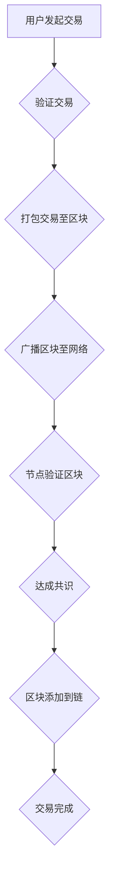

> 区块链，数据可信，加密算法，哈希函数，共识机制，智能合约，代码实战

## 1. 背景介绍

在当今数据爆炸的时代，数据安全、可信和透明性成为越来越重要的议题。传统的数据存储和管理方式存在着数据篡改、不可追溯和缺乏信任等问题。区块链技术作为一种去中心化、分布式、不可篡改的数据库技术，为解决这些问题提供了新的解决方案。

区块链的核心思想是将数据存储在多个节点上，并通过加密算法和哈希函数确保数据的完整性和安全性。每个区块包含一系列交易记录，并通过哈希函数与前一个区块链接，形成一个不可逆的链条。这种链式结构使得数据不可篡改，任何试图修改数据都会导致整个链条失效。

## 2. 核心概念与联系

**2.1 区块链架构**

区块链由以下核心组件组成：

* **区块 (Block):** 存储交易数据的基本单元，包含交易记录、时间戳、前一个区块的哈希值等信息。
* **链 (Chain):** 由多个区块链接形成的不可逆链条，保证数据的完整性和安全性。
* **节点 (Node):** 网络中的参与者，每个节点都拥有完整的区块链副本，并参与验证和维护区块链。
* **共识机制 (Consensus Mechanism):** 确保所有节点达成一致的算法，用于验证交易和生成新的区块。
* **加密算法 (Cryptography):** 用于保护数据安全和身份验证的算法，例如哈希函数、公钥加密等。

**2.2 数据可信原理**

区块链技术实现数据可信性的关键原理包括：

* **去中心化 (Decentralization):** 数据分散存储在多个节点上，任何单一节点都不能控制整个区块链，从而避免了单点故障和数据篡改的风险。
* **不可篡改性 (Immutability):** 每个区块的哈希值与前一个区块的哈希值链接，形成一个不可逆的链条，任何试图修改数据都会导致整个链条失效。
* **透明性 (Transparency):** 所有交易记录都公开透明地存储在区块链上，任何人都可以查看和验证交易信息。

**2.3  Mermaid 流程图**



## 3. 核心算法原理 & 具体操作步骤

**3.1 算法原理概述**

区块链的核心算法包括哈希函数、加密算法和共识机制。

* **哈希函数 (Hash Function):** 将任意长度的数据转换为固定长度的哈希值，具有不可逆性和抗碰撞性，用于确保数据的完整性和唯一性。
* **加密算法 (Cryptography):** 用于保护数据安全和身份验证的算法，例如公钥加密、数字签名等。
* **共识机制 (Consensus Mechanism):** 确保所有节点达成一致的算法，用于验证交易和生成新的区块。常见的共识机制包括工作量证明 (Proof of Work)、权益证明 (Proof of Stake) 等。

**3.2 算法步骤详解**

1. **用户发起交易:** 用户发起交易请求，包含交易信息和签名。
2. **验证交易:** 节点验证交易的合法性和有效性，例如检查交易金额、账户余额等。
3. **打包交易至区块:** 验证通过的交易被打包到一个新的区块中，并包含时间戳、前一个区块的哈希值等信息。
4. **广播区块至网络:** 节点将新的区块广播到整个网络。
5. **节点验证区块:** 节点接收区块后，验证区块的合法性和有效性，例如检查哈希值、交易信息等。
6. **达成共识:** 节点通过共识机制达成一致，确认新的区块是有效的。
7. **区块添加到链:** 确认后的区块被添加到区块链中，形成一个不可逆的链条。
8. **交易完成:** 交易被记录在区块链上，完成交易过程。

**3.3 算法优缺点**

* **优点:**
    * 数据安全性和不可篡改性强
    * 去中心化，避免单点故障
    * 透明性和可追溯性高
* **缺点:**
    * 性能有限，交易处理速度较慢
    * 存储空间较大，需要大量的存储资源
    * 开发和维护成本较高

**3.4 算法应用领域**

* **金融科技:** 数字货币、支付结算、供应链金融等
* **医疗健康:** 电子病历、药品溯源、医疗数据共享等
* **物联网:** 设备身份认证、数据安全、数据共享等
* **政府管理:** 身份认证、电子政务、数据监管等

## 4. 数学模型和公式 & 详细讲解 & 举例说明

**4.1 数学模型构建**

区块链的数学模型主要基于哈希函数、加密算法和概率论。

* **哈希函数模型:**  H(x) = y，其中 x 是输入数据，y 是哈希值。哈希函数具有单向性，即无法从哈希值反推原数据。
* **加密算法模型:**  E(m, k) = c，其中 m 是明文，k 是密钥，c 是密文。加密算法将明文转换为密文，只有拥有密钥才能解密密文。
* **共识机制模型:**  基于概率论和博弈论，共识机制通过激励机制和惩罚机制，引导节点达成一致。

**4.2 公式推导过程**

* **哈希函数的抗碰撞性:**  假设哈希函数 H(x) 是安全的，则两个不同的输入数据 x1 和 x2 对应的哈希值 H(x1) 和 H(x2) 应该不同。
* **加密算法的安全性:**  假设加密算法 E(m, k) 是安全的，则即使攻击者知道密文 c 和密钥 k，也无法推导出明文 m。
* **共识机制的有效性:**  共识机制应该能够保证所有节点达成一致，并防止恶意节点攻击区块链。

**4.3 案例分析与讲解**

* **比特币的哈希函数:**  比特币使用 SHA-256 哈希函数，将交易数据转换为 256 位的哈希值。
* **区块链的加密算法:**  区块链使用椭圆曲线密码学 (ECC) 进行加密，确保交易数据的安全性和身份验证。
* **工作量证明的共识机制:**  比特币使用工作量证明 (PoW) 共识机制，节点需要消耗大量的计算资源来解决复杂的数学问题，才能获得生成新区块的权利。

## 5. 项目实践：代码实例和详细解释说明

**5.1 开发环境搭建**

* **操作系统:**  Linux 或 macOS
* **编程语言:**  Python
* **开发工具:**  VS Code 或 Atom
* **区块链框架:**  Hyperledger Fabric 或 Ethereum

**5.2 源代码详细实现**

```python
# 创建一个区块
class Block:
    def __init__(self, timestamp, data, previous_hash):
        self.timestamp = timestamp
        self.data = data
        self.previous_hash = previous_hash
        self.hash = self.calculate_hash()

    def calculate_hash(self):
        # 使用 SHA-256 哈希函数计算区块哈希值
        return hashlib.sha256(str(self.timestamp).encode('utf-8') + 
                              str(self.data).encode('utf-8') + 
                              str(self.previous_hash).encode('utf-8')).hexdigest()

# 创建一个区块链
class Blockchain:
    def __init__(self):
        self.chain = [self.create_genesis_block()]

    def create_genesis_block(self):
        # 创建创世区块
        return Block("0", "Genesis Block", "0")

    def add_block(self, new_block):
        # 添加新区块到区块链
        new_block.previous_hash = self.chain[-1].hash
        new_block.hash = new_block.calculate_hash()
        self.chain.append(new_block)

# 示例代码
blockchain = Blockchain()
blockchain.add_block(Block("1", "Transaction 1", blockchain.chain[-1].hash))
blockchain.add_block(Block("2", "Transaction 2", blockchain.chain[-1].hash))

# 打印区块链信息
for block in blockchain.chain:
    print(f"Timestamp: {block.timestamp}")
    print(f"Data: {block.data}")
    print(f"Previous Hash: {block.previous_hash}")
    print(f"Hash: {block.hash}")
    print("-" * 20)
```

**5.3 代码解读与分析**

* **Block 类:**  定义了区块的结构和方法，包括时间戳、数据、前一个区块的哈希值和区块哈希值。
* **Blockchain 类:**  定义了区块链的结构和方法，包括创世区块、添加新区块和打印区块链信息。
* **示例代码:**  创建了一个简单的区块链实例，添加了两个交易，并打印了区块链信息。

**5.4 运行结果展示**

运行代码后，会输出每个区块的详细信息，包括时间戳、数据、前一个区块的哈希值和区块哈希值。

## 6. 实际应用场景

**6.1 数字货币**

区块链技术是数字货币的基础，例如比特币和以太坊。区块链确保了交易的安全性、透明性和不可篡改性，为数字货币提供了可靠的底层技术。

**6.2 供应链管理**

区块链可以用于追踪商品的来源、运输过程和最终目的地，提高供应链的透明度和效率。

**6.3 医疗健康**

区块链可以用于存储和共享患者的医疗记录，确保数据的安全性和隐私性。

**6.4 其他应用场景**

* **身份认证**
* **投票系统**
* **知识产权保护**
* **数据共享**

**6.5 未来应用展望**

区块链技术的发展潜力巨大，未来将应用于更多领域，例如：

* **去中心化金融 (DeFi)**
* **元宇宙**
* **Web3.0**

## 7. 工具和资源推荐

**7.1 学习资源推荐**

* **书籍:**
    * 《区块链：从原理到实践》
    * 《Mastering Bitcoin》
* **在线课程:**
    * Coursera: Blockchain Specialization
    * edX: Blockchain Fundamentals
* **博客和网站:**
    * Bitcoin.org
    * Ethereum.org
    * Blockchain.com

**7.2 开发工具推荐**

* **IDE:**  VS Code, Atom
* **区块链框架:**  Hyperledger Fabric, Ethereum
* **钱包:**  MetaMask, MyEtherWallet

**7.3 相关论文推荐**

* **比特币白皮书:**  https://bitcoin.org/bitcoin.pdf
* **以太坊白皮书:**  https://ethereum.org/en/whitepaper/

## 8. 总结：未来发展趋势与挑战

**8.1 研究成果总结**

区块链技术已经取得了显著的进展，在数字货币、供应链管理、医疗健康等领域取得了成功应用。

**8.2 未来发展趋势**

* **性能提升:**  提高区块链的交易处理速度和吞吐量。
* **隐私保护:**  开发更有效的隐私保护机制，保护用户数据安全。
* **可扩展性:**  解决区块链的规模化问题，使其能够处理更大的数据量。
* **应用场景拓展:**  将区块链技术应用于更多领域，例如人工智能、物联网等。

**8.3 面临的挑战**

* **监管政策:**  缺乏完善的监管政策，制约了区块链技术的应用发展。
* **技术标准:**  缺乏