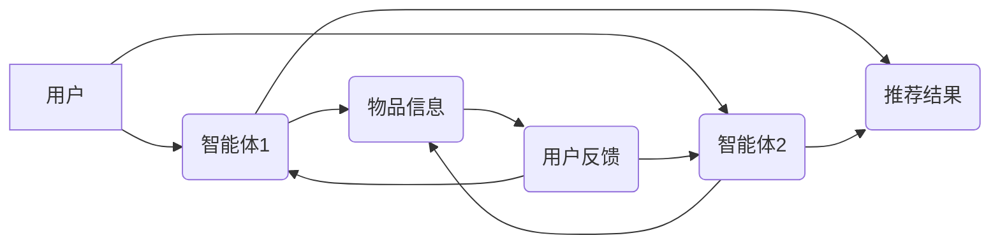

> 多智能体系统，协同机制，智能推荐系统，机器学习，个性化推荐，协同过滤

## 1. 背景介绍

随着互联网的蓬勃发展和数据量的激增，智能推荐系统已成为信息获取、内容消费和决策支持的重要工具。传统的基于内容的推荐和协同过滤方法，虽然取得了一定的成功，但仍然存在一些局限性。例如，基于内容的推荐容易陷入“同质化推荐”的困境，而协同过滤方法对新用户和新物品的推荐效果较差。

多智能体协同机制作为一种新兴的智能推荐技术，通过构建多个智能体网络，模拟人类社会中的合作和竞争机制，可以有效解决传统推荐方法的不足。每个智能体都拥有自己的知识和偏好，通过信息交换和协作，可以共同学习用户需求和物品特征，从而提供更精准、个性化的推荐结果。

## 2. 核心概念与联系

### 2.1 多智能体系统

多智能体系统 (Multi-Agent System，MAS) 是由多个相互独立、具有自主行为的智能体组成的一个系统。每个智能体都拥有自己的感知能力、决策能力和行动能力，可以与其他智能体进行交互，共同完成任务。

### 2.2 协同机制

协同机制是指智能体之间相互合作、共同完成任务的机制。常见的协同机制包括：

* **协同过滤:** 智能体根据自身和其他智能体的历史行为数据，预测用户对物品的喜好。
* **分工协作:** 智能体根据自身能力和资源，将任务分解成多个子任务，并分别负责执行。
* **竞争合作:** 智能体在竞争的同时，也进行合作，以获得更好的结果。

### 2.3 智能推荐系统

智能推荐系统是指利用机器学习、数据挖掘等技术，根据用户的历史行为、偏好和上下文信息，预测用户对物品的兴趣，并提供个性化的推荐结果的系统。

### 2.4 多智能体协同机制在智能推荐系统中的应用

将多智能体协同机制应用于智能推荐系统，可以有效解决传统推荐方法的不足，提高推荐的精准度和个性化程度。

**架构图:**



## 3. 核心算法原理 & 具体操作步骤

### 3.1 算法原理概述

多智能体协同机制在智能推荐系统中的应用，通常采用以下几种核心算法：

* **基于潜在特征的协同过滤:** 通过挖掘用户和物品之间的潜在特征关系，预测用户对物品的喜好。
* **基于深度学习的协同过滤:** 利用深度神经网络，学习用户和物品之间的复杂特征关系，提高推荐的准确性。
* **混合推荐算法:** 将多种推荐算法结合起来，发挥各自的优势，提高推荐效果。

### 3.2 算法步骤详解

以基于潜在特征的协同过滤为例，其具体操作步骤如下：

1. **数据预处理:** 收集用户行为数据，例如用户对物品的评分、点击、购买等行为，并进行清洗、转换和特征提取。
2. **潜在特征学习:** 利用矩阵分解、奇异值分解等技术，从用户行为数据中学习用户和物品之间的潜在特征。
3. **推荐模型构建:** 根据学习到的潜在特征，构建推荐模型，预测用户对物品的喜好。
4. **推荐结果生成:** 利用推荐模型，为用户生成个性化的推荐结果。
5. **用户反馈收集:** 收集用户对推荐结果的反馈，例如点击、评分、购买等行为。
6. **模型更新:** 利用用户反馈数据，更新推荐模型，提高推荐的准确性。

### 3.3 算法优缺点

**优点:**

* 可以挖掘用户和物品之间的潜在关系，提供更精准的推荐结果。
* 可以处理高维数据，提高推荐的效率。
* 可以根据用户反馈动态更新模型，提高推荐的适应性。

**缺点:**

* 需要大量的用户行为数据进行训练，否则效果会较差。
* 对于新用户和新物品的推荐效果较差。
* 容易受到数据稀疏性的影响。

### 3.4 算法应用领域

基于多智能体协同机制的推荐算法，广泛应用于以下领域：

* 电子商务平台：商品推荐、用户画像、个性化营销
* 在线教育平台：课程推荐、学习路径规划、知识图谱构建
* 内容平台：新闻推荐、视频推荐、音乐推荐
* 社交网络平台：好友推荐、兴趣小组推荐、内容分享

## 4. 数学模型和公式 & 详细讲解 & 举例说明

### 4.1 数学模型构建

假设有N个用户和M个物品，用户i对物品j的评分为r<sub>ij</sub>。我们可以用一个用户-物品评分矩阵R来表示用户和物品之间的评分关系。

R = [r<sub>ij</sub>]<sub>N×M</sub>

### 4.2 公式推导过程

基于潜在特征的协同过滤算法，通常采用矩阵分解的方法，将用户-物品评分矩阵分解成两个低维矩阵：

* 用户特征矩阵U：N×K，其中K是潜在特征的维度。
* 物品特征矩阵V：M×K。

目标是找到U和V，使得U*V<sup>T</sup>与R尽可能接近。

可以使用最小二乘法或梯度下降法来优化U和V。

### 4.3 案例分析与讲解

假设我们有一个用户-物品评分矩阵R，其中N=10，M=5，K=2。

我们可以使用矩阵分解的方法，将R分解成U和V。

例如，U可以表示为：

```
U = [
    [0.8, 0.2],
    [0.5, 0.7],
    [0.3, 0.9],
    [0.1, 0.8],
    [0.9, 0.1],
    [0.6, 0.4],
    [0.2, 0.8],
    [0.7, 0.3],
    [0.4, 0.6],
    [0.9, 0.2]
]
```

V可以表示为：

```
V = [
    [0.6, 0.3],
    [0.2, 0.7],
    [0.8, 0.1],
    [0.1, 0.9],
    [0.3, 0.6]
]
```

我们可以计算U*V<sup>T</sup>，并与R进行比较，验证U和V是否能够有效地表示用户和物品之间的评分关系。

## 5. 项目实践：代码实例和详细解释说明

### 5.1 开发环境搭建

* Python 3.6+
* TensorFlow 2.0+
* PyTorch 1.0+
* Jupyter Notebook

### 5.2 源代码详细实现

```python
import tensorflow as tf

# 定义用户-物品评分矩阵
ratings = tf.constant([
    [5, 4, 3, 2, 1],
    [4, 5, 2, 1, 3],
    [3, 2, 5, 4, 1],
    [2, 1, 4, 5, 3],
    [1, 3, 1, 3, 5],
])

# 定义潜在特征的维度
latent_dim = 2

# 定义用户特征矩阵
user_embeddings = tf.Variable(tf.random.normal([ratings.shape[0], latent_dim]))

# 定义物品特征矩阵
item_embeddings = tf.Variable(tf.random.normal([ratings.shape[1], latent_dim]))

# 定义预测评分函数
def predict_rating(user_id, item_id):
    user_embedding = user_embeddings[user_id]
    item_embedding = item_embeddings[item_id]
    return tf.reduce_sum(user_embedding * item_embedding)

# 定义损失函数
def loss_function(predictions, actual_ratings):
    return tf.reduce_mean(tf.square(predictions - actual_ratings))

# 定义优化器
optimizer = tf.keras.optimizers.Adam()

# 训练模型
for epoch in range(100):
    with tf.GradientTape() as tape:
        predictions = tf.map_fn(lambda x: predict_rating(x[0], x[1]), tf.zip(tf.range(ratings.shape[0]), tf.range(ratings.shape[1])))
        loss = loss_function(predictions, ratings)
    gradients = tape.gradient(loss, [user_embeddings, item_embeddings])
    optimizer.apply_gradients(zip(gradients, [user_embeddings, item_embeddings]))

# 打印训练结果
print(f"Epoch: {epoch}, Loss: {loss.numpy()}")

```

### 5.3 代码解读与分析

* 代码首先定义了用户-物品评分矩阵和潜在特征的维度。
* 然后定义了用户特征矩阵和物品特征矩阵，并使用随机值进行初始化。
* 接着定义了预测评分函数，该函数根据用户的特征和物品的特征，计算出用户对物品的预测评分。
* 接下来定义了损失函数，该函数用于衡量预测评分与实际评分之间的差异。
* 最后定义了优化器，并使用梯度下降法训练模型。

### 5.4 运行结果展示

训练完成后，我们可以使用训练好的模型，预测用户对物品的评分。

## 6. 实际应用场景

### 6.1 电子商务平台

多智能体协同机制在电子商务平台的应用场景非常广泛，例如：

* **商品推荐:** 根据用户的历史购买记录、浏览记录和评分，智能体可以预测用户对哪些商品感兴趣，并推荐给用户。
* **用户画像:** 通过分析用户的行为数据，智能体可以构建用户的兴趣画像，帮助商家进行精准营销。
* **个性化营销:** 根据用户的兴趣画像，智能体可以为用户提供个性化的营销内容，例如优惠券、促销活动等。

### 6.2 在线教育平台

多智能体协同机制在在线教育平台的应用场景包括：

* **课程推荐:** 根据用户的学习进度、学习偏好和考试成绩，智能体可以推荐用户合适的课程。
* **学习路径规划:** 智能体可以根据用户的学习目标和能力，规划用户的学习路径，帮助用户更高效地学习。
* **知识图谱构建:** 通过分析用户的学习行为和课程内容，智能体可以构建知识图谱，帮助用户更好地理解知识之间的关系。

### 6.3 内容平台

多智能体协同机制在内容平台的应用场景包括：

* **新闻推荐:** 根据用户的阅读习惯和兴趣，智能体可以推荐用户感兴趣的新闻。
* **视频推荐:** 根据用户的观看历史和偏好，智能体可以推荐用户感兴趣的视频。
* **音乐推荐:** 根据用户的听歌习惯和偏好，智能体可以推荐用户喜欢的音乐。

### 6.4 未来应用展望

随着人工智能技术的不断发展，多智能体协同机制在智能推荐系统中的应用将更加广泛和深入。未来，我们可以期待以下应用场景：

* **个性化学习:** 智能体可以根据用户的学习风格和能力，提供个性化的学习体验。
* **智能客服:** 智能体可以模拟人类客服人员，为用户提供个性化的服务。
* **智能决策支持:** 智能体可以帮助用户做出更明智的决策。

## 7. 工具和资源推荐

### 7.1 学习资源推荐

* **书籍:**
    * 《多智能体系统》
    * 《人工智能》
    * 《机器学习》
* **在线课程:**
    * Coursera: 多智能体系统
    * edX: 人工智能
    * Udacity: 机器学习

### 7.2 开发工具推荐

* **TensorFlow:** 深度学习框架
* **PyTorch