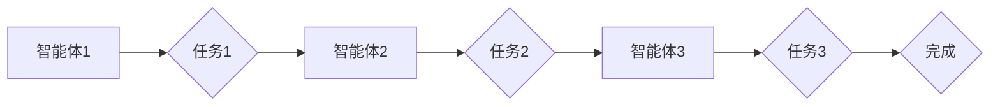

> 多智能体协同，Agentic Workflow，设计模式，人工智能，协同工作流程

## 1. 背景介绍

随着人工智能技术的快速发展，智能体（Agent）的概念逐渐被广泛应用于各个领域。智能体是一种能够感知环境、做出决策并执行行动的软件实体。在现代软件系统中，智能体协同已成为一种重要的设计模式，能够有效地解决复杂问题、提高系统效率和灵活性。

Agentic Workflow 是指由多个智能体协同完成任务的动态工作流程。这种工作流程具有以下特点：

* **自主性:** 每个智能体都具有自主决策和执行能力。
* **协同性:** 智能体之间能够相互通信、共享信息和协同完成任务。
* **动态性:** 工作流程可以根据环境变化和任务需求进行动态调整。

Agentic Workflow 在许多领域都有广泛的应用，例如：

* **业务流程自动化:** 智能体可以自动执行重复性任务，提高工作效率。
* **供应链管理:** 智能体可以协同完成物流配送、库存管理等任务，优化供应链效率。
* **机器人协作:** 多个机器人可以协同完成复杂的任务，例如组装、搬运等。

## 2. 核心概念与联系

### 2.1 智能体 (Agent)

智能体是 Agentic Workflow 的核心组成部分。它是一个具有感知、决策、行动和学习能力的软件实体。智能体通常具有以下特征：

* **感知能力:** 智能体能够感知环境信息，例如传感器数据、网络消息等。
* **决策能力:** 智能体能够根据感知到的信息做出决策，选择合适的行动。
* **行动能力:** 智能体能够执行决策，例如控制设备、发送消息等。
* **学习能力:** 智能体能够从经验中学习，不断改进决策和行动。

### 2.2 工作流程 (Workflow)

工作流程是指一系列有序的任务和步骤，用于完成一个特定的目标。Agentic Workflow 中的工作流程由多个智能体协同完成，每个智能体负责执行特定的任务或步骤。

### 2.3 协同机制 (Coordination Mechanism)

协同机制是智能体之间相互通信、共享信息和协同完成任务的关键。常见的协同机制包括：

* **消息传递:** 智能体通过发送和接收消息进行通信。
* **事件驱动:** 智能体通过订阅和发布事件进行通信。
* **状态共享:** 智能体共享状态信息，以便彼此了解当前情况。

### 2.4 设计模式 (Design Pattern)

设计模式是解决软件设计问题的一套可重用的解决方案。在 Agentic Workflow 中，可以使用多种设计模式来提高系统的可维护性、可扩展性和可靠性。

**Mermaid 流程图**



## 3. 核心算法原理 & 具体操作步骤

### 3.1 算法原理概述

多智能体协同设计模式的核心算法原理是基于智能体之间的协作和通信，通过设计合理的协同机制和任务分配策略，使智能体能够高效地完成复杂任务。

### 3.2 算法步骤详解

1. **智能体初始化:** 创建多个智能体，并为每个智能体分配特定的任务或职责。
2. **环境感知:** 智能体感知环境信息，例如任务目标、资源状态、其他智能体的行为等。
3. **决策制定:** 智能体根据感知到的信息和自身的知识库，做出决策，选择合适的行动。
4. **行动执行:** 智能体执行决策，例如发送消息、控制设备、更新状态等。
5. **状态更新:** 智能体更新自身的内部状态，并向其他智能体发送状态信息。
6. **协同完成:** 智能体通过协作和通信，最终完成预定的任务目标。

### 3.3 算法优缺点

**优点:**

* **灵活性:** 智能体具有自主决策能力，能够根据环境变化灵活调整行为。
* **可扩展性:** 可以轻松添加新的智能体，扩展系统的功能和能力。
* **可靠性:** 多个智能体协同工作，可以提高系统的可靠性，即使部分智能体出现故障，也能保证整体任务的完成。

**缺点:**

* **复杂性:** 设计和实现多智能体协同系统比较复杂，需要考虑智能体之间的通信、协调和冲突解决等问题。
* **安全性:** 智能体之间需要进行安全通信，防止恶意攻击和数据泄露。
* **可解释性:** 多智能体协同系统的决策过程可能比较复杂，难以解释和理解。

### 3.4 算法应用领域

多智能体协同设计模式在以下领域有广泛的应用：

* **机器人协作:** 多个机器人可以协同完成复杂的任务，例如组装、搬运等。
* **无人驾驶:** 多个传感器和智能体可以协同完成车辆的感知、决策和控制。
* **智能家居:** 多个智能设备可以协同完成家居环境的自动化控制。
* **金融交易:** 多个智能体可以协同完成金融交易的自动化执行和风险管理。

## 4. 数学模型和公式 & 详细讲解 & 举例说明

### 4.1 数学模型构建

在 Agentic Workflow 中，可以使用数学模型来描述智能体之间的交互和协同行为。例如，可以使用图论模型来表示智能体之间的关系，可以使用博弈论模型来分析智能体之间的竞争和合作。

### 4.2 公式推导过程

**博弈论模型:**

假设有两个智能体，A 和 B，他们需要协同完成一个任务。每个智能体都有两种策略可以选择：合作或背叛。

* 如果 A 和 B 都选择合作，则他们可以获得共同收益。
* 如果 A 选择合作，B 选择背叛，则 A 会损失收益，B 会获得收益。
* 如果 A 选择背叛，B 选择合作，则 B 会损失收益，A 会获得收益。
* 如果 A 和 B 都选择背叛，则他们都不会获得收益。

我们可以用一个 payoff matrix 来表示这个博弈模型：

|           | B 合作 | B 背叛 |
|-----------|---------|---------|
| A 合作   | (3, 3)   | (0, 5)   |
| A 背叛  | (5, 0)   | (1, 1)   |

其中，(3, 3) 表示 A 和 B 都选择合作时，A 和 B 的收益分别为 3 和 3。

通过分析这个 payoff matrix，我们可以发现，如果 A 和 B 都理性地选择，他们最终会选择背叛对方。

### 4.3 案例分析与讲解

在现实世界中，多智能体协同设计模式被广泛应用于各种场景。例如，在无人驾驶汽车中，多个传感器和智能体协同完成车辆的感知、决策和控制。

* **感知层:** 摄像头、雷达、激光雷达等传感器收集车辆周围的环境信息。
* **决策层:** 智能体分析传感器数据，做出驾驶决策，例如转向、加速、刹车等。
* **控制层:** 智能体控制车辆的各个部件，例如发动机、转向系统、制动系统等。

通过多智能体协同工作，无人驾驶汽车能够实现更安全、更可靠的驾驶体验。

## 5. 项目实践：代码实例和详细解释说明

### 5.1 开发环境搭建

* **操作系统:** Ubuntu 20.04 LTS
* **编程语言:** Python 3.8
* **框架:** ROS (Robot Operating System)

### 5.2 源代码详细实现

```python
# 智能体1代码
import rospy
from std_msgs.msg import String

class Agent1:
    def __init__(self):
        rospy.init_node('agent1')
        self.pub = rospy.Publisher('task1_result', String, queue_size=10)

    def process_task(self, task_data):
        # 处理任务1
        result = 'Task1 completed: ' + task_data
        self.pub.publish(result)

# 智能体2代码
import rospy
from std_msgs.msg import String

class Agent2:
    def __init__(self):
        rospy.init_node('agent2')
        self.sub = rospy.Subscriber('task1_result', String, self.callback)

    def callback(self, data):
        # 处理任务2
        print('Received task1 result:', data.data)
        # 执行任务2

# 智能体3代码
import rospy
from std_msgs.msg import String

class Agent3:
    def __init__(self):
        rospy.init_node('agent3')
        self.sub = rospy.Subscriber('task2_result', String, self.callback)

    def callback(self, data):
        # 处理任务3
        print('Received task2 result:', data.data)
        # 执行任务3

if __name__ == '__main__':
    agent1 = Agent1()
    agent2 = Agent2()
    agent3 = Agent3()
    rospy.spin()
```

### 5.3 代码解读与分析

* **智能体类:** 每个智能体都定义为一个类，包含感知、决策和行动的功能。
* **ROS节点:** 使用 ROS 库创建节点，用于通信和数据共享。
* **消息发布和订阅:** 使用 ROS 的消息机制，智能体之间进行通信。
* **任务处理:** 每个智能体负责处理特定的任务，并根据任务结果做出相应的决策。

### 5.4 运行结果展示

运行上述代码，可以观察到三个智能体之间协同完成任务的过程。例如，智能体1处理任务1，并将结果发布到话题`task1_result`，智能体2订阅该话题，接收任务1的结果，并执行任务2，并将结果发布到话题`task2_result`，智能体3订阅该话题，接收任务2的结果，并执行任务3。

## 6. 实际应用场景

### 6.1 智能制造

在智能制造领域，多智能体协同设计模式可以用于实现柔性生产、协同协作和智能化管理。例如，多个机器人可以协同完成产品组装、搬运和检测等任务，提高生产效率和产品质量。

### 6.2 智能物流

在智能物流领域，多智能体协同设计模式可以用于优化物流配送、仓储管理和运输调度。例如，多个无人驾驶车辆可以协同完成货物运输，多个智能仓库机器人可以协同完成货物搬运和分拣，提高物流效率和降低成本。

### 6.3 智能医疗

在智能医疗领域，多智能体协同设计模式可以用于辅助医生诊断、治疗和护理。例如，多个智能体可以协同分析患者的病历、影像数据和生理指标，辅助医生做出更准确的诊断；多个机器人可以协同完成患者的护理工作，例如输液、喂食和康复训练，减轻医护人员的工作负担。

### 6.4 未来应用展望

随着人工智能技术的不断发展，多智能体协同设计模式将在更多领域得到应用，例如：

* **智能城市:** 多个智能体可以协同完成城市管理、交通调度和环境监测等任务，打造更加智能化、高效的城市。
* **智能农业:** 多个智能体可以协同完成农作物种植、管理和收获等任务，提高农业生产效率和降低环境污染。
* **智能教育:** 多个智能体可以协同完成个性化教学、智能辅导和学习评估等任务，打造更加智能化、高效的教育体系。

## 7. 工具和资源推荐

### 7.1 学习资源推荐

* **书籍:**
    * 《多智能体系统》
    * 《人工智能：现代方法》
    * 《软件设计模式》
* **在线课程:**
    * Coursera: Multi-Agent Systems
    * edX: Artificial Intelligence
    * Udacity: Artificial Intelligence Nanodegree

### 7.2 开发工具推荐

* **ROS