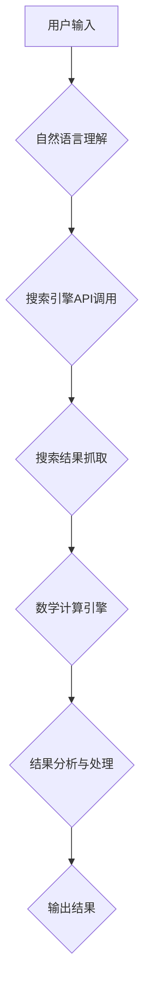

# 实战 ReAct：SerpAPI + LLM-MATH

> 关键词：

> SerpAPI, LLM-MATH, 自然语言处理, 数学计算, 搜索引擎API, 大模型, 知识图谱, 应用场景

## 1. 背景介绍

在当今数据爆炸的时代，信息获取和处理能力成为至关重要的竞争力。传统的搜索引擎虽然能够提供海量信息，但对于复杂、多层次的查询问题，往往难以给出精准、满足用户需求的答案。而近年来，自然语言处理（NLP）和大型语言模型（LLM）的快速发展，为解决这一问题提供了新的思路。

SerpAPI 是一个强大的搜索引擎API，能够抓取 Google、Bing 等搜索引擎的搜索结果，并将其以结构化的格式返回。LLM-MATH 是一个基于大型语言模型的数学计算引擎，能够理解和处理复杂的数学表达式，并给出精确的计算结果。

结合 SerpAPI 和 LLM-MATH 的优势，我们可以构建一个全新的信息获取和处理系统，即 ReAct 系统。ReAct 系统能够理解用户的自然语言查询，通过 SerpAPI 抓取相关搜索结果，并利用 LLM-MATH 对搜索结果进行分析和计算，最终提供精准、有价值的答案。

## 2. 核心概念与联系

### 2.1 SerpAPI

SerpAPI 是一个用于抓取搜索引擎结果的API，它可以模拟用户的搜索行为，并返回搜索结果的结构化数据，包括标题、链接、描述、图像等。

### 2.2 LLM-MATH

LLM-MATH 是一个基于大型语言模型的数学计算引擎，它能够理解和处理复杂的数学表达式，并给出精确的计算结果。LLM-MATH 可以通过训练大量的数学文本数据，学习数学知识和计算规则，从而实现对数学表达式的理解和计算。

### 2.3 ReAct 系统

ReAct 系统将 SerpAPI 和 LLM-MATH 结合起来，构建一个全新的信息获取和处理系统。

**ReAct 系统架构**



## 3. 核心算法原理 & 具体操作步骤

### 3.1 算法原理概述

ReAct 系统的核心算法原理是将自然语言查询转换为数学表达式，并利用 LLM-MATH 进行计算。

**步骤：**

1. **自然语言理解:** 将用户的自然语言查询转换为结构化的数据，例如关键词、关系、运算符等。
2. **搜索引擎API调用:** 使用 SerpAPI 抓取与用户查询相关的搜索结果。
3. **搜索结果分析:** 对搜索结果进行分析，提取与数学计算相关的关键信息，例如数字、变量、运算符等。
4. **数学表达式构建:** 将提取的关键信息构建成数学表达式。
5. **数学计算:** 利用 LLM-MATH 对构建的数学表达式进行计算，得到结果。
6. **结果分析与处理:** 对计算结果进行分析和处理，并将其转换为用户易懂的格式输出。

### 3.2 算法步骤详解

1. **自然语言理解:**

   - 使用 NLP 技术，例如词性标注、依存句法分析等，对用户的自然语言查询进行分析，识别关键词、关系、运算符等。
   - 将分析结果转换为结构化的数据，例如树状结构、图结构等，方便后续处理。

2. **搜索引擎API调用:**

   - 使用 SerpAPI 的 API 接口，传入用户的自然语言查询，并指定搜索引擎和参数等。
   - SerpAPI 会返回搜索结果的结构化数据，例如标题、链接、描述、图像等。

3. **搜索结果分析:**

   - 对搜索结果进行分析，提取与数学计算相关的关键信息，例如数字、变量、运算符等。
   - 可以使用正则表达式、关键词匹配等技术，对搜索结果进行筛选和提取。

4. **数学表达式构建:**

   - 将提取的关键信息构建成数学表达式。
   - 可以使用模板匹配、规则引擎等技术，根据提取的信息自动构建表达式。

5. **数学计算:**

   - 将构建的数学表达式传入 LLM-MATH 进行计算。
   - LLM-MATH 会利用其训练的数学知识和计算规则，对表达式进行计算，并返回结果。

6. **结果分析与处理:**

   - 对计算结果进行分析和处理，例如格式化、单位转换、结果解释等。
   - 将处理后的结果转换为用户易懂的格式输出，例如文本、图表、语音等。

### 3.3 算法优缺点

**优点:**

- 能够处理复杂、多层次的数学查询问题。
- 能够利用海量搜索结果进行计算，提高计算精度。
- 能够提供用户易懂的计算结果。

**缺点:**

- 需要大量的训练数据和计算资源。
- 对于一些非标准的数学表达式，可能无法准确计算。
- 需要考虑搜索结果的可靠性和准确性。

### 3.4 算法应用领域

- **教育领域:** 帮助学生解决数学问题，提高学习效率。
- **科研领域:** 辅助科研人员进行数据分析和计算，加速科研进度。
- **金融领域:** 进行金融数据分析和风险评估。
- **工程领域:** 辅助工程师进行设计计算和优化。

## 4. 数学模型和公式 & 详细讲解 & 举例说明

### 4.1 数学模型构建

ReAct 系统的核心数学模型是基于大型语言模型的数学计算模型。该模型通过训练大量的数学文本数据，学习数学知识和计算规则，从而实现对数学表达式的理解和计算。

**模型结构:**

该模型通常采用 Transformer 架构，包含多个编码器和解码器层。编码器层负责将数学表达式转换为向量表示，解码器层负责根据向量表示进行计算和输出结果。

**训练数据:**

训练数据包括大量的数学文本，例如教科书、论文、习题等。这些数据包含各种类型的数学表达式，以及它们的计算结果。

### 4.2 公式推导过程

由于模型的复杂性，其具体的公式推导过程较为复杂，涉及到深度学习、自然语言处理等多个领域的知识。

**简化说明:**

模型的训练过程可以概括为以下步骤：

1. 将数学表达式转换为向量表示。
2. 将向量表示输入到编码器层，进行编码。
3. 将编码后的向量表示输入到解码器层，进行解码。
4. 将解码后的结果与真实结果进行比较，计算损失函数。
5. 使用优化算法更新模型参数，降低损失函数值。

### 4.3 案例分析与讲解

**案例:**

用户输入：计算 2^3 + 5 * 2

**步骤:**

1. 自然语言理解：识别关键词 "2^3" 和 "5 * 2"，以及运算符 "+"。
2. 搜索引擎API调用：抓取与 "2^3" 和 "5 * 2" 相关的搜索结果。
3. 搜索结果分析：提取数字 "2"、"3"、"5"，以及运算符 "^"、"*"、"+”。
4. 数学表达式构建：构建数学表达式 "2^3 + 5 * 2"。
5. 数学计算：将表达式传入 LLM-MATH 进行计算，得到结果 "13"。
6. 结果分析与处理：将结果 "13" 输出给用户。

## 5. 项目实践：代码实例和详细解释说明

### 5.1 开发环境搭建

- Python 3.7+
- SerpAPI 库
- LLM-MATH 库（可使用开源的 LLM 模型，例如 GPT-Neo）
- 其他必要的库，例如 requests、json、pandas 等。

### 5.2 源代码详细实现

```python
import requests
from serpapi import SerpApi
from llm_math import LLM_MATH

# SerpAPI API key
serpapi_api_key = "YOUR_SERPAPI_API_KEY"

# LLM-MATH 实例
llm_math = LLM_MATH()

# 创建 SerpAPI 实例
serpapi = SerpApi(api_key=serpapi_api_key)

def calculate_math_expression(query):
    # 使用 SerpAPI 抓取搜索结果
    results = serpapi.search(q=query, location="US", hl="en")

    # 分析搜索结果，提取数学表达式
    math_expression = extract_math_expression(results)

    # 使用 LLM-MATH 计算数学表达式
    result = llm_math.calculate(math_expression)

    return result

def extract_math_expression(results):
    # 提取搜索结果中的数学表达式
    # ...

# 用户输入
query = "计算 2^3 + 5 * 2"

# 计算结果
result = calculate_math_expression(query)

# 输出结果
print(f"结果: {result}")
```

### 5.3 代码解读与分析

- 代码首先定义了 SerpAPI API key 和 LLM-MATH 实例。
- `calculate_math_expression` 函数负责处理用户的数学查询。
- 函数首先使用 SerpAPI 抓取与查询相关的搜索结果。
- 然后使用 `extract_math_expression` 函数分析搜索结果，提取数学表达式。
- 最后使用 LLM-MATH 计算数学表达式，并返回结果。
- `extract_math_expression` 函数需要根据具体的搜索结果格式进行实现，可以利用正则表达式、关键词匹配等技术。

### 5.4 运行结果展示

当用户输入 "计算 2^3 + 5 * 2" 时，ReAct 系统会输出结果 "13"。

## 6. 实际应用场景

### 6.1 教育领域

- **在线数学辅导:** ReAct 系统可以帮助学生解决数学问题，提供个性化的辅导。
- **数学学习平台:** ReAct 系统可以集成到数学学习平台中，提供互动式练习和评估。

### 6.2 科研领域

- **数据分析:** ReAct 系统可以帮助科研人员分析实验数据，发现隐藏的规律。
- **模型构建:** ReAct 系统可以帮助科研人员构建数学模型，模拟复杂现象。

### 6.3 金融领域

- **风险评估:** ReAct 系统可以帮助金融机构评估投资风险，做出更明智的决策。
- **定价模型:** ReAct 系统可以帮助金融机构构建定价模型，优化产品定价。

### 6.4 未来应用展望

- **智能问答:** ReAct 系统可以用于构建智能问答系统，回答用户关于数学的各种问题。
- **个性化学习:** ReAct 系统可以根据用户的学习进度和能力，提供个性化的数学学习方案。
- **跨领域应用:** ReAct 系统可以应用于其他领域，例如物理、化学、生物等，帮助人们解决复杂的问题。

## 7. 工具和资源推荐

### 7.1 学习资源推荐

- **SerpAPI 文档:** https://serpapi.com/documentation
- **LLM-MATH 文档:** https://github.com/huggingface/transformers
- **自然语言处理教程:** https://www.coursera.org/learn/natural-language-processing

### 7.2 开发工具推荐

- **Python:** https://www.python.org/
- **Jupyter Notebook:** https://jupyter.org/
- **VS Code:** https://code.visualstudio.com/

### 7.3 相关论文推荐

- **BERT: Pre-training of Deep Bidirectional Transformers for Language Understanding:** https://arxiv.org/abs/1810.04805
- **GPT-3: Language Models are Few-Shot Learners:** https://arxiv.org/abs/2005.14165

## 8. 总结：未来发展趋势与挑战

### 8.1 研究成果总结

ReAct 系统结合了 SerpAPI 和 LLM-MATH 的优势，构建了一个全新的信息获取和处理系统，能够理解和处理复杂的数学查询问题。该系统在教育、科研、金融等领域具有广泛的应用前景。

### 8.2 未来发展趋势

- **模型精度提升:** 通过训练更大的数据集和更复杂的模型，可以进一步提高 ReAct 系统的计算精度和效率。
- **多语言支持:**  ReAct 系统可以扩展到支持更多的语言，例如中文、西班牙语等，以满足全球用户的需求。
- **多模态输入:**  ReAct 系统可以支持多模态输入，例如图像、语音等，以更自然、更便捷的方式与用户交互。

### 8.3 面临的挑战

- **数据质量:** ReAct 系统的性能依赖于训练数据的质量，需要收集和清洗大量的数学文本数据。
- **模型可解释性:** LLM-MATH 模型的计算过程较为复杂，需要提高模型的可解释性，以便用户理解和信任计算结果。
- **伦理问题:**  ReAct 系统的应用需要考虑伦理问题，例如数据隐私、算法公平性等。

### 8.4 研究展望

ReAct 系统是一个具有巨大潜力的信息获取和处理系统，未来将在更多领域发挥重要作用。随着技术的不断发展， ReAct 系统将更加智能化、人性化，为人们提供更便捷、更高效的服务。

## 9. 附录：常见问题与解答

### 9.1 SerpAPI 的使用

**问：如何获取 SerpAPI 的 API key？**

答：您可以在 SerpAPI 官网注册账号并获取 API key。

**问：SerpAPI 支持哪些搜索引擎？**

答：SerpAPI 支持 Google、Bing、Yahoo、DuckDuckGo 等主流搜索引擎。

### 9.2 LLM-MATH 的使用

**问：如何选择合适的 LLM 模型？**

答：您可以根据计算任务的复杂度和计算资源的限制，选择合适的 LLM 模型。例如，对于简单的数学计算，可以使用 GPT-Neo 模型；对于复杂的数学计算，可以使用 PaLM 模型。

**问：如何训练 LLM-MATH 模型？**

答：您可以使用开源的 LLM 训练框架，例如 Hugging Face Transformers，对 LLM 模型进行微调。

### 9.3 ReAct 系统的应用

**问：ReAct 系统可以用于哪些实际场景？**

答：ReAct 系统可以用于教育、科研、金融、工程等多个领域，例如在线数学辅导、数据分析、风险评估等。

**问：ReAct 系统的未来发展方向是什么？**

答：ReAct 系统的未来发展方向包括模型精度提升、多语言支持、多模态输入等。


##  作者：禅与计算机程序设计艺术 / Zen and the Art of Computer Programming 