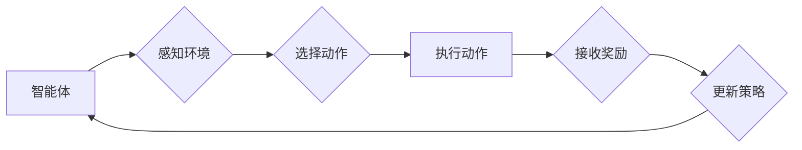

> 强化学习，游戏AI，深度强化学习，Q学习，策略梯度，游戏开发，人工智能

## 1. 背景介绍

游戏作为一种娱乐形式，也成为了人工智能研究的理想平台。传统的基于规则的游戏AI通常难以应对复杂的游戏环境和玩家策略的变化。而强化学习（Reinforcement Learning，RL）作为一种机器学习方法，能够通过与环境交互学习最优策略，从而为游戏AI带来更智能、更具挑战性的体验。

强化学习的核心思想是通过奖励机制引导智能体学习。智能体在与环境交互的过程中，会根据自己的行为获得奖励或惩罚。通过不断地尝试不同的行为，智能体可以学习到哪些行为能够带来更高的奖励，从而最终找到最优策略。

## 2. 核心概念与联系

**2.1 强化学习核心概念**

* **智能体 (Agent):**  与环境交互并做出决策的实体。
* **环境 (Environment):** 智能体所处的外部世界，会根据智能体的行为做出相应的反应。
* **状态 (State):** 环境在某个时刻的描述。
* **动作 (Action):** 智能体可以采取的行动。
* **奖励 (Reward):** 环境对智能体行为的反馈，可以是正向奖励或负向惩罚。
* **策略 (Policy):** 智能体在不同状态下选择动作的规则。

**2.2 强化学习流程图**



**2.3 强化学习与游戏AI的联系**

在游戏AI中，智能体通常扮演游戏角色，环境则是游戏世界，状态是游戏中的当前情况，动作是角色可以执行的操作，奖励是完成任务或获得胜利的反馈。通过强化学习，游戏AI可以学习到最优的游戏策略，从而实现更智能、更具挑战性的游戏体验。

## 3. 核心算法原理 & 具体操作步骤

**3.1 算法原理概述**

强化学习算法的核心是通过不断地与环境交互，学习最优策略。常见的强化学习算法包括Q学习、策略梯度等。

* **Q学习:**  Q学习是一种基于价值函数的强化学习算法，它通过学习状态-动作对的价值函数，来指导智能体选择最优动作。
* **策略梯度:** 策略梯度是一种基于策略的强化学习算法，它直接优化策略参数，从而学习到最优策略。

**3.2 算法步骤详解**

**3.2.1 Q学习算法步骤**

1. 初始化 Q 函数，将所有状态-动作对的价值函数设置为 0。
2. 在环境中进行交互，观察状态、采取动作、接收奖励。
3. 更新 Q 函数：
    * $Q(s, a) = Q(s, a) + \alpha [r + \gamma \max_{a'} Q(s', a') - Q(s, a)]$
    * 其中：
        * $s$ 是当前状态
        * $a$ 是当前动作
        * $r$ 是接收到的奖励
        * $\gamma$ 是折扣因子，控制未来奖励的权重
        * $a'$ 是下一个状态下最优动作
        * $\alpha$ 是学习率，控制学习速度
4. 重复步骤 2 和 3，直到 Q 函数收敛。

**3.2.2 策略梯度算法步骤**

1. 初始化策略参数。
2. 在环境中进行交互，观察状态、采取动作、接收奖励。
3. 计算策略梯度：
    * $\nabla \theta J(\theta)$
    * 其中：
        * $\theta$ 是策略参数
        * $J(\theta)$ 是策略的效用函数
4. 更新策略参数：
    * $\theta = \theta + \eta \nabla \theta J(\theta)$
    * 其中：
        * $\eta$ 是学习率
5. 重复步骤 2 和 3，直到策略收敛。

**3.3 算法优缺点**

**3.3.1 Q学习**

* **优点:** 
    * 算法简单易懂，易于实现。
    * 可以解决离散状态和动作空间的问题。
* **缺点:** 
    * 容易陷入局部最优解。
    * 对于连续状态和动作空间的问题，效率较低。

**3.3.2 策略梯度**

* **优点:** 
    * 可以解决连续状态和动作空间的问题。
    * 容易收敛到全局最优解。
* **缺点:** 
    * 算法复杂度较高，实现难度较大。
    * 容易受到噪声的影响。

**3.4 算法应用领域**

强化学习算法广泛应用于游戏AI、机器人控制、推荐系统、自动驾驶等领域。

## 4. 数学模型和公式 & 详细讲解 & 举例说明

**4.1 数学模型构建**

强化学习的数学模型通常由以下几个部分组成：

* **状态空间 (S):** 所有可能的系统状态的集合。
* **动作空间 (A):** 智能体可以采取的所有动作的集合。
* **奖励函数 (R):** 描述智能体在特定状态采取特定动作后获得的奖励。
* **策略 (π):** 描述智能体在特定状态下选择动作的概率分布。

**4.2 公式推导过程**

**4.2.1 Q学习公式推导**

Q学习的目标是学习一个状态-动作对的价值函数 Q(s, a)，该函数表示在状态 s 下采取动作 a 后获得的期望累积奖励。

Q学习公式的推导过程如下：

1. 假设智能体在状态 s 下采取动作 a，获得奖励 r，并进入状态 s'。
2. Q学习的目标是最大化期望累积奖励：
    * $max_{\pi} E_{\pi} [ \sum_{t=0}^{\infty} \gamma^t r_t ]$
3. 其中：
    * $\pi$ 是策略
    * $r_t$ 是在时间步 t 获得的奖励
    * $\gamma$ 是折扣因子，控制未来奖励的权重
4. 使用 Bellman 方程，可以将期望累积奖励表示为：
    * $Q(s, a) = E[r + \gamma \max_{a'} Q(s', a')] $
5. 通过迭代更新 Q 函数，可以逐渐逼近最优 Q 函数。

**4.2.2 策略梯度公式推导**

策略梯度算法的目标是直接优化策略参数，从而学习到最优策略。

策略梯度公式的推导过程如下：

1. 假设策略参数为 $\theta$，策略为 $\pi_{\theta}$。
2. 策略的效用函数为 $J(\theta)$，表示策略的期望累积奖励。
3. 策略梯度为：
    * $\nabla \theta J(\theta) = E_{\pi_{\theta}} [ \nabla_{\theta} \log \pi_{\theta}(a|s) \cdot R(s, a) ]$
4. 其中：
    * $R(s, a)$ 是在状态 s 下采取动作 a 后获得的奖励
    * $\log \pi_{\theta}(a|s)$ 是策略参数 $\theta$ 下在状态 s 下采取动作 a 的对数概率

**4.3 案例分析与讲解**

**4.3.1 Q学习案例分析**

例如，在玩贪吃蛇的游戏中，智能体可以采取向上、向下、向左、向右四个动作。每个状态可以由蛇的当前位置和食物的位置描述。

Q学习算法可以学习到每个状态下采取每个动作的价值函数，从而指导智能体选择最优动作，例如，在蛇靠近食物的状态下，采取移动到食物位置的动作的价值函数会更高。

**4.3.2 策略梯度案例分析**

例如，在玩围棋的游戏中，智能体可以采取落子动作。每个状态可以由棋盘上的棋子分布描述。

策略梯度算法可以学习到每个状态下落子位置的概率分布，从而指导智能体选择最优落子位置，例如，在棋盘上占据优势位置的状态下，落子在该位置的概率会更高。

## 5. 项目实践：代码实例和详细解释说明

**5.1 开发环境搭建**

* Python 3.x
* TensorFlow 或 PyTorch 深度学习框架
* OpenAI Gym 游戏环境

**5.2 源代码详细实现**

```python
import gym
import numpy as np
from tensorflow.keras.models import Sequential
from tensorflow.keras.layers import Dense

# 创建游戏环境
env = gym.make('CartPole-v1')

# 定义神经网络模型
model = Sequential()
model.add(Dense(128, activation='relu', input_shape=(env.observation_space.shape[0],)))
model.add(Dense(64, activation='relu'))
model.add(Dense(env.action_space.n))

# 定义损失函数和优化器
model.compile(loss='mse', optimizer='adam')

# 训练循环
for episode in range(1000):
    state = env.reset()
    done = False
    total_reward = 0

    while not done:
        # 选择动作
        action = np.argmax(model.predict(state.reshape(1, -1)))

        # 执行动作
        next_state, reward, done, _ = env.step(action)

        # 更新状态
        state = next_state

        # 更新奖励
        total_reward += reward

    # 打印奖励
    print(f'Episode {episode+1}: Reward = {total_reward}')

# 保存模型
model.save('cartpole_model.h5')
```

**5.3 代码解读与分析**

* 代码首先创建游戏环境，并定义一个神经网络模型。
* 神经网络模型的输入层维度为环境的观测空间维度，输出层维度为动作空间维度。
* 训练循环中，智能体在环境中进行交互，并根据神经网络模型的预测选择动作。
* 每次执行动作后，智能体会获得奖励和下一个状态。
* 智能体使用梯度下降算法更新神经网络模型的参数，从而提高选择动作的准确性。

**5.4 运行结果展示**

运行代码后，智能体将在 CartPole 游戏中学习平衡杆的行为。随着训练的进行，智能体能够保持杆子平衡的时间会越来越长。

## 6. 实际应用场景

**6.1 游戏AI**

强化学习在游戏AI领域有着广泛的应用，例如：

* **游戏角色控制:**  让游戏角色能够做出更智能、更具挑战性的行为。
* **游戏策略优化:**  帮助玩家学习更有效的游戏策略。
* **游戏难度调节:**  根据玩家的水平自动调节游戏难度。

**6.2 机器人控制**

强化学习可以用于训练机器人控制算法，例如：

* **机器人导航:**  让机器人能够在复杂环境中自主导航。
* **机器人抓取:**  训练机器人学会抓取和移动物体。
* **机器人协作:**  训练多个机器人协同完成任务。

**6.3 推荐系统**

强化学习可以用于优化推荐系统的算法，例如：

* **个性化推荐:**  根据用户的历史行为推荐更符合用户偏好的内容。
* **推荐多样性:**  推荐不同类型的物品，避免推荐单一内容。
* **推荐时效性:**  推荐最新的和最相关的物品。

**6.4 自动驾驶**

强化学习可以用于训练自动驾驶算法，例如：

* **路径规划:**  让自动驾驶汽车能够规划最优的路径。
* **避障:**  训练自动驾驶汽车避开障碍物。
* **交通规则遵循:**  训练自动驾驶汽车遵守交通规则。

**6.5 其他应用场景**

强化学习还可以应用于其他领域