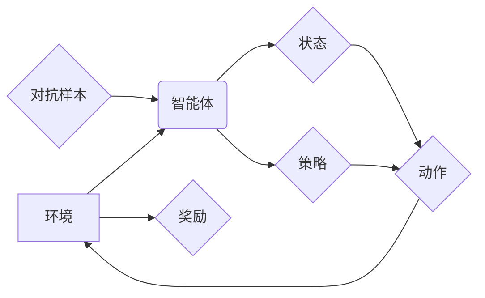

> 强化学习，对抗性训练，环境适应性，深度学习，神经网络，强化学习算法

## 1. 背景介绍

在人工智能领域，强化学习（Reinforcement Learning，RL）作为一种模仿人类学习的机器学习方法，近年来取得了显著进展。它通过在与环境交互的过程中学习策略，以最大化累积奖励，从而解决复杂决策问题。然而，传统的RL算法在面对复杂、动态变化的环境时，往往表现出鲁棒性差、适应性弱等问题。

对抗性训练（Adversarial Training）作为一种提高模型鲁棒性的技术，通过在训练过程中加入对抗样本，迫使模型学习更稳健的特征表示。将对抗性训练与强化学习相结合，可以有效提升RL算法的鲁棒性和环境适应性。

## 2. 核心概念与联系

**2.1 强化学习核心概念**

* **Agent（智能体）：** 与环境交互并采取行动的实体。
* **Environment（环境）：** 智能体所处的外部世界，会根据智能体的行动产生状态变化和奖励信号。
* **State（状态）：** 环境在特定时刻的描述。
* **Action（动作）：** 智能体在特定状态下可以采取的行动。
* **Reward（奖励）：** 环境对智能体动作的反馈，可以是正向或负向。
* **Policy（策略）：** 智能体在不同状态下选择动作的规则。
* **Value Function（价值函数）：**  评估状态或状态-动作对的长期价值。

**2.2 对抗性训练核心概念**

* **对抗样本：** 通过对原始数据进行微小扰动，生成能够欺骗模型的恶意样本。
* **攻击者：** 生成对抗样本的实体。
* **防御者：** 训练模型以抵抗对抗样本攻击的实体。

**2.3 强化学习与对抗性训练的联系**

将对抗性训练与强化学习相结合，可以提升RL算法的鲁棒性和环境适应性。

* **增强环境适应性：** 通过对抗性训练，RL算法可以学习到更稳健的策略，能够更好地应对环境中的变化和不确定性。
* **提高模型鲁棒性：** 对抗性训练可以帮助RL算法抵抗对抗样本攻击，使其在面对恶意攻击时也能保持正常工作。

**2.4  核心概念架构图**



## 3. 核心算法原理 & 具体操作步骤

### 3.1  算法原理概述

对抗性强化学习（Adversarial Reinforcement Learning，ARL）的核心思想是将对抗性训练融入到RL算法的训练过程中。

* **生成对抗样本：** 在训练过程中，使用对抗生成网络（Adversarial Generative Network，GAN）等方法生成对抗样本，这些样本能够欺骗RL算法的策略网络。
* **训练策略网络：** RL算法的策略网络需要在对抗样本的干扰下学习，从而获得更稳健的策略。
* **训练价值网络：** ARL算法通常也需要训练一个价值网络，用于评估状态或状态-动作对的长期价值。

### 3.2  算法步骤详解

1. **初始化：** 初始化策略网络、价值网络和对抗生成网络的参数。
2. **环境交互：** 智能体与环境交互，根据策略网络输出的动作，观察环境的状态变化和奖励信号。
3. **策略网络更新：** 使用强化学习算法（如Q-learning、Policy Gradient）更新策略网络的参数，使其能够最大化累积奖励。
4. **对抗样本生成：** 使用对抗生成网络生成对抗样本，这些样本能够欺骗策略网络。
5. **策略网络对抗训练：** 使用对抗样本对策略网络进行训练，使其能够抵抗对抗样本的攻击。
6. **价值网络更新：** 使用强化学习算法更新价值网络的参数，使其能够准确评估状态或状态-动作对的长期价值。
7. **重复步骤2-6：** 重复上述步骤，直到策略网络和价值网络收敛。

### 3.3  算法优缺点

**优点：**

* **提高模型鲁棒性：** ARL算法可以帮助RL算法抵抗对抗样本攻击，使其在面对恶意攻击时也能保持正常工作。
* **增强环境适应性：** ARL算法可以帮助RL算法学习到更稳健的策略，能够更好地应对环境中的变化和不确定性。

**缺点：**

* **训练复杂度高：** ARL算法的训练过程比传统的RL算法更加复杂，需要同时训练多个网络。
* **计算资源消耗大：** ARL算法的训练需要大量的计算资源。

### 3.4  算法应用领域

* **安全领域：** 提高安全系统对恶意攻击的抵抗能力。
* **自动驾驶领域：** 训练更鲁棒的自动驾驶算法，使其能够应对复杂路况和突发事件。
* **机器人领域：** 训练更适应复杂环境的机器人算法。

## 4. 数学模型和公式 & 详细讲解 & 举例说明

### 4.1  数学模型构建

**4.1.1  状态空间和动作空间**

* 状态空间：环境所有可能的的状态集合，记为 S。
* 动作空间：智能体在每个状态下可以采取的所有动作集合，记为 A。

**4.1.2  奖励函数**

* 奖励函数：描述环境对智能体动作的反馈，记为 R(s, a)，其中 s 是当前状态，a 是智能体采取的动作。

**4.1.3  价值函数**

* 价值函数：评估状态或状态-动作对的长期价值，记为 V(s) 或 Q(s, a)。

**4.1.4  策略函数**

* 策略函数：描述智能体在每个状态下选择动作的概率分布，记为 π(a|s)。

### 4.2  公式推导过程

**4.2.1  Bellman方程**

Bellman方程是RL算法的核心公式，用于描述价值函数的更新规则。

* **状态价值函数的Bellman方程：**

$$V(s) = \max_{\pi} \mathbb{E}_{\pi}[R(s, a) + \gamma V(s')]$$

其中：

* γ 是折扣因子，控制未来奖励的权重。
* s' 是下一个状态。

* **动作价值函数的Bellman方程：**

$$Q(s, a) = \mathbb{E}[R(s, a) + \gamma \max_{a'} Q(s', a')]$$

**4.2.2  策略梯度算法**

策略梯度算法是一种常用的RL算法，用于更新策略函数的参数。

* **策略梯度公式：**

$$\nabla_{\theta} J(\theta) = \mathbb{E}_{\pi_{\theta}}[\nabla_{\theta} \log \pi_{\theta}(a|s) Q(s, a)]$$

其中：

* θ 是策略网络的参数。
* J(θ) 是策略网络的目标函数，通常是累积奖励。

### 4.3  案例分析与讲解

**4.3.1  强化学习控制机器人案例**

假设我们有一个机器人需要在迷宫中找到出口。我们可以使用RL算法训练机器人学习最优的路径。

* **状态空间：** 迷宫中的所有位置。
* **动作空间：** 机器人可以向左、右、上、下移动。
* **奖励函数：** 当机器人到达出口时，奖励为正值；否则，奖励为负值。
* **价值函数：** 评估每个位置的长期价值，即机器人到达出口的概率。

**4.3.2  对抗性训练增强机器人鲁棒性**

我们可以使用对抗性训练来增强机器人的鲁棒性。

* **生成对抗样本：** 在训练过程中，使用GAN生成一些能够欺骗机器人策略的迷宫地图。
* **对抗训练：** 使用这些对抗样本训练机器人，使其能够在面对恶意地图时也能找到出口。

## 5. 项目实践：代码实例和详细解释说明

### 5.1  开发环境搭建

* **操作系统：** Ubuntu 20.04
* **Python版本：** 3.8
* **库依赖：** TensorFlow、PyTorch、OpenAI Gym

### 5.2  源代码详细实现

```python
# 策略网络
class PolicyNetwork(tf.keras.Model):
    def __init__(self, state_dim, action_dim):
        super(PolicyNetwork, self).__init__()
        self.dense1 = tf.keras.layers.Dense(64, activation='relu')
        self.dense2 = tf.keras.layers.Dense(32, activation='relu')
        self.output = tf.keras.layers.Dense(action_dim, activation='softmax')

    def call(self, state):
        x = self.dense1(state)
        x = self.dense2(x)
        return self.output(x)

# 价值网络
class ValueNetwork(tf.keras.Model):
    def __init__(self, state_dim):
        super(ValueNetwork, self).__init__()
        self.dense1 = tf.keras.layers.Dense(64, activation='relu')
        self.dense2 = tf.keras.layers.Dense(32, activation='relu')
        self.output = tf.keras.layers.Dense(1)

    def call(self, state):
        x = self.dense1(state)
        x = self.dense2(x)
        return self.output(x)

# 对抗生成网络
class AdversarialGenerator(tf.keras.Model):
    def __init__(self, state_dim):
        super(AdversarialGenerator, self).__init__()
        self.dense1 = tf.keras.layers.Dense(64, activation='relu')
        self.dense2 = tf.keras.layers.Dense(32, activation='relu')
        self.output = tf.keras.layers.Dense(state_dim)

    def call(self, noise):
        x = self.dense1(noise)
        x = self.dense2(x)
        return self.output(x)

# 对抗性强化学习算法
class AdversarialRL:
    def __init__(self, state_dim, action_dim):
        self.policy_network = PolicyNetwork(state_dim, action_dim)
        self.value_network = ValueNetwork(state_dim)
        self.adversarial_generator = AdversarialGenerator(state_dim)
        # ... 其他参数初始化

    def train(self):
        # ... 训练过程
        pass

```

### 5.3  代码解读与分析

* **策略网络：** 负责根据当前状态预测最优动作的概率分布。
* **价值网络：** 负责评估状态或状态-动作对的长期价值。
* **对抗生成网络：** 负责生成对抗样本，这些样本能够欺骗策略网络。
* **对抗性强化学习算法：** 负责协调策略网络、价值网络和对抗生成网络的训练过程。

### 5.4  运行结果展示

* **训练过程：** 观察策略网络和价值网络的损失函数变化，以及智能体在环境中的表现。
* **测试过程：** 使用训练好的模型在新的环境中进行测试，评估其性能。

## 6. 实际应用场景

### 6.1  安全领域

* **入侵检测：** 使用ARL训练模型识别网络攻击，提高安全系统的鲁棒性。
* **恶意软件检测：** 使用ARL训练模型识别恶意软件，提高安全系统的防御能力。

### 6.2  自动驾驶领域

* **对抗性驾驶场景：** 训练自动驾驶算法应对恶意攻击，例如虚假路