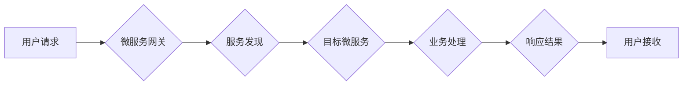

> 微服务，高扩展性，分布式系统，服务发现，弹性伸缩，容器化，微服务架构

## 1. 背景介绍

随着互联网技术的飞速发展，企业对系统性能、可靠性和可扩展性的需求越来越高。传统的单体架构模式在面对海量用户和数据时，往往难以满足这些需求。微服务架构应运而生，它将大型应用程序拆分成一系列小型、独立的服务，每个服务专注于特定的业务功能，并通过轻量级的通信协议进行交互。微服务架构的这种模块化设计，为系统的高扩展性提供了强大的保障。

## 2. 核心概念与联系

### 2.1 微服务架构

微服务架构是一种将应用程序拆分成一系列小型、独立的服务的软件架构风格。每个微服务都专注于特定的业务功能，并通过轻量级的通信协议（如RESTful API）进行交互。微服务之间相互独立，可以独立部署、开发和维护。

### 2.2 高扩展性

高扩展性是指系统能够根据需要动态地增加资源，以满足不断增长的用户需求和业务负载。高扩展性系统能够在不影响性能和可用性的前提下，轻松应对突发流量峰值和持续的业务增长。

### 2.3 联系

微服务架构为高扩展性提供了以下优势：

* **独立部署和扩展:** 微服务可以独立部署和扩展，这意味着可以根据特定服务的负载需求，动态地增加或减少其实例数量。
* **弹性伸缩:** 微服务架构支持弹性伸缩，可以根据业务负载动态地调整资源分配，以确保系统性能和可用性。
* **技术多样性:** 微服务可以采用不同的技术栈，这使得可以根据特定服务的特性选择最合适的技术，提高开发效率和系统性能。

**Mermaid 流程图**



## 3. 核心算法原理 & 具体操作步骤

### 3.1 算法原理概述

微服务架构中，实现高扩展性的核心算法主要包括服务发现、负载均衡和弹性伸缩。

* **服务发现:** 服务发现机制允许微服务之间自动发现彼此的存在和位置。当一个微服务需要调用另一个微服务时，它会通过服务发现机制获取目标微服务的地址和端口信息。
* **负载均衡:** 负载均衡机制将请求分发到多个实例，以避免单个实例被过载。当一个微服务收到请求时，它会将请求转发到负载均衡器，负载均衡器根据预设的策略将请求分发到不同的实例。
* **弹性伸缩:** 弹性伸缩机制允许根据业务负载动态地增加或减少微服务的实例数量。当系统负载增加时，弹性伸缩机制会自动启动新的实例，并将请求分发到这些新的实例。当系统负载减少时，弹性伸缩机制会自动停止部分实例，以节省资源。

### 3.2 算法步骤详解

**服务发现:**

1. 注册中心: 微服务注册到一个注册中心，注册中心维护着所有微服务的地址和端口信息。
2. 服务发现: 当一个微服务需要调用另一个微服务时，它会向注册中心查询目标微服务的地址和端口信息。
3. 连接: 微服务根据注册中心返回的信息连接到目标微服务。

**负载均衡:**

1. 请求到达: 用户请求到达负载均衡器。
2. 负载均衡策略: 负载均衡器根据预设的策略选择一个实例转发请求。
3. 请求转发: 负载均衡器将请求转发到选中的实例。
4. 响应返回: 实例处理请求并返回响应，响应返回给用户。

**弹性伸缩:**

1. 监控系统负载: 系统监控微服务的资源使用情况，例如CPU使用率、内存使用率等。
2. 触发伸缩: 当系统负载超过预设阈值时，触发弹性伸缩机制。
3. 启动新实例: 弹性伸缩机制启动新的微服务实例，并将其注册到注册中心。
4. 分配请求: 负载均衡器将请求分发到新的实例。
5. 停止实例: 当系统负载降低到预设阈值时，弹性伸缩机制停止部分实例。

### 3.3 算法优缺点

**优点:**

* 高扩展性: 可以根据需要动态地增加资源，以满足不断增长的用户需求和业务负载。
* 弹性伸缩: 可以根据业务负载动态地调整资源分配，以确保系统性能和可用性。
* 技术多样性: 可以采用不同的技术栈，这使得可以根据特定服务的特性选择最合适的技术，提高开发效率和系统性能。

**缺点:**

* 复杂性: 微服务架构比单体架构更复杂，需要更多的管理和维护。
* 通信开销: 微服务之间需要通过网络进行通信，这会增加通信开销。
* 部署和运维成本: 微服务架构需要部署和管理多个独立的服务，这会增加部署和运维成本。

### 3.4 算法应用领域

微服务架构和高扩展性算法广泛应用于以下领域:

* **电商平台:** 处理海量商品信息、订单和用户数据。
* **社交媒体:** 支持实时消息推送、用户互动和内容分享。
* **金融服务:** 提供高可用性和高安全性金融交易服务。
* **云计算:** 提供弹性伸缩的计算、存储和网络资源。

## 4. 数学模型和公式 & 详细讲解 & 举例说明

### 4.1 数学模型构建

**负载均衡算法:**

假设有N个微服务实例，每个实例的处理能力为P，请求的平均处理时间为T。

* **请求量:** Q
* **平均响应时间:** R = T * (N / Q)

**弹性伸缩算法:**

假设系统负载为L，预设阈值为T，每个实例的处理能力为P。

* **实例数量:** S = ceil(L / P)

### 4.2 公式推导过程

**平均响应时间:**

平均响应时间R是请求量Q与每个实例的处理能力P的函数。

* R = T * (N / Q)

**实例数量:**

实例数量S是系统负载L与每个实例的处理能力P的函数。

* S = ceil(L / P)

### 4.3 案例分析与讲解

**案例:**

假设一个电商平台有100个微服务实例，每个实例的处理能力为1000请求/秒，平均请求处理时间为0.1秒，系统负载为100000请求/秒。

**分析:**

* 平均响应时间: R = 0.1 * (100 / 100000) = 0.001秒
* 实例数量: S = ceil(100000 / 1000) = 101

**结论:**

在该案例中，平均响应时间为0.001秒，系统负载为100000请求/秒，需要101个实例才能满足系统需求。

## 5. 项目实践：代码实例和详细解释说明

### 5.1 开发环境搭建

* 操作系统: Ubuntu 20.04
* 虚拟机: VirtualBox
* Docker: Docker Desktop
* Kubernetes: Minikube

### 5.2 源代码详细实现

```python
# 服务发现示例代码
from service_discovery import ServiceDiscovery

# 创建服务发现实例
service_discovery = ServiceDiscovery()

# 注册服务
service_discovery.register_service("my-service", "http://localhost:8080")

# 查询服务地址
service_address = service_discovery.get_service_address("my-service")

# 打印服务地址
print(service_address)
```

### 5.3 代码解读与分析

* **服务发现示例代码:** 该代码示例演示了如何使用服务发现机制注册和查询微服务地址。
* **ServiceDiscovery类:** 该类负责管理微服务的注册和发现。
* **register_service()方法:** 用于注册微服务到服务发现中心。
* **get_service_address()方法:** 用于查询微服务的地址。

### 5.4 运行结果展示

运行上述代码后，将输出目标微服务的地址信息。

## 6. 实际应用场景

### 6.1 电商平台

电商平台可以将商品信息、订单管理、支付处理等功能拆分成不同的微服务，并通过服务发现和负载均衡机制实现高扩展性和高可用性。

### 6.2 社交媒体

社交媒体平台可以将用户消息推送、好友关系管理、内容分享等功能拆分成不同的微服务，并通过弹性伸缩机制应对突发流量峰值。

### 6.3 金融服务

金融服务平台可以将交易处理、风险控制、用户认证等功能拆分成不同的微服务，并通过高可用性和高安全性机制保障金融交易的安全可靠。

### 6.4 未来应用展望

随着微服务架构的不断发展，其在高扩展性领域的应用将更加广泛。未来，微服务架构将与人工智能、云计算等新兴技术深度融合，为企业提供更加灵活、高效和智能的解决方案。

## 7. 工具和资源推荐

### 7.1 学习资源推荐

* **微服务架构实践:** https://www.alibabacloud.com/blog/microservices-architecture-practice_595949
* **微服务架构设计:** https://www.oreilly.com/library/view/microservices-patterns/9781492034130/

### 7.2 开发工具推荐

* **Docker:** https://www.docker.com/
* **Kubernetes:** https://kubernetes.io/
* **Spring Cloud:** https://spring.io/projects/spring-cloud

### 7.3 相关论文推荐

* **Microservices: Architectural Style and Patterns:** https://martinfowler.com/articles/microservices.html
* **Building Microservices: Designing Fine-Grained Systems:** https://www.oreilly.com/library/view/building-microservices/9781492034130/

## 8. 总结：未来发展趋势与挑战

### 8.1 研究成果总结

微服务架构为高扩展性提供了强大的保障，并广泛应用于各种领域。

### 8.2 未来发展趋势

* **更细粒度的服务:** 微服务将更加细粒化，每个服务专注于更小的业务功能。
* **更智能的自动化:** 微服务架构将更加智能化，自动化部署、运维和监控。
* **更强大的安全保障:** 微服务架构将更加注重安全，提供更强大的安全保障机制。

### 8.3 面临的挑战

* **复杂性管理:** 微服务架构的复杂性不断增加，需要更有效的管理和维护手段。
* **数据一致性:** 微服务之间的数据一致性需要更加关注，需要更有效的解决方案。
* **监控和调试:** 微服务架构的监控和调试更加复杂，需要更强大的工具和技术支持。

### 8.4 研究展望

未来，微服务架构的研究将更加深入，探索更有效的解决方案来应对上述挑战，并推动微服务架构的更广泛应用。

## 9. 附录：常见问题与解答

### 9.1 什么是微服务？

微服务是一种将应用程序拆分成一系列小型、独立的服务的软件架构风格。每个微服务都专注于特定的业务功能，并通过轻量级的通信协议（如RESTful API）进行交互。

### 9.2 微服务架构的优势是什么？

微服务架构的优势包括：

* 高扩展性: 可以根据需要动态地增加资源，以满足不断增长的用户需求和业务负载。
* 弹性伸缩: 可以根据业务负载动态地调整资源分配，以确保系统性能和可用性。
* 技术多样性: 可以采用不同的技术栈，这使得可以根据特定服务的特性选择最合适的技术，提高开发效率和系统性能。

### 9.3 微服务架构的缺点是什么？

微服务架构的缺点包括