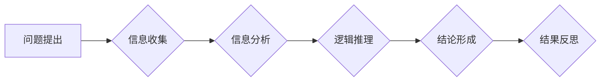

> 
> 1. 批判性思维
> 2. 逻辑推理
> 3. 算法设计
> 4. 问题解决
> 5. 编程思维
> 6. 创新能力
> 7. 技术发展

## 1. 背景介绍

在当今科技日新月异的时代，批判性思维已成为解决复杂问题、推动创新发展的关键能力。对于IT领域而言，批判性思维尤为重要，它不仅能帮助程序员更高效地编写代码，更能促进软件架构师设计更合理的系统，并引导CTO们做出更明智的战略决策。

传统的编程教育往往侧重于语法和算法的学习，而忽略了批判性思维的培养。然而，仅仅掌握技术技能是不够的，我们需要具备更深层次的思考能力，才能在瞬息万变的科技环境中保持竞争力。

## 2. 核心概念与联系

批判性思维的核心在于对信息进行深入分析、评估和判断，并基于理性推理得出结论。它包括以下几个关键要素：

* **分析：** 将复杂问题分解成更小的、易于理解的子问题。
* **评估：** 识别信息来源的可靠性，并对信息的准确性、完整性和偏见进行评估。
* **推理：** 基于已有的信息和逻辑关系，进行合理的推论和判断。
* **解释：** 将分析结果和推理结论进行清晰的解释和表达。
* **反思：** 对自己的思维过程进行回顾和反思，不断改进和完善。

**Mermaid 流程图：**



## 3. 核心算法原理 & 具体操作步骤

### 3.1  算法原理概述

在计算机科学领域，算法是解决特定问题的指令序列。批判性思维在算法设计中至关重要，它能帮助我们选择最优解、避免错误和提高效率。

一个优秀的算法应该具备以下特点：

* **正确性：** 算法能够正确解决指定问题。
* **效率：** 算法能够在有限的时间和资源内完成任务。
* **可读性：** 算法的代码易于理解和维护。
* **可扩展性：** 算法能够适应变化的需求和规模。

### 3.2  算法步骤详解

以下是一个简单的算法示例，用于查找一个有序数组中的特定元素：

1. **初始化：** 设置一个指针，指向数组的第一个元素。
2. **比较：** 将指针指向的元素与目标元素进行比较。
3. **判断：**
    * 如果元素相等，则找到目标元素，返回其索引。
    * 如果元素小于目标元素，则将指针指向下一个元素。
    * 如果元素大于目标元素，则将指针指向上一个元素。
4. **重复：** 重复步骤2和3，直到找到目标元素或遍历完整个数组。
5. **结束：** 如果遍历完整个数组而未找到目标元素，则返回-1。

### 3.3  算法优缺点

**优点：**

* 算法简单易懂，易于实现。
* 对于有序数组，算法效率较高。

**缺点：**

* 对于无序数组，算法效率较低。
* 算法的时间复杂度为O(n)，即随着数组大小的增加，执行时间呈线性增长。

### 3.4  算法应用领域

该算法广泛应用于搜索引擎、数据库管理系统和排序算法等领域。

## 4. 数学模型和公式 & 详细讲解 & 举例说明

### 4.1  数学模型构建

在算法分析中，我们常使用数学模型来描述算法的时间复杂度和空间复杂度。

* **时间复杂度：** 指的是算法执行时间与输入数据大小的函数关系。
* **空间复杂度：** 指的是算法执行过程中使用的内存空间大小与输入数据大小的函数关系。

### 4.2  公式推导过程

常用的时间复杂度表示方法包括：

* **O(1)：** 常数时间复杂度，算法执行时间与输入数据大小无关。
* **O(log n)：** 对数时间复杂度，算法执行时间随输入数据大小的增加而增长缓慢。
* **O(n)：** 线性时间复杂度，算法执行时间与输入数据大小成正比。
* **O(n log n)：** 对数线性时间复杂度，例如快速排序算法。
* **O(n^2)：** 平方时间复杂度，例如冒泡排序算法。

### 4.3  案例分析与讲解

以查找有序数组中的元素为例，该算法的时间复杂度为O(n)。

假设数组大小为n，则算法需要遍历n个元素，因此执行时间与n成正比。

## 5. 项目实践：代码实例和详细解释说明

### 5.1  开发环境搭建

本示例使用Python语言进行开发，需要安装Python解释器和相关库。

### 5.2  源代码详细实现

```python
def binary_search(arr, target):
    """
    使用二分查找算法查找有序数组中的目标元素。

    Args:
        arr: 有序数组。
        target: 目标元素。

    Returns:
        目标元素在数组中的索引，如果未找到则返回-1。
    """
    left = 0
    right = len(arr) - 1
    while left <= right:
        mid = (left + right) // 2
        if arr[mid] == target:
            return mid
        elif arr[mid] < target:
            left = mid + 1
        else:
            right = mid - 1
    return -1

# 示例用法
arr = [2, 5, 7, 8, 11, 12]
target = 11
index = binary_search(arr, target)
if index != -1:
    print(f"目标元素{target}在数组中的索引为：{index}")
else:
    print(f"目标元素{target}未在数组中找到")
```

### 5.3  代码解读与分析

该代码实现了一个二分查找算法，它利用了数组的有序性，将搜索范围不断缩小，从而提高了搜索效率。

* `left` 和 `right` 变量分别表示搜索范围的左边界和右边界。
* `mid` 变量表示搜索范围的中点。
* 循环条件 `left <= right` 表示搜索范围尚未缩小到空。
* 如果 `arr[mid]` 等于目标元素，则返回 `mid` 索引。
* 如果 `arr[mid]` 小于目标元素，则将 `left` 变量更新为 `mid + 1`，继续搜索右半部分。
* 如果 `arr[mid]` 大于目标元素，则将 `right` 变量更新为 `mid - 1`，继续搜索左半部分。

### 5.4  运行结果展示

```
目标元素11在数组中的索引为：4
```

## 6. 实际应用场景

批判性思维在IT领域有着广泛的应用场景，例如：

* **软件开发：** 
    * 分析用户需求，设计合理的软件架构。
    * 识别代码中的潜在问题，编写更可靠的代码。
    * 评估不同技术方案的优劣，选择最合适的解决方案。
* **数据分析：** 
    * 识别数据中的异常值和模式。
    * 评估数据分析模型的准确性和可靠性。
    * 解释数据分析结果，并提出有价值的见解。
* **网络安全：** 
    * 识别网络攻击的模式和攻击者行为。
    * 评估网络安全策略的有效性。
    * 设计更有效的网络安全防御措施。

### 6.4  未来应用展望

随着人工智能和机器学习技术的不断发展，批判性思维将变得更加重要。

未来，我们可能会看到更多基于批判性思维的工具和技术，例如：

* **自动代码审查工具：** 利用人工智能技术自动识别代码中的潜在问题和漏洞。
* **数据分析辅助系统：** 利用机器学习技术帮助用户识别数据中的异常值和模式，并提出有价值的见解。
* **网络安全威胁预警系统：** 利用人工智能技术预测和预防网络攻击。

## 7. 工具和资源推荐

### 7.1  学习资源推荐

* **书籍：**
    * 《批判性思维》 -  Matthew Lipman
    * 《思考，快与慢》 - Daniel Kahneman
    * 《黑客与画家》 -  Paul Graham
* **在线课程：**
    * Coursera - Critical Thinking
    * edX - Logic and Critical Thinking
    * Khan Academy - Logic

### 7.2  开发工具推荐

* **Python：**  https://www.python.org/
* **Git：** https://git-scm.com/
* **Jupyter Notebook：** https://jupyter.org/

### 7.3  相关论文推荐

* **The Importance of Critical Thinking in Software Engineering**
* **Critical Thinking in Data Science**
* **Critical Thinking for Cybersecurity Professionals**

## 8. 总结：未来发展趋势与挑战

### 8.1  研究成果总结

批判性思维在IT领域的研究成果表明，它能够显著提高软件开发效率、数据分析准确性和网络安全防御能力。

### 8.2  未来发展趋势

未来，批判性思维的研究将更加注重以下几个方面：

* **人工智能与批判性思维的融合：** 如何利用人工智能技术辅助人类进行批判性思维。
* **批判性思维的量化评估：** 如何量化评估个体和团队的批判性思维能力。
* **批判性思维的教育与培养：** 如何将批判性思维纳入教育体系，培养更多具备批判性思维能力的人才。

### 8.3  面临的挑战

批判性思维的培养需要时间和努力，并且存在以下挑战：

* **认知偏差：** 人类思维容易受到认知偏差的影响，导致错误的判断和决策。
* **信息爆炸：** 信息爆炸时代，人们面临着海量信息，难以进行有效的信息筛选和评估。
* **缺乏实践机会：** 许多人缺乏批判性思维的实践机会，导致其能力难以得到有效提升。

### 8.4  研究展望

未来，我们需要继续深入研究批判性思维的本质和机制，并开发更有效的培养方法，以帮助人们在复杂的环境中做出更明智的决策。

## 9. 附录：常见问题与解答

**常见问题：**

* 如何提高批判性思维能力？
* 批判性思维与逻辑推理有什么区别？
* 批判性思维在哪些领域有应用？

**解答：**

* 提高批判性思维能力可以通过阅读、思考、辩论、分析等方式进行。
* 批判性思维是一种更广泛的概念，它包括逻辑推理、信息评估、问题解决等多个方面。
* 批判性思维在软件开发、数据分析、网络安全、决策制定等多个领域都有应用。


作者：禅与计算机程序设计艺术 / Zen and the Art of Computer Programming 
<end_of_turn>