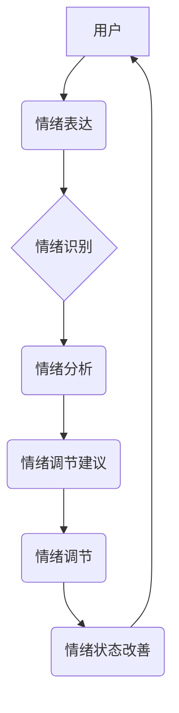

> 元宇宙、情绪调节、人工智能、情感分析、生物反馈、虚拟现实、增强现实、数字健康

## 1. 背景介绍

随着科技的飞速发展，元宇宙概念逐渐从科幻小说走向现实。元宇宙，一个融合虚拟现实（VR）、增强现实（AR）、区块链、人工智能等技术的沉浸式虚拟世界，正在为人们提供全新的交互体验和生活方式。然而，在虚拟世界中，人们的情感体验也面临着新的挑战和机遇。

传统社会中，人们的情感调节主要依赖于现实世界的社交互动、个人经验和认知能力。但在元宇宙中，虚拟身份、虚拟环境和虚拟社交模式可能会对人们的情绪产生复杂的影响。一方面，元宇宙可以提供一个安全的空间，帮助人们探索和表达自己的情绪；另一方面，虚拟世界的虚拟社交和虚拟身份可能会导致情绪失控、虚拟现实依赖等问题。

因此，如何有效地调节和管理情绪，成为元宇宙发展的重要课题。数字化情绪调节技术应运而生，它利用人工智能、生物反馈、情感分析等技术，为用户提供个性化的情绪管理工具，帮助他们在元宇宙中保持身心健康。

## 2. 核心概念与联系

数字化情绪调节技术的核心概念包括：

* **情绪识别:** 利用自然语言处理、计算机视觉等技术，识别用户在虚拟环境中的情感表达，例如文字、语音、表情、肢体动作等。
* **情绪分析:** 对识别出的情绪进行分析和解读，了解用户的情绪状态、情绪变化趋势和情绪背后的原因。
* **情绪调节:** 根据用户的情绪状态，提供个性化的调节建议和干预措施，例如放松技巧、认知重构、虚拟陪伴等。
* **生物反馈:** 利用生物传感器监测用户的情绪生理指标，例如心率、血压、皮肤电导等，并根据这些指标提供更精准的情绪调节建议。

**核心概念架构**



## 3. 核心算法原理 & 具体操作步骤

### 3.1  算法原理概述

数字化情绪调节技术主要依赖于以下核心算法：

* **深度学习:** 用于情绪识别和分析，训练模型识别不同情绪的特征，例如语音语调、面部表情、文字内容等。
* **自然语言处理 (NLP):** 用于分析用户文本表达的情绪倾向，识别情感词汇和语法结构。
* **生物信号处理:** 用于分析用户生理指标，例如心率、血压、皮肤电导等，识别情绪变化的生理信号。

### 3.2  算法步骤详解

1. **数据采集:** 收集用户在元宇宙中的情绪表达数据，包括文本、语音、表情、肢体动作等。
2. **数据预处理:** 对采集到的数据进行清洗、格式化和特征提取，例如语音信号的音频特征提取、文本数据的词向量化等。
3. **模型训练:** 利用深度学习、NLP等算法，训练情绪识别和分析模型，使其能够准确识别用户的情绪状态。
4. **情绪识别:** 将用户在元宇宙中的实时情绪表达数据输入到训练好的模型中，识别用户的当前情绪状态。
5. **情绪分析:** 对识别出的情绪进行分析，了解用户的情绪变化趋势、情绪背后的原因等。
6. **情绪调节建议:** 根据用户的情绪状态和分析结果，提供个性化的情绪调节建议，例如放松技巧、认知重构、虚拟陪伴等。
7. **情绪调节反馈:** 收集用户对情绪调节建议的反馈，并根据反馈进行模型优化和调整。

### 3.3  算法优缺点

**优点:**

* **精准度高:** 深度学习算法能够识别出细微的情绪变化，提高情绪识别的精准度。
* **个性化定制:** 根据用户的个人特征和情绪状态，提供个性化的情绪调节建议。
* **实时反馈:** 利用生物反馈技术，实时监测用户的情绪状态，及时提供调节建议。

**缺点:**

* **数据依赖:** 算法的性能依赖于训练数据的质量和数量。
* **隐私安全:** 收集和分析用户情绪数据需要考虑隐私安全问题。
* **伦理道德:** 情绪调节技术可能会被滥用，例如操控用户情绪，需要谨慎考虑伦理道德问题。

### 3.4  算法应用领域

数字化情绪调节技术在元宇宙中的应用领域非常广泛，例如：

* **虚拟社交平台:** 帮助用户在虚拟社交平台中更好地管理情绪，避免情绪失控和虚拟现实依赖。
* **虚拟教育平台:** 帮助学生更好地调节学习情绪，提高学习效率和学习兴趣。
* **虚拟医疗平台:** 帮助患者管理情绪，缓解心理压力，辅助治疗心理疾病。
* **虚拟娱乐平台:** 为用户提供更沉浸式的娱乐体验，帮助用户更好地释放压力和情绪。

## 4. 数学模型和公式 & 详细讲解 & 举例说明

### 4.1  数学模型构建

情绪识别模型通常采用多层感知机 (MLP) 或卷积神经网络 (CNN) 等深度学习模型。

**MLP 模型:**

MLP 模型将用户情绪表达数据作为输入，经过多层神经网络的处理，最终输出用户情绪的概率分布。

**CNN 模型:**

CNN 模型擅长处理图像数据，可以用于识别用户面部表情、肢体动作等视觉情绪表达。

### 4.2  公式推导过程

深度学习模型的训练过程涉及到大量的数学公式，例如梯度下降算法、激活函数、损失函数等。

**梯度下降算法:** 用于更新模型参数，使其能够更好地拟合训练数据。

**激活函数:** 用于引入非线性，提高模型的表达能力。

**损失函数:** 用于衡量模型预测结果与真实结果之间的差异，指导模型训练。

### 4.3  案例分析与讲解

例如，可以使用 CNN 模型识别用户面部表情，并将其转换为情绪标签。

**输入数据:** 用户面部表情图像

**模型输出:** 用户情绪标签 (例如：快乐、悲伤、愤怒、恐惧)

**训练数据:** 包含大量面部表情图像和对应情绪标签的数据集

**模型评估:** 使用测试数据集评估模型的识别准确率

## 5. 项目实践：代码实例和详细解释说明

### 5.1  开发环境搭建

* 操作系统: Ubuntu 20.04
* Python 版本: 3.8
* 深度学习框架: TensorFlow 2.0

### 5.2  源代码详细实现

```python
import tensorflow as tf

# 定义模型结构
model = tf.keras.models.Sequential([
    tf.keras.layers.Conv2D(32, (3, 3), activation='relu', input_shape=(64, 64, 3)),
    tf.keras.layers.MaxPooling2D((2, 2)),
    tf.keras.layers.Conv2D(64, (3, 3), activation='relu'),
    tf.keras.layers.MaxPooling2D((2, 2)),
    tf.keras.layers.Flatten(),
    tf.keras.layers.Dense(10, activation='softmax')
])

# 编译模型
model.compile(optimizer='adam',
              loss='sparse_categorical_crossentropy',
              metrics=['accuracy'])

# 训练模型
model.fit(train_images, train_labels, epochs=10)

# 评估模型
loss, accuracy = model.evaluate(test_images, test_labels)
print('Test loss:', loss)
print('Test accuracy:', accuracy)
```

### 5.3  代码解读与分析

* **模型结构:** 使用了卷积神经网络 (CNN) 模型，包含多个卷积层、池化层和全连接层。
* **激活函数:** 使用了 ReLU 激活函数，提高模型的表达能力。
* **损失函数:** 使用了 sparse_categorical_crossentropy 损失函数，用于多分类问题。
* **优化器:** 使用了 Adam 优化器，用于更新模型参数。

### 5.4  运行结果展示

训练完成后，可以使用测试数据评估模型的识别准确率。

## 6. 实际应用场景

### 6.1  虚拟社交平台

在虚拟社交平台中，数字化情绪调节技术可以帮助用户更好地管理情绪，避免情绪失控和虚拟现实依赖。例如，当用户在虚拟社交平台中遇到负面情绪时，系统可以提供放松技巧、认知重构等建议，帮助用户缓解情绪压力。

### 6.2  虚拟教育平台

在虚拟教育平台中，数字化情绪调节技术可以帮助学生更好地调节学习情绪，提高学习效率和学习兴趣。例如，当学生感到焦虑或疲劳时，系统可以提供休息建议、学习技巧等，帮助学生保持良好的学习状态。

### 6.3  虚拟医疗平台

在虚拟医疗平台中，数字化情绪调节技术可以帮助患者管理情绪，缓解心理压力，辅助治疗心理疾病。例如，系统可以提供冥想练习、情绪日记等工具，帮助患者更好地了解和管理自己的情绪。

### 6.4  未来应用展望

随着元宇宙的发展，数字化情绪调节技术将有更广泛的应用场景，例如：

* **虚拟娱乐平台:** 为用户提供更沉浸式的娱乐体验，帮助用户更好地释放压力和情绪。
* **虚拟工作平台:** 帮助用户更好地管理工作情绪，提高工作效率和工作满意度。
* **虚拟培训平台:** 帮助用户更好地调节学习情绪，提高培训效果。

## 7. 工具和资源推荐

### 7.1  学习资源推荐

* **书籍:**
    * 《深度学习》 by Ian Goodfellow, Yoshua Bengio, and Aaron Courville
    * 《自然语言处理》 by Dan Jurafsky and James H. Martin
* **在线课程:**
    * Coursera: 深度学习 Specialization
    * Udacity: 自然语言处理 Nanodegree

### 7.2  开发工具推荐

* **Python:** 广泛用于深度学习和自然语言处理开发。
* **TensorFlow:** 开源深度学习框架，提供丰富的工具和资源。
* **PyTorch:** 开源深度学习框架，以其灵活性和易用性而闻名。

### 7.3  相关论文推荐

* **Emotion Recognition in the Wild:** A Survey
* **Deep Learning for Emotion Recognition: A Comprehensive Review**
* **Biofeedback for Emotion Regulation: A Review**

## 8. 总结：未来发展趋势与挑战

### 8.1  研究成果总结

数字化情绪调节技术在元宇宙中的应用前景广阔，已经取得了一定的研究成果。例如，已经开发出能够识别用户面部表情、语音语调等情绪表达的模型，并提供个性化的情绪调节建议。

### 8.2  未来发展趋势

未来，数字化情绪调节技术将朝着以下方向发展：

* **更精准的情绪识别:** 利用更先进的深度学习算法和生物信号处理技术，提高情绪识别的精准度和实时性。
* **更个性化的情绪调节:** 根据用户的个人特征、情绪状态和环境因素，提供更个性化的情绪调节建议。
* **更沉浸式的交互体验:** 利用虚拟现实和增强现实技术，创造更沉浸式的虚拟环境，帮助用户更好地体验情绪调节。

### 8.3  面临的挑战

数字化情绪调节技术也面临着一些挑战：

* **数据隐私安全:** 收集和分析用户情绪数据需要考虑隐私安全问题，需要制定相应的保护措施。
* **伦理道德:** 情绪调节技术可能会被滥用，例如操控用户情绪，需要谨慎考虑伦理道德问题。
* **技术可解释性:** 深度学习模型的决策过程难以解释，需要提高模型的可解释性，增强用户对技术的信任。

### 8.4  研究展望

未来，需要进一步研究数字化情绪调节技术的原理、算法和应用场景，并制定相应的规范和标准，确保其安全、有效和伦理地应用于元宇宙。


## 9. 附录：常见问题与解答

**Q1: 数字化情绪调节技术是否会取代人类的社交互动？**

**A1:** 数字化情绪调节技术旨在帮助用户更好地管理情绪，而不是取代人类的社交互动。它可以作为一种辅助工具，帮助用户在虚拟环境中更有效