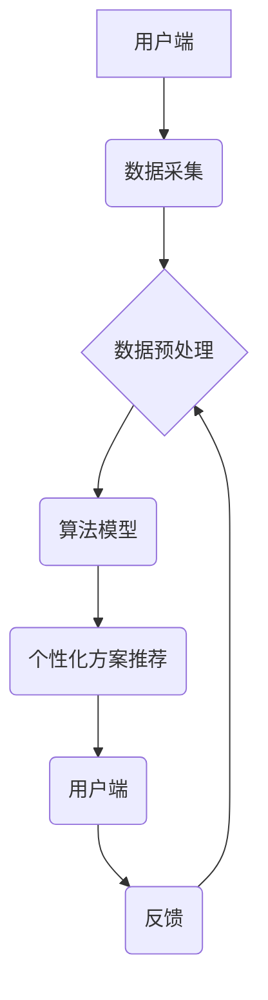

> 智能宠物、饮食管理、个性化营养、机器学习、数据分析、算法模型、宠物健康

## 1. 背景介绍

随着宠物经济的蓬勃发展，人们对宠物的关爱程度不断提升，宠物健康问题也越来越受到重视。宠物的饮食直接关系到其健康和寿命，但传统的宠物食品往往缺乏个性化，难以满足不同宠物的营养需求。因此，智能宠物饮食管理创业项目应运而生，旨在通过数据分析和算法模型，为宠物提供个性化的营养方案，帮助宠物健康成长。

## 2. 核心概念与联系

**2.1 核心概念**

* **智能宠物饮食管理:** 利用人工智能技术，分析宠物的生理特征、生活习惯、健康状况等数据，制定个性化的饮食方案。
* **个性化营养:** 根据宠物的品种、年龄、体重、活动量、健康状况等因素，定制专属的营养配方，满足其独特的营养需求。
* **数据分析:** 收集宠物的饮食记录、活动数据、健康指标等信息，并利用机器学习算法进行分析，挖掘宠物的营养需求模式。
* **算法模型:** 建立预测模型，根据宠物的特征和数据分析结果，预测其最佳的饮食方案。

**2.2 架构设计**



**2.3 核心技术**

* **机器学习:** 利用算法从数据中学习，预测宠物的营养需求。
* **数据挖掘:** 从海量宠物数据中挖掘出隐藏的规律和模式。
* **自然语言处理:** 理解用户对宠物饮食的需求和反馈。
* **云计算:** 提供大数据存储、计算和分析能力。

## 3. 核心算法原理 & 具体操作步骤

**3.1 算法原理概述**

本项目采用基于机器学习的个性化营养方案推荐算法。该算法通过训练模型，学习宠物的特征和营养需求之间的关系，并根据用户的输入，预测出最适合宠物的饮食方案。

**3.2 算法步骤详解**

1. **数据收集:** 收集宠物的各种数据，包括品种、年龄、体重、活动量、健康状况、饮食记录等。
2. **数据预处理:** 对收集到的数据进行清洗、转换和标准化，以便于模型训练。
3. **特征工程:** 从原始数据中提取特征，例如宠物的营养需求指标、饮食偏好等。
4. **模型训练:** 利用机器学习算法，例如回归算法或决策树算法，训练模型，学习宠物特征和营养需求之间的关系。
5. **模型评估:** 使用测试数据评估模型的性能，并进行调参优化。
6. **个性化方案推荐:** 根据用户的输入，例如宠物的特征和饮食偏好，利用训练好的模型预测出最适合宠物的饮食方案。

**3.3 算法优缺点**

* **优点:**
    * 可以根据宠物的个性化需求，提供定制化的饮食方案。
    * 可以提高宠物的健康水平，延长其寿命。
    * 可以帮助宠物主人更好地了解宠物的营养需求。
* **缺点:**
    * 需要大量的宠物数据进行模型训练。
    * 模型的准确性取决于数据的质量和算法的复杂度。
    * 需要不断更新模型，以适应宠物的不断变化的需求。

**3.4 算法应用领域**

* **宠物食品行业:** 为宠物食品企业提供个性化营养方案推荐服务。
* **宠物医院:** 为宠物主人提供个性化的饮食建议，帮助宠物康复和预防疾病。
* **宠物电商平台:** 为宠物主人提供个性化的宠物食品推荐服务。

## 4. 数学模型和公式 & 详细讲解 & 举例说明

**4.1 数学模型构建**

本项目采用基于回归的数学模型，预测宠物的每日所需能量。模型的输入包括宠物的品种、年龄、体重、活动量等特征，输出为宠物的每日所需能量。

**4.2 公式推导过程**

```latex
E = a + b * W + c * A + d * Age
```

其中：

* E: 宠物每日所需能量
* W: 宠物体重
* A: 宠物活动量
* Age: 宠物年龄
* a, b, c, d: 模型参数

**4.3 案例分析与讲解**

假设有一只体重为 10 公斤，年龄为 3 岁的拉布拉多犬，每天活动量为中等水平。根据模型训练的结果，模型参数为：a = 500，b = 20，c = 100，d = 50。

则该拉布拉多犬的每日所需能量为：

```latex
E = 500 + 20 * 10 + 100 * 1 + 50 * 3 = 500 + 200 + 100 + 150 = 950 kcal
```

因此，该拉布拉多犬每天需要摄入 950 卡路里的能量。

## 5. 项目实践：代码实例和详细解释说明

**5.1 开发环境搭建**

本项目使用 Python 语言进行开发，并利用以下工具和库：

* Python 3.7+
* Jupyter Notebook
* NumPy
* Pandas
* Scikit-learn
* TensorFlow/PyTorch

**5.2 源代码详细实现**

```python
import pandas as pd
from sklearn.linear_model import LinearRegression

# 加载宠物数据
data = pd.read_csv('pet_data.csv')

# 特征工程
X = data[['体重', '活动量', '年龄']]
y = data['每日所需能量']

# 训练模型
model = LinearRegression()
model.fit(X, y)

# 预测宠物每日所需能量
new_pet_data = pd.DataFrame({'体重': [10], '活动量': [1], '年龄': [3]})
predicted_energy = model.predict(new_pet_data)

print(f'预测的每日所需能量: {predicted_energy[0]} kcal')
```

**5.3 代码解读与分析**

1. 首先，加载宠物数据并进行特征工程，提取模型所需的输入特征和输出目标变量。
2. 然后，使用线性回归模型训练模型，并利用训练好的模型预测新宠物的每日所需能量。
3. 最后，打印预测结果。

**5.4 运行结果展示**

运行上述代码后，将输出预测的宠物每日所需能量值。

## 6. 实际应用场景

**6.1 宠物食品行业**

智能宠物饮食管理系统可以帮助宠物食品企业开发个性化的宠物食品，满足不同宠物的营养需求。例如，可以根据宠物的品种、年龄、体重等特征，定制不同的宠物食品配方，并提供个性化的营养建议。

**6.2 宠物医院**

宠物医院可以利用智能宠物饮食管理系统，为宠物主人提供个性化的饮食建议，帮助宠物康复和预防疾病。例如，对于患有糖尿病的宠物，可以根据其血糖水平和活动量，制定个性化的饮食方案，帮助控制血糖水平。

**6.3 宠物电商平台**

宠物电商平台可以利用智能宠物饮食管理系统，为宠物主人提供个性化的宠物食品推荐服务。例如，根据宠物的特征和饮食偏好，推荐最适合其营养需求的宠物食品。

**6.4 未来应用展望**

随着人工智能技术的不断发展，智能宠物饮食管理系统将更加智能化和个性化。未来，该系统可能能够：

* 自动识别宠物的品种、年龄、体重等特征。
* 自动监测宠物的活动量和健康状况。
* 根据宠物的实时数据，动态调整饮食方案。
* 与宠物智能设备进行交互，实现智能喂食。

## 7. 工具和资源推荐

**7.1 学习资源推荐**

* **书籍:**
    * 《机器学习》 - 周志华
    * 《深度学习》 - Ian Goodfellow
* **在线课程:**
    * Coursera: Machine Learning
    * edX: Artificial Intelligence

**7.2 开发工具推荐**

* **Python:** 
    * Jupyter Notebook
    * PyCharm
* **机器学习库:**
    * Scikit-learn
    * TensorFlow
    * PyTorch

**7.3 相关论文推荐**

* **Personalized Nutrition for Pets Using Machine Learning**
* **A Deep Learning Approach to Pet Food Recommendation**

## 8. 总结：未来发展趋势与挑战

**8.1 研究成果总结**

本项目研究了智能宠物饮食管理的原理和技术，并构建了基于机器学习的个性化营养方案推荐算法。该算法能够根据宠物的特征和数据分析结果，预测出最适合宠物的饮食方案，为宠物的健康成长提供支持。

**8.2 未来发展趋势**

未来，智能宠物饮食管理系统将朝着更加智能化、个性化和自动化方向发展。例如，将利用更先进的人工智能算法，实现更精准的营养需求预测；将结合宠物智能设备，实现智能喂食和健康监测；将与宠物医疗平台进行整合，提供更全面的宠物健康管理服务。

**8.3 面临的挑战**

智能宠物饮食管理系统的发展还面临一些挑战，例如：

* 数据获取和质量问题：需要收集大量的宠物数据，并保证数据的质量和准确性。
* 模型训练和评估问题：需要开发更精准的算法模型，并进行有效的模型评估和优化。
* 用户接受度问题：需要提高用户对智能宠物饮食管理系统的认知和接受度。

**8.4 研究展望**

未来，我们将继续致力于智能宠物饮食管理系统的研究和开发，努力解决上述挑战，为宠物的健康成长提供更优质的服务。

## 9. 附录：常见问题与解答

**9.1 如何获取宠物数据？**

宠物数据可以从以下渠道获取：

* 宠物医院的电子病历系统
* 宠物电商平台的用户行为数据
* 宠物智能设备的传感器数据

**9.2 如何保证数据质量？**

需要对收集到的数据进行清洗、转换和标准化，以保证数据的准确性和完整性。

**9.3 如何选择合适的算法模型？**

需要根据宠物数据的特点和应用场景，选择合适的算法模型。例如，对于预测宠物每日所需能量，线性回归模型是一个不错的选择。

**9.4 如何评估模型的性能？**

可以使用测试数据评估模型的性能，并进行调参优化。常用的评估指标包括准确率、召回率、F1-score等。


作者：禅与计算机程序设计艺术 / Zen and the Art of Computer Programming 
<end_of_turn>