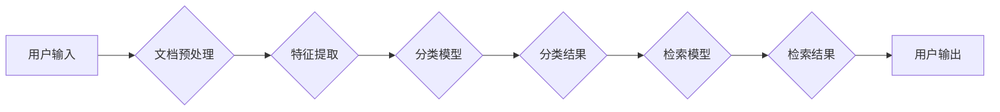

> 智能文档分类，文档检索，自然语言处理，机器学习，深度学习，信息检索

## 1. 背景介绍

随着数字化时代的到来，海量文档的产生和积累已成为不可避免的趋势。如何高效地组织、管理和检索这些文档，成为了一个亟待解决的关键问题。传统的文档检索系统主要依赖于关键词匹配，难以准确理解文档内容的语义，且对新兴领域和专业术语的处理能力有限。因此，智能文档分类与检索系统应运而生，旨在通过自然语言处理（NLP）和机器学习（ML）等技术，对文档进行智能分类和精准检索，提升信息获取效率和准确性。

## 2. 核心概念与联系

智能文档分类与检索系统主要包含以下核心概念：

* **文档分类:** 将文档按照预定义的类别进行自动归类，例如新闻分类、邮件分类、学术论文分类等。
* **文档检索:** 根据用户查询，从文档库中找到与查询内容最相关的文档。
* **自然语言处理 (NLP):**  处理和理解人类语言的技术，包括文本预处理、词性标注、依存句法分析、语义角色标注等。
* **机器学习 (ML):**  通过算法学习数据模式，实现预测和分类等任务。
* **深度学习 (DL):**  一种更高级的机器学习方法，利用多层神经网络模拟人类大脑的学习过程。

**系统架构**



## 3. 核心算法原理 & 具体操作步骤

### 3.1  算法原理概述

智能文档分类与检索系统通常采用以下核心算法：

* **文本分类算法:**  常用的文本分类算法包括朴素贝叶斯、支持向量机 (SVM)、决策树、随机森林、深度学习模型等。这些算法通过学习训练数据，建立文档与类别之间的映射关系，从而实现文档分类。
* **信息检索算法:**  常用的信息检索算法包括TF-IDF、BM25、余弦相似度等。这些算法通过计算文档与查询之间的相似度，找到与查询内容最相关的文档。

### 3.2  算法步骤详解

**文本分类算法步骤:**

1. **数据预处理:**  对文本数据进行清洗、去停用词、词干化、词向量化等处理，以提取有效信息。
2. **特征提取:**  选择合适的特征表示方法，例如词频统计、TF-IDF、Word2Vec等，将文本数据转换为数值向量。
3. **模型训练:**  使用训练数据训练分类模型，例如朴素贝叶斯、SVM、决策树等。
4. **模型评估:**  使用测试数据评估模型的性能，例如准确率、召回率、F1-score等。
5. **模型部署:**  将训练好的模型部署到生产环境中，用于对新文档进行分类。

**信息检索算法步骤:**

1. **索引构建:**  对文档库进行索引，将文档内容转换为可快速检索的格式。
2. **查询处理:**  对用户查询进行处理，提取关键词和语义信息。
3. **相似度计算:**  计算查询与文档之间的相似度，例如TF-IDF、BM25、余弦相似度等。
4. **结果排序:**  根据相似度排序检索结果，并将相关文档返回给用户。

### 3.3  算法优缺点

**文本分类算法:**

* **朴素贝叶斯:**  简单易实现，训练速度快，但假设特征独立性，对数据分布敏感。
* **支持向量机 (SVM):**  能够处理高维数据，具有较好的泛化能力，但训练时间较长，参数选择较复杂。
* **决策树:**  易于理解和解释，但容易过拟合，对数据噪声敏感。
* **随机森林:**  通过多个决策树的集成，提高了模型的鲁棒性和准确性，但训练时间较长。
* **深度学习模型:**  能够学习更复杂的特征表示，具有较高的准确率，但训练数据量大，训练时间长，模型复杂度高。

**信息检索算法:**

* **TF-IDF:**  简单易实现，能够反映词语的重要程度，但对语义理解能力有限。
* **BM25:**  考虑了词语频率和文档长度，能够提高检索的准确性，但计算复杂度较高。
* **余弦相似度:**  能够度量文本之间的语义相似度，但对短文本的处理效果较差。

### 3.4  算法应用领域

智能文档分类与检索系统广泛应用于以下领域:

* **企业信息管理:**  自动分类和检索公司内部文档，提高信息获取效率。
* **学术研究:**  自动分类和检索学术论文，帮助学者快速找到相关文献。
* **新闻媒体:**  自动分类和检索新闻报道，提高新闻内容的组织和管理效率。
* **电子商务:**  自动分类和检索商品信息，帮助用户快速找到所需商品。
* **医疗保健:**  自动分类和检索医疗记录，提高医疗诊断和治疗效率。

## 4. 数学模型和公式 & 详细讲解 & 举例说明

### 4.1  数学模型构建

**文本分类模型:**

假设我们有一个包含 $N$ 个文档的集合 $D = \{d_1, d_2, ..., d_N\}$, 每个文档 $d_i$ 属于一个类别 $c_i$. 文本分类模型的目标是学习一个函数 $f(d_i)$，将文档 $d_i$ 映射到其所属类别 $c_i$.

**信息检索模型:**

假设我们有一个包含 $M$ 个文档的集合 $D = \{d_1, d_2, ..., d_M\}$, 每个文档 $d_i$ 包含一个词向量 $v_i$. 用户输入一个查询 $q$, 查询也包含一个词向量 $v_q$. 信息检索模型的目标是找到与查询 $q$ 最相似的文档 $d_i$, 也就是找到 $v_i$ 和 $v_q$ 之间的相似度最大化的文档。

### 4.2  公式推导过程

**文本分类模型:**

常用的文本分类算法，例如朴素贝叶斯，基于贝叶斯定理推导公式：

$$P(c_i|d_i) = \frac{P(d_i|c_i)P(c_i)}{P(d_i)}$$

其中:

* $P(c_i|d_i)$ 是文档 $d_i$ 属于类别 $c_i$ 的概率。
* $P(d_i|c_i)$ 是给定类别 $c_i$ 下，文档 $d_i$ 出现的概率。
* $P(c_i)$ 是类别 $c_i$ 出现的概率。
* $P(d_i)$ 是文档 $d_i$ 出现的概率。

**信息检索模型:**

常用的信息检索算法，例如余弦相似度，计算文档 $d_i$ 和查询 $q$ 之间的夹角余弦值：

$$\cos(\theta) = \frac{v_i \cdot v_q}{||v_i|| ||v_q||}$$

其中:

* $v_i$ 是文档 $d_i$ 的词向量。
* $v_q$ 是查询 $q$ 的词向量。
* $||v_i||$ 和 $||v_q||$ 分别是文档 $d_i$ 和查询 $q$ 的词向量的长度。

### 4.3  案例分析与讲解

**文本分类案例:**

假设我们有一个包含新闻报道的文档集合，需要将其分类为体育、财经、娱乐等类别。我们可以使用朴素贝叶斯算法，根据每个类别下常见词语的频率，计算文档属于每个类别的概率。例如，如果一个文档包含大量“篮球”、“NBA”等词语，则其属于体育类别的概率较高。

**信息检索案例:**

假设用户输入一个查询“苹果公司最新产品”，信息检索模型会根据查询的词向量，计算与文档库中所有文档的词向量的余弦相似度。然后，根据相似度排序检索结果，将与查询内容最相关的文档返回给用户。

## 5. 项目实践：代码实例和详细解释说明

### 5.1  开发环境搭建

智能文档分类与检索系统的开发环境通常包括以下软件：

* **Python:**  常用的编程语言，广泛应用于数据科学和机器学习领域。
* **NLTK:**  自然语言处理工具包，提供文本预处理、词性标注、依存句法分析等功能。
* **Scikit-learn:**  机器学习库，提供各种分类、回归、聚类等算法。
* **TensorFlow/PyTorch:**  深度学习框架，用于训练深度学习模型。
* **Elasticsearch:**  分布式搜索引擎，用于构建高效的文档检索系统。

### 5.2  源代码详细实现

以下是一个使用Scikit-learn库实现文本分类的简单代码示例：

```python
from sklearn.feature_extraction.text import TfidfVectorizer
from sklearn.naive_bayes import MultinomialNB
from sklearn.model_selection import train_test_split

# 文本数据
documents = [
    "This is a sports news article.",
    "This is a finance news article.",
    "This is an entertainment news article.",
    "This is another sports news article.",
    "This is a finance news article about stocks."
]

# 类别标签
labels = ["sports", "finance", "entertainment", "sports", "finance"]

# 文本向量化
vectorizer = TfidfVectorizer()
X = vectorizer.fit_transform(documents)

# 数据分割
X_train, X_test, y_train, y_test = train_test_split(X, labels, test_size=0.2)

# 模型训练
model = MultinomialNB()
model.fit(X_train, y_train)

# 模型评估
accuracy = model.score(X_test, y_test)
print("Accuracy:", accuracy)
```

### 5.3  代码解读与分析

这段代码首先使用TfidfVectorizer将文本数据转换为数值向量，然后使用MultinomialNB算法训练文本分类模型。最后，使用测试数据评估模型的准确率。

### 5.4  运行结果展示

运行这段代码后，会输出模型的准确率，例如：

```
Accuracy: 0.8
```

这表示模型在测试数据上的准确率为80%。

## 6. 实际应用场景

### 6.1  企业信息管理

智能文档分类与检索系统可以帮助企业自动分类和检索内部文档，例如：

* **合同管理:**  自动分类和检索合同文档，方便查找特定条款或合同签订日期。
* **邮件管理:**  自动分类和检索邮件，例如将重要邮件标记为高优先级，将垃圾邮件过滤掉。
* **知识库管理:**  自动分类和检索公司知识库中的文档，方便员工查找所需信息。

### 6.2  学术研究

智能文档分类与检索系统可以帮助学者快速找到相关文献，例如：

* **文献综述:**  自动分类和检索大量学术论文，方便学者进行文献综述和研究方向探索。
* **论文写作:**  自动检索相关文献，帮助学者进行论文写作和文献引用。
* **学术会议:**  自动分类和检索会议论文，方便学者了解会议主题和最新研究成果。

### 6.3  新闻媒体

智能文档分类与检索系统可以帮助新闻媒体提高新闻内容的组织和管理效率，例如：

* **新闻分类:**  自动分类新闻报道，例如将体育新闻、财经新闻、娱乐新闻等分类到不同的栏目。
* **新闻检索:**  方便用户根据关键词或主题检索新闻报道。
* **新闻推荐:**  根据用户的阅读历史和兴趣，推荐相关新闻报道。

### 6.4  未来应用展望

随着人工智能技术的不断发展，智能文档