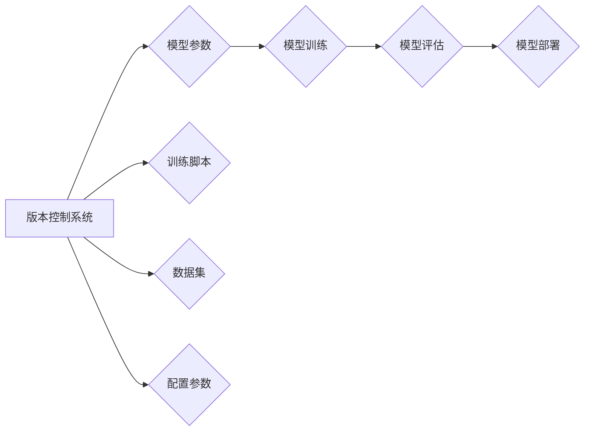

> 深度学习,神经网络,版本控制,模型训练,模型部署,持续集成,持续交付

## 1. 背景介绍

深度学习的蓬勃发展为人工智能领域带来了革命性的变革，神经网络模型在图像识别、自然语言处理、语音识别等领域取得了令人瞩目的成就。然而，随着模型规模的不断扩大和训练数据的日益复杂，神经网络模型的版本控制问题日益凸显。

传统的软件版本控制系统难以满足神经网络模型的特殊需求。神经网络模型不仅包含模型参数，还包含训练脚本、数据集、配置参数等多种元数据。这些元数据之间的相互依赖关系复杂，版本管理难度较大。

## 2. 核心概念与联系

**2.1 版本控制的意义**

版本控制是软件开发中不可或缺的一部分，它可以帮助我们追踪代码的修改历史，回退到之前的版本，并协同开发。对于神经网络模型来说，版本控制同样重要，它可以帮助我们：

* **追踪模型演进:** 记录模型训练过程中的每一次修改，方便回溯和分析模型性能变化。
* **协同开发:** 允许多个开发人员同时工作于同一个模型，并避免版本冲突。
* **模型复现:** 确保模型训练结果的可重复性，方便其他研究人员进行验证和复现。

**2.2 神经网络模型版本控制的挑战**

神经网络模型版本控制面临着以下挑战：

* **模型复杂性:** 神经网络模型包含大量参数和元数据，版本管理难度较大。
* **训练过程依赖性:** 模型训练过程依赖于训练脚本、数据集、配置参数等多种因素，版本控制需要考虑这些因素之间的相互依赖关系。
* **模型规模庞大:** 大型神经网络模型参数量巨大，版本存储和管理成本高昂。

**2.3 解决方案架构**

为了解决上述挑战，我们可以采用以下解决方案架构：



**2.3.1 版本控制系统:**

选择合适的版本控制系统，例如Git，可以帮助我们管理模型参数、训练脚本、数据集和配置参数等元数据。

**2.3.2 模型参数存储:**

可以使用专门的模型参数存储服务，例如TensorFlow Hub或PyTorch Hub，来存储和管理模型参数。

**2.3.3 训练环境管理:**

可以使用容器化技术，例如Docker，来管理模型训练环境，确保训练环境的可重复性和稳定性。

**2.3.4 持续集成与持续交付:**

采用持续集成与持续交付流程，可以自动化模型训练、测试和部署过程，提高开发效率和模型发布速度。

## 3. 核心算法原理 & 具体操作步骤

**3.1 算法原理概述**

神经网络模型的版本控制本质上是基于版本控制系统的操作，它利用版本控制系统的特性来管理模型的各个组成部分。

**3.2 算法步骤详解**

1. **初始化版本库:** 创建一个新的Git仓库，用于存储模型的所有文件。
2. **添加模型文件:** 将模型参数、训练脚本、数据集和配置参数等文件添加到版本库中。
3. **提交版本:** 对模型文件进行修改后，使用Git commit命令提交修改内容到版本库。
4. **创建分支:** 为了方便模型开发和实验，可以创建多个分支，每个分支代表一个不同的模型版本。
5. **合并分支:** 当模型开发完成，可以将分支合并到主分支，发布新的模型版本。
6. **回退版本:** 如果模型出现问题，可以使用Git revert命令回退到之前的版本。

**3.3 算法优缺点**

**优点:**

* **版本历史记录:** 可以清晰地记录模型的修改历史，方便回溯和分析。
* **协同开发:** 允许多个开发人员同时工作于同一个模型，并避免版本冲突。
* **模型复现:** 确保模型训练结果的可重复性，方便其他研究人员进行验证和复现。

**缺点:**

* **学习成本:** 需要学习Git等版本控制系统的操作。
* **存储成本:** 大型神经网络模型参数量巨大，版本存储和管理成本高昂。

**3.4 算法应用领域**

神经网络模型版本控制技术广泛应用于以下领域：

* **机器学习研究:** 研究人员可以使用版本控制系统来管理模型的训练过程和实验结果。
* **深度学习产品开发:** 企业可以使用版本控制系统来管理深度学习模型的开发和部署过程。
* **人工智能开源社区:** 开源社区可以使用版本控制系统来管理开源深度学习模型的开发和维护。

## 4. 数学模型和公式 & 详细讲解 & 举例说明

**4.1 数学模型构建**

神经网络模型的版本控制可以抽象为一个状态转换模型，其中每个状态代表一个模型版本，状态之间的转换由版本控制操作（如提交、合并、回退）驱动。

**4.2 公式推导过程**

由于版本控制操作本身不涉及复杂的数学公式，因此这里不再进行公式推导。

**4.3 案例分析与讲解**

假设我们有一个神经网络模型，其训练过程包含以下步骤：

1. 训练模型参数
2. 评估模型性能
3. 保存模型参数和训练日志

我们可以使用版本控制系统来管理这些步骤，例如：

* 每次训练模型参数后，提交一个新的版本到版本库。
* 评估模型性能后，记录评估结果到版本库中。
* 保存模型参数和训练日志到版本库中。

这样，我们可以清晰地记录模型的训练过程和性能变化，并方便地回溯到之前的版本。

## 5. 项目实践：代码实例和详细解释说明

**5.1 开发环境搭建**

* 安装Python和必要的深度学习库（例如TensorFlow或PyTorch）。
* 安装Git版本控制系统。

**5.2 源代码详细实现**

```python
# 使用Git提交模型参数
import tensorflow as tf

# 定义一个简单的神经网络模型
model = tf.keras.models.Sequential([
    tf.keras.layers.Dense(10, activation='relu', input_shape=(784,)),
    tf.keras.layers.Dense(10, activation='softmax')
])

# 训练模型参数
model.compile(optimizer='adam',
              loss='sparse_categorical_crossentropy',
              metrics=['accuracy'])

# 训练模型
model.fit(x_train, y_train, epochs=10)

# 保存模型参数
model.save('my_model.h5')

# 使用Git提交模型参数文件
git add my_model.h5
git commit -m "训练完成，保存模型参数"
```

**5.3 代码解读与分析**

* 代码首先定义了一个简单的神经网络模型。
* 然后使用TensorFlow的`model.compile()`方法配置模型的训练参数。
* 使用`model.fit()`方法训练模型参数。
* 训练完成后，使用`model.save()`方法保存模型参数到文件。
* 最后使用Git命令提交模型参数文件到版本库。

**5.4 运行结果展示**

运行上述代码后，将生成一个名为`my_model.h5`的文件，该文件包含模型参数。该文件将被提交到Git版本库中。

## 6. 实际应用场景

**6.1 机器学习研究**

在机器学习研究中，版本控制系统可以帮助研究人员管理模型的训练过程和实验结果。例如，研究人员可以创建不同的分支来进行不同的实验，并使用版本控制系统来记录每个实验的模型参数、训练脚本和评估结果。

**6.2 深度学习产品开发**

在深度学习产品开发中，版本控制系统可以帮助开发人员管理模型的开发和部署过程。例如，开发人员可以创建不同的分支来开发不同的模型版本，并使用版本控制系统来跟踪模型的修改历史和测试结果。

**6.3 人工智能开源社区**

在人工智能开源社区中，版本控制系统可以帮助开发人员管理开源深度学习模型的开发和维护。例如，开发人员可以创建不同的分支来进行不同的改进，并使用版本控制系统来记录每个改进的代码和测试结果。

**6.4 未来应用展望**

随着深度学习技术的不断发展，神经网络模型的版本控制将变得越来越重要。未来，我们可以期待以下应用场景：

* **自动模型版本管理:** 使用人工智能技术自动管理模型的版本控制过程，例如自动生成版本标签、自动合并分支等。
* **模型性能评估和比较:** 使用版本控制系统来记录模型的性能评估结果，并方便地比较不同模型的性能。
* **模型可解释性:** 使用版本控制系统来记录模型的训练过程和参数变化，从而提高模型的可解释性。

## 7. 工具和资源推荐

**7.1 学习资源推荐**

* **Git官方文档:** https://git-scm.com/doc
* **GitHub学习教程:** https://guides.github.com/

**7.2 开发工具推荐**

* **Git:** https://git-scm.com/
* **GitHub:** https://github.com/
* **GitLab:** https://about.gitlab.com/

**7.3 相关论文推荐**

* **Towards Reproducible Deep Learning Research:** https://arxiv.org/abs/1803.05441
* **Version Control for Machine Learning:** https://arxiv.org/abs/1904.09777

## 8. 总结：未来发展趋势与挑战

**8.1 研究成果总结**

神经网络模型的版本控制技术已经取得了一定的进展，为深度学习研究和开发提供了重要的支持。

**8.2 未来发展趋势**

未来，神经网络模型的版本控制技术将朝着以下方向发展：

* **自动化:** 使用人工智能技术自动管理模型的版本控制过程。
* **集成化:** 将版本控制系统与其他深度学习工具和平台集成在一起。
* **可解释性:** 使用版本控制系统来记录模型的训练过程和参数变化，从而提高模型的可解释性。

**8.3 面临的挑战**

神经网络模型的版本控制技术仍然面临着一些挑战：

* **模型复杂性:** 大型神经网络模型参数量巨大，版本存储和管理成本高昂。
* **训练环境依赖性:** 模型训练过程依赖于训练脚本、数据集、配置参数等多种因素，版本控制需要考虑这些因素之间的相互依赖关系。
* **标准化:** 目前缺乏统一的版本控制标准和规范，不同平台和工具之间存在兼容性问题。

**8.4 研究展望**

未来，我们需要继续研究和探索神经网络模型的版本控制技术，以解决上述挑战，并推动深度学习技术的进一步发展。


## 9. 附录：常见问题与解答

**9.1 如何选择合适的版本控制系统？**

选择版本控制系统需要根据项目的具体需求和规模进行考虑。对于小型项目，可以使用简单的版本控制系统，例如Git。对于大型项目，可以使用更强大的版本控制系统，例如GitLab或Bitbucket。

**9.2 如何管理大型神经网络模型的版本？**

大型神经网络模型参数量巨大，可以使用专门的模型参数存储服务，例如TensorFlow Hub或PyTorch Hub，来存储和管理模型参数。

**9.3 如何避免版本冲突？**

使用分支机制可以有效避免版本冲突。每个开发人员可以创建自己的分支，并在分支中进行开发。当开发完成时，可以将分支合并到主分支。

**9.4 如何回退到之前的版本？**

可以使用Git的`revert`命令回退到之前的版本。

**9.5 如何记录模型的训练过程和性能变化？**

可以使用版本控制系统来记录模型的训练过程和性能变化。例如，可以将训练脚本、数据集、配置参数和评估结果都提交到版本库中。


作者：禅与计算机程序设计艺术 / Zen and the Art of Computer Programming 
<end_of_turn>