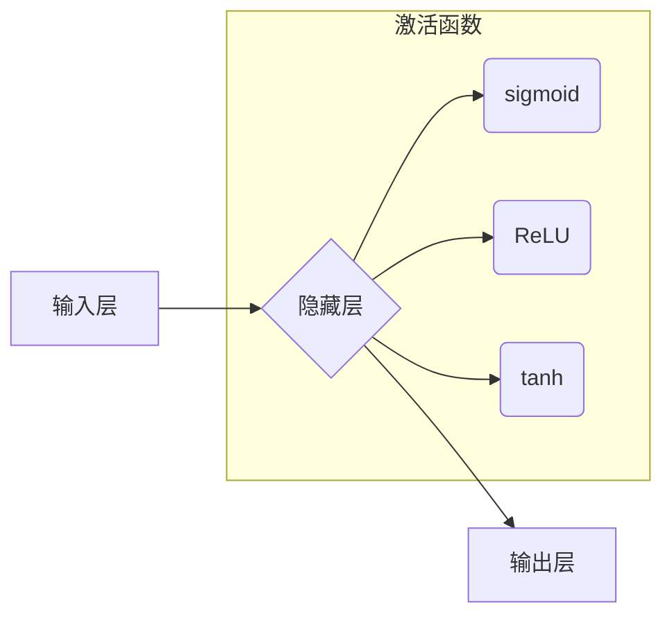

> 神经网络,深度学习,机器学习,人工智能,算法,模型,应用

## 1. 背景介绍

人类文明的发展离不开对自身认知的不断深化和对世界规律的探索。从古希腊哲学家对“万物本源”的思考，到现代科学对“宇宙起源”的探索，人类始终在追寻着理解世界和自身本质的答案。而人工智能（AI）的兴起，为我们提供了全新的视角和工具，让我们能够更深入地探索人类认知的奥秘，并将其应用于解决现实世界中的复杂问题。

神经网络作为人工智能领域的核心技术之一，以其强大的学习能力和模式识别能力，在图像识别、自然语言处理、语音识别等领域取得了突破性的进展。它不仅模拟了人类大脑的神经元结构和连接方式，更重要的是，它能够通过大量的训练数据，自动学习和提取数据的特征，从而实现对复杂问题的理解和解决。

然而，神经网络的应用也引发了一些伦理和社会问题，例如算法偏见、数据隐私、工作岗位替代等。因此，我们需要认真思考神经网络的本质，理解其工作原理，并探讨其在人类社会中的作用和未来发展方向。

## 2. 核心概念与联系

### 2.1 神经网络的基本结构

神经网络由大量的节点（神经元）组成，这些节点按照特定的层次结构连接在一起，形成一个复杂的网络结构。每个神经元接收来自其他神经元的输入信号，并对其进行处理，然后将处理后的信号传递给下一层的神经元。

神经网络的结构可以分为输入层、隐藏层和输出层。输入层接收原始数据，隐藏层对数据进行处理和提取特征，输出层输出最终的结果。

### 2.2 激活函数

激活函数是神经网络中一个重要的组成部分，它决定了神经元对输入信号的响应方式。不同的激活函数具有不同的特性，例如sigmoid函数、ReLU函数、tanh函数等。

激活函数的作用是将神经元的输入信号转换为输出信号，并引入非线性因素，使神经网络能够学习更复杂的模式。

### 2.3 权重和偏置

权重和偏置是神经网络中的参数，它们决定了神经元之间的连接强度和激活阈值。

通过训练过程，神经网络会不断调整权重和偏置的值，以最小化预测误差，从而实现对数据的学习和建模。

**Mermaid 流程图**



## 3. 核心算法原理 & 具体操作步骤

### 3.1 算法原理概述

神经网络的训练过程本质上是一个优化问题，目标是找到一组最优的权重和偏置，使得神经网络能够对输入数据进行准确的预测。

常用的训练算法包括梯度下降法、随机梯度下降法、动量法、Adam优化器等。这些算法通过不断调整权重和偏置的值，使神经网络的预测误差逐渐减小，最终达到训练目标。

### 3.2 算法步骤详解

1. **初始化权重和偏置:** 随机初始化神经网络中的权重和偏置值。

2. **前向传播:** 将输入数据传递到神经网络中，通过各层神经元的计算，得到最终的输出结果。

3. **计算损失函数:** 计算预测结果与真实结果之间的误差，使用损失函数来量化误差的大小。

4. **反向传播:** 计算损失函数对权重和偏置的梯度，即误差对权重和偏置的敏感度。

5. **更新权重和偏置:** 使用梯度下降法或其他优化算法，根据梯度信息更新权重和偏置的值，使误差逐渐减小。

6. **重复步骤2-5:** 循环进行前向传播、计算损失函数和反向传播，直到误差达到预设的阈值或训练次数达到上限。

### 3.3 算法优缺点

**优点:**

* 学习能力强，能够学习复杂的数据模式。
* 泛化能力好，能够对未知数据进行准确的预测。
* 可并行化训练，训练速度快。

**缺点:**

* 训练数据量大，需要大量的训练数据才能达到较好的效果。
* 训练过程复杂，需要专业的知识和技术。
* 容易出现过拟合问题，模型对训练数据过拟合，无法泛化到未知数据。

### 3.4 算法应用领域

神经网络的应用领域非常广泛，包括：

* **图像识别:** 人脸识别、物体检测、图像分类等。
* **自然语言处理:** 机器翻译、文本摘要、情感分析等。
* **语音识别:** 语音转文本、语音助手等。
* **推荐系统:** 商品推荐、内容推荐等。
* **医疗诊断:** 疾病诊断、影像分析等。

## 4. 数学模型和公式 & 详细讲解 & 举例说明

### 4.1 数学模型构建

神经网络的数学模型可以表示为一个多层感知机（MLP），其结构由多个神经元层组成。每个神经元接收来自上一层神经元的输入信号，并对其进行线性变换和非线性激活函数处理，最终输出到下一层神经元。

**公式:**

* **线性变换:** $z_j = \sum_{i=1}^{n} w_{ji}x_i + b_j$

* **激活函数:** $a_j = f(z_j)$

其中：

* $z_j$ 是神经元 $j$ 的线性组合结果。
* $w_{ji}$ 是神经元 $i$ 到神经元 $j$ 的权重。
* $x_i$ 是神经元 $i$ 的输入信号。
* $b_j$ 是神经元 $j$ 的偏置。
* $f(z_j)$ 是神经元 $j$ 的激活函数。
* $a_j$ 是神经元 $j$ 的输出信号。

### 4.2 公式推导过程

神经网络的训练过程是通过最小化损失函数来实现的。损失函数衡量了神经网络的预测结果与真实结果之间的误差。常用的损失函数包括均方误差（MSE）和交叉熵损失函数（CE）。

**均方误差 (MSE):**

$MSE = \frac{1}{N} \sum_{i=1}^{N} (y_i - \hat{y}_i)^2$

其中：

* $N$ 是样本数量。
* $y_i$ 是真实值。
* $\hat{y}_i$ 是预测值。

**交叉熵损失函数 (CE):**

$CE = -\frac{1}{N} \sum_{i=1}^{N} \sum_{j=1}^{C} y_{ij} \log(\hat{y}_{ij})$

其中：

* $C$ 是类别数量。
* $y_{ij}$ 是真实标签。
* $\hat{y}_{ij}$ 是预测概率。

通过梯度下降法或其他优化算法，可以计算损失函数对权重和偏置的梯度，并根据梯度信息更新权重和偏置的值，从而最小化损失函数。

### 4.3 案例分析与讲解

**图像分类案例:**

假设我们有一个图像分类任务，目标是将图像分类为猫、狗或鸟。我们可以使用一个包含多个隐藏层的卷积神经网络（CNN）来解决这个问题。

CNN 可以学习图像的特征，例如边缘、纹理和形状。通过训练 CNN，它可以学习到不同动物的特征，并能够准确地将图像分类为猫、狗或鸟。

## 5. 项目实践：代码实例和详细解释说明

### 5.1 开发环境搭建

* **操作系统:** Ubuntu 20.04 LTS
* **编程语言:** Python 3.8
* **深度学习框架:** TensorFlow 2.0
* **其他工具:** Jupyter Notebook

### 5.2 源代码详细实现

```python
import tensorflow as tf

# 定义模型结构
model = tf.keras.models.Sequential([
    tf.keras.layers.Conv2D(32, (3, 3), activation='relu', input_shape=(28, 28, 1)),
    tf.keras.layers.MaxPooling2D((2, 2)),
    tf.keras.layers.Conv2D(64, (3, 3), activation='relu'),
    tf.keras.layers.MaxPooling2D((2, 2)),
    tf.keras.layers.Flatten(),
    tf.keras.layers.Dense(10, activation='softmax')
])

# 编译模型
model.compile(optimizer='adam',
              loss='sparse_categorical_crossentropy',
              metrics=['accuracy'])

# 加载数据集
(x_train, y_train), (x_test, y_test) = tf.keras.datasets.mnist.load_data()

# 数据预处理
x_train = x_train.astype('float32') / 255.0
x_test = x_test.astype('float32') / 255.0
x_train = x_train.reshape((x_train.shape[0], 28, 28, 1))
x_test = x_test.reshape((x_test.shape[0], 28, 28, 1))

# 训练模型
model.fit(x_train, y_train, epochs=5)

# 评估模型
loss, accuracy = model.evaluate(x_test, y_test)
print('Test loss:', loss)
print('Test accuracy:', accuracy)
```

### 5.3 代码解读与分析

这段代码实现了使用 TensorFlow 框架训练一个简单的卷积神经网络来进行手写数字识别。

* **模型结构:** 代码定义了一个包含两个卷积层、两个最大池化层、一个全连接层和一个输出层的 CNN 模型。

* **模型编译:** 代码使用 Adam 优化器、稀疏类别交叉熵损失函数和准确率作为评估指标来编译模型。

* **数据加载和预处理:** 代码使用 MNIST 数据集，并对数据进行预处理，例如归一化和形状转换。

* **模型训练:** 代码使用 `model.fit()` 函数训练模型，训练 epochs=5 次。

* **模型评估:** 代码使用 `model.evaluate()` 函数评估模型在测试集上的性能。

### 5.4 运行结果展示

训练完成后，代码会输出测试集上的损失值和准确率。

## 6. 实际应用场景

### 6.1 图像识别

* **人脸识别:** 用于解锁手机、验证身份、监控安全等。
* **物体检测:** 用于自动驾驶、安防监控、工业自动化等。
* **图像分类:** 用于医疗影像诊断、产品分类、内容推荐等。

### 6.2 自然语言处理

* **机器翻译:** 将文本从一种语言翻译成另一种语言。
* **文本摘要:** 自动生成文本的简短摘要。
* **情感分析:** 分析文本的情感倾向，例如正面、负面或中性。

### 6.3 语音识别

* **语音转文本:** 将语音转换为文本，用于语音助手、听写软件等。
* **语音识别:** 将语音识别为特定的命令或指令，用于智能家居、语音控制等。

### 6.4 其他应用

* **推荐系统:** 根据用户的历史行为和偏好，推荐相关的商品、内容或服务。
* **医疗诊断:** 辅助医生进行疾病诊断，例如分析医学影像、预测患者风险等。
* **金融分析:** 分析金融数据，预测市场趋势、识别欺诈行为等。

### 6.5 未来应用展望

随着人工智能技术的不断发展，神经网络的应用场景将会更加广泛，例如：

* **个性化教育:** 根据学生的学习情况，提供个性化的学习内容和教学方法。
* **自动写作:** 自动生成新闻报道、小说、诗歌等文本内容。
* **虚拟助手:** 更智能、更人性化的虚拟助手，能够理解和响应用户的自然语言指令。

## 7. 工具和