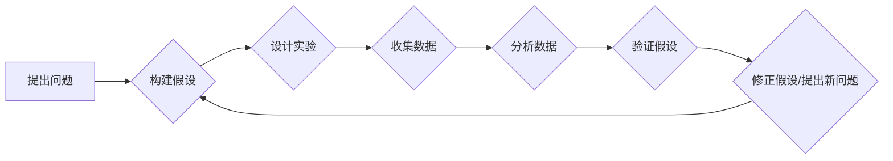

> 科学方法论，假说验证，算法设计，数学建模，代码实现，实践应用，未来趋势

## 1. 背景介绍

在瞬息万变的科技时代，创新和进步离不开科学方法论的指引。无论是软件开发、人工智能研究还是其他技术领域，科学方法论都扮演着至关重要的角色。它提供了一种系统化的思维框架，帮助我们从问题提出、假设构建到验证和改进，最终实现技术目标。

传统的科学方法论主要应用于自然科学领域，但其核心思想和步骤也同样适用于技术领域。本文将深入探讨科学方法论在技术领域的应用，并以算法设计为例，阐述其具体步骤和实践方法。

## 2. 核心概念与联系

科学方法论的核心在于“假说验证”。它强调通过观察、实验和推理来检验假设的正确性。

**流程图：**



**核心概念：**

* **问题提出:** 首先要明确需要解决的问题，并将其转化为可检验的假设。
* **假设构建:** 根据问题和现有知识，提出一个或多个关于问题的假设。
* **实验设计:** 设计一个实验方案，以便收集能够检验假设的数据。
* **数据收集:** 按照实验方案进行操作，并收集相关数据。
* **数据分析:** 对收集到的数据进行分析，以判断其是否支持或反驳假设。
* **假设验证:** 根据数据分析结果，验证假设的正确性。
* **修正假设/提出新问题:** 如果假设被证伪，则需要修正假设或提出新的假设，并重新进行实验验证。

## 3. 核心算法原理 & 具体操作步骤

### 3.1  算法原理概述

算法设计是技术领域的核心环节之一。一个好的算法能够有效解决问题，提高效率和准确性。科学方法论可以指导算法设计，帮助我们构建高效、可靠的算法。

**算法设计步骤:**

1. **明确问题:** 首先要明确需要解决的问题，并将其转化为算法的输入和输出。
2. **分析问题:** 对问题进行深入分析，了解其本质特征和约束条件。
3. **设计算法:** 根据问题分析结果，设计一个能够解决问题的算法。
4. **算法实现:** 将算法转化为具体的代码实现。
5. **算法测试:** 对算法进行测试，验证其正确性和效率。
6. **算法优化:** 根据测试结果，对算法进行优化，提高其性能。

### 3.2  算法步骤详解

以排序算法为例，详细阐述算法设计步骤：

1. **明确问题:** 需要设计一个算法，能够将一个无序的数列进行排序。
2. **分析问题:** 
    * 输入：一个无序的数列。
    * 输出：一个有序的数列。
    * 约束条件：排序算法的效率和稳定性。
3. **设计算法:** 选择合适的排序算法，例如冒泡排序、插入排序、快速排序等。
4. **算法实现:** 将选择的排序算法转化为具体的代码实现。
5. **算法测试:** 对算法进行测试，使用不同的测试数据验证其正确性和效率。
6. **算法优化:** 根据测试结果，对算法进行优化，例如改进算法的复杂度或空间复杂度。

### 3.3  算法优缺点

不同的排序算法具有不同的优缺点，需要根据实际情况选择合适的算法。

* **冒泡排序:** 
    * 优点：简单易懂，实现代码简洁。
    * 缺点：效率较低，时间复杂度为O(n^2)。
* **插入排序:** 
    * 优点：效率较高，时间复杂度为O(n^2)。
    * 缺点：对于已经排序的数列，效率较低。
* **快速排序:** 
    * 优点：效率较高，时间复杂度为平均情况下O(n log n)。
    * 缺点：最坏情况下时间复杂度为O(n^2)。

### 3.4  算法应用领域

排序算法广泛应用于各种领域，例如：

* **数据库管理:** 用于对数据库中的数据进行排序。
* **搜索引擎:** 用于对搜索结果进行排序。
* **图像处理:** 用于对图像进行排序和分类。
* **机器学习:** 用于对训练数据进行排序。

## 4. 数学模型和公式 & 详细讲解 & 举例说明

### 4.1  数学模型构建

数学模型可以帮助我们抽象和描述算法的逻辑关系。例如，冒泡排序算法可以用数学模型来表示其迭代过程。

**数学模型:**

```
for i = 1 to n-1
    for j = 1 to n-i
        if a[j] > a[j+1]
            swap(a[j], a[j+1])
```

其中，a[i]表示数列中的第i个元素，n表示数列的长度。

### 4.2  公式推导过程

我们可以推导算法的时间复杂度公式。例如，冒泡排序算法的时间复杂度为O(n^2)。

**时间复杂度推导:**

* 外层循环执行n-1次。
* 内层循环在每次外层循环执行时执行n-i次。
* 因此，总的执行次数为：

```
(n-1) + (n-2) + ... + 1 = n(n-1)/2 = O(n^2)
```

### 4.3  案例分析与讲解

通过数学模型和公式，我们可以分析算法的性能和效率。例如，我们可以比较冒泡排序和快速排序的效率，并根据实际情况选择合适的算法。

## 5. 项目实践：代码实例和详细解释说明

### 5.1  开发环境搭建

使用Python语言实现冒泡排序算法。

### 5.2  源代码详细实现

```python
def bubble_sort(arr):
    n = len(arr)
    for i in range(n):
        for j in range(0, n-i-1):
            if arr[j] > arr[j+1]:
                arr[j], arr[j+1] = arr[j+1], arr[j]
    return arr

# 测试代码
arr = [64, 34, 25, 12, 22, 11, 90]
sorted_arr = bubble_sort(arr)
print("排序后的数组:", sorted_arr)
```

### 5.3  代码解读与分析

* `bubble_sort(arr)`函数接收一个数组`arr`作为输入。
* 外层循环`for i in range(n)`控制迭代次数，每次迭代将最大的元素“冒泡”到数组末尾。
* 内层循环`for j in range(0, n-i-1)`比较相邻元素，如果顺序错误则交换位置。
* `arr[j], arr[j+1] = arr[j+1], arr[j]`使用Python的元组解包语法实现元素交换。
* 最后返回排序后的数组`sorted_arr`。

### 5.4  运行结果展示

```
排序后的数组: [11, 12, 22, 25, 34, 64, 90]
```

## 6. 实际应用场景

### 6.1  数据排序

在数据库管理系统中，排序算法用于对数据进行排序，以便快速查找和检索。

### 6.2  搜索引擎排名

搜索引擎使用排序算法对搜索结果进行排名，以便用户能够快速找到最相关的结果。

### 6.3  机器学习模型训练

机器学习模型的训练过程通常需要对数据进行排序，以便算法能够有效地学习和预测。

### 6.4  未来应用展望

随着人工智能和机器学习技术的不断发展，排序算法将在更多领域得到应用，例如：

* **个性化推荐:** 根据用户的行为和偏好，对商品或内容进行排序，提供个性化推荐。
* **自动驾驶:** 对传感器数据进行排序，帮助自动驾驶系统做出决策。
* **医疗诊断:** 对患者的医疗数据进行排序，辅助医生进行诊断和治疗。

## 7. 工具和资源推荐

### 7.1  学习资源推荐

* **书籍:**
    * 《算法导论》
    * 《数据结构与算法分析》
* **在线课程:**
    * Coursera: 数据结构与算法
    * edX: 算法导论

### 7.2  开发工具推荐

* **Python:** 
    * 语言特性简单易懂，广泛应用于数据科学和机器学习领域。
* **Java:** 
    * 性能稳定，适合开发大型应用程序。
* **C++:** 
    * 性能优异，适合开发高性能应用程序。

### 7.3  相关论文推荐

* **The Art of Computer Programming** by Donald Knuth
* **Introduction to Algorithms** by Thomas H. Cormen, Charles E. Leiserson, Ronald L. Rivest, and Clifford Stein

## 8. 总结：未来发展趋势与挑战

### 8.1  研究成果总结

科学方法论为技术领域提供了有效的思维框架和实践方法，帮助我们构建高效、可靠的算法和解决方案。

### 8.2  未来发展趋势

随着人工智能和机器学习技术的不断发展，算法设计将面临新的挑战和机遇。未来，算法设计将更加注重：

* **自动化:** 利用机器学习等技术自动生成算法。
* **可解释性:** 设计能够解释其决策过程的算法。
* **鲁棒性:** 设计能够应对噪声和不确定性的算法。

### 8.3  面临的挑战

* **算法复杂度:** 设计能够处理海量数据的算法。
* **数据隐私:** 保护数据隐私的同时实现算法的有效性。
* **伦理问题:** 确保算法的公平性和公正性。

### 8.4  研究展望

未来，我们将继续探索科学方法论在技术领域的应用，并致力于开发更加高效、可靠、可解释和鲁棒的算法，为人类社会创造更大的价值。

## 9. 附录：常见问题与解答

### 9.1  常见问题

* 如何选择合适的排序算法？
* 如何优化算法的性能？
* 如何评估算法的效率？

### 9.2  解答

* 选择合适的排序算法需要根据实际情况考虑，例如数据量、数据类型、排序顺序等。
* 优化算法的性能可以通过改进算法的复杂度、空间复杂度、代码实现等方式实现。
* 评估算法的效率可以通过时间复杂度、空间复杂度、运行时间等指标进行评估。


作者：禅与计算机程序设计艺术 / Zen and the Art of Computer Programming 
<end_of_turn>