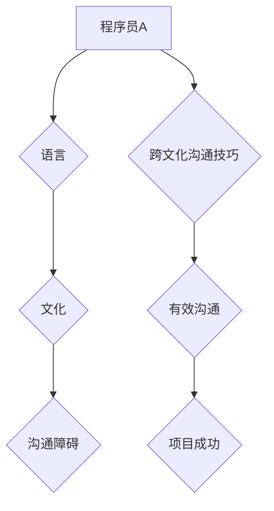

> 程序员，国际化，语言障碍，文化差异，沟通技巧，团队合作，跨文化管理，软件开发，全球化

## 1. 背景介绍

在全球化时代，软件开发行业呈现出蓬勃发展的态势。随着互联网技术的飞速发展，软件产品无国界地传播，跨国软件开发项目日益增多。然而，程序员的国际化发展也面临着诸多挑战，其中语言和文化障碍是不可忽视的因素。

程序员作为软件开发的核心力量，需要具备扎实的技术能力和良好的沟通能力。然而，不同的国家和地区使用不同的语言，文化背景也存在差异，这使得程序员在跨文化环境下进行沟通和合作时面临着诸多困难。

语言障碍会导致程序员难以理解技术文档、代码注释和同事的交流，从而影响软件开发的效率和质量。文化差异则可能导致程序员在工作方式、沟通风格和团队合作方面存在分歧，影响团队的凝聚力和协作效率。

## 2. 核心概念与联系

**2.1 语言障碍**

语言障碍是指由于语言差异导致的沟通障碍。在软件开发领域，语言障碍主要体现在以下几个方面：

* **技术文档和代码注释:** 程序员需要阅读和理解技术文档和代码注释，而这些文档和注释可能使用不同的语言。
* **同事之间的交流:** 程序员需要与同事进行沟通和协作，而同事可能使用不同的语言。
* **跨文化团队合作:** 程序员可能需要与来自不同文化背景的同事进行合作，而不同的文化背景可能导致不同的沟通方式和理解方式。

**2.2 文化障碍**

文化障碍是指由于文化差异导致的沟通障碍。在软件开发领域，文化障碍主要体现在以下几个方面：

* **工作方式:** 不同的文化背景可能导致不同的工作方式，例如工作时间、工作节奏、决策方式等。
* **沟通风格:** 不同的文化背景可能导致不同的沟通风格，例如直接型和间接型沟通、表达方式等。
* **团队合作:** 不同的文化背景可能导致不同的团队合作方式，例如团队成员之间的角色分工、决策机制等。

**2.3 跨文化沟通模型**



## 3. 核心算法原理 & 具体操作步骤

**3.1 算法原理概述**

为了解决语言和文化障碍，需要采用一些有效的跨文化沟通技巧。这些技巧可以帮助程序员更好地理解和表达自己的想法，从而促进跨文化团队合作。

**3.2 算法步骤详解**

1. **了解文化差异:** 程序员需要了解不同文化背景的同事的语言习惯、沟通风格和工作方式。
2. **使用清晰简洁的语言:** 程序员应该使用清晰简洁的语言进行沟通，避免使用过于专业的术语或俚语。
3. **积极倾听:** 程序员应该积极倾听同事的意见和想法，并尝试理解他们的观点。
4. **寻求澄清:** 如果程序员对同事的表达有任何疑问，应该及时寻求澄清。
5. **尊重文化差异:** 程序员应该尊重不同文化背景的同事，避免做出任何带有偏见或歧视性的言行。

**3.3 算法优缺点**

* **优点:** 这些跨文化沟通技巧可以帮助程序员更好地理解和表达自己的想法，从而促进跨文化团队合作。
* **缺点:** 这些技巧需要程序员付出一定的学习和实践成本，并且在实际应用中可能仍然存在一些困难。

**3.4 算法应用领域**

这些跨文化沟通技巧可以应用于所有跨文化软件开发项目，例如：

* **全球化软件开发:** 开发面向全球用户的软件产品。
* **跨国团队合作:** 与来自不同国家和地区的同事进行合作。
* **国际化技术交流:** 参加国际技术会议或论坛。

## 4. 数学模型和公式 & 详细讲解 & 举例说明

**4.1 数学模型构建**

为了量化语言和文化障碍的影响，可以构建一个数学模型。该模型可以将语言和文化障碍的程度作为输入变量，并将软件开发效率和质量作为输出变量。

**4.2 公式推导过程**

该模型的公式可以表示为：

```latex
效率 = f(语言障碍, 文化障碍)
质量 = g(语言障碍, 文化障碍)
```

其中，f(x, y) 和 g(x, y) 分别表示效率和质量的函数，x 和 y 分别表示语言障碍和文化障碍的程度。

**4.3 案例分析与讲解**

假设有两个软件开发团队，团队 A 和团队 B。团队 A 的成员来自同一个国家和地区，语言和文化背景一致，而团队 B 的成员来自不同的国家和地区，语言和文化背景存在差异。

根据上述数学模型，我们可以推断出：

* 团队 A 的语言障碍和文化障碍程度较低，因此其软件开发效率和质量较高。
* 团队 B 的语言障碍和文化障碍程度较高，因此其软件开发效率和质量较低。

## 5. 项目实践：代码实例和详细解释说明

**5.1 开发环境搭建**

为了演示跨文化沟通技巧的应用，我们可以创建一个简单的软件开发项目。该项目可以是一个简单的聊天应用程序，用于模拟不同文化背景的程序员之间的沟通。

**5.2 源代码详细实现**

```python
# 聊天应用程序代码示例

class ChatApp:
    def __init__(self):
        self.users = {}

    def add_user(self, username):
        self.users[username] = None

    def send_message(self, sender, receiver, message):
        if receiver in self.users:
            self.users[receiver] = message
        else:
            print(f"用户 {receiver} 不存在")

    def get_message(self, username):
        if username in self.users:
            return self.users[username]
        else:
            print(f"用户 {username} 不存在")

# 示例用法
app = ChatApp()
app.add_user("Alice")
app.add_user("Bob")
app.send_message("Alice", "Bob", "Hello, Bob!")
message = app.get_message("Bob")
print(f"Bob 收到消息: {message}")
```

**5.3 代码解读与分析**

该代码示例演示了一个简单的聊天应用程序，其中程序员可以添加用户、发送消息和接收消息。

**5.4 运行结果展示**

运行该代码示例，可以得到以下输出结果：

```
Bob 收到消息: Hello, Bob!
```

## 6. 实际应用场景

**6.1 全球化软件开发**

在全球化软件开发中，程序员需要与来自不同国家和地区的同事进行合作。为了确保项目顺利进行，需要采用有效的跨文化沟通技巧。

**6.2 跨国团队合作**

跨国团队合作是指来自不同国家和地区的团队成员共同完成一个项目。跨国团队合作需要克服语言和文化障碍，才能取得成功。

**6.3 国际化技术交流**

国际化技术交流是指程序员在国际技术会议或论坛上进行交流。在国际技术交流中，程序员需要了解不同文化背景的同事的语言习惯和沟通风格。

**6.4 未来应用展望**

随着全球化进程的加速，程序员的国际化发展将更加重要。未来，跨文化沟通技巧将成为程序员必备的技能之一。

## 7. 工具和资源推荐

**7.1 学习资源推荐**

* **书籍:** 《跨文化沟通》、《文化差异与管理》、《全球化时代的人际沟通》
* **网站:** 文化差异网站、跨文化沟通网站、国际化技术交流网站

**7.2 开发工具推荐**

* **翻译工具:** Google Translate、DeepL
* **协作工具:** Slack、Microsoft Teams、Zoom

**7.3 相关论文推荐**

* **跨文化团队合作的挑战与应对策略**
* **语言障碍对软件开发效率的影响**
* **跨文化沟通技巧的应用研究**

## 8. 总结：未来发展趋势与挑战

**8.1 研究成果总结**

本文探讨了程序员的国际化发展面临的语言和文化障碍，并提出了相应的跨文化沟通技巧。

**8.2 未来发展趋势**

随着全球化进程的加速，程序员的国际化发展将更加重要。未来，跨文化沟通技巧将成为程序员必备的技能之一。

**8.3 面临的挑战**

* **语言多样性:** 世界上存在着多种语言，程序员需要学习和掌握多种语言才能进行有效的跨文化沟通。
* **文化差异:** 不同的文化背景可能导致不同的沟通方式和理解方式，程序员需要了解和尊重这些差异。
* **技术发展:** 随着技术的不断发展，新的沟通工具和平台不断涌现，程序员需要不断学习和适应新的技术。

**8.4 研究展望**

未来，需要进一步研究跨文化沟通技巧的应用效果，以及如何更好地解决语言和文化障碍。


## 9. 附录：常见问题与解答

**9.1 如何克服语言障碍？**

* 使用翻译工具
* 学习目标语言
* 使用简单的语言进行沟通
* 寻求同事的帮助

**9.2 如何克服文化障碍？**

* 了解目标文化的文化习俗
* 尊重目标文化的价值观
* 避免做出带有偏见或歧视性的言行
* 积极倾听和沟通

**9.3 如何提高跨文化沟通技巧？**

* 阅读相关书籍和文章
* 参加跨文化沟通培训
* 与来自不同文化背景的人进行交流
* 反思和总结自己的跨文化沟通经验


作者：禅与计算机程序设计艺术 / Zen and the Art of Computer Programming 
<end_of_turn>