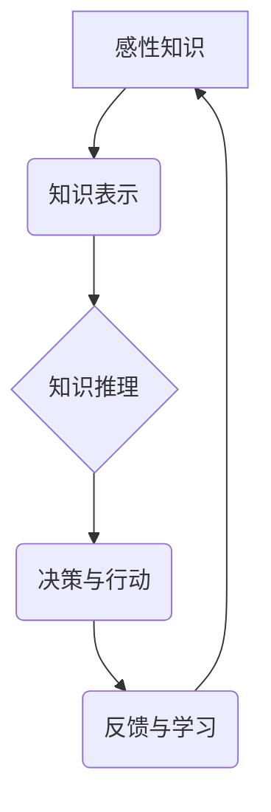

> 感性知识，人工智能，深度学习，知识图谱，自然语言处理，机器学习

## 1. 背景介绍

人工智能（AI）的发展历程可以概括为三个阶段：第一代人工智能（1950s-1970s）以符号逻辑和规则系统为主，但受限于知识的表达和推理能力；第二代人工智能（1980s-2000s）以专家系统和机器学习为主，取得了一些突破，但仍然难以处理复杂、开放世界的知识；第三代人工智能（2010s至今）以深度学习和神经网络为主，展现出强大的学习和适应能力，但仍然缺乏对人类情感、直觉和创造力的理解。

当前，人工智能技术已经取得了显著的进展，但在许多领域仍然面临着挑战。例如，在自然语言处理领域，虽然机器已经能够进行基本的文本理解和生成，但仍然难以理解复杂的语义和情感；在计算机视觉领域，虽然机器已经能够识别和分类图像，但仍然难以理解图像中的场景和故事。这些挑战表明，人工智能技术还需要进一步发展，才能真正像人类一样智能。

## 2. 核心概念与联系

感性知识是指人类通过情感、直觉、经验和想象力获得的知识，它是一种非逻辑、非理性、非可量化的知识。它包含着人类的情感、价值观、信念和文化背景等信息，是人类认知和行为的重要组成部分。

**感性知识与人工智能的结合**

将感性知识融入人工智能系统，可以帮助人工智能更好地理解和处理人类语言、图像、音乐等复杂信息，从而提升人工智能的智能水平。

**核心概念原理和架构**



## 3. 核心算法原理 & 具体操作步骤

### 3.1  算法原理概述

感性知识的传授需要结合深度学习、自然语言处理、知识图谱等技术，构建一个能够理解和表达感性知识的模型。

### 3.2  算法步骤详解

1. **感性知识的采集和标注:** 从文本、图像、音频等多种数据源中采集感性知识，并进行标注，例如情感标签、主题标签、意图标签等。
2. **感性知识的表示:** 将感性知识表示为计算机可理解的形式，例如词向量、知识图谱、情感词典等。
3. **感性知识的推理:** 利用深度学习模型，例如循环神经网络（RNN）、长短期记忆网络（LSTM）、Transformer等，对感性知识进行推理，例如情感分析、意图识别、文本生成等。
4. **感性知识的应用:** 将推理结果应用于实际场景，例如聊天机器人、情感分析系统、个性化推荐系统等。

### 3.3  算法优缺点

**优点:**

* 可以提升人工智能的理解和表达能力，使其能够更好地理解和处理人类语言、图像、音乐等复杂信息。
* 可以使人工智能系统更加人性化，能够更好地与人类进行交互。

**缺点:**

* 感性知识的采集和标注难度较大，需要大量的标注数据和专业知识。
* 感性知识的表示和推理仍然是一个挑战，需要进一步的研究和探索。

### 3.4  算法应用领域

* **自然语言处理:** 情感分析、意图识别、文本生成、机器翻译等。
* **计算机视觉:** 情感识别、场景理解、图像生成等。
* **语音识别:** 语音情感识别、语音合成等。
* **个性化推荐:** 基于情感和兴趣的个性化推荐。
* **医疗保健:** 情感分析辅助诊断、患者情绪管理等。

## 4. 数学模型和公式 & 详细讲解 & 举例说明

### 4.1  数学模型构建

感性知识的传授可以利用深度学习模型，例如循环神经网络（RNN）和长短期记忆网络（LSTM），构建一个能够理解和表达感性知识的数学模型。

**RNN模型:**

RNN模型是一种能够处理序列数据的深度学习模型，它具有记忆单元，能够记住之前的信息，从而更好地理解上下文信息。

**LSTM模型:**

LSTM模型是一种改进的RNN模型，它具有更强大的记忆能力，能够更好地处理长序列数据。

### 4.2  公式推导过程

RNN和LSTM模型的具体公式推导过程比较复杂，这里不再赘述。

### 4.3  案例分析与讲解

**情感分析案例:**

利用LSTM模型对文本进行情感分析，例如判断一段文本是正面、负面还是中性。

**训练数据:**

收集大量的文本数据，并标注其情感标签。

**模型训练:**

利用训练数据训练LSTM模型，使其能够学习到文本情感与词语之间的关系。

**模型预测:**

将新的文本输入到训练好的LSTM模型中，模型会输出文本的情感标签。

## 5. 项目实践：代码实例和详细解释说明

### 5.1  开发环境搭建

使用Python语言和相关的深度学习框架，例如TensorFlow或PyTorch，搭建开发环境。

### 5.2  源代码详细实现

```python
# 使用TensorFlow搭建LSTM模型
import tensorflow as tf

# 定义模型结构
model = tf.keras.Sequential([
    tf.keras.layers.Embedding(input_dim=vocab_size, output_dim=embedding_dim),
    tf.keras.layers.LSTM(units=128),
    tf.keras.layers.Dense(units=num_classes, activation='softmax')
])

# 编译模型
model.compile(optimizer='adam',
              loss='sparse_categorical_crossentropy',
              metrics=['accuracy'])

# 训练模型
model.fit(x_train, y_train, epochs=10)

# 预测结果
predictions = model.predict(x_test)
```

### 5.3  代码解读与分析

* **Embedding层:** 将词语映射到低维向量空间，捕捉词语之间的语义关系。
* **LSTM层:** 处理文本序列数据，学习文本的上下文信息。
* **Dense层:** 全连接层，输出情感标签的概率分布。
* **编译模型:** 选择优化器、损失函数和评价指标。
* **训练模型:** 使用训练数据训练模型，更新模型参数。
* **预测结果:** 将新的文本输入到训练好的模型中，预测其情感标签。

### 5.4  运行结果展示

训练完成后，可以评估模型的性能，例如准确率、召回率、F1-score等。

## 6. 实际应用场景

### 6.1  聊天机器人

将感性知识融入聊天机器人，使其能够更好地理解用户的意图和情感，提供更自然、更人性化的对话体验。

### 6.2  情感分析系统

利用感性知识进行情感分析，例如分析用户对产品的评价、对新闻事件的看法等，帮助企业了解用户情绪，改进产品和服务。

### 6.3  个性化推荐系统

根据用户的兴趣、偏好和情感，提供个性化的商品、内容和服务推荐。

### 6.4  未来应用展望

感性知识的传授将推动人工智能技术的发展，使其能够更好地理解和模拟人类的情感、直觉和创造力。未来，感性知识将应用于更多领域，例如教育、医疗、艺术等，为人类社会带来更多福祉。

## 7. 工具和资源推荐

### 7.1  学习资源推荐

* **书籍:**
    * 《深度学习》
    * 《自然语言处理》
    * 《人工智能：一种现代方法》
* **在线课程:**
    * Coursera
    * edX
    * Udacity

### 7.2  开发工具推荐

* **深度学习框架:** TensorFlow, PyTorch, Keras
* **自然语言处理库:** NLTK, spaCy, Gensim
* **数据可视化工具:** Matplotlib, Seaborn

### 7.3  相关论文推荐

* **情感分析:**
    * "Sentiment Analysis Using Deep Learning"
    * "A Survey of Sentiment Analysis Techniques"
* **知识图谱:**
    * "Knowledge Graph Embedding: A Survey"
    * "TransE: Embedding Entities and Relations for Learning and Inference"

## 8. 总结：未来发展趋势与挑战

### 8.1  研究成果总结

感性知识的传授是人工智能领域的一个重要研究方向，它将推动人工智能技术的发展，使其能够更好地理解和模拟人类的情感、直觉和创造力。

### 8.2  未来发展趋势

* **更强大的感性知识表示:** 开发更有效的算法和模型，能够更好地表示和理解感性知识。
* **跨模态感性知识传授:** 将感性知识应用于多模态数据，例如文本、图像、音频等，实现跨模态的感性知识理解和表达。
* **个性化感性知识传授:** 根据用户的个性化需求，提供定制化的感性知识传授服务。

### 8.3  面临的挑战

* **感性知识的定义和量化:** 感性知识是一种非逻辑、非理性、非可量化的知识，如何对其进行定义和量化仍然是一个挑战。
* **感性知识的表示和推理:** 如何将感性知识表示为计算机可理解的形式，并进行有效的推理，仍然是一个技术难题。
* **数据标注和隐私保护:** 感性知识的采集和标注需要大量的标注数据，如何保证数据质量和隐私保护是一个重要问题。

### 8.4  研究展望

未来，感性知识的传授将成为人工智能领域的一个重要研究方向，它将推动人工智能技术的发展，使其能够更好地理解和模拟人类的情感、直觉和创造力。


## 9. 附录：常见问题与解答

**Q1: 感性知识与逻辑知识有什么区别？**

**A1:** 感性知识是指人类通过情感、直觉、经验和想象力获得的知识，它是一种非逻辑、非理性、非可量化的知识。而逻辑知识是指基于逻辑推理和规则系统获得的知识，它是一种可量化、可推理的知识。

**Q2: 如何采集和标注感性知识？**

**A2:** 感性知识的采集可以从文本、图像、音频等多种数据源中进行，例如用户评论、社交媒体帖子、艺术作品等。标注感性知识需要专业人员进行人工标注，例如情感标签、主题标签、意图标签等。

**Q3: 感性知识的传授有哪些应用场景？**

**A3:** 感性知识的传授可以应用于聊天机器人、情感分析系统、个性化推荐系统等多个领域。

**Q4: 感性知识的传授面临哪些挑战？**

**A4:** 感性知识的传授面临着感性知识的定义和量化、表示和推理、数据标注和隐私保护等挑战。


作者：禅与计算机程序设计艺术 / Zen and the Art of Computer Programming 
<end_of_turn>