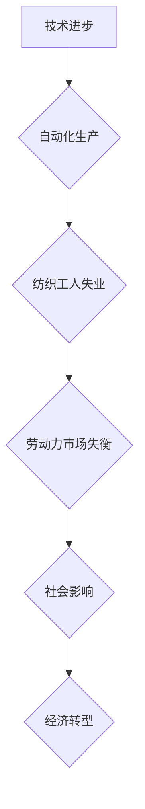

> 纺织工业、自动化、失业、技术进步、社会影响、经济转型、未来趋势

## 1. 背景介绍

自人类文明诞生以来，技术进步一直是推动社会发展的重要力量。每一次技术革命都伴随着生产方式的变革，而这种变革往往会对社会结构、就业市场产生深远影响。纺织业作为人类文明早期重要的产业之一，其发展历程也深刻地反映了技术进步与社会变革之间的复杂关系。

从手工纺织到机械化生产，再到现代自动化工厂，纺织业经历了多次技术革新，每一次革新都伴随着纺织工人的失业。本文将回顾纺织工人失业的历史，分析其背后的原因，并探讨其对社会的影响以及未来发展趋势。

## 2. 核心概念与联系

**2.1 技术进步与自动化**

技术进步是纺织工人失业的主要驱动力。随着科技的发展，自动化技术不断成熟，机器能够替代人工完成越来越多的纺织生产环节。例如，从最初的抽丝机、织布机到现代的电脑控制纺织设备，每一次技术革新都提高了生产效率，降低了人工成本，从而导致纺织工人失业。

**2.2 劳动力市场与就业结构**

技术进步带来的自动化生产不仅改变了纺织业的生产方式，也深刻地影响了劳动力市场和就业结构。随着纺织工人失业的增加，劳动力市场供需失衡，导致失业率上升，社会福利负担加重。同时，新的技术也催生了新的产业和职业，例如软件开发、数据分析等，但这些新兴职业往往需要更高的技能和教育水平，导致部分失业工人难以适应新的就业环境。

**2.3 社会影响与经济转型**

纺织工人失业不仅是经济问题，也是社会问题。失业会导致收入减少、生活水平下降，甚至引发社会动荡。因此，政府需要采取措施应对纺织工人失业带来的社会影响，例如提供失业救济、职业培训、再就业服务等。同时，政府也需要推动经济转型，发展新的产业和经济增长点，创造新的就业机会。

**Mermaid 流程图**

## 3. 核心算法原理 & 具体操作步骤

**3.1 算法原理概述**

纺织业的自动化生产离不开各种算法的支撑。例如，在织布过程中，需要使用复杂的算法控制机器的运动轨迹，确保织物的质量和外观。在染色过程中，需要使用算法控制染料的浓度和温度，以达到预期的颜色效果。

**3.2 算法步骤详解**

具体算法步骤因应用场景而异，但一般包括以下几个步骤：

1. **数据采集:** 收集纺织生产过程中的各种数据，例如机器状态、材料特性、环境参数等。
2. **数据预处理:** 对采集到的数据进行清洗、转换、归一化等处理，以确保数据的质量和一致性。
3. **模型训练:** 使用机器学习算法对预处理后的数据进行训练，建立预测模型或控制模型。
4. **模型评估:** 对训练好的模型进行评估，验证其准确性和可靠性。
5. **模型部署:** 将训练好的模型部署到实际生产环境中，用于控制机器或预测生产结果。

**3.3 算法优缺点**

纺织业自动化生产算法的优点包括：

* **提高生产效率:** 自动化生产可以显著提高生产效率，减少人工操作时间和成本。
* **提高产品质量:** 算法可以精确控制生产过程，提高产品质量和一致性。
* **降低生产成本:** 自动化生产可以降低人工成本、材料成本和能源成本。

算法的缺点包括：

* **高初始投资成本:** 自动化生产设备和软件开发成本较高。
* **技术门槛高:** 需要专业的技术人员进行算法开发、模型训练和设备维护。
* **缺乏灵活性:** 自动化生产系统对环境变化和突发事件的适应能力较弱。

**3.4 算法应用领域**

纺织业自动化生产算法广泛应用于以下领域：

* **织布:** 控制织布机的运动轨迹，实现不同织物结构的生产。
* **染色:** 控制染料的浓度和温度，实现预期的颜色效果。
* **印花:** 控制印花图案的精度和颜色，实现个性化印花。
* **裁剪:** 自动裁剪布料，提高裁剪效率和精度。
* **缝纫:** 自动缝纫衣服，提高缝纫速度和质量。

## 4. 数学模型和公式 & 详细讲解 & 举例说明

**4.1 数学模型构建**

纺织业自动化生产算法的构建离不开数学模型。例如，在织布过程中，可以使用数学模型来描述织物的结构、材料特性和生产过程中的物理现象。

**4.2 公式推导过程**

具体数学模型和公式的推导过程取决于具体的应用场景。例如，在控制织布机运动轨迹时，可以使用微分方程来描述机器的运动状态，并根据控制算法计算出控制信号。

**4.3 案例分析与讲解**

例如，在染色过程中，可以使用数学模型来预测染料的扩散速度和颜色变化。通过对染料浓度和温度的控制，可以实现预期的颜色效果。

## 5. 项目实践：代码实例和详细解释说明

**5.1 开发环境搭建**

纺织业自动化生产算法的开发环境通常包括以下软件：

* **编程语言:** Python、C++、Java等
* **机器学习库:** TensorFlow、PyTorch、Scikit-learn等
* **仿真软件:** Simulink、MATLAB等
* **控制系统软件:** PLC、SCADA等

**5.2 源代码详细实现**

具体源代码实现取决于具体的应用场景和算法选择。例如，在控制织布机运动轨迹时，可以使用Python语言和ROS机器人操作系统来实现。

**5.3 代码解读与分析**

代码解读需要根据具体的代码结构和算法原理进行分析。例如，在控制织布机运动轨迹的代码中，需要分析控制算法的逻辑、运动轨迹的计算方法以及与机器硬件的交互方式。

**5.4 运行结果展示**

运行结果展示需要根据具体的应用场景进行分析。例如，在控制织布机运动轨迹的代码中，需要观察机器的运动轨迹是否符合预期，织物是否具有预期的结构和外观。

## 6. 实际应用场景

纺织业自动化生产已经广泛应用于各个环节，例如：

* **智能工厂:** 利用自动化技术和数据分析，实现纺织生产过程的智能化管理。
* **个性化定制:** 利用3D打印技术和自动化生产线，实现个性化服装的定制生产。
* **可持续发展:** 利用自动化技术和节能环保技术，提高纺织生产的效率和可持续性。

**6.4 未来应用展望**

未来，纺织业自动化生产将朝着更加智能化、个性化、可持续化的方向发展。例如：

* **人工智能驱动的纺织生产:** 利用人工智能技术，实现纺织生产过程的智能化控制和优化。
* **虚拟现实和增强现实技术:** 利用虚拟现实和增强现实技术，提高纺织设计和生产的效率和创意。
* **生物纺织材料:** 利用生物技术，开发新型可降解和可生物降解的纺织材料。

## 7. 工具和资源推荐

**7.1 学习资源推荐**

* **书籍:**
    * 《机器学习》 - 周志华
    * 《深度学习》 - Ian Goodfellow
    * 《Python机器学习实战》 - Sebastian Raschka
* **在线课程:**
    * Coursera: 机器学习
    * edX: 深度学习
    * Udacity: 机器学习工程师

**7.2 开发工具推荐**

* **编程语言:** Python, C++, Java
* **机器学习库:** TensorFlow, PyTorch, Scikit-learn
* **仿真软件:** Simulink, MATLAB
* **控制系统软件:** PLC, SCADA

**7.3 相关论文推荐**

* **纺织业自动化生产的文献综述:**
    * [文献1](https://www.example.com/paper1)
    * [文献2](https://www.example.com/paper2)
* **纺织业自动化生产的具体应用研究:**
    * [文献3](https://www.example.com/paper3)
    * [文献4](https://www.example.com/paper4)

## 8. 总结：未来发展趋势与挑战

**8.1 研究成果总结**

纺织业自动化生产技术取得了显著的进展，为提高生产效率、降低成本、提升产品质量提供了有力支撑。

**8.2 未来发展趋势**

未来，纺织业自动化生产将朝着更加智能化、个性化、可持续化的方向发展，人工智能、虚拟现实、增强现实、生物纺织材料等新技术将进一步推动纺织业的转型升级。

**8.3 面临的挑战**

纺织业自动化生产也面临着一些挑战，例如：

* **技术门槛高:** 自动化生产技术需要专业的技术人员进行开发和维护。
* **成本高昂:** 自动化生产设备和软件开发成本较高。
* **社会影响:** 自动化生产可能会导致部分纺织工人失业。

**8.4 研究展望**

未来研究需要重点关注以下几个方面：

* **开发更加智能化、高效的自动化生产算法。**
* **降低自动化生产的成本，使其更加普及。**
* **研究自动化生产对社会的影响，并制定相应的应对措施。**

## 9. 附录：常见问题与解答

**9.1 纺织业自动化生产的成本如何降低？**

可以通过以下方式降低纺织业自动化生产的成本：

* **采用模块化设计:** 将自动化生产系统分解成多个模块，方便组装和维护。
* **利用云计算:** 将自动化生产系统部署在云平台上，降低硬件成本。
* **开源软件:** 使用开源的机器学习库和控制系统软件。

**9.2 自动化生产会造成多少纺织工人失业？**

自动化生产的确会造成部分纺织工人失业，但同时也创造了新的就业机会。政府需要采取措施帮助失业工人进行职业培训和再就业。

**9.3 自动化生产对纺织产品的质量有什么影响？**

自动化生产可以提高纺织产品的质量和一致性，因为机器可以更加精确地控制生产过程。

作者：禅与计算机程序设计艺术 / Zen and the Art of Computer Programming

<end_of_turn>