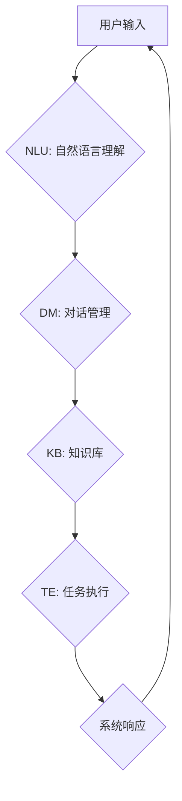

> 虚拟助理，AI代理，自然语言处理，机器学习，对话系统，深度学习，知识图谱，强化学习

## 1. 背景介绍

虚拟助理，也称为AI代理，近年来备受关注，其核心是利用人工智能技术，构建能够理解和响应人类指令的智能系统。从智能手机的语音助手到智能家居的控制中心，虚拟助理已渗透到我们的日常生活，为我们提供便捷、高效的服务。

构建一个功能强大的虚拟助理并非易事，它需要整合多种人工智能技术，包括自然语言处理（NLP）、机器学习（ML）、对话系统、深度学习等。本文将深入探讨构建AI代理的工作流程，从核心概念到实际应用，为您提供全面的指南。

## 2. 核心概念与联系

**2.1 虚拟助理的定义**

虚拟助理是一种能够理解和响应人类指令的智能系统，它可以执行各种任务，例如：

* **信息查询:** 提供天气预报、新闻资讯、股票信息等。
* **日程安排:** 设置提醒、安排会议、管理待办事项。
* **设备控制:** 控制智能家居设备，例如灯光、空调、电视等。
* **娱乐服务:** 播放音乐、视频、播客等。
* **个性化服务:** 根据用户的喜好和习惯提供定制化的服务。

**2.2 AI代理的架构**

AI代理的架构通常由以下几个模块组成：

* **自然语言理解 (NLU):** 负责将用户输入的自然语言转换为机器可理解的格式，例如实体识别、意图分类、关系抽取等。
* **对话管理 (DM):** 负责管理对话流程，根据用户意图和上下文进行响应，并引导对话走向目标。
* **知识库 (KB):** 存储各种知识和信息，例如事实、规则、概念等，为对话系统提供知识支持。
* **任务执行 (TE):** 负责执行用户指令，例如查询信息、控制设备、发送邮件等。

**2.3 核心技术**

构建AI代理需要整合多种核心技术，包括：

* **自然语言处理 (NLP):** 包括词法分析、语法分析、语义分析等，用于理解和处理自然语言。
* **机器学习 (ML):** 包括监督学习、无监督学习、强化学习等，用于训练模型，提高代理的智能水平。
* **深度学习 (DL):** 一种更高级的机器学习方法，利用多层神经网络，能够处理更复杂的数据和任务。
* **知识图谱 (KG):** 一种结构化的知识表示形式，可以存储和推理各种知识关系。

**2.4 Mermaid 流程图**



## 3. 核心算法原理 & 具体操作步骤

### 3.1 算法原理概述

构建AI代理的核心算法包括：

* **词嵌入:** 将单词映射到向量空间，捕捉单词之间的语义关系。
* **序列标注:** 用于实体识别、意图分类等任务，预测每个单词的标签。
* **对话状态跟踪:** 用于维护对话上下文，跟踪对话历史和用户意图。
* **强化学习:** 用于训练代理，使其能够在交互过程中不断学习和改进。

### 3.2 算法步骤详解

**3.2.1 词嵌入**

1. **预训练词向量:** 使用大量的文本数据训练预训练词向量模型，例如Word2Vec、GloVe等。
2. **词向量映射:** 将用户输入的单词映射到预训练词向量空间。

**3.2.2 序列标注**

1. **特征提取:** 从输入序列中提取特征，例如单词本身、词性、语法结构等。
2. **模型训练:** 使用训练数据训练序列标注模型，例如条件随机场 (CRF)、循环神经网络 (RNN) 等。
3. **预测标签:** 将输入序列输入到训练好的模型中，预测每个单词的标签。

**3.2.3 对话状态跟踪**

1. **状态表示:** 使用向量或其他数据结构表示对话状态，包括用户意图、对话历史等。
2. **状态更新:** 根据用户输入更新对话状态。
3. **状态预测:** 使用模型预测下一个对话状态。

**3.2.4 强化学习**

1. **奖励函数设计:** 设计一个奖励函数，根据代理的行为和对话结果给予奖励。
2. **策略训练:** 使用强化学习算法，例如Q学习、策略梯度等，训练代理策略，使其能够最大化奖励。

### 3.3 算法优缺点

**3.3.1 词嵌入**

* **优点:** 可以捕捉单词之间的语义关系，提高模型的理解能力。
* **缺点:** 对于罕见单词的表示可能不够准确。

**3.3.2 序列标注**

* **优点:** 可以用于各种序列标注任务，例如实体识别、意图分类等。
* **缺点:** 对于长序列的处理能力有限。

**3.3.3 对话状态跟踪**

* **优点:** 可以维护对话上下文，提高代理的对话能力。
* **缺点:** 需要设计复杂的模型和状态表示方法。

**3.3.4 强化学习**

* **优点:** 可以训练代理使其能够在交互过程中不断学习和改进。
* **缺点:** 需要大量的训练数据和计算资源。

### 3.4 算法应用领域

* **聊天机器人:** 提供智能对话服务。
* **虚拟助手:** 执行用户指令，提供便捷服务。
* **客服机器人:** 自动处理客户咨询，提高服务效率。
* **教育机器人:** 提供个性化学习辅导。
* **医疗机器人:** 辅助医生诊断和治疗。

## 4. 数学模型和公式 & 详细讲解 & 举例说明

### 4.1 数学模型构建

**4.1.1 词嵌入模型**

词嵌入模型通常使用神经网络结构，例如Word2Vec或GloVe，将单词映射到向量空间。

**Word2Vec模型**

Word2Vec模型使用神经网络来学习词向量表示。它主要有两种架构：

* **CBOW (Continuous Bag-of-Words):** 预测中心词，根据上下文词向量进行预测。
* **Skip-gram:** 预测上下文词，根据中心词向量进行预测。

**GloVe模型 (Global Vectors for Word Representation)**

GloVe模型利用全局词共现矩阵，通过矩阵分解学习词向量表示。

**4.1.2 序列标注模型**

序列标注模型通常使用条件随机场 (CRF) 或循环神经网络 (RNN) 来预测每个单词的标签。

**CRF模型**

CRF模型是一种概率图模型，用于处理序列标注问题。其目标是找到最优的标签序列，使得该序列在给定输入序列和标签概率分布下具有最大概率。

**RNN模型**

RNN模型是一种能够处理序列数据的循环神经网络。它通过隐藏状态来记忆之前的信息，并根据当前输入和隐藏状态预测下一个单词的标签。

**4.1.3 对话状态跟踪模型**

对话状态跟踪模型通常使用循环神经网络 (RNN) 或Transformer来维护对话上下文。

**RNN模型**

RNN模型可以用于跟踪对话历史，并根据对话历史预测下一个对话状态。

**Transformer模型**

Transformer模型是一种更强大的序列模型，它可以更好地处理长序列数据，并具有更强的表达能力。

### 4.2 公式推导过程

**4.2.1 词嵌入模型**

Word2Vec模型的目标是最大化以下目标函数：

$$
J(\theta) = \sum_{i=1}^{N} \sum_{j \in C(w_i)} \log p(w_j | w_i; \theta)
$$

其中：

* $N$ 是训练语料库中单词的数量。
* $w_i$ 是中心词。
* $C(w_i)$ 是中心词 $w_i$ 的上下文词集合。
* $p(w_j | w_i; \theta)$ 是中心词 $w_i$ 给定上下文词 $w_j$ 的概率，由词向量表示参数 $\theta$ 决定。

**4.2.2 序列标注模型**

CRF模型的目标是最大化以下目标函数：

$$
P(Y|X) = \frac{1}{Z(X)} \exp \left( \sum_{i=1}^{n} \sum_{k} A_{i,k} Y_i^k + \sum_{i=1}^{n} B_{i,Y_i} \right)
$$

其中：

* $X$ 是输入序列。
* $Y$ 是标签序列。
* $n$ 是序列长度。
* $A_{i,k}$ 是状态转移概率。
* $B_{i,Y_i}$ 是观测概率。
* $Z(X)$ 是归一化因子。

### 4.3 案例分析与讲解

**4.3.1 词嵌入模型案例**

Word2Vec模型可以用于学习单词之间的语义关系。例如，我们可以观察到以下关系：

* "king" - "man" + "woman" ≈ "queen"

这表明Word2Vec模型能够捕捉到性别和职位之间的关系。

**4.3.2 序列标注模型案例**

序列标注模型可以用于实体识别任务。例如，我们可以使用序列标注模型识别以下文本中的实体：

"苹果公司总部位于加州库比蒂诺。"

模型可以识别出 "苹果公司" 和 "加州库比蒂诺" 作为实体。

**4.3.3 对话状态跟踪模型案例**

对话状态跟踪模型可以用于构建更智能的聊天机器人。例如，我们可以训练一个对话状态跟踪模型，使其能够理解用户的意图，并提供相应的回复。

## 5. 项目实践：代码实例和详细解释说明

### 5.1 开发环境搭建

构建AI代理需要准备以下开发环境：

* **操作系统:** Linux、macOS 或 Windows。
* **编程语言:** Python。
* **深度学习框架:** TensorFlow、PyTorch 或 Keras。
* **自然语言处理库:** NLTK、spaCy 或 Hugging Face Transformers。

### 5.2 源代码详细实现

以下是一个简单的虚拟助理代码示例，使用Python和NLTK库实现基本的对话功能：

```python
import nltk

# 下载NLTK数据
nltk.download('punkt')
nltk.download('averaged_perceptron_tagger')

# 定义一个简单的对话系统
class VirtualAssistant:
    def __init__(self):
        self.greetings = ["你好", "您好", "早上好", "下午好", "晚上好"]
        self.farewells = ["再见", "祝您愉快", "下次再见"]

    def greet(self, user_input):
        if any(word in user_input for word in self.greetings):
            return "你好！"

    def farewell(self, user_input):
        if any(word in user_input for word in self.farewells):
            return "再见！"

    def respond(self, user_input):
        # 处理用户输入
        tokens = nltk.word_tokenize(user_input)
        pos_tags = nltk.pos_tag(tokens)

        # 根据用户输入进行响应
        if self.greet(user_input):
            return "你好！"
        elif self.farewell(user_input):
            return "再见！"
        else:
            return "我理解不了你的意思。"

# 创建虚拟助理实例
assistant = VirtualAssistant()

# 与用户进行对话
while True:
    user_input = input("您想说什么？ ")
    response = assistant.respond(user_input)
    print(response)
```

### 5.3 代码解读与分析

* **`VirtualAssistant`类:** 定义了一个简单的虚拟助理类，包含 greet、farewell 和 respond 方法。
* **`greet`方法:** 检查用户输入是否包含问候语，并返回相应的问候语。
* **`farewell`方法:** 检查用户输入是否包含告别语