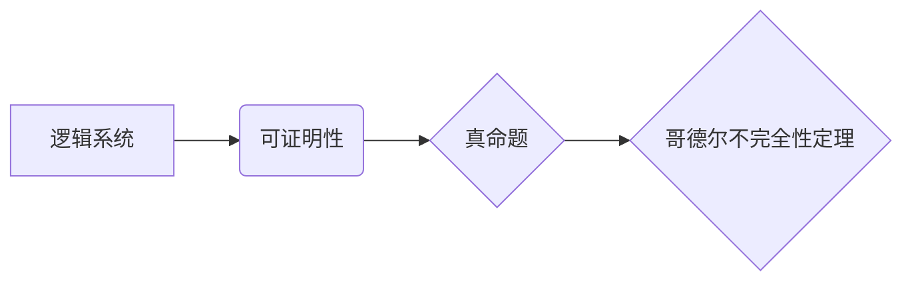

> 哥德尔不完全性定理，计算理论，逻辑系统，证明，可计算性，终结者

## 1. 背景介绍

在漫长的计算发展历程中，人类不断探索计算的边界，试图用数学和逻辑来描述和理解计算的本质。哥德尔不完全性定理，作为20世纪数学领域最具影响力的成果之一，深刻地揭示了计算的局限性，为我们提供了关于计算能力的深刻洞察。

哥德尔不完全性定理由美国逻辑学家、数学家艾伦·图灵的学生，天才数学家Kurt Gödel于1931年提出。该定理表明，任何一个足够复杂的、能够表达基本的算术的逻辑系统，都存在着无法被该系统证明的真命题。换句话说，任何一个逻辑系统都无法包含所有真命题，必然存在着无法被其证明的知识。

## 2. 核心概念与联系

### 2.1  逻辑系统

逻辑系统是一个由符号、规则和公理组成的体系，用于进行推理和证明。它提供了一种形式化的语言和方法，用于表达和验证数学命题的真假性。

### 2.2  可证明性

可证明性是指一个命题是否能够被某个逻辑系统证明为真。如果一个命题能够被某个逻辑系统证明为真，则称该命题为该逻辑系统中的可证明命题。

### 2.3  真命题

真命题是指无论在什么情况下都为真的命题。

**核心概念关系图:**

## 3. 核心算法原理 & 具体操作步骤

哥德尔不完全性定理本身不是一个算法，而是一个数学定理。它揭示了计算和逻辑的局限性，而不是提供一种解决问题的算法。

### 3.1  算法原理概述

哥德尔不完全性定理的证明依赖于以下几个关键概念：

* **编码:** 将自然语言中的语句编码成数字形式，以便计算机能够处理。
* **递归函数:** 一种能够通过自身定义来计算的函数。
* **自我引用:** 一个语句能够引用自身，例如“这句话是假的”。

哥德尔利用这些概念构造了一个特殊的语句，该语句能够证明自身不可被该逻辑系统证明。

### 3.2  算法步骤详解

哥德尔证明的详细步骤非常复杂，涉及到大量的数学逻辑和证明技巧。

### 3.3  算法优缺点

哥德尔不完全性定理本身没有优缺点，因为它是一个数学定理，而不是一个算法。

### 3.4  算法应用领域

哥德尔不完全性定理对计算机科学、逻辑学、哲学等领域产生了深远的影响。它表明了计算的局限性，也促进了对人工智能、知识表示和逻辑推理等领域的深入研究。

## 4. 数学模型和公式 & 详细讲解 & 举例说明

哥德尔不完全性定理的证明依赖于复杂的数学逻辑和证明技巧。

### 4.1  数学模型构建

哥德尔构建了一个数学模型，将逻辑系统抽象为一个形式化的体系，并定义了可证明性的概念。

### 4.2  公式推导过程

哥德尔利用递归函数和自我引用等概念，构造了一个特殊的语句，该语句能够证明自身不可被该逻辑系统证明。

### 4.3  案例分析与讲解

哥德尔不完全性定理的证明是一个经典的数学案例，它展示了数学逻辑的强大性和复杂性。

## 5. 项目实践：代码实例和详细解释说明

由于哥德尔不完全性定理是一个数学定理，而不是一个算法，因此无法直接用代码实现。

## 6. 实际应用场景

哥德尔不完全性定理的应用场景主要集中在以下几个方面：

* **人工智能:** 哥德尔不完全性定理表明了人工智能系统不可能完全模拟人类的智能，因为人工智能系统也受到计算能力的限制。
* **知识表示:** 哥德尔不完全性定理提醒我们，任何知识表示系统都无法包含所有知识，必然存在着无法被其表示的知识。
* **逻辑推理:** 哥德尔不完全性定理表明了逻辑推理的局限性，任何逻辑系统都无法证明所有真命题。

## 7. 工具和资源推荐

### 7.1  学习资源推荐

* **《数学逻辑》:**  由Herbert Enderton著，是一本经典的数学逻辑教材。
* **《哥德尔不完全性定理》:**  由Stephen Cole Kleene著，是一本介绍哥德尔不完全性定理的经典著作。

### 7.2  开发工具推荐

* **Coq:**  一种基于形式化逻辑的编程语言，用于证明软件的正确性。
* **Isabelle/HOL:**  一种基于HOL逻辑的证明助手，用于进行形式化数学证明。

### 7.3  相关论文推荐

* **Gödel, K. (1931). Über formal unentscheidbare Sätze der Principia Mathematica und verwandter Systeme I. Monatshefte für Mathematik und Physik, 38(1), 171-198.**
* **Gödel, K. (1931). Über formal unentscheidbare Sätze der Principia Mathematica und verwandter Systeme II. Monatshefte für Mathematik und Physik, 38(2), 593-611.**

## 8. 总结：未来发展趋势与挑战

哥德尔不完全性定理是一个里程碑式的成果，它深刻地影响了我们对计算和逻辑的理解。未来，哥德尔不完全性定理的研究将继续深入，并可能在以下几个方面取得新的进展：

* **更复杂的逻辑系统:** 研究更复杂的逻辑系统，并探索它们是否能够克服哥德尔不完全性定理的限制。
* **新的证明方法:** 开发新的证明方法，以更有效地证明哥德尔不完全性定理及其相关结果。
* **应用领域拓展:** 将哥德尔不完全性定理应用于更广泛的领域，例如人工智能、量子计算和密码学。

## 9. 附录：常见问题与解答

### 9.1  哥德尔不完全性定理是否意味着计算是无用的？

不，哥德尔不完全性定理并不意味着计算是无用的。它只是表明了计算的局限性，即任何一个逻辑系统都无法包含所有知识。尽管如此，计算仍然是我们理解和解决问题的重要工具。

### 9.2  哥德尔不完全性定理是否意味着人工智能永远无法达到人类的智能水平？

哥德尔不完全性定理表明了人工智能系统不可能完全模拟人类的智能，因为人工智能系统也受到计算能力的限制。然而，这并不意味着人工智能永远无法达到人类的智能水平。随着计算能力的不断提高，人工智能技术可能会取得新的突破。

### 9.3  哥德尔不完全性定理的证明非常复杂，普通人是否能够理解？

哥德尔不完全性定理的证明确实非常复杂，需要一定的数学基础才能理解。但是，我们可以通过阅读一些科普文章或书籍来了解哥德尔不完全性定理的基本概念和意义。

作者：禅与计算机程序设计艺术 / Zen and the Art of Computer Programming

<end_of_turn>