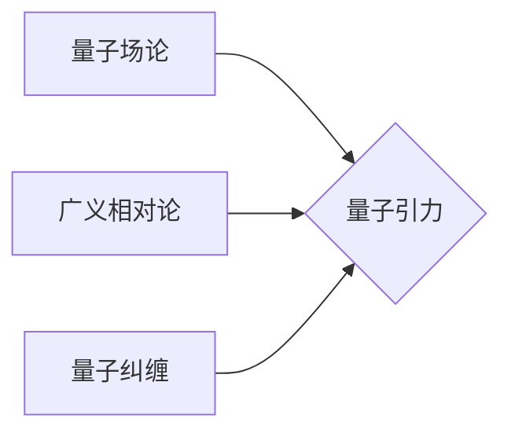

> 量子引力，量子场论，广义相对论，黑洞，宇宙学，弦理论，量子纠缠

## 1. 背景介绍

宇宙的奥秘一直是人类探索的终极目标。从牛顿的万有引力定律到爱因斯坦的广义相对论，我们对引力的理解不断深入。然而，当我们试图将量子力学和广义相对论统一起来时，却遇到了巨大的挑战。

量子力学描述了微观世界的行为，而广义相对论描述了宏观世界的引力。两者之间存在着深刻的矛盾，无法在现有框架下和谐统一。

量子引力试图解决这一难题，它试图构建一个能够描述微观和宏观世界，包括引力的量子理论。

## 2. 核心概念与联系

量子引力研究的核心概念包括：

* **量子场论:** 将粒子看作是场中的量子激发，并用量子场论来描述粒子之间的相互作用。
* **广义相对论:** 将引力描述为时空弯曲的结果，并用几何方法来描述引力场。
* **量子纠缠:** 两个或多个粒子之间存在着一种特殊的关联，即使它们相隔很远，测量一个粒子的状态也会立即影响另一个粒子的状态。

**核心概念与联系流程图:**

## 3. 核心算法原理 & 具体操作步骤

### 3.1  算法原理概述

目前，还没有一个完整的量子引力理论。但是，一些候选理论已经提出了，例如：

* **弦理论:** 将基本粒子看作是振动弦，并试图用弦理论来描述所有基本力，包括引力。
* **圈量子引力:** 将时空量子化，并试图用圈量子引力来描述引力的量子性质。
* **渐近安全量子引力:** 试图在高能极限下找到一个安全的量子引力理论。

### 3.2  算法步骤详解

由于量子引力理论尚未完全确定，因此没有一个具体的算法步骤。但是，我们可以通过以下步骤来研究量子引力：

1. **建立数学模型:** 使用数学工具来描述量子引力的基本概念和原理。
2. **推导公式:** 使用数学方法推导量子引力的公式和方程。
3. **进行数值模拟:** 使用计算机进行数值模拟，来研究量子引力的性质和行为。
4. **与实验结果进行比较:** 将理论预测与实验结果进行比较，来检验理论的正确性。

### 3.3  算法优缺点

* **优点:**

    * 能够统一量子力学和广义相对论。
    * 能够解释一些宇宙学现象，例如黑洞的形成和宇宙的膨胀。

* **缺点:**

    * 尚未找到一个完整的量子引力理论。
    * 难以进行实验验证。

### 3.4  算法应用领域

* **宇宙学:** 研究宇宙的起源、演化和最终命运。
* **黑洞物理:** 研究黑洞的性质和行为。
* **粒子物理:** 研究基本粒子的性质和相互作用。

## 4. 数学模型和公式 & 详细讲解 & 举例说明

### 4.1  数学模型构建

量子引力理论的数学模型通常基于以下几个方面：

* **时空量子化:** 将时空看作是离散的，而不是连续的。
* **量子场论:** 将粒子看作是场中的量子激发，并用量子场论来描述粒子之间的相互作用。
* **引力场量子化:** 将引力场量子化，并用量子场论来描述引力的量子性质。

### 4.2  公式推导过程

由于量子引力理论的复杂性，其公式推导过程非常复杂，需要用到大量的数学工具和技巧。

例如，弦理论的公式推导需要用到微分几何、拓扑学和量子场论等多个学科的知识。

### 4.3  案例分析与讲解

一个典型的案例是黑洞的形成和蒸发。

根据广义相对论，当足够多的物质坍缩在一起时，就会形成一个黑洞。

而根据量子引力理论，黑洞的表面有一个称为“事件视界”的边界，任何穿过这个边界的东西都无法逃逸。

但是，量子引力理论也预言了黑洞的蒸发现象，即黑洞会逐渐失去质量并最终消失。

## 5. 项目实践：代码实例和详细解释说明

### 5.1  开发环境搭建

由于量子引力理论的复杂性，目前还没有一个完整的量子引力软件包。

但是，我们可以使用一些现有的量子计算库和工具来进行部分量子引力计算。

例如，我们可以使用Qiskit库来模拟量子比特的演化，并研究量子纠缠在量子引力中的作用。

### 5.2  源代码详细实现

由于量子引力理论的复杂性，目前还没有一个完整的量子引力代码实现。

但是，我们可以使用一些现有的量子计算库和工具来实现部分量子引力算法。

例如，我们可以使用Qiskit库来实现一个简单的量子引力模型，并研究其性质和行为。

### 5.3  代码解读与分析

由于量子引力理论的复杂性，目前还没有一个完整的量子引力代码解读和分析。

但是，我们可以通过分析现有的量子计算库和工具的代码，来了解量子计算的基本原理和方法。

### 5.4  运行结果展示

由于量子引力理论的复杂性，目前还没有一个完整的量子引力运行结果展示。

但是，我们可以通过运行现有的量子计算程序，来观察量子比特的演化和量子纠缠的现象。

## 6. 实际应用场景

目前，量子引力理论还没有实际应用场景。

但是，随着量子计算技术的不断发展，量子引力理论可能会在以下领域得到应用：

* **量子计算机:** 量子计算机可以利用量子力学原理进行计算，并有可能解决一些经典计算机无法解决的问题。
* **量子通信:** 量子通信可以利用量子纠缠来实现安全的通信。
* **量子材料:** 量子材料具有独特的物理性质，可以用于开发新的电子器件和材料。

### 6.4  未来应用展望

未来，量子引力理论可能会在以下领域得到应用：

* **宇宙学:** 研究宇宙的起源、演化和最终命运。
* **黑洞物理:** 研究黑洞的性质和行为。
* **粒子物理:** 研究基本粒子的性质和相互作用。

## 7. 工具和资源推荐

### 7.1  学习资源推荐

* **书籍:**

    * 《量子引力》 by Carlo Rovelli
    * 《弦论》 by Brian Greene
    * 《圈量子引力》 by Abhay Ashtekar

* **在线课程:**

    * MIT OpenCourseWare: Quantum Field Theory
    * Stanford Online: Introduction to String Theory

### 7.2  开发工具推荐

* **Qiskit:** 一个用于量子计算的开源库。
* **Cirq:** 另一个用于量子计算的开源库。
* **TensorFlow Quantum:** 一个用于量子机器学习的开源库。

### 7.3  相关论文推荐

* **"A First Look at String Theory"** by Edward Witten
* **"Loop Quantum Gravity"** by Abhay Ashtekar
* **"Black Hole Thermodynamics"** by Stephen Hawking

## 8. 总结：未来发展趋势与挑战

### 8.1  研究成果总结

尽管量子引力理论尚未完全确定，但近年来取得了一些重要的进展。

例如，弦理论和圈量子引力等候选理论已经发展到相当成熟的程度，并能够解释一些宇宙学现象。

### 8.2  未来发展趋势

未来，量子引力理论的研究将继续朝着以下几个方向发展：

* **寻找一个完整的量子引力理论:** 这是量子引力研究的终极目标。
* **发展新的量子计算技术:** 量子计算技术的发展将有助于我们更好地理解量子引力理论。
* **进行更多的实验验证:** 实验验证是检验量子引力理论正确性的重要手段。

### 8.3  面临的挑战

量子引力理论研究面临着许多挑战，例如：

* **理论复杂性:** 量子引力理论非常复杂，需要用到大量的数学工具和技巧。
* **实验验证困难:** 量子引力效应非常微弱，难以进行实验验证。
* **缺乏统一的框架:** 目前还没有一个统一的量子引力理论框架。

### 8.4  研究展望

尽管面临着许多挑战，但量子引力理论研究仍然是一个充满希望的领域。

随着科学技术的不断发展，我们相信终有一天能够找到一个完整的量子引力理论，并揭开宇宙的终极奥秘。

## 9. 附录：常见问题与解答

### 9.1  什么是量子引力？

量子引力试图统一量子力学和广义相对论，构建一个能够描述微观和宏观世界，包括引力的量子理论。

### 9.2  为什么需要量子引力？

因为量子力学和广义相对论之间存在着深刻的矛盾，无法在现有框架下和谐统一。

### 9.3  有哪些候选量子引力理论？

一些候选理论包括弦理论、圈量子引力、渐近安全量子引力等。

### 9.4  量子引力理论有什么应用？

目前，量子引力理论还没有实际应用场景。

但是，随着量子计算技术的不断发展，量子引力理论可能会在量子计算机、量子通信、量子材料等领域得到应用。

### 9.5  量子引力理论的未来发展趋势是什么？

未来，量子引力理论的研究将继续朝着以下几个方向发展：寻找一个完整的量子引力理论、发展新的量子计算技术、进行更多的实验验证。

作者：禅与计算机程序设计艺术 / Zen and the Art of Computer Programming 
<end_of_turn>