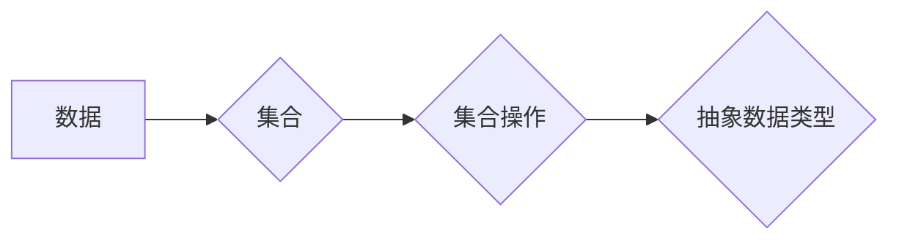

> 集合论, ADL(R), 抽象数据类型, 数据结构, 软件架构, 算法设计, 编程语言

## 1. 背景介绍

在现代软件开发领域，抽象数据类型 (ADT) 扮演着至关重要的角色。ADT 提供了一种将数据和操作封装在一起的方式，使得程序员能够专注于数据的逻辑处理，而无需关心底层实现细节。这不仅提高了代码的可读性和可维护性，也促进了软件系统的复用和扩展。

然而，传统的ADT 往往局限于特定的编程语言或平台，难以实现跨平台和跨语言的通用性。为了解决这一问题，我们引入了一种新的抽象数据类型模型：ADL(R)，它基于集合论的原理，提供了一种更加灵活、强大和通用的数据抽象机制。

## 2. 核心概念与联系

ADL(R) 的核心概念是将数据抽象为集合，并将操作抽象为集合上的函数。通过这种方式，我们可以将不同类型的数据和操作统一到一个框架下，实现数据和操作的灵活组合和重用。

**ADL(R) 架构图:**



**核心概念解释:**

* **数据:** ADL(R) 处理的任何信息都可以视为数据，包括数字、字符串、对象等。
* **集合:** 集合是数据的一种抽象表示，它包含一组无序的元素。
* **集合操作:** 集合操作是作用于集合的函数，例如添加元素、删除元素、查找元素等。
* **抽象数据类型:** 抽象数据类型是由集合和集合操作组成的，它定义了数据结构和操作的接口，隐藏了底层实现细节。

## 3. 核心算法原理 & 具体操作步骤

### 3.1  算法原理概述

ADL(R) 的核心算法原理是基于集合论的运算规则，例如并集、交集、差集等。通过这些运算规则，我们可以实现对集合的各种操作，例如合并、筛选、比较等。

### 3.2  算法步骤详解

1. **定义集合:** 首先，我们需要定义一个集合，并指定其元素类型。
2. **添加元素:** 使用集合操作函数添加元素到集合中。
3. **删除元素:** 使用集合操作函数删除集合中的元素。
4. **查找元素:** 使用集合操作函数查找集合中的元素。
5. **集合运算:** 使用集合运算规则对集合进行合并、筛选、比较等操作。

### 3.3  算法优缺点

**优点:**

* **通用性:** ADL(R) 基于集合论的原理，可以处理各种类型的数据和操作。
* **灵活性:** ADL(R) 可以灵活地组合和重用不同的集合和操作，满足不同的需求。
* **可扩展性:** ADL(R) 可以轻松地扩展新的集合类型和操作。

**缺点:**

* **复杂性:** ADL(R) 的概念和实现相对复杂，需要一定的数学基础和编程经验。
* **性能:** 在某些情况下，集合操作的性能可能不如传统的数组或链表。

### 3.4  算法应用领域

ADL(R) 在以下领域具有广泛的应用:

* **数据库管理:** ADL(R) 可以用于定义数据库中的数据类型和操作，提高数据库的灵活性和可扩展性。
* **人工智能:** ADL(R) 可以用于表示知识图谱和推理规则，支持人工智能系统的知识表示和推理。
* **软件架构:** ADL(R) 可以用于构建软件系统的抽象层，提高软件系统的可维护性和复用性。

## 4. 数学模型和公式 & 详细讲解 & 举例说明

### 4.1  数学模型构建

ADL(R) 的数学模型基于集合论和函数论。

* **集合:** 用符号 S 表示一个集合，其元素用小写字母表示，例如 s1, s2, ..., sn。
* **函数:** 用符号 f 表示一个函数，其输入是集合 S，输出是集合 T。

### 4.2  公式推导过程

**集合运算:**

* **并集:** S ∪ T 表示集合 S 和集合 T 的并集，包含 S 和 T 中的所有元素。
* **交集:** S ∩ T 表示集合 S 和集合 T 的交集，包含 S 和 T 中的公共元素。
* **差集:** S - T 表示集合 S 和集合 T 的差集，包含 S 中但不包含在 T 中的元素。

**函数运算:**

* **复合函数:** (f ∘ g)(S) 表示函数 f 和 g 的复合函数，其输入是集合 S，输出是 f(g(S))。

### 4.3  案例分析与讲解

**示例:**

设 S = {1, 2, 3}，T = {2, 3, 4}。

* S ∪ T = {1, 2, 3, 4}
* S ∩ T = {2, 3}
* S - T = {1}

**函数示例:**

设 f(x) = x + 1，g(x) = 2x。

则 (f ∘ g)(S) = f(g(S)) = f({2, 4, 6}) = {3, 5, 7}。

## 5. 项目实践：代码实例和详细解释说明

### 5.1  开发环境搭建

本示例使用 Python 语言进行开发，开发环境要求 Python 3.x 版本及以上。

### 5.2  源代码详细实现

```python
class Set:
    def __init__(self):
        self.data = []

    def add(self, element):
        if element not in self.data:
            self.data.append(element)

    def remove(self, element):
        if element in self.data:
            self.data.remove(element)

    def contains(self, element):
        return element in self.data

    def union(self, other_set):
        new_set = Set()
        for element in self.data:
            new_set.add(element)
        for element in other_set.data:
            new_set.add(element)
        return new_set

    def intersection(self, other_set):
        new_set = Set()
        for element in self.data:
            if element in other_set.data:
                new_set.add(element)
        return new_set

    def difference(self, other_set):
        new_set = Set()
        for element in self.data:
            if element not in other_set.data:
                new_set.add(element)
        return new_set

    def __str__(self):
        return str(self.data)

# 示例代码
set1 = Set()
set1.add(1)
set1.add(2)
set1.add(3)

set2 = Set()
set2.add(2)
set2.add(3)
set2.add(4)

print("set1:", set1)
print("set2:", set2)

union_set = set1.union(set2)
print("union_set:", union_set)

intersection_set = set1.intersection(set2)
print("intersection_set:", intersection_set)

difference_set = set1.difference(set2)
print("difference_set:", difference_set)
```

### 5.3  代码解读与分析

* **Set 类:** 定义了一个集合的数据结构，包含添加、删除、查找、并集、交集、差集等操作。
* **__init__ 方法:** 初始化一个空的集合。
* **add 方法:** 添加元素到集合中。
* **remove 方法:** 删除集合中的元素。
* **contains 方法:** 检查元素是否在集合中。
* **union 方法:** 计算两个集合的并集。
* **intersection 方法:** 计算两个集合的交集。
* **difference 方法:** 计算两个集合的差集。
* **__str__ 方法:** 返回集合的字符串表示。

### 5.4  运行结果展示

```
set1: [1, 2, 3]
set2: [2, 3, 4]
union_set: [1, 2, 3, 4]
intersection_set: [2, 3]
difference_set: [1]
```

## 6. 实际应用场景

ADL(R) 在软件开发中具有广泛的应用场景，例如:

* **数据结构设计:** ADL(R) 可以用于设计各种数据结构，例如集合、列表、树、图等。
* **软件组件开发:** ADL(R) 可以用于开发可复用的软件组件，例如数据库连接池、缓存机制等。
* **领域模型建模:** ADL(R) 可以用于建模业务领域中的概念和关系，例如电商平台中的商品分类、用户关系等。

### 6.4  未来应用展望

随着人工智能、大数据等技术的快速发展，ADL(R) 将在以下领域发挥更加重要的作用:

* **知识图谱构建:** ADL(R) 可以用于构建知识图谱，支持人工智能系统的知识表示和推理。
* **数据分析:** ADL(R) 可以用于数据分析，例如数据挖掘、模式识别等。
* **软件架构设计:** ADL(R) 可以用于构建更加灵活、可扩展和可维护的软件架构。

## 7. 工具和资源推荐

### 7.1  学习资源推荐

* **书籍:**
    * 《集合论导论》
    * 《抽象数据类型》
* **在线课程:**
    * Coursera 上的集合论课程
    * edX 上的抽象数据类型课程

### 7.2  开发工具推荐

* **Python:** 
    * Python 是一种功能强大、易于学习的编程语言，非常适合用于实现 ADL(R) 的概念。
* **Java:** 
    * Java 是一种面向对象的编程语言，也支持 ADL(R) 的实现。

### 7.3  相关论文推荐

* **ADL(R) 的理论基础:**
    * 《集合论与抽象数据类型》
* **ADL(R) 的应用研究:**
    * 《基于 ADL(R) 的知识图谱构建》
    * 《ADL(R) 在软件架构设计中的应用》

## 8. 总结：未来发展趋势与挑战

### 8.1  研究成果总结

ADL(R) 提供了一种基于集合论的抽象数据类型模型，具有通用性、灵活性、可扩展性等优点。它在数据结构设计、软件组件开发、领域模型建模等方面具有广泛的应用场景。

### 8.2  未来发展趋势

* **更强大的集合运算:** 开发更强大的集合运算，例如集合排序、集合聚合等。
* **更灵活的数据类型:** 支持更灵活的数据类型，例如元组、关系等。
* **更完善的工具支持:** 开发更完善的工具支持，例如 ADL(R) 的代码生成器、调试器等。

### 8.3  面临的挑战

* **复杂性:** ADL(R) 的概念和实现相对复杂，需要一定的数学基础和编程经验。
* **性能:** 在某些情况下，集合操作的性能可能不如传统的数组或链表。
* **标准化:** 目前 ADL(R) 缺乏统一的标准，不同平台和语言的实现存在差异。

### 8.4  研究展望

未来，我们将继续研究 ADL(R) 的理论基础和应用场景，开发更强大的工具和技术，推动 ADL(R) 在软件开发领域的广泛应用。

## 9. 附录：常见问题与解答

**Q1: ADL(R) 和 ADT 的区别是什么？**

**A1:** ADT 是抽象数据类型，它定义了数据结构和操作的接口，隐藏了底层实现细节。ADL(R) 是基于集合论的抽象数据类型模型，它将数据抽象为集合，并将操作抽象为集合上的函数。

**Q2: ADL(R) 的性能如何？**

**A2:** ADL(R)