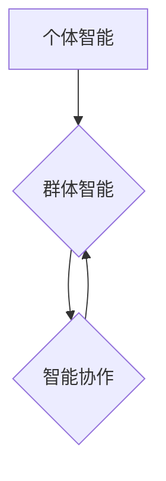

> AI Agent, 个体智能, 群体智能, 智能协作, 算法原理, 数学模型, 项目实践, 应用场景

## 1. 背景介绍

人工智能（AI）正以惊人的速度发展，其应用领域不断拓展，从自动驾驶到医疗诊断，再到金融分析，AI 正在深刻地改变着我们的生活。在 AI 的发展过程中，AI 代理（AI Agent）作为 AI 的核心组成部分，扮演着越来越重要的角色。AI 代理是指能够感知环境、做出决策并采取行动的智能体。

传统的 AI 代理通常基于单一的个体智能，其能力受限于自身的知识和经验。然而，随着 AI 技术的进步，我们开始探索更强大的 AI 代理模型，即基于群体智能和智能协作的 AI 代理。

## 2. 核心概念与联系

**2.1 个体智能**

个体智能是指单个 AI 代理所拥有的智能能力。它包括感知环境、理解信息、做出决策和执行行动等方面。个体智能通常基于机器学习算法，例如深度学习、强化学习等，通过训练数据来学习和提升其智能能力。

**2.2 群体智能**

群体智能是指多个 AI 代理协同合作，通过相互交流和信息共享，实现超越单个代理能力的智能表现。群体智能的优势在于：

* **分工协作:**  多个代理可以分工合作，完成复杂的任务。
* **信息共享:** 代理之间可以共享信息，提高决策的准确性和效率。
* **鲁棒性:** 群体智能系统通常具有更高的鲁棒性，即使部分代理失效，也能保持整体功能。

**2.3 智能协作**

智能协作是指 AI 代理之间进行有效的合作和沟通，共同完成任务。它需要代理之间能够理解彼此的意图，协调行动，并根据任务需求进行动态调整。智能协作的关键技术包括：

* **通信协议:**  代理之间需要使用一种通用的通信协议进行信息交换。
* **任务分配:**  需要一种机制来分配任务给不同的代理。
* **决策融合:**  代理需要将各自的决策结果融合在一起，做出最终的决策。

**2.4 三驾马车关系**

个体智能、群体智能和智能协作是 AI 代理发展的三驾马车，相互关联、相互促进。个体智能是群体智能和智能协作的基础，群体智能和智能协作则可以提升个体智能的水平。



## 3. 核心算法原理 & 具体操作步骤

### 3.1 算法原理概述

群体智能算法通常基于自然界中群体行为的启发，例如蚂蚁群体的觅食行为、鸟群的飞行行为等。这些算法通过模拟群体行为，实现智能决策和问题解决。常见的群体智能算法包括：

* **粒子群算法 (PSO):**  模拟粒子群在搜索空间中运动，通过迭代更新粒子位置和速度，找到最优解。
* **蚁群算法 (ACO):**  模拟蚂蚁群体的觅食行为，通过蚂蚁在路径上留下信息素，引导其他蚂蚁选择更优路径。
* **蜂群算法 (BPSO):**  模拟蜂群的觅食行为，通过蜂群中的工蜂和侦察蜂协同工作，找到最佳食物来源。

### 3.2 算法步骤详解

以粒子群算法为例，其具体操作步骤如下：

1. **初始化粒子群:**  随机生成多个粒子，每个粒子代表一个候选解。
2. **评估粒子适应度:**  根据目标函数对每个粒子的适应度进行评估。
3. **更新粒子速度和位置:**  根据粒子的当前速度、最佳位置和全局最佳位置，更新粒子的速度和位置。
4. **重复步骤 2-3:**  重复上述步骤，直到达到终止条件，例如最大迭代次数或目标函数值达到预设阈值。

### 3.3 算法优缺点

**优点:**

* **简单易实现:**  粒子群算法的原理和实现相对简单。
* **全局搜索能力强:**  粒子群算法能够有效地探索搜索空间，找到全局最优解。
* **并行化处理:**  粒子群算法可以并行化处理，提高计算效率。

**缺点:**

* **参数设置敏感:**  粒子群算法的性能受参数设置的影响较大。
* **容易陷入局部最优:**  在某些情况下，粒子群算法可能陷入局部最优解。

### 3.4 算法应用领域

粒子群算法广泛应用于以下领域：

* **优化问题:**  例如机器学习模型参数优化、调度问题、路径规划等。
* **控制系统:**  例如机器人控制、无人机控制等。
* **图像处理:**  例如图像分割、图像识别等。

## 4. 数学模型和公式 & 详细讲解 & 举例说明

### 4.1 数学模型构建

粒子群算法的数学模型主要包括粒子位置、速度、适应度函数等。

* **粒子位置:**  每个粒子的位置用一个向量表示，例如 $x = (x_1, x_2, ..., x_n)$，其中 $x_i$ 表示第 $i$ 个维度上的位置。
* **粒子速度:**  每个粒子的速度用一个向量表示，例如 $v = (v_1, v_2, ..., v_n)$，其中 $v_i$ 表示第 $i$ 个维度上的速度。
* **适应度函数:**  适应度函数用于评估粒子的优劣，通常是目标函数的相反数。

### 4.2 公式推导过程

粒子群算法的更新公式如下：

* **速度更新公式:**  $v_{i,d} = w \cdot v_{i,d} + c_1 \cdot r_1 \cdot (p_{i,d} - x_{i,d}) + c_2 \cdot r_2 \cdot (g_d - x_{i,d})$

* **位置更新公式:**  $x_{i,d} = x_{i,d} + v_{i,d}$

其中:

* $v_{i,d}$ 表示第 $i$ 个粒子在第 $d$ 维上的速度。
* $x_{i,d}$ 表示第 $i$ 个粒子在第 $d$ 维上的位置。
* $w$ 表示惯性权重，控制粒子的速度衰减。
* $c_1$ 和 $c_2$ 分别是认知因子和社会因子，控制粒子对自身最佳位置和全局最佳位置的吸引力。
* $r_1$ 和 $r_2$ 是随机数，保证算法的随机性。
* $p_{i,d}$ 表示第 $i$ 个粒子在第 $d$ 维上的最佳位置。
* $g_d$ 表示全局最佳位置在第 $d$ 维上的值。

### 4.3 案例分析与讲解

假设我们使用粒子群算法来优化一个简单的目标函数，目标函数为 $f(x) = x^2$，其中 $x$ 是一个实数。

* 初始化粒子群:  随机生成 10 个粒子，每个粒子的位置在区间 [-5, 5] 内。
* 评估粒子适应度:  计算每个粒子的适应度值，即 $f(x)$ 的值。
* 更新粒子速度和位置:  根据速度更新公式和位置更新公式，更新每个粒子的速度和位置。
* 重复步骤 2-3:  重复上述步骤，直到达到终止条件，例如最大迭代次数或目标函数值达到预设阈值。

通过迭代更新，粒子群算法会逐渐收敛到目标函数的全局最优解，即 $x = 0$。

## 5. 项目实践：代码实例和详细解释说明

### 5.1 开发环境搭建

本项目使用 Python 语言进行开发，所需的库包括 NumPy、Matplotlib 等。

### 5.2 源代码详细实现

```python
import numpy as np

class Particle:
    def __init__(self, dim):
        self.position = np.random.uniform(-5, 5, dim)
        self.velocity = np.zeros(dim)
        self.best_position = self.position
        self.best_fitness = self.evaluate_fitness()

    def evaluate_fitness(self):
        return np.sum(self.position ** 2)

    def update_velocity(self, w, c1, c2, r1, r2, global_best_position):
        self.velocity = w * self.velocity + c1 * r1 * (self.best_position - self.position) + c2 * r2 * (global_best_position - self.position)

    def update_position(self):
        self.position += self.velocity

    def update_best_position(self):
        current_fitness = self.evaluate_fitness()
        if current_fitness < self.best_fitness:
            self.best_position = self.position
            self.best_fitness = current_fitness

def main():
    dim = 1
    num_particles = 10
    w = 0.729
    c1 = 1.49445
    c2 = 1.49445
    max_iterations = 100

    particles = [Particle(dim) for _ in range(num_particles)]
    global_best_position = particles[0].position
    global_best_fitness = particles[0].best_fitness

    for iteration in range(max_iterations):
        for particle in particles:
            r1 = np.random.rand()
            r2 = np.random.rand()
            particle.update_velocity(w, c1, c2, r1, r2, global_best_position)
            particle.update_position()
            particle.update_best_position()

            if particle.best_fitness < global_best_fitness:
                global_best_position = particle.best_position
                global_best_fitness = particle.best_fitness

        print(f"Iteration {iteration+1}: Best fitness = {global_best_fitness}")

if __name__ == "__main__":
    main()
```

### 5.3 代码解读与分析

* **Particle 类:**  定义了每个粒子的属性和方法，包括位置、速度、最佳位置、最佳适应度等。
* **evaluate_fitness() 方法:**  计算粒子的适应度值。
* **update_velocity() 方法:**  根据速度更新公式更新粒子的速度。
* **update_position() 方法:**  根据位置更新公式更新粒子的位置。
* **update_best_position() 方法:**  更新粒子的最佳位置和最佳适应度。
* **main() 函数:**  主函数，初始化粒子群，迭代更新粒子，并打印最佳适应度值。

### 5.4 运行结果展示

运行代码后，会输出每个迭代次数下的最佳适应度值，最终会收敛到目标函数的全局最优解，即 $x = 0$。

## 6. 实际应用场景

### 6.1 智能协作机器人

在智能协作机器人领域，多个机器人可以协同合作完成复杂的任务，例如组装、搬运、维修等。通过智能协作，机器人可以分工协作，提高效率和准确性。

### 6.2 自动驾驶系统

自动驾驶系统需要多个传感器和算法协同工作，才能实现安全可靠的驾驶。例如，摄像头、雷达、激光雷达等传感器可以提供车辆周围环境的信息，而决策算法则需要根据这些信息做出驾驶决策。

### 6.3 医疗诊断

在医疗诊断领域，多个专家可以协同合作，分析患者的病历、检查结果等信息，做出更准确的诊断。通过智能协作，可以提高诊断的准确性和效率。

### 6.4 未来应用展望

随着 AI 技术的不断发展，群体智能和智能协作将在更多领域得到应用，例如：

* **金融分析:**  多个 AI 代理可以协同分析市场数据，预测股票价格、