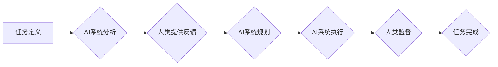

> 人工智能，协同工作，未来趋势，应用场景，挑战与机遇

## 1. 背景介绍

人工智能（AI）技术近年来发展迅速，从语音识别、图像识别到自然语言处理等领域取得了突破性进展。AI技术的应用已经渗透到各个行业，并深刻地改变着人们的生活方式和工作模式。

随着AI技术的不断成熟，人们开始思考AI与人类如何协同工作，如何更好地发挥各自的优势，共同创造更大的价值。AI与人的协同工作，不再是科幻小说中的幻想，而是现实中正在逐步实现的目标。

## 2. 核心概念与联系

**2.1 人工智能 (AI)**

人工智能是指模拟人类智能行为的计算机系统。它涵盖了广泛的领域，包括机器学习、深度学习、自然语言处理、计算机视觉等。

**2.2 协同工作**

协同工作是指两个或多个个体共同完成一项任务的过程。在AI与人的协同工作中，AI系统和人类将共同参与任务的各个阶段，包括规划、执行、评估和改进。

**2.3 人机协作模式**

AI与人协同工作的方式多种多样，常见的模式包括：

* **增强型协作:** AI系统辅助人类完成任务，提高效率和准确性。例如，AI辅助医生诊断疾病、AI辅助律师审查合同等。
* **共享型协作:** AI系统和人类共同参与任务的各个阶段，共享决策权和执行权。例如，AI辅助设计师进行创意设计、AI辅助工程师进行软件开发等。
* **自主型协作:** AI系统能够独立完成任务，但仍需与人类进行沟通和反馈。例如，AI自动驾驶汽车、AI机器人等。

**2.4 协同工作流程图**

## 3. 核心算法原理 & 具体操作步骤

**3.1 算法原理概述**

AI与人协同工作的核心算法原理主要包括：

* **机器学习:** 训练AI系统从数据中学习，识别模式和做出预测。
* **深度学习:** 使用多层神经网络，模拟人类大脑的学习过程，实现更复杂的智能行为。
* **自然语言处理:** 理解和生成人类语言，使AI系统能够与人类进行自然流畅的对话。
* **计算机视觉:** 理解和解释图像和视频信息，使AI系统能够“看到”和“理解”周围环境。

**3.2 算法步骤详解**

以机器学习为例，其基本步骤包括：

1. **数据收集:** 收集与任务相关的训练数据。
2. **数据预处理:** 对数据进行清洗、转换和特征提取。
3. **模型选择:** 选择合适的机器学习算法模型。
4. **模型训练:** 使用训练数据训练模型，调整模型参数。
5. **模型评估:** 使用测试数据评估模型的性能。
6. **模型部署:** 将训练好的模型部署到实际应用场景中。

**3.3 算法优缺点**

* **优点:** 能够自动学习和改进，适应不断变化的环境。
* **缺点:** 需要大量的数据进行训练，训练过程可能耗时和耗能。

**3.4 算法应用领域**

* **医疗保健:** 疾病诊断、药物研发、个性化治疗。
* **金融服务:** 风险评估、欺诈检测、投资决策。
* **制造业:** 自动化生产、质量控制、预测维护。
* **零售业:** 商品推荐、客户服务、库存管理。

## 4. 数学模型和公式 & 详细讲解 & 举例说明

**4.1 数学模型构建**

在AI与人协同工作中，可以使用数学模型来描述人和AI之间的交互关系，以及AI系统如何学习和决策。例如，可以使用马尔可夫决策过程（MDP）来建模AI系统在不同状态下做出决策的过程。

**4.2 公式推导过程**

MDP模型的核心公式包括状态转移概率、奖励函数和价值函数。

* **状态转移概率:** 描述AI系统从一个状态转移到另一个状态的概率。
* **奖励函数:** 描述AI系统在某个状态下获得的奖励。
* **价值函数:** 描述AI系统从某个状态开始执行策略的期望总奖励。

**4.3 案例分析与讲解**

例如，在自动驾驶汽车中，可以使用MDP模型来建模汽车在不同路况下做出转向、加速和制动的决策。

* 状态: 汽车的位置、速度、周围环境等。
* 动作: 转向、加速、制动等。
* 转移概率: 根据汽车的物理特性和周围环境的变化，计算汽车从一个状态转移到另一个状态的概率。
* 奖励函数: 根据汽车的安全性和效率，设计奖励函数，鼓励汽车做出安全、高效的决策。
* 价值函数: 通过动态规划算法，计算汽车从每个状态开始执行策略的期望总奖励。

## 5. 项目实践：代码实例和详细解释说明

**5.1 开发环境搭建**

使用Python语言和相关的AI库，例如TensorFlow、PyTorch等，搭建开发环境。

**5.2 源代码详细实现**

根据具体的AI算法和应用场景，编写源代码实现AI系统。

**5.3 代码解读与分析**

详细解释代码的逻辑结构和功能，包括数据预处理、模型训练、模型评估等步骤。

**5.4 运行结果展示**

展示AI系统的运行结果，例如预测准确率、执行效率等指标。

## 6. 实际应用场景

**6.1 医疗保健**

* AI辅助医生诊断疾病，提高诊断准确率和效率。
* AI辅助药物研发，加速新药开发周期。
* AI辅助个性化治疗，根据患者的基因信息和病史制定个性化的治疗方案。

**6.2 金融服务**

* AI辅助风险评估，识别潜在的金融风险。
* AI辅助欺诈检测，防止金融欺诈行为。
* AI辅助投资决策，根据市场数据和投资策略进行投资决策。

**6.3 制造业**

* AI辅助自动化生产，提高生产效率和质量。
* AI辅助质量控制，及时发现产品缺陷。
* AI辅助预测维护，提前预警设备故障，降低维护成本。

**6.4 未来应用展望**

AI与人协同工作将应用于越来越多的领域，例如教育、交通、娱乐等。

## 7. 工具和资源推荐

**7.1 学习资源推荐**

* **在线课程:** Coursera、edX、Udacity等平台提供丰富的AI课程。
* **书籍:** 《深度学习》、《人工智能：一种现代方法》等书籍。
* **开源项目:** TensorFlow、PyTorch等开源项目。

**7.2 开发工具推荐**

* **Python:** 广泛使用的编程语言，用于AI开发。
* **Jupyter Notebook:** 用于编写和运行Python代码的交互式环境。
* **TensorFlow:** 开源深度学习框架。
* **PyTorch:** 开源深度学习框架。

**7.3 相关论文推荐**

* **AlphaGo论文:** 《Mastering the game of Go with deep neural networks and tree search》
* **BERT论文:** 《BERT: Pre-training of Deep Bidirectional Transformers for Language Understanding》
* **GPT-3论文:** 《Language Models are Few-Shot Learners》

## 8. 总结：未来发展趋势与挑战

**8.1 研究成果总结**

AI与人协同工作取得了显著的成果，在多个领域实现了实际应用。

**8.2 未来发展趋势**

* **更智能的AI系统:** AI系统将更加智能，能够更好地理解和响应人类的需求。
* **更广泛的应用场景:** AI与人协同工作将应用于更多领域，改变人们的生活方式和工作模式。
* **更安全的AI系统:** AI系统将更加安全可靠，能够更好地保护人类的隐私和安全。

**8.3 面临的挑战**

* **算法的解释性和可信度:** AI系统的决策过程往往难以解释，这可能会导致人们对AI系统的信任度降低。
* **数据隐私和安全:** AI系统需要大量的数据进行训练，这可能会带来数据隐私和安全问题。
* **伦理和社会影响:** AI与人协同工作可能会带来一些伦理和社会问题，例如工作岗位的替代、算法偏见等。

**8.4 研究展望**

未来研究将重点关注解决上述挑战，使AI与人协同工作更加安全、可靠、可解释和伦理。

## 9. 附录：常见问题与解答

**9.1 如何选择合适的AI算法？**

选择合适的AI算法取决于具体的应用场景和数据特点。

**9.2 如何保证AI系统的安全性和可靠性？**

可以通过多种方法保证AI系统的安全性和可靠性，例如数据加密、模型验证、安全审计等。

**9.3 AI与人协同工作会带来哪些伦理问题？**

AI与人协同工作可能会带来一些伦理问题，例如算法偏见、工作岗位替代、责任归属等。

作者：禅与计算机程序设计艺术 / Zen and the Art of Computer Programming 
<end_of_turn>