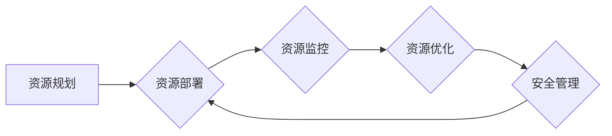

> AI大模型、数据中心、运营管理、资源调度、模型部署、数据安全、可持续发展

## 1. 背景介绍

近年来，人工智能（AI）技术取得了飞速发展，特别是大规模语言模型（LLM）的出现，如GPT-3、LaMDA等，为自然语言处理、计算机视觉、语音识别等领域带来了革命性的变革。这些强大的AI模型需要海量数据进行训练和推理，也对数据存储、处理和管理提出了更高的要求。

数据中心作为AI模型应用的基础设施，承担着存储、计算、网络等关键功能，在AI大模型的应用中扮演着至关重要的角色。随着AI技术的不断发展和应用场景的不断拓展，数据中心的规模、复杂度和对性能的要求也在不断提升。

## 2. 核心概念与联系

**2.1 数据中心架构**

数据中心通常由以下几个关键组件组成：

* **计算资源:** 包括服务器、GPU、TPU等硬件设备，用于执行AI模型的训练和推理。
* **存储资源:** 包括本地存储、网络存储、云存储等，用于存储海量训练数据和模型参数。
* **网络资源:** 包括交换机、路由器、网络接口卡等，用于连接计算资源、存储资源和用户设备，保证数据传输的效率和可靠性。
* **管理系统:** 用于监控、管理和维护整个数据中心，包括资源调度、性能监控、安全管理等功能。

**2.2 AI大模型应用场景**

AI大模型在各个领域都有广泛的应用场景，例如：

* **自然语言处理:** 文本生成、机器翻译、问答系统、情感分析等。
* **计算机视觉:** 图像识别、物体检测、图像分割、视频分析等。
* **语音识别:** 语音转文本、语音助手、语音搜索等。
* **推荐系统:** 商品推荐、内容推荐、个性化服务等。

**2.3 数据中心运营与管理**

数据中心运营与管理是指对数据中心资源的规划、部署、监控、维护和优化，以确保数据中心的稳定运行、高效利用和安全可靠。

**2.4 核心概念联系**

数据中心是AI大模型应用的基础设施，AI大模型的应用场景对数据中心的资源需求提出了更高的要求，数据中心运营与管理则需要针对AI大模型的特点，优化资源调度、性能监控、安全管理等环节，以满足AI大模型的应用需求。

**2.5 数据中心运营与管理流程图**



## 3. 核心算法原理 & 具体操作步骤

**3.1 算法原理概述**

数据中心运营与管理涉及到许多算法和技术，例如：

* **资源调度算法:** 用于分配计算资源、存储资源和网络资源，以满足不同应用的需求。常见的调度算法包括：优先级调度、轮转调度、最短作业优先调度等。
* **性能监控算法:** 用于收集和分析数据中心资源的性能指标，例如CPU利用率、内存利用率、网络带宽等。常用的监控算法包括：滑动平均、指数平滑等。
* **安全管理算法:** 用于检测和防御数据中心的安全威胁，例如入侵检测、恶意软件防护等。常用的安全管理算法包括：签名检测、行为分析等。

**3.2 算法步骤详解**

以资源调度算法为例，其具体操作步骤如下：

1. 收集资源需求信息：从各个应用系统收集计算资源、存储资源和网络资源的需求信息。
2. 评估资源可用性：根据当前资源的可用状态，评估各个资源的需求是否能够满足。
3. 选择调度策略：根据应用的优先级、资源的可用性等因素，选择合适的调度策略。
4. 分配资源：根据选择的调度策略，将资源分配给各个应用系统。
5. 监控资源使用情况：持续监控资源的使用情况，及时调整资源分配策略，以保证资源的有效利用。

**3.3 算法优缺点**

不同的调度算法各有优缺点，需要根据实际情况选择合适的算法。例如：

* 优先级调度：简单易实现，但可能导致高优先级任务占用过多资源，低优先级任务无法得到及时执行。
* 轮转调度：公平性强，但可能导致资源利用率低。
* 最短作业优先调度：提高资源利用率，但可能导致长作业等待时间过长。

**3.4 算法应用领域**

资源调度算法广泛应用于各种领域，例如：

* 云计算平台：用于分配云服务器、存储空间和网络带宽等资源。
* 数据中心：用于分配计算资源、存储资源和网络资源。
* 高性能计算集群：用于分配计算节点和存储资源。

## 4. 数学模型和公式 & 详细讲解 & 举例说明

**4.1 数学模型构建**

数据中心运营与管理可以抽象为一个资源优化问题，可以使用数学模型来描述和解决。

例如，可以构建一个资源分配模型，将数据中心资源视为一个有限的资源池，将应用系统视为对资源的需求者。模型的目标是最大化资源的利用率，同时满足各个应用系统的需求。

**4.2 公式推导过程**

资源分配模型的数学公式可以根据具体的场景和需求进行设计。

例如，可以定义一个资源利用率指标，表示数据中心资源的实际使用量与总资源量的比值。

资源利用率 = 实际使用资源量 / 总资源量

**4.3 案例分析与讲解**

假设一个数据中心有10个服务器，每个服务器的CPU性能为1000单位。

有3个应用系统需要使用这些服务器，分别是A、B、C。

应用A需要1000单位的CPU性能，应用B需要500单位的CPU性能，应用C需要200单位的CPU性能。

可以使用资源分配模型来分配服务器资源，以最大化资源利用率。

例如，可以将服务器分配给应用A、B、C，分别为5个、3个、2个。

这样，资源利用率为：

(1000 + 500 + 200) / (10 * 1000) = 1.7 / 10 = 0.17

**4.4 数学模型的局限性**

数学模型只是一个抽象的描述，无法完全反映现实世界的复杂性。

例如，数学模型无法考虑资源的动态变化、应用系统的突发需求等因素。

因此，在实际应用中，需要结合实际情况，对数学模型进行调整和优化。

## 5. 项目实践：代码实例和详细解释说明

**5.1 开发环境搭建**

数据中心运营与管理的项目实践需要搭建一个合适的开发环境。

例如，可以使用Linux操作系统，并安装必要的软件工具，例如：

* Python编程语言
* TensorFlow深度学习框架
* Kubernetes容器编排平台

**5.2 源代码详细实现**

以下是一个简单的资源调度算法的Python代码实现示例：

```python
class ResourceAllocator:
    def __init__(self, resources):
        self.resources = resources

    def allocate_resources(self, requests):
        # 这里实现资源分配逻辑
        pass

# 示例用法
resources = {
    "cpu": 1000,
    "memory": 2000,
}
requests = [
    {"cpu": 500, "memory": 1000},
    {"cpu": 300, "memory": 500},
]
allocator = ResourceAllocator(resources)
allocated_resources = allocator.allocate_resources(requests)
print(allocated_resources)
```

**5.3 代码解读与分析**

该代码实现了一个简单的资源分配器，它接受资源池和应用系统的资源请求作为输入，并返回分配给每个应用系统的资源。

具体实现逻辑需要根据实际场景进行设计，例如，可以根据应用的优先级、资源的可用性等因素，选择合适的分配策略。

**5.4 运行结果展示**

运行该代码后，会输出分配给每个应用系统的资源信息。

例如，如果资源分配策略是优先分配CPU资源，则输出结果可能如下：

```
{
    "app1": {"cpu": 500, "memory": 1000},
    "app2": {"cpu": 300, "memory": 500},
}
```

## 6. 实际应用场景

**6.1 云计算平台**

云计算平台需要高效地分配计算资源、存储资源和网络资源给不同的用户和应用。

数据中心运营与管理技术可以帮助云计算平台优化资源调度、提高资源利用率，降低运营成本。

**6.2 高性能计算集群**

高性能计算集群用于执行大规模计算任务，例如科学计算、金融建模等。

数据中心运营与管理技术可以帮助高性能计算集群优化资源分配、提高计算效率，缩短计算时间。

**6.3 互联网公司**

互联网公司需要处理海量数据和用户请求，对数据中心资源的需求非常高。

数据中心运营与管理技术可以帮助互联网公司优化资源调度、提高系统性能，保障服务稳定性。

**6.4 未来应用展望**

随着AI技术的不断发展，数据中心运营与管理将面临新的挑战和机遇。

例如：

* **AI驱动的资源调度:** 利用AI算法，实现更加智能、高效的资源调度。
* **自动化运维:** 利用自动化技术，减少人工干预，提高运维效率。
* **可持续发展:** 关注数据中心的能源效率和环境影响，实现可持续发展。

## 7. 工具和资源推荐

**7.1 学习资源推荐**

* **书籍:**
    * 《数据中心基础设施》
    * 《云计算架构》
    * 《人工智能算法》
* **在线课程:**
    * Coursera: 数据中心管理
    * edX: 云计算基础
    * Udacity: 深度学习

**7.2 开发工具推荐**

* **监控工具:** Prometheus, Grafana
* **容器编排平台:** Kubernetes
* **自动化运维工具:** Ansible, Puppet

**7.3 相关论文推荐**

* 《数据中心资源调度算法研究》
* 《云计算平台资源管理技术》
* 《AI驱动的资源优化》

## 8. 总结：未来发展趋势与挑战

**8.1 研究成果总结**

数据中心运营与管理技术已经取得了显著的成果，例如：

* 资源调度算法的不断优化，提高了资源利用率。
* 自动化运维技术的发展，降低了运维成本。
* 可持续发展理念的融入，降低了数据中心的能源消耗。

**8.2 未来发展趋势**

未来，数据中心运营与管理技术将朝着以下方向发展：

* **AI驱动的资源调度:** 利用AI算法，实现更加智能、高效的资源调度。
* **自动化运维:** 利用自动化技术，减少人工干预，提高运维效率。
* **可持续发展:** 关注数据中心的能源效率和环境影响，实现可持续发展。

**8.3 面临的挑战**

数据中心运营与管理技术也面临着一些挑战，例如：

* **数据安全:** 数据中心需要保障数据的安全性和隐私性。
* **资源弹性:** 数据中心需要能够快速响应用户需求，提供弹性的资源分配。
* **成本控制:** 数据中心运营成本较高，需要不断寻求降低成本的方法。

**8.4 研究展望**

未来，需要进一步研究以下问题：

* 如何利用AI算法，实现更加智能、高效的资源调度？
* 如何提高数据中心的安全性、可靠性和弹性？
* 如何降低数据中心的运营成本，实现可持续发展？


## 9. 附录：常见问题与解答

**9.1 如何选择合适的资源调度算法？**

选择合适的资源调度算法需要根据实际场景和需求进行考虑，例如：

* 应用的优先级
* 资源的可用性
* 资源的类型
* 系统的性能要求

**9.2 如何保障数据中心的安全性？**

保障数据中心的安全性需要采取多方面的措施