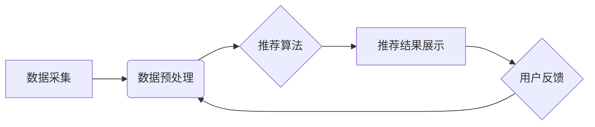

> AI推荐系统，个性化推荐，协同过滤，内容过滤，深度学习，推荐算法，用户行为分析

## 1. 背景介绍

在信息爆炸的时代，海量数据和信息涌现，用户面临着选择困难和信息过载的挑战。个性化推荐系统应运而生，旨在根据用户的兴趣、偏好、历史行为等信息，精准推荐用户感兴趣的内容，提升用户体验，并为企业带来商业价值。

传统推荐系统主要依赖于基于内容的过滤和基于协同过滤的方法，但这些方法存在一定的局限性。基于内容的过滤依赖于内容的标签和描述，难以捕捉用户隐性的需求；基于协同过滤依赖于用户之间的相似度，当用户数据稀疏时，效果不佳。

近年来，随着人工智能技术的快速发展，深度学习算法被广泛应用于推荐系统，带来了革命性的变革。深度学习模型能够从海量用户行为数据中学习用户隐性的特征和偏好，实现更精准、更个性化的推荐。

## 2. 核心概念与联系

**2.1 个性化推荐**

个性化推荐是指根据用户的个人特征、兴趣、偏好等信息，为用户提供定制化的产品、服务或内容推荐。其核心目标是提升用户体验，满足用户的个性化需求。

**2.2 推荐系统**

推荐系统是一种信息过滤系统，旨在从海量数据中筛选出用户感兴趣的内容，并将其推荐给用户。推荐系统通常由以下几个模块组成：

* 数据采集模块：收集用户行为数据、商品信息等数据。
* 数据预处理模块：对收集到的数据进行清洗、转换、特征提取等处理。
* 推荐算法模块：根据用户特征和商品信息，预测用户对商品的兴趣，并生成推荐列表。
* 推荐结果展示模块：将推荐结果以用户友好的方式展示给用户。

**2.3 AI技术在推荐系统中的应用**

人工智能技术，特别是深度学习算法，为推荐系统带来了革命性的变革。深度学习模型能够从海量用户行为数据中学习用户隐性的特征和偏好，实现更精准、更个性化的推荐。

**2.4 推荐系统架构**



## 3. 核心算法原理 & 具体操作步骤

### 3.1 算法原理概述

深度学习算法在推荐系统中的应用主要包括以下几种：

* **协同过滤模型:** 
    * 基于用户-物品交互矩阵，预测用户对物品的评分或偏好。
    * 常用算法包括：矩阵分解、深度协同过滤。
* **内容过滤模型:** 
    * 基于物品的特征和描述，推荐与用户兴趣相似的物品。
    * 常用算法包括：TF-IDF、Word2Vec、深度内容过滤。
* **混合推荐模型:** 
    * 结合协同过滤和内容过滤的优势，实现更精准的推荐。
    * 常用算法包括：深度混合推荐模型。

### 3.2 算法步骤详解

以深度协同过滤模型为例，其具体操作步骤如下：

1. **数据收集:** 收集用户-物品交互数据，例如用户对物品的评分、点击、购买等行为。
2. **数据预处理:** 对交互数据进行清洗、转换、特征提取等处理，例如将评分数据转换为one-hot编码。
3. **模型构建:** 使用深度神经网络构建协同过滤模型，例如使用多层感知机（MLP）、卷积神经网络（CNN）或循环神经网络（RNN）。
4. **模型训练:** 使用训练数据训练模型，优化模型参数，使模型能够准确预测用户对物品的评分或偏好。
5. **模型评估:** 使用测试数据评估模型性能，例如使用均方根误差（RMSE）或平均绝对误差（MAE）作为评价指标。
6. **推荐生成:** 将训练好的模型应用于新的用户-物品交互数据，预测用户对物品的评分或偏好，并生成推荐列表。

### 3.3 算法优缺点

**优点:**

* 能够学习用户隐性的特征和偏好，实现更精准的推荐。
* 能够处理高维数据和复杂关系。
* 能够不断学习和更新，随着用户行为数据的增加，推荐效果不断提升。

**缺点:**

* 需要大量的训练数据，否则模型效果不佳。
* 训练过程复杂，需要专业的技术人员进行操作。
* 容易出现冷启动问题，对于新用户和新物品的推荐效果较差。

### 3.4 算法应用领域

深度学习算法在推荐系统中的应用领域非常广泛，例如：

* **电商推荐:** 推荐商品、优惠券、促销活动等。
* **视频推荐:** 推荐视频、电视剧、电影等。
* **音乐推荐:** 推荐歌曲、专辑、音乐人等。
* **新闻推荐:** 推荐新闻、文章、博客等。
* **社交推荐:** 推荐好友、群组、活动等。

## 4. 数学模型和公式 & 详细讲解 & 举例说明

### 4.1 数学模型构建

深度协同过滤模型通常使用矩阵分解的方法，将用户-物品交互矩阵分解成两个低维矩阵，分别表示用户特征和物品特征。

假设用户集合为U，物品集合为I，用户-物品交互矩阵为R，其中R(u,i)表示用户u对物品i的评分或偏好。

则深度协同过滤模型的目标是学习两个低维矩阵：

* 用户特征矩阵：P，其中P(u,:)表示用户u的特征向量。
* 物品特征矩阵：Q，其中Q(i,:)表示物品i的特征向量。

模型假设：R(u,i) ≈ P(u,:) * Q(i,:)

### 4.2 公式推导过程

模型的目标函数通常是最小化预测评分与真实评分之间的误差，例如使用均方误差（MSE）作为损失函数：

MSE = ∑_(u∈U) ∑_(i∈I) (R(u,i) - P(u,:) * Q(i,:))^2

使用梯度下降算法优化模型参数，更新用户特征矩阵和物品特征矩阵。

### 4.3 案例分析与讲解

假设有一个用户-物品交互矩阵，其中用户集合为U = {1, 2, 3}, 物品集合为I = {A, B, C}, 矩阵R如下：

```
R = [
    [5, 3, 4],
    [4, 5, 2],
    [3, 2, 5]
]
```

使用深度协同过滤模型，可以学习到用户和物品的特征向量，例如：

* P = [
    [0.8, 0.2, 0.5],
    [0.5, 0.7, 0.3],
    [0.3, 0.6, 0.8]
]
* Q = [
    [0.6, 0.4, 0.3],
    [0.4, 0.5, 0.6],
    [0.3, 0.6, 0.7]
]

通过计算P(u,:) * Q(i,:), 可以预测用户对物品的评分，例如：

* R(1,A) ≈ 0.8 * 0.6 + 0.2 * 0.4 + 0.5 * 0.3 ≈ 5

## 5. 项目实践：代码实例和详细解释说明

### 5.1 开发环境搭建

* Python 3.6+
* TensorFlow 2.0+
* PyTorch 1.0+
* Jupyter Notebook

### 5.2 源代码详细实现

```python
import tensorflow as tf

# 定义深度协同过滤模型
class DeepCF(tf.keras.Model):
    def __init__(self, user_dim, item_dim, latent_dim):
        super(DeepCF, self).__init__()
        self.user_embedding = tf.keras.layers.Embedding(user_dim, latent_dim)
        self.item_embedding = tf.keras.layers.Embedding(item_dim, latent_dim)
        self.dense = tf.keras.layers.Dense(1)

    def call(self, user_ids, item_ids):
        user_embeddings = self.user_embedding(user_ids)
        item_embeddings = self.item_embedding(item_ids)
        predictions = self.dense(tf.keras.layers.Concatenate()([user_embeddings, item_embeddings]))
        return predictions

# 训练模型
model = DeepCF(user_dim=num_users, item_dim=num_items, latent_dim=64)
model.compile(optimizer='adam', loss='mse')
model.fit(train_data, epochs=10)

# 生成推荐列表
user_id = 1
item_ids = tf.constant([1, 2, 3])
predictions = model(user_id, item_ids)
recommended_items = tf.argsort(predictions, direction='DESCENDING')[:5]
```

### 5.3 代码解读与分析

* 代码首先定义了一个深度协同过滤模型类 `DeepCF`，该模型包含用户嵌入层、物品嵌入层和全连接层。
* 然后，根据实际数据创建模型实例，并使用 Adam 优化器和均方误差损失函数训练模型。
* 最后，使用训练好的模型生成推荐列表，并根据预测评分排序。

### 5.4 运行结果展示

训练完成后，可以将模型应用于新的用户-物品交互数据，生成推荐列表，并评估推荐效果。

## 6. 实际应用场景

### 6.1 电商推荐

深度学习算法在电商推荐系统中应用广泛，例如：

* **商品推荐:** 根据用户的浏览历史、购买记录、购物车内容等信息，推荐用户可能感兴趣的商品。
* **优惠券推荐:** 根据用户的消费习惯、偏好等信息，推荐用户可用的优惠券。
* **促销活动推荐:** 根据用户的兴趣爱好、消费行为等信息，推荐用户参与的促销活动。

### 6.2 视频推荐

深度学习算法在视频推荐系统中应用广泛，例如：

* **视频推荐:** 根据用户的观看历史、点赞记录、评论等信息，推荐用户可能感兴趣的视频。
* **电视剧推荐:** 根据用户的观看历史、评分等信息，推荐用户可能感兴趣的电视剧。
* **电影推荐:** 根据用户的观看历史、评分等信息，推荐用户可能感兴趣的电影。

### 6.3 音乐推荐

深度学习算法在音乐推荐系统中应用广泛，例如：

* **歌曲推荐:** 根据用户的播放历史、收藏记录、点赞等信息，推荐用户可能感兴趣的歌曲。
* **专辑推荐:** 根据用户的播放历史、收藏记录、点赞等信息，推荐用户可能感兴趣的专辑。
* **音乐人推荐:** 根据用户的播放历史、收藏记录、点赞等信息，推荐用户可能感兴趣的音乐人。

### 6.4 未来应用展望

随着人工智能技术的不断发展，深度学习算法在推荐系统中的应用将更加广泛和深入，例如：

* **个性化内容生成:** 基于用户的兴趣爱好和偏好，生成个性化的内容，例如新闻、文章、视频等。
* **跨平台推荐:** 将用户行为数据整合到不同的平台，实现跨平台的个性化推荐。
* **实时推荐:** 基于用户的实时行为数据，实现实时个性化推荐。

## 7. 工具和资源推荐

### 7.1 学习资源推荐

* **书籍:**
    * Deep Learning by Ian Goodfellow, Yoshua Bengio, and Aaron Courville
    * Hands-On Machine Learning with Scikit-Learn, Keras & TensorFlow by Aurélien Géron
* **在线课程:**
    * Deep Learning Specialization by Andrew Ng (Coursera)
    * Fast.ai Practical Deep Learning for Coders
* **博客和网站:**
    * Towards Data Science
    * Machine Learning Mastery

### 7.2 开发工具推荐

* **深度学习框架:** TensorFlow, PyTorch, Keras
* **数据处理工具:** Pandas, NumPy
* **可视化工具:** Matplotlib,