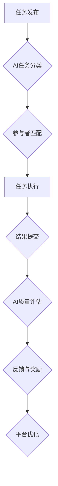

> AI，众包，协作，机器学习，自然语言处理，数据分析，自动化，效率

## 1. 背景介绍

在当今数字时代，信息爆炸和全球化趋势日益明显。传统的工作模式面临着效率低下、资源分配不均等挑战。众包，作为一种新型的协作模式，通过将任务分解成一个个小的单元，并通过互联网平台将这些任务分配给全球范围内的志愿者或自由职业者，有效地利用了全球的智慧和资源。然而，传统的众包平台往往依赖于人工筛选和管理，存在着效率低、质量参差不齐等问题。

人工智能（AI）技术的快速发展为众包模式带来了新的机遇。AI算法能够自动识别和筛选优质任务，并根据任务特点智能匹配合适的参与者，从而提高了众包平台的效率和质量。

## 2. 核心概念与联系

**2.1 众包概述**

众包是指通过互联网平台将任务分解成一个个小的单元，并通过全球范围内的志愿者或自由职业者完成的协作模式。

**2.2 人工智能概述**

人工智能是指模拟人类智能行为的计算机系统。AI技术涵盖了机器学习、深度学习、自然语言处理、计算机视觉等多个领域。

**2.3 AI驱动的众包**

AI驱动的众包是指利用人工智能技术来优化和提升传统的众包模式。AI算法可以自动完成任务分配、参与者筛选、质量控制等环节，从而提高了众包平台的效率和质量。

**2.4 核心架构**

## 3. 核心算法原理 & 具体操作步骤

**3.1 算法原理概述**

AI驱动的众包平台通常采用以下核心算法：

* **机器学习算法:** 用于任务分类、参与者筛选、质量评估等环节。例如，可以使用监督学习算法训练模型，根据历史数据预测任务的难度和参与者的能力。
* **自然语言处理算法:** 用于理解和处理任务描述、参与者评论等文本信息。例如，可以使用文本分类算法识别任务类型，可以使用情感分析算法评估参与者的满意度。
* **推荐算法:** 用于匹配合适的参与者和任务。例如，可以使用协同过滤算法推荐与用户兴趣相符的任务，可以使用内容过滤算法推荐与用户技能相匹配的任务。

**3.2 算法步骤详解**

1. **任务发布:** 用户发布任务，并提供任务描述、奖励等信息。
2. **AI任务分类:** AI算法根据任务描述自动识别任务类型，并进行分类。
3. **参与者匹配:** AI算法根据任务类型、参与者的技能和经验等信息，智能匹配合适的参与者。
4. **任务执行:** 参与者接取任务，并完成任务。
5. **结果提交:** 参与者提交完成的任务结果。
6. **AI质量评估:** AI算法对提交的结果进行评估，并判断其质量。
7. **反馈与奖励:** 平台根据质量评估结果，向参与者提供反馈和奖励。
8. **平台优化:** 平台根据参与者的反馈和任务执行情况，不断优化算法和平台规则。

**3.3 算法优缺点**

**优点:**

* **提高效率:** AI算法可以自动完成任务分配、参与者筛选等环节，从而提高了众包平台的效率。
* **提升质量:** AI算法可以根据任务特点和参与者的能力进行匹配，从而提高了任务执行的质量。
* **降低成本:** AI算法可以减少人工干预，从而降低了众包平台的运营成本。

**缺点:**

* **算法偏差:** AI算法的训练数据可能存在偏差，导致算法结果存在偏差。
* **数据安全:** 众包平台需要处理大量用户数据，需要采取措施保障数据安全。
* **伦理问题:** AI驱动的众包可能引发一些伦理问题，例如，参与者权益保护、算法透明度等。

**3.4 算法应用领域**

AI驱动的众包技术可以应用于多个领域，例如：

* **数据标注:** 用于训练机器学习模型的数据标注任务。
* **内容创作:** 用于生成文章、视频、音乐等内容的创作任务。
* **软件开发:** 用于开发和测试软件的开发任务。
* **市场调研:** 用于收集用户反馈和市场信息的研究任务。

## 4. 数学模型和公式 & 详细讲解 & 举例说明

**4.1 数学模型构建**

假设我们有一个众包平台，包含N个任务和M个参与者。每个任务都有一个难度值d_i，每个参与者都有一个技能值s_j。我们希望找到一个最优的匹配方案，使得每个任务都分配给一个技能值与其难度值相匹配的参与者。

我们可以使用以下数学模型来表示这个匹配问题：

* **目标函数:** 
    * 
    * 
    * 
    * 
    * 
    * 
    * 
    * 
    * 
    * 
    * 
    * 
    * 
    * 
    * 
    * 
    * 
    * 
    * 
    * 
    * 
    * 
    * 
    * 
    * 
    * 
    * 
    * 
    * 
    * 
    * 
    * 
    * 
    * 
    * 
    * 
    * 
    * 
    * 
    * 
    * 
    * 
    * 
    * 
    * 
    * 
    * 
    * 
    * 
    * 
    * 
    * 
    * 
    * 
    * 
    * 
    * 
    * 
    * 
    * 
    * 
    * 
    * 
    * 
    * 
    * 
    * 
    * 
    * 
    * 
    * 
    * 
    * 
    * 
    * 
    * 
    * 
    * 
    * 
    * 
    * 
    * 
    * 
    * 
    * 
    * 
    * 
    * 
    * 
    * 
    * 
    * 
    * 
    * 
    * 
    * 
    * 
    * 
    * 
    * 
    * 
    * 
    * 
    * 
    * 
    * 
    * 
    * 
    * 
    * 
    * 
    * 
    * 
    * 
    * 
    * 
    * 
    * 
    * 
    * 
    * 
    * 
    * 
    * 
    * 
    * 
    * 
    * 
    * 
    * 
    * 
    * 
    * 
    * 
    * 
    * 
    * 
    * 
    * 
    * 
    * 
    * 
    * 
    * 
    * 
    * 
    * 
    * 
    * 
    * 
    * 
    * 
    * 
    * 
    * 
    * 
    * 
    * 
    * 
    * 
    * 
    * 
    * 
    * 
    * 
    * 
    * 
    * 
    * 
    * 
    * 
    * 
    * 
    * 
    * 
    * 
    * 
    * 
    * 
    * 
    * 
    * 
    * 
    * 
    * 
    * 
    * 
    * 
    * 
    * 
    * 
    * 
    * 
    * 
    * 
    * 
    * 
    * 
    * 
    * 
    * 
    * 
    * 
    * 
    * 
    * 
    * 
    * 
    * 
    * 
    * 
    * 
    * 
    * 
    * 
    * 
    * 
    * 
    * 
    * 
    * 
    * 
    * 
    * 
    * 
    * 
    * 
    * 
    * 
    * 
    * 
    * 
    * 
    * 
    * 
    * 
    * 
    * 
    * 
    * 
    * 
    * 
    * 
    * 
    * 
    * 
    * 
    * 
    * 
    * 
    * 
    * 
    * 
    * 
    * 
    * 
    * 
    * 
    * 
    * 
    * 
    * 
    * 
    * 
    * 
    * 
    * 
    * 
    * 
    * 
    * 
    * 
    * 
    * 
    * 
    * 
    * 
    * 
    * 
    * 
    * 
    * 
    * 
    * 
    * 
    * 
    * 
    * 
    * 
    * 
    * 
    * 
    * 
    * 
    * 
    * 
    * 
    * 
    * 
    * 
    * 
    * 
    * 
    * 
    * 
    * 
    * 
    * 
    * 
    * 
    * 
    * 
    * 
    * 
    * 
    * 
    * 
    * 
    * 
    * 
    * 
    * 
    * 
    * 
    * 
    * 
    * 
    * 
    * 
    * 
    * 
    * 
    * 
    * 
    * 
    * 
    * 
    * 
    * 
    * 
    * 
    * 
    * 
    * 
    * 
    * 
    * 
    * 
    * 
    * 
    * 
    * 
    * 
    * 
    * 
    * 
    * 
    * 
    * 
    * 
    * 
    * 
    * 
    * 
    * 
    * 
    * 
    * 
    * 
    * 
    * 
    * 
    * 
    * 
    * 
    * 
    * 
    * 
    * 
    * 
    * 
    * 
    * 
    * 
    * 
    * 
    * 
    * 
    * 
    * 
    * 
    * 
    * 
    * 
    * 
    * 
    * 
    * 
    * 
    * 
    * 
    * 
    * 
    * 
    * 
    * 
    * 