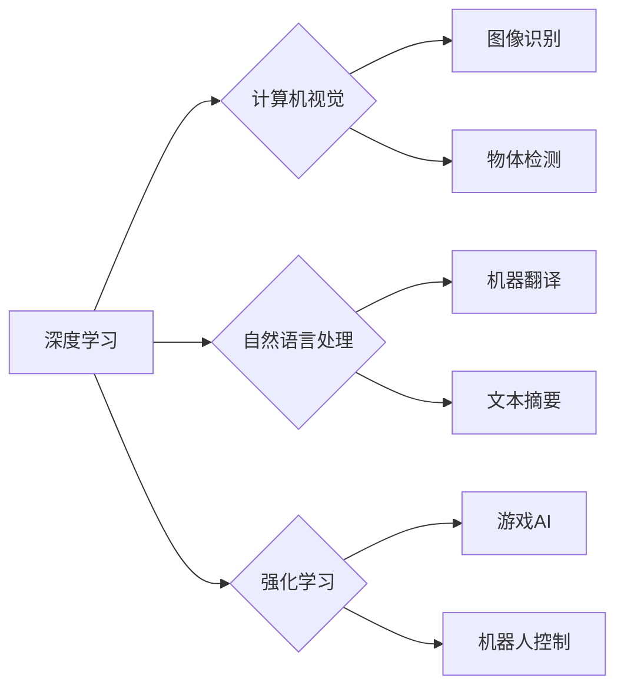

> 人工智能，深度学习，计算机视觉，自然语言处理，强化学习，伦理问题，未来趋势

## 1. 背景介绍

人工智能（AI）正以惊人的速度发展，深刻地改变着我们生活的方方面面。从自动驾驶汽车到智能语音助手，AI技术已经渗透到我们的日常生活中。作为AI领域的领军人物之一，Andrej Karpathy 博士的贡献不可忽视。他不仅是一位杰出的研究者，也是一位优秀的工程师和作家，他的作品深刻地影响了AI领域的理解和发展。

Andrej Karpathy 博士现任特斯拉高级人工智能工程师，曾任 OpenAI 研究科学家。他以其在深度学习、计算机视觉和自然语言处理方面的杰出研究而闻名。他开发了许多重要的AI工具和库，例如 Caffe 和 Torch，为AI研究和开发提供了强大的支持。

## 2. 核心概念与联系

**2.1 深度学习**

深度学习是人工智能领域的一个重要分支，它利用多层神经网络来模拟人类大脑的学习过程。通过训练大量的样本数据，深度学习模型能够自动学习特征和模式，从而实现对复杂问题的解决。

**2.2 计算机视觉**

计算机视觉是让计算机“看”和理解图像和视频的技术。深度学习在计算机视觉领域取得了突破性的进展，例如图像识别、物体检测和图像分割等任务。

**2.3 自然语言处理**

自然语言处理（NLP）是让计算机理解和处理人类语言的技术。深度学习在NLP领域也取得了显著的成果，例如机器翻译、文本摘要和情感分析等任务。

**2.4 强化学习**

强化学习是一种基于奖励机制的机器学习方法。在强化学习中，智能体通过与环境交互，学习如何采取最优行动以获得最大奖励。

**2.5 人工智能伦理**

随着人工智能技术的快速发展，其伦理问题也日益受到关注。例如，AI算法的偏见、隐私保护和责任归属等问题都需要认真思考和解决。

**2.6 未来发展趋势**

人工智能的未来发展趋势包括：

* **更强大的计算能力:** 更强大的计算能力将推动深度学习模型的规模和复杂度不断提高。
* **更多样化的数据:** 更丰富、更全面的数据将为深度学习模型提供更强大的训练素材。
* **更有效的算法:** 更有效的算法将提高深度学习模型的效率和性能。
* **更广泛的应用场景:** 人工智能技术将应用于更多领域，例如医疗、教育、金融等。

**Mermaid 流程图**



## 3. 核心算法原理 & 具体操作步骤

**3.1 算法原理概述**

深度学习算法的核心是多层神经网络。神经网络由许多相互连接的神经元组成，每个神经元接收来自其他神经元的输入，并根据权重进行计算，最终输出一个信号。通过训练大量的样本数据，神经网络可以自动学习权重，从而实现对复杂问题的解决。

**3.2 算法步骤详解**

1. **数据预处理:** 将原始数据转换为深度学习模型可以理解的格式。
2. **网络结构设计:** 根据具体任务设计神经网络的结构，包括层数、神经元数量和激活函数等。
3. **参数初始化:** 为神经网络的参数进行随机初始化。
4. **前向传播:** 将输入数据通过神经网络进行传播，得到输出结果。
5. **损失函数计算:** 计算输出结果与真实值的差异，即损失函数的值。
6. **反向传播:** 根据损失函数的值，反向传播误差信号，更新神经网络的参数。
7. **迭代训练:** 重复步骤4-6，直到损失函数达到预设的阈值。

**3.3 算法优缺点**

**优点:**

* **强大的学习能力:** 深度学习模型能够自动学习复杂特征和模式。
* **高精度:** 深度学习模型在许多任务上取得了state-of-the-art的精度。
* **通用性:** 深度学习模型可以应用于多种不同的任务。

**缺点:**

* **数据依赖:** 深度学习模型需要大量的样本数据进行训练。
* **计算资源消耗:** 训练深度学习模型需要大量的计算资源。
* **可解释性差:** 深度学习模型的决策过程难以理解。

**3.4 算法应用领域**

深度学习算法已广泛应用于以下领域:

* **计算机视觉:** 图像识别、物体检测、图像分割、人脸识别等。
* **自然语言处理:** 机器翻译、文本摘要、情感分析、对话系统等。
* **语音识别:** 语音转文本、语音助手等。
* **推荐系统:** 商品推荐、内容推荐等。
* **医疗诊断:** 疾病诊断、影像分析等。

## 4. 数学模型和公式 & 详细讲解 & 举例说明

**4.1 数学模型构建**

深度学习模型通常由多层神经网络组成，每层神经网络包含多个神经元。每个神经元接收来自上一层的输出作为输入，并通过一个激活函数进行处理，最终输出一个信号。

**4.2 公式推导过程**

深度学习模型的训练过程基于梯度下降算法。梯度下降算法的目标是找到一个参数值，使得模型的损失函数最小化。

损失函数通常定义为预测值与真实值的差值。梯度下降算法通过计算损失函数的梯度，更新模型的参数，朝着损失函数最小化的方向前进。

**4.3 案例分析与讲解**

例如，在图像识别任务中，深度学习模型的输入是一个图像，输出是一个类别标签。损失函数可以定义为预测类别标签与真实类别标签之间的交叉熵。

通过梯度下降算法，模型的参数会被不断更新，使得预测类别标签与真实类别标签之间的差异逐渐减小，最终达到识别图像的准确率。

## 5. 项目实践：代码实例和详细解释说明

**5.1 开发环境搭建**

深度学习模型的开发环境通常需要安装深度学习框架，例如 TensorFlow 或 PyTorch，以及必要的库和工具。

**5.2 源代码详细实现**

以下是一个使用 TensorFlow 实现图像分类模型的简单代码示例：

```python
import tensorflow as tf

# 定义模型结构
model = tf.keras.models.Sequential([
    tf.keras.layers.Conv2D(32, (3, 3), activation='relu', input_shape=(28, 28, 1)),
    tf.keras.layers.MaxPooling2D((2, 2)),
    tf.keras.layers.Conv2D(64, (3, 3), activation='relu'),
    tf.keras.layers.MaxPooling2D((2, 2)),
    tf.keras.layers.Flatten(),
    tf.keras.layers.Dense(10, activation='softmax')
])

# 编译模型
model.compile(optimizer='adam',
              loss='sparse_categorical_crossentropy',
              metrics=['accuracy'])

# 训练模型
model.fit(x_train, y_train, epochs=5)

# 评估模型
loss, accuracy = model.evaluate(x_test, y_test)
print('Test loss:', loss)
print('Test accuracy:', accuracy)
```

**5.3 代码解读与分析**

这段代码定义了一个简单的卷积神经网络模型，用于图像分类任务。模型包含两层卷积层、两层最大池化层、一层全连接层和一层输出层。

模型使用 Adam 优化器、交叉熵损失函数和准确率作为评估指标。

**5.4 运行结果展示**

训练完成后，模型可以用来预测新的图像类别。

## 6. 实际应用场景

**6.1 自动驾驶汽车**

深度学习算法在自动驾驶汽车中用于图像识别、物体检测和路径规划等任务。

**6.2 智能语音助手**

深度学习算法在智能语音助手中用于语音识别、自然语言理解和对话生成等任务。

**6.3 医疗诊断**

深度学习算法在医疗诊断中用于疾病诊断、影像分析和药物研发等任务。

**6.4 未来应用展望**

未来，深度学习算法将应用于更多领域，例如个性化教育、金融风险管理和科学发现等。

## 7. 工具和资源推荐

**7.1 学习资源推荐**

* **书籍:**
    * 深度学习 (Deep Learning) - Ian Goodfellow, Yoshua Bengio, Aaron Courville
    * 人工智能：一种现代方法 (Artificial Intelligence: A Modern Approach) - Stuart Russell, Peter Norvig
* **在线课程:**
    * 深度学习 Specialization - Andrew Ng (Coursera)
    * fast.ai - Practical Deep Learning for Coders
* **博客和网站:**
    * Andrej Karpathy's Blog: https://karpathy.github.io/
    * OpenAI Blog: https://openai.com/blog/

**7.2 开发工具推荐**

* **深度学习框架:** TensorFlow, PyTorch, Keras
* **编程语言:** Python
* **数据处理工具:** Pandas, NumPy

**7.3 相关论文推荐**

* ImageNet Classification with Deep Convolutional Neural Networks - Alex Krizhevsky, Ilya Sutskever, Geoffrey E. Hinton
* Attention Is All You Need - Ashish Vaswani, Noam Shazeer, Niki Parmar, Jakob Uszkoreit, Llion Jones, Aidan N Gomez, Łukasz Kaiser, Illia Polosukhin

## 8. 总结：未来发展趋势与挑战

**8.1 研究成果总结**

近年来，深度学习取得了令人瞩目的进展，在计算机视觉、自然语言处理等领域取得了突破性的成果。

**8.2 未来发展趋势**

未来，深度学习的发展趋势包括：

* **模型规模和复杂度不断提高:** 更大的模型和更复杂的架构将带来更高的性能。
* **数据的多样性和质量不断提升:** 更丰富、更全面的数据将推动模型的泛化能力和鲁棒性。
* **算法效率和可解释性不断提升:** 更有效的算法和更易于理解的模型将推动深度学习的应用范围。

**8.3 面临的挑战**

深度学习也面临着一些挑战：

* **数据偏见:** 训练数据中的偏见可能会导致模型产生不公平的结果。
* **隐私保护:** 深度学习模型的训练和应用可能会涉及到敏感个人数据，需要妥善保护隐私。
* **可解释性:** 深度学习模型的决策过程难以理解，这可能会导致模型的应用受到限制。

**8.4 研究展望**

未来，需要进一步研究如何解决深度学习面临的挑战，使其更加安全、可靠和可解释。


## 9. 附录：常见问题与解答

**9.1 如何选择合适的深度学习框架？**

选择深度学习框架需要根据具体任务和需求进行考虑。 TensorFlow 和 PyTorch 是目前最流行的深度学习框架，各有优缺点。

**9.2 如何处理深度学习模型中的数据偏见？**

可以采用以下方法来处理数据偏见：

* 使用更全面、更多样化的训练数据。
* 使用去偏见算法来调整训练数据。
* 在模型训练过程中引入正则化项来抑制偏见。

**9.3 如何提高深度学习模型的可解释性？**

可以采用以下方法来提高深度学习模型的可解释性：

* 使用可解释性模型，例如线性模型或决策树。
* 使用可视化技术来分析模型的决策过程。
* 使用特征重要性分析来识别模型中最重要的特征。


作者：禅与计算机程序设计艺术 / Zen and the Art of Computer Programming 
<end_of_turn>